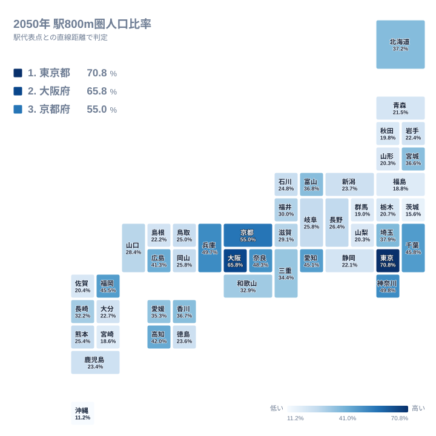
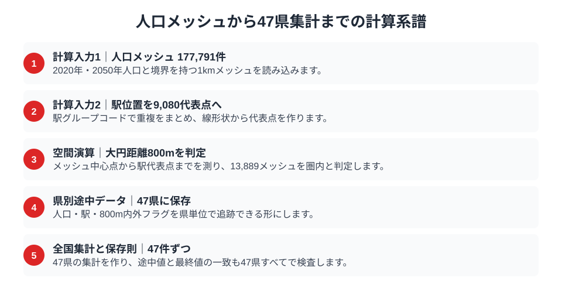
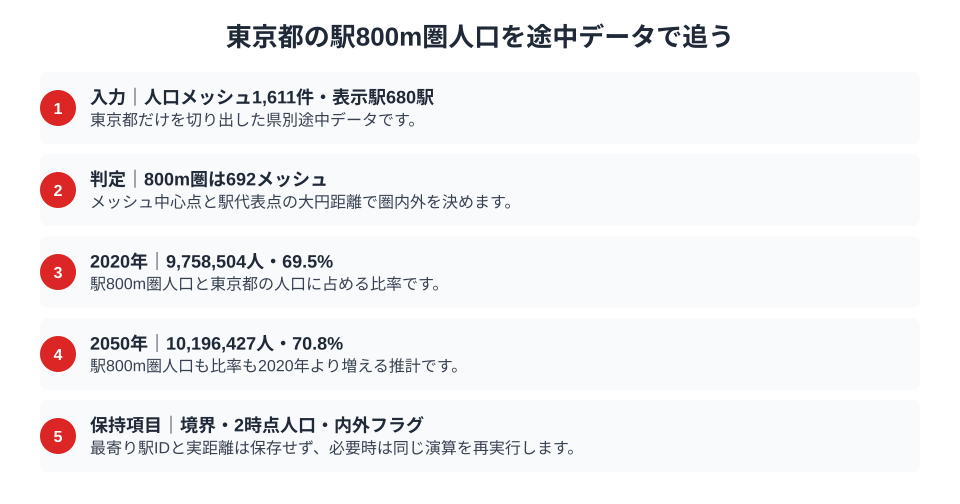

2050年、駅の近くに住む人口はどれくらい残るのでしょうか。現在の駅位置を固定し、駅代表点から直線800m以内に中心がある1km人口メッシュを集計すると、東京都の2050年駅800m圏人口比率は70.8%でした。大阪府は65.8%、京都府は55.0%です。

一方、沖縄県は11.2%で47位、茨城県は15.6%で46位でした。しかし、この順位は公共交通の便利さや住みやすさを直接評価するものではありません。道路網、坂道、河川、踏切、列車本数を使わず、駅代表点と人口メッシュ中心点の直線距離だけを比べた結果です。

興味深いのは、2020年から2050年に駅800m圏人口比率が上がる県が38あることです。人口減少のなかで居住が駅周辺へ相対的に集中すれば、駅近人口の人数が減っても比率は上がります。全47県の地図、県別途中データ、計算条件は[2050年人口×駅アクセスのGeo分析](/geo/population-station-access)で確認できます。

## 東京70.8%と沖縄11.2%を地図で見る

地図では東京都、大阪府、京都府をはじめ、首都圏・近畿圏の比率が高く見えます。東京都の駅800m圏人口は10,196,427人で、県内の2050年人口の70.8%です。大阪府は4,776,713人で65.8%、京都府は1,142,679人で55.0%でした。都市圏では駅が密に配置され、人口も駅周辺へ集まっているため、この判定条件に入るメッシュの人口比率が高くなります。

ただし、地図の濃淡をそのまま交通利便性の優劣とは読めません。沖縄県の比率は11.2%ですが、対象は国土数値情報の鉄道駅位置です。バス網、自動車移動、航路など地域の主要な移動手段は含みません。茨城県も15.6%で46位ですが、2050年の駅800m圏人口は350,446人あります。比率が低いことと、駅周辺人口が存在しないことは別です。

全国中央値は26.4%です。しかし、中央値より上か下かだけで地域政策を判断することもできません。県土の広さ、鉄道路線の配置、都市の集約度、人口メッシュの形が同時に効くためです。地図は「どの県を詳しく調べるか」を選ぶ入口であり、最終的な交通評価ではありません。

[東京都の地域データ](/areas/13000)、[大阪府の地域データ](/areas/27000)、[沖縄県の地域データ](/areas/47000)もあわせて見ると、人口構造や交通・観光の別指標から地域差を確認できます。

> [!NOTE]
> 本記事の「駅800m圏」は徒歩10分圏を意味しません。駅代表点と1km人口メッシュ中心点の大円距離が800m以内かを判定した分析上の呼び名です。実際の徒歩時間や到達可能範囲とは一致しません。

## 二つの計算入力と一つの補助レイヤー

人口側の入力は、国土交通省「1kmメッシュ別将来推計人口（R6国政局推計）」version 24です。2020年人口と2050年推計人口を持つ177,791メッシュを使います。駅側の計算入力は、国土交通省S12 version 25の駅位置です。駅グループコードで重複をまとめた9,080グループから代表点を計算します。

二つの計算入力は、人口メッシュと駅位置です。駅線形状を駅グループ単位の代表点へ変換し、メッシュ中心点からの大円距離で800m内外を判定します。その結果を県別途中データ（artifact）へ保存し、最後に全国集計（aggregate）の47レコードへまとめます。途中値と最終値の一致を確かめる保存則（conservation）も47県すべてで検査します。この順序が固定されているため、最終比率だけを手作業で作り直すのではなく、同じ入力から同じ判定を再生成できます。

駅の乗降客数はS12の2019〜2023年値で、駅の規模を理解する補助レイヤーとして表示できますが、駅800m圏人口の計算には使っていません。乗降客数の多い駅だから圏域を広げたり、少ない駅だから狭めたりする処理もありません。すべての駅代表点へ同じ800m条件を適用しています。

> [!TIP]
> Geoページで乗降客数を表示しても、計算結果が変わらないのは計算不使用の補助レイヤー（context-only）だからです。計算入力と背景理解の補助データを分けることで、「利用者が多い駅ほど駅近人口に重く加算された」という誤読を防いでいます。

## 直線800mとメッシュ中心点で判定する

空間演算は二段階です。まず駅グループの線形状から代表点を作ります。次に各1km人口メッシュの中心点から最寄りの駅代表点まで大円距離を計算し、800m以内なら駅アクセス圏、800mを超えれば圏外と判定します。

この方法は全国を同じ条件で再計算できますが、メッシュ内部の人口が均一に分布するという近似を含みます。中心点が駅から800mを超えるメッシュは、端の一部が駅近でも圏外です。逆に中心点が800m以内なら、メッシュ内の人口をすべて圏内人口へ加えます。

道路や線路を横断できる場所、駅の出入口、坂道、河川、信号も使いません。駅とメッシュ中心点の直線距離だけなので、日常的な「歩いて行ける」と同じ意味ではありません。この近似を固定することで県間比較はできますが、住所単位の移住・出店判断には使えません。

## 東京都の県別途中データを追う

東京都の県別途中データには人口メッシュ1,611件と表示駅680駅があり、692メッシュが駅800m圏と判定されています。各メッシュにはメッシュID、四辺の境界座標、2020年人口、2050年人口、800m内外フラグの8項目が残ります。最寄り駅IDと実距離は保持していないため、公開中の途中データだけから個別メッシュの距離を直接確認することはできません。

東京都では、駅800m圏人口が2020年の9,758,504人から2050年の10,196,427人へ増え、比率も69.5%から70.8%へ上がります。人口メッシュ数1,611件、圏内692件という判定単位を残しているため、記事の70.8%がどの県別ファイルから来たかを追えます。ただし、フラグは判定結果であり、どの駅まで何mだったかを示す値ではありません。そこまで監査する場合は、保持されたメッシュ境界から中心点を再計算し、同じ県別ファイルの駅代表点へ大円距離を再適用する必要があります。

[東京都の駅・メッシュ途中データ](/geo/data/population-station-access/13)では、人口、駅、判定後メッシュの段階を県単位で読み込めます。全国の巨大データを記事へ複製せず、調べたい県だけを開く設計です。沖縄県も同じ契約で、表示駅19駅、駅800m圏21メッシュから11.2%を算出しています。

県別途中データが重要なのは、最終比率だけでは判定単位を確認できないためです。集計値に疑問があるとき、人口と駅の入力、メッシュ単位の判定結果まで一段ずつ戻れることがGeo分析の再現性になります。なお、現行ファイルは距離そのものを保存しないため、境界付近の判定を調べるには同じ空間演算の再実行が必要です。

> [!WARNING]
> 現在の駅位置を2020年と2050年の両方へ固定しています。2050年までの新駅、廃駅、路線再編、運行本数の変化は予測していません。将来の鉄道網そのものを予測した比率ではありません。

## 比率上昇と駅近人口増加は同じではない

47都道府県のうち38県では、2020年より2050年の駅800m圏人口比率が高くなります。しかし、駅近人口の人数まで増えるとは限りません。大阪府では比率が64.2%から65.8%へ上がる一方、駅800m圏人口は5,671,173人から4,776,713人へ減ります。

この逆転は、分子だけでなく分母も減る比率の性質から生まれます。駅から遠いメッシュの人口がより速く減れば、駅近人口が減っていても県全体に占める割合は上がります。人口集約の可能性を示す一方、鉄道需要が増えることを直接示しません。

**[仮説]** 大都市圏や地方中核都市では、住宅・サービスが駅周辺へ集まり、郊外メッシュより人口が残りやすい可能性があります。ただし、この仮説を検証するには、市区町村別の住宅開発、年齢構成、駅別運行本数、再開発、道路交通などを追加で突き合わせる必要があります。

## 47県の保存則で距離判定を検査する

計算対象は人口のある1kmメッシュ177,791件、駅グループ9,080件です。大円距離の判定で駅800m圏となった人口メッシュは13,889件でした。県別詳細データは47県すべてにあり、保存則検査も47県で実行されています。全国集計は47レコードです。

保存則では、県別途中データの圏内メッシュ数、2020年人口合計、2050年人口合計、比率が全国集計と一致するかを検査します。欠損県を0で埋めず、計算不使用の乗降客数が計算へ混入していないことも役割定義で固定しています。

保存則が保証するのは、現在の入力と800m条件から同じ集計を再生成できることです。将来の駅網、実際の徒歩経路、交通サービスの品質を保証するものではありません。入力、空間演算、県別途中データ、全国集計、保存則の共通契約は[Geo分析の方法](/geo/method)で確認できます。

## まとめ

- 2050年の駅800m圏人口比率は東京都70.8%が1位、大阪府65.8%、京都府55.0%と続きます。
- 沖縄県は11.2%で47位ですが、公共交通や生活利便性そのものの順位ではありません。
- 9,080駅グループの代表点と177,791人口メッシュ中心点を直線800mで距離判定しました。
- 38県で比率は上がりますが、大阪府のように駅近人口の人数が減る県もあります。
- 結論と県別根拠は無料公開し、再利用物は入力辞書、加工済みデータ、計算手順、比較テンプレートとして切り分けます。

## データ出典

人口は国土交通省「1kmメッシュ別将来推計人口（R6国政局推計）」version 24、計算用の駅位置は国土交通省S12 version 25を使用しました。表示用の駅別乗降客数はS12の2019〜2023年値で、距離判定には使用していません。県別途中データ、計算系譜のmanifest、全国集計は決定的スクリプトで生成し、同じR2 prefixから配信します。
