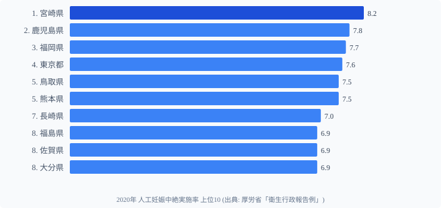
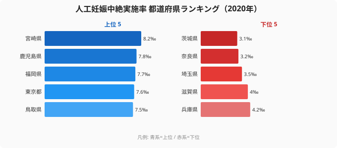

「人工妊娠中絶実施率」は **15〜49 歳女性 1,000 人あたりの実施件数** (単位 ‰ = パーミル) で、女性の生殖医療・性教育・経済状況の地域差を反映する指標です。厚生労働省「衛生行政報告例」(2020 年) によると **1 位は[宮崎県](/areas/45000) (8.2‰)**、最下位は **[茨城県](/areas/08000) (3.1‰)** で **2.6 倍** の地域差があります。

ランキングを見ると、**九州 (宮崎・鹿児島・福岡・熊本・長崎・佐賀・大分) と東京** が上位を占め、**関東内陸 (茨城・埼玉) ・近畿 (奈良・滋賀・兵庫) ・四国 (なし)** が下位に集中する明確な地域構造が見えます。

> [!NOTE]
> 人工妊娠中絶実施率は「15〜49歳の女性人口1,000人当たりの件数」で計算されます。産婦人科医の届出に基づく統計のため、実態を100%反映しているとは限りません。また、出生数・妊娠数の地域差とは別の指標であり、合計特殊出生率との単純比較には注意が必要です。

## 人工妊娠中絶実施率 TOP10 (2020年)

上位は宮崎 (8.2‰)・鹿児島 (7.8‰)・福岡 (7.7‰)・東京 (7.6‰)・鳥取 (7.5‰)・熊本 (7.5‰)・長崎 (7.0‰)・福島 (6.9‰)・佐賀 (6.9‰)・大分 (6.9‰) と並びます。

TOP10 のうち **6 県が九州 (宮崎・鹿児島・福岡・熊本・長崎・佐賀・大分)** で、九州が突出して高い構造が明確です。東京 (4 位) は唯一の大都市圏トップ。

## 最下位グループ TOP5

下位 5 県は、兵庫 (4.2‰)・滋賀 (4.0‰)・埼玉 (3.5‰)・奈良 (3.2‰)・茨城 (3.1‰) の順に低くなります (43〜47 位)。

最下位 **茨城 (3.1‰)** は宮崎の **38%**。次いで奈良 (3.2‰) ・埼玉 (3.5‰) ・滋賀 (4.0‰) ・兵庫 (4.2‰) と、**関東内陸と近畿圏** が下位を占めます。

## 「九州が高く関東内陸が低い」地理パターン

上位 10 県と下位 5 県を地図上でまとめると、明確な地域パターンが浮かびます。

- **高い地域 (上位)**: 九州 (宮崎・鹿児島・福岡・熊本・長崎・佐賀・大分) ・東京 ・福島
- **低い地域 (下位)**: 関東内陸 (茨城・埼玉) ・近畿 (奈良・滋賀・兵庫)

この地域差を一つの要因で説明することは困難ですが、考えられる仮説は複数あります。

- **[仮説] 医療アクセス・産婦人科の集積差** — 都市部や医療基盤が整った地域での実施率が反映される可能性
- **[仮説] 性教育・避妊普及度の地域差** — 学校・地域での性教育の充実度が中絶率に影響する可能性
- **[仮説] 出生率との連動** — 九州は出生率も高い (沖縄・宮崎・福岡が上位) ため、妊娠総数が多く実施率も比例する可能性

これらは個別検証が必要な仮説で、本データ単体では因果は特定できません。なお、複数の要因が重なり合って地域差が形成されているため、単一の説明に収斂させることは困難です。

**出生率との関係**を具体的に見ると、合計特殊出生率 (TFR) ランキングで宮崎は全国 3 位 (1.49)、鹿児島は 4 位 (1.48)、熊本は 5 位 (1.47) と九州・南九州が上位に集まります。妊娠件数が多い地域では、計画外妊娠の絶対数も多くなり、結果として実施件数も増える構造が背景にある可能性があります。一方、最下位の茨城 (3.1‰) は TFR が全国平均程度であり、妊娠件数の少なさだけでは説明しきれません。

女性健康寿命との関係も示唆的です。女性健康寿命が上位の宮崎 (3 位 76.71 年) は中絶実施率も 1 位です。健康寿命の高さが「医療アクセスの充実」を示す間接指標であるなら、産婦人科へのアクセスしやすさも含意する可能性があります。ただし、これも単一要因への還元は慎重に行う必要があります。

> [!TIP]
> [仮説] 九州・南九州の中絶率の高さは、出生率の高さ（宮崎3位・鹿児島4位）と表裏一体の関係にある可能性があります。妊娠件数そのものが多い地域では中絶件数も多くなる構造が考えられますが、避妊普及度・性教育の地域差も絡むため、単一要因への帰着には慎重さが必要です。検証には妊娠総数・産婦人科密度などの追加データが必要です。

## 全国ランキングと都道府県分布

<source-link href="/ranking/abortion-rate">人工妊娠中絶実施率ランキングをもっと見る</source-link>
<source-link href="/ranking/total-fertility-rate">合計特殊出生率ランキングで妊娠件数の地域差を確認する</source-link>

全国の分布を見ると、**九州7県が概ね上位**（TOP10に宮崎・鹿児島・福岡・熊本・長崎・佐賀・大分が入る）一方、関東内陸や近畿圏が下位に集中する構造は統計的に明確です。

実施率が高い県の特徴としては、出生率も高い傾向があります。宮崎（出生率全国上位）・鹿児島・福岡は妊娠件数そのものが多く、結果として実施件数も多くなる構造が背景にある可能性があります。

一方、茨城・埼玉・奈良といった低実施率の県は、いずれも都市近郊または農村型の人口構成を持ち、産婦人科へのアクセスパターンや地域文化も異なります。このような多因子の影響を受ける指標であるため、単純な「意識の差」や「道徳観の差」として解釈することは適切ではありません。

> [!WARNING]
> 人工妊娠中絶は法律（母体保護法）に基づき指定医師のみが実施できる医療行為です。本データは都道府県間の統計的差異を示すものであり、個人の選択に対する価値判断を目的とするものではありません。地域差の要因は多岐にわたるため、一面的な解釈は避けてください。

## まとめ

- 1 位 **宮崎 (8.2‰)**、2 位 **鹿児島 (7.8‰)**、3 位 **福岡 (7.7‰)** と九州が上位独占
- 最下位 **茨城 (3.1‰)** で **2.6 倍** の地域差
- 上位は **九州 6 県 + 東京 + 福島**、下位は **関東内陸・近畿圏**
- 大都市圏で唯一 TOP10 入りは東京 (4 位)
- 九州は出生率も高い地域でもあり、妊娠総数の多さも背景にある可能性

## データ出典

- 厚生労働省「衛生行政報告例」(2020 年)
- e-Stat 経由で都道府県別に整備

本記事の対象データ: [関連カテゴリ](/category/socialsecurity)
