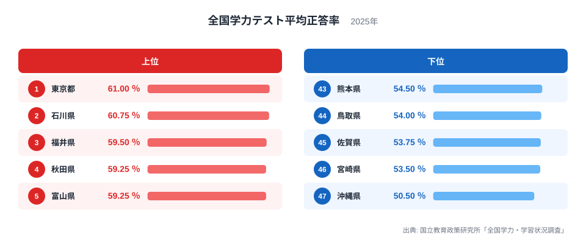
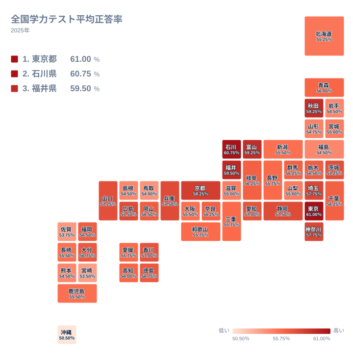

「学力が高い県」と聞くと、多くの人は東北や北陸の地方県を思い浮かべるのではないでしょうか。実際に2025年度の全国学力テスト（全国学力・学習状況調査）でも、石川・福井・秋田・富山という顔ぶれが上位に名を連ねています。ところが今回、1位に立ったのは東京都でした。

全国学力テストは、公立小学校6年生と公立中学校3年生を対象に、文部科学省・国立教育政策研究所が毎年実施している学力調査です。今回のランキングは、小学校の国語・算数と中学校の国語・数学、4教科の平均正答率を単純平均した値で並べています。東京都は61％で1位、最下位の沖縄県は50.5％で、その差は1.2倍にとどまります。順位の格差そのものは大きくない一方、上位の顔ぶれが持つ地理的な意味は見逃せません。

この記事では、なぜ東京が上位に食い込んだのか、なぜ沖縄など特定の地域が下位に集中するのかを地理的な視点から読み解きます。あわせて、学力テストの結果が家計調査の食品消費データや進学率ランキングとどう符合し、どこで食い違うのかも見ていきます。

> [!NOTE]
> このランキングは4教科（小学国語・小学算数・中学国語・中学数学）の平均正答率を単純平均した独自の総合値です。理科は3年に1度しか実施されないため対象から外しています。また調査に参加するのは主に公立の小中学校で、私立・国立校の参加は任意のため、都道府県別の値は公立校の水準を反映したものと理解してください。

## 東京・石川・福井が上位、沖縄が最下位

<source-link href="/ranking/academic-achievement-test-average-rate">全国学力テスト平均正答率ランキングをもっと見る</source-link>

1位は東京都で61％、2位は石川県で60.75％、3位は福井県で59.5％と続きます。4位に秋田県、5位に富山県が並び、上位5県のうち4県を北陸・東北勢が占めている点は、これまでの学力調査で語られてきた構図とほぼ変わりません。[仮説] 石川・福井・富山の3県はいずれも北陸で隣接しており、少人数の学級規模を活かした指導や家庭学習の定着が要因として指摘されることがありますが、これは全国学力テストの正答率データだけでは検証できません。学級規模や家庭学習時間に関する統計と突き合わせて初めて確認できる仮説です。秋田県も同様に公立小中学校の学力水準の高さが全国的に注目されてきましたが、その要因分析も本記事のデータだけでは行えません。

一方で首位に立ったのは、地方の常連組ではなく東京都でした。上位10県まで見ると、石川・福井・富山の北陸3県と秋田に加えて、東京・埼玉・神奈川という首都圏の3都県、京都・兵庫という近畿の2府県、そして静岡が名を連ねています。つまり今回のランキングは、北陸・東北だけでなく首都圏や近畿の都市部も同時に上位を形成しており、単一の地域が独占する構図ではなくなっています。[仮説] 都市部では教育投資や学習塾を含めた教育資源の集積、地方では少人数教育という、それぞれ性質の異なる強みが高い正答率につながっている可能性がありますが、これも全国学力テストの正答率データだけでは検証できません。教育費支出や学習塾の利用率など、別の指標と突き合わせて初めて確認できる仮説です。

タイルマップで見ると、上位の色が北陸から近畿・首都圏にかけて広がっている一方、九州から沖縄にかけて低い値が集中していることがわかります。上位が北陸・首都圏・近畿という離れた地域に飛び地状に散らばっているのは、都市部型と地方型という異なる強みが別々の場所で成り立っているためだと考えられます。対して下位は九州・沖縄という隣接した地域に面として集中しており、こちらは単一の要因（後述する子どもの貧困率や離島の教育資源分散など）が地域全体に広く及んでいる可能性を示しています。同じ「学力上位」でも、成り立ちが異なる複数の地域がまだら状に並んでいる点が、このランキングの読みどころです。

## なぜ九州・沖縄勢が下位に沈むのか

下位5県は熊本県、鳥取県、佐賀県、宮崎県、そして最下位の沖縄県です。鳥取県を除く4県が九州・沖縄に位置しており、下位グループが特定の地域に偏っていることが見て取れます。

沖縄県は50.5％と、46位の宮崎県53.5％からもさらに離れた値で、全国学力テストの都道府県別集計が始まって以来、継続して下位に位置してきた県です。要因として教育政策や地域研究の分野でしばしば指摘されるのが、子どもの貧困率の高さや、離島を多く抱えることによる教育資源の分散です。

[仮説] 沖縄県の順位が継続して低い背景には、世帯所得や地域の教育投資の水準が影響している可能性がありますが、これは全国学力テストの正答率データだけでは検証できません。家計調査や地域別の所得統計と突き合わせて初めて確認できる仮説です。

> [!WARNING]
> このランキングは2025年度単年のスナップショットです。学力調査の順位は年度によって数県分入れ替わることがあり、1年分の数値だけで「その地域の教育水準」を断定するのは早計です。複数年の推移を確認することをおすすめします。

## 学力上位県と食卓の符合、そして相関の限界

学力テストの上位県をめぐっては、家計調査に基づく食品消費データとの符合がしばしば話題になります。[ほうれんそう消費量ランキング](/blog/spinach-consumption-ranking)では、山形・秋田・岩手・富山という東北・北陸勢が上位を占めており、今回の学力テストで上位に入った秋田県や富山県とも顔ぶれが重なります。緑黄色野菜をよく食べる地域と、学力調査で高い成績を収める地域が重なって見える、という指摘は以前から知られている「符合」です。

> [!WARNING]
> ほうれんそうの消費量と学力テストの正答率は、どちらも都道府県別のデータとして重なる部分がありますが、当サイトのデータだけで両者の因果関係を検証することはできません。世帯の教育熱心さや所得水準、地域の食文化など、両方に影響する別の要因が背後にある可能性が高く、「野菜を食べれば学力が上がる」と読み違えないよう注意が必要です。また、ほうれんそう消費量は県庁所在市の二人以上世帯を対象とした家計調査の値で、県全域の消費実態ではありません。学力テストが都道府県全体（公立小中学校）の値である点と対象範囲が異なるため、単純に同じ土俵の県別ランキングとして比べることはできません。

## 進学率ランキングとの違いに見える、もうひとつの物差し

義務教育段階の学力と、高校卒業後の進路はまったく別の指標です。[大学等進学率ランキング](/blog/high-school-advancement-rate)では東京都が1位となっており、今回の学力テストでも東京都が1位という点で重なりが見られます。都市部に大学や専門学校が集中し、通学の選択肢が豊富なことが進学率を押し上げている一方、学力テストの正答率は公立小中学校での指導や家庭学習の水準を反映したものです。

一方で、学力テストの常連組である石川・福井・富山・秋田は、進学率ランキングでは必ずしも東京や京都ほどの上位には入りません。義務教育段階の到達度と、その後の大学進学という選択は、経済的な事情や地元での就職機会、大学の立地条件など、学力とは別の要因にも大きく左右されるためです。

> [!TIP]
> 「学力が高い県=進学率も高い県」とは限りません。義務教育段階の到達度を見るなら全国学力テスト、その後の進路の広がりを見るなら進学率というように、目的に応じて指標を使い分けることをおすすめします。

教育・スポーツ分野の他の指標は[教育・スポーツカテゴリ](/category/educationsports)でまとめて確認できます。[秋田県](/areas/05000)や[東京都](/areas/13000)の地域データブックでは、この記事で扱った指標以外の県別データも参照できます。

## まとめ

- 2025年度の全国学力テスト平均正答率は東京都61％が1位、沖縄県50.5％が最下位で1.2倍の差
- 上位5県は東京・石川・福井・秋田・富山で、北陸・東北勢に加えて東京が首位に立った
- 下位5県は熊本・鳥取・佐賀・宮崎・沖縄で、九州・沖縄勢が下位グループの大半を占める
- 学力上位県とほうれんそう消費量上位県の顔ぶれには符合が見られるが、因果関係は検証されていない
- 学力テストの正答率と大学等進学率は別の指標であり、東京は両方で上位でも常連組の顔ぶれは一致しない

## データ出典

国立教育政策研究所「全国学力・学習状況調査」（令和7年度／2025年度実施）の都道府県別（公立）教科別平均正答率をもとに、小学校国語・算数と中学校国語・数学の4教科を単純平均して算出しています。データはe-Stat経由で取得・加工しています。
