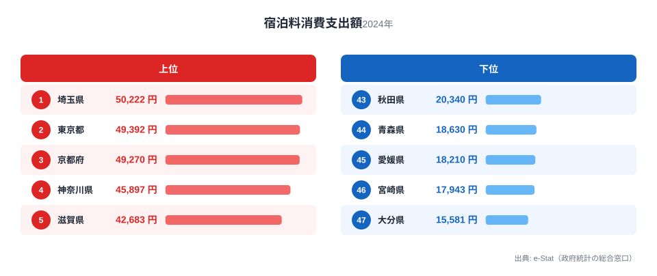
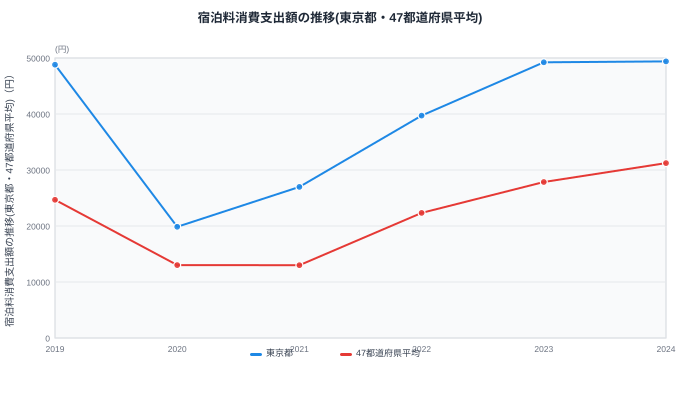

「宿泊料消費支出額」というランキングを見ると、多くの人が「観光地が多い県が上位だろう」と予想するのではないでしょうか。ところがこの指標は、県内の宿泊施設がどれだけ稼いだかではなく、**その県庁所在市に住む世帯が、旅行や出張でどれだけ宿泊費を使ったか**を表す家計側の統計です。

総務省「家計調査」(品目別)によると、2024年の宿泊料消費支出額(二人以上世帯・都道府県庁所在市)は、1位の埼玉県が5万222円、最下位の大分県が1万5,581円で、その差は3.2倍にのぼります。上位には観光県ではなく南関東・近畿の都市圏が並び、下位には九州・四国が目立ちます。

この記事では、上位・下位それぞれの顔ぶれと、コロナ禍で大きく落ち込んでから過去最高水準まで回復した推移を見ながら、「宿泊にお金を使う県民」がどこにいるのかを読み解きます。

> [!NOTE]
> この指標は「家計調査」(総務省)に基づく**支出側**のデータです。県内のホテル・旅館がどれだけ売り上げたかを示す「延べ宿泊者数」などの**受入側**の統計とは性格が異なります。調査対象は都道府県庁所在市に住む二人以上世帯のみで、県内全域の平均ではありません。

## 宿泊料支出が多い県・少ない県

2024年の宿泊料消費支出額で上位に入ったのは、[埼玉県](/areas/11000)(5万222円)、東京都(4万9,392円)、[京都府](/areas/26000)(4万9,270円)、神奈川県(4万5,897円)、滋賀県(4万2,683円)でした。南関東3県と近畿2県が上位5位を占めています。

<source-link href="/ranking/accommodation-consumption-expenditure">宿泊料消費支出額ランキングをもっと見る</source-link>

この並びが示すのは、「観光資源が豊富な県」ではなく「世帯の可処分所得が高い都市圏」が上位に来るという構造です。埼玉・東京・神奈川はいずれも首都圏で世帯収入が全国平均より高く、京都・滋賀も関西圏で通勤圏内の世帯が多い地域です。[仮説] 宿泊を伴う旅行支出は生活必需品ではなく、所得に余裕が出て初めて増える支出(いわゆる「贅沢財」的な性質)である可能性があります。ただしこれは本ランキングの並びから読み取れる傾向にすぎず、所得水準そのものとの相関を確認するには、県民所得や1人あたり可処分所得のランキングと突き合わせる必要があります。

一方で興味深いのは、いわゆる観光地として全国区の知名度を持つ北海道(2万7,331円・33位)や沖縄県(2万1,140円・40位)が中位・下位に沈んでいる点です。これは「その県に旅行者がどれだけ来るか」ではなく「その県に住む世帯がどれだけ旅行にお金を使うか」という視点の違いを如実に表しています。

## 支出が少ない県のグループ

下位を見ると、宮崎県(1万7,943円・46位)と[大分県](/areas/44000)(1万5,581円・47位)の九州勢に加え、愛媛県(1万8,210円・45位)、青森県(1万8,630円・44位)、秋田県(2万340円・43位)が並びます。九州・四国・東北という、都市圏から距離のある地方が目立つ構成です。

> [!WARNING]
> 家計調査は各都道府県の**県庁所在市のみ**を対象にしたサンプル調査です。県全体の平均ではなく、また調査世帯数も都市によって少ないため、年によって順位が大きく変動することがあります(後述の時系列データ参照)。単年の順位差を「県民性」のように断定的に読むのは避けたほうがよいでしょう。

下位県に共通するのは、都市圏からの移動コストが高く、日帰りで用が済む近距離旅行が主体になりやすいことです。所得水準が相対的に低いことに加え、地元での外食・レジャーで完結する消費パターンが強い地域ほど、宿泊を伴う旅行支出は抑えられる傾向があります。九州は温泉地や観光資源自体は豊富ですが、それは「受け入れる側」の強みであり、「その県に住む世帯が遠方に泊まりがけで出かけるか」という支出側の指標とは別の話だという点が、このランキングの読みどころです。

> [!TIP]
> 埼玉・東京など上位の世帯が年間5万円前後を宿泊にかけているのに対し、大分など下位の世帯は1万5千円台にとどまります。同じ「1泊旅行」でも、都市圏在住者は遠方への移動費・宿泊費込みの予算感覚が身につきやすく、地方在住者は近距離・日帰り中心で予算感覚が異なりやすいということです。地方から都市圏並みの旅行体験(遠方への宿泊旅行)をしようとすると、移動コストの分だけ余計な予算が必要になる点は意識しておくとよいでしょう。

## コロナ禍からの回復と「支出側」の意味

上のグラフは東京都と47都道府県平均の推移を示したものです。2020年に両者とも前年の半分近くまで急落し、2021年も低水準が続いたあと、2022年から右肩上がりに回復し、2023-2024年にはコロナ前(2019年)を上回る水準まで戻っています。東京都は2019年の4万8,799円から2020年に1万9,856円へ急落し、2024年には4万9,392円まで回復。47都道府県平均も2019年の2万4,675円から2020年に1万3,012円へ落ち込み、2024年は3万1,240円と、コロナ前を上回りました。回復のペースは東京都のほうが早く、2023年時点ですでにコロナ前水準を超えている一方、47都道府県平均が2019年水準を超えたのは2023-2024年です。都市圏の支出回復が地方より先行したと読めます。

これは単なる「元に戻った」という話ではなく、宿泊料そのものの値上がり(インバウンド需要や人件費上昇による宿泊単価の上昇)と、旅行需要の反動増が重なった結果と考えられます。[仮説] 支出額の伸びが利用回数の増加によるものか、単価上昇によるものかは、この指標だけでは切り分けられません。検証するには「延べ宿泊者数」など利用量側の指標と合わせて見る必要があります。

<source-link href="/ranking/total-overnight-guests">延べ宿泊者数ランキングで受入側のデータを見る</source-link>

> [!TIP]
> 「宿泊料消費支出額」(支出側・家計調査)と「延べ宿泊者数」(受入側・宿泊旅行統計調査)を並べて見ると、「お金を使う県民」と「観光客を受け入れる県」がずれていることがよく分かります。旅行系のランキングを見るときは、どちらの視点のデータかを意識すると読み違いを防げます。

## パッケージツアー支出との比較

家計調査には、宿泊料以外にも旅行関連の支出項目があります。国内・海外それぞれのパッケージツアー費用の支出額ランキングと合わせて見ることで、世帯がどのような旅行スタイルにお金をかけているかがより立体的に見えてきます。

<source-link href="/ranking/domestic-package-tour-consumption-expenditure">国内パック旅行費ランキングを見る</source-link>

<source-link href="/ranking/overseas-package-tour-consumption-expenditure">海外パック旅行費ランキングを見る</source-link>

> [!NOTE]
> 宿泊料・国内パック旅行費・海外パック旅行費はいずれも家計調査の別品目です。同じ県でも「個人手配の宿泊は多いがパックツアーは少ない」など支出パターンが分かれることがあり、単純に合算して比較することはできません。

## まとめ

- 2024年の宿泊料消費支出額(二人以上世帯・都道府県庁所在市)は1位が埼玉県で5万222円
- 最下位は大分県の1万5,581円で、1位との差は3.2倍
- 上位には南関東・近畿の都市圏が並び、下位には九州・四国・東北の地方が目立つ
- 全国平均は2020-2021年のコロナ禍で半減した後、2023-2024年にコロナ前を上回る水準まで回復
- この指標は「観光客を受け入れる県」ではなく「旅行にお金を使う世帯がいる県」を表す支出側のデータである点に注意

## データ出典

総務省統計局「家計調査」(品目別、都道府県庁所在市・二人以上世帯)を基に集計。e-Stat(政府統計の総合窓口)経由でデータを取得・整備しています。家計の消費支出に関する他の指標は[経済カテゴリ](/category/economy)でまとめて確認できます。
