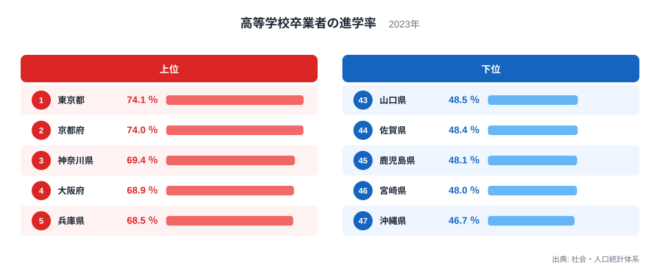
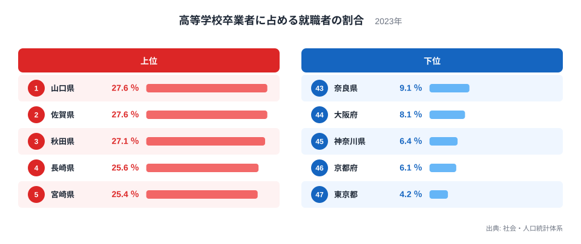
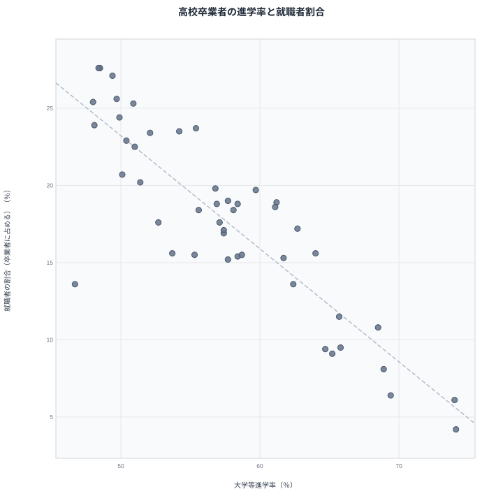
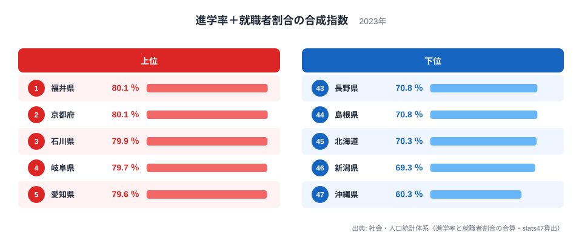

「大学進学率が低い県は、教育のレベルも低い」という見方をよく耳にします。大学等進学率は文部科学省「学校基本調査」に基づく指標で、高校卒業者のうち大学・短期大学等へ進学した人の割合を示します。2023年度は1位の東京都が74.1％、最下位の沖縄県は46.7％で、両者の差は1.6倍あります。

ですが、進学率だけで教育水準を測るのは早計です。高校を卒業してすぐに就職する道も、立派な選択肢のひとつだからです。卒業者に占める就職者の割合まで合わせて見ると、進学率で下位に沈んでいた県が上位に浮かび上がり、東海・北陸勢の存在感が際立ちます。この記事では、進学率と就職者割合の2つの指標を47都道府県で突き合わせ、どちらか一方だけでは見えない県の姿を確認します。

## 大学等進学率の上位5県・下位5県

2023年度の高等学校卒業者の進学率で1位になったのは東京都で74.1％、僅差の2位は京都府で74.0％です。3位以下も神奈川県69.4％、大阪府68.9％、兵庫県68.5％と続き、いずれも大都市圏の県が並びます。大学や短期大学の数が多く、自宅から通える選択肢が豊富な地域ほど、進学のハードルが下がりやすいことがうかがえます。

一方、下位は山口県48.5％、佐賀県48.4％、鹿児島県48.1％、宮崎県48.0％、そして最下位の沖縄県46.7％です。九州・沖縄の各県が下位に集中しており、通学圏内の進学先が限られることが背景のひとつと考えられます。この進学率単体の分布は、以前の記事「[高校卒業者の進学率ランキング](/blog/high-school-advancement-rate)」でも詳しく取り上げています。

<source-link href="/ranking/high-school-advancement-rate">高等学校卒業者の進学率ランキングをもっと見る</source-link>

> [!NOTE]
> 大学等進学率は「大学・短期大学等への進学者数 ÷ 高校卒業者数」で計算され、進学先を大学以外にした人や、大学と就職の両方を目指す浪人生などは含みません。あくまで卒業した年に大学等へ進んだ人の割合であり、翌年以降の再受験は反映されない点に注意してください。

## 卒業者に占める就職者の割合は、進学率とほぼ逆の並び

進学率とは対照的な指標が、高等学校卒業者に占める就職者の割合です。2023年度は山口県と佐賀県がそろって1位で27.6％、3位は秋田県で27.1％、4位は長崎県で25.6％、5位は宮崎県で25.4％でした。興味深いのは、進学率で下位5県だった山口県・佐賀県・宮崎県が、この就職者割合ではそのまま上位に入っていることです。

逆に下位は奈良県9.1％、大阪府8.1％、神奈川県6.4％、京都府6.1％、そして最下位の東京都4.2％と、進学率トップ5と重なる大都市圏の県が並びます。同じ「卒業者を分母とする割合」であるため、進学率が高い県は就職者割合が低くなりやすく、逆もまた成り立つという構造がはっきり見えます。

<source-link href="/ranking/high-school-graduates-job-ratio">高等学校卒業者に占める就職者の割合ランキングをもっと見る</source-link>

> [!NOTE]
> この指標と混同しやすいのが、ハローワーク経由の「就職内定率」です。内定率は求職した生徒のうち内定を得た人の割合(分母は求職者)で、近年は94〜100％とほぼ天井に張り付いています。一方、本記事で使う就職者割合は分母が卒業者全員で、進学率と足し合わせて比較できる指標です。混同すると、まったく違う結論になるので注意してください。

## 進学率と就職者割合の関係を散布図で見る

47都道府県のデータで相関係数を計算すると、進学率と就職者割合の間にはおよそ-0.87という強い負の相関があります。散布図でも、右下(進学率が高く就職者割合が低い)と左上(進学率が低く就職者割合が高い)に県が集まり、右上や左下にはほとんど県がないことが分かります。両者が同じ卒業者数を分母とする「取り合いの関係」にあるため、片方が高ければもう片方は低くなりやすいという構造が、そのまま図の形になって現れています。

対角線から大きく外れた点ほど、この記事にとっては情報量があります。最も目立つのが左下寄りに位置する沖縄県で、進学率は47位の46.7％、就職者割合も38位の13.6％と、どちらの軸でも低い水準にとどまっています。進学率が低い県は就職者割合で挽回するという右下・左上の対応関係から外れた、47都道府県で唯一の県です。この位置取りは、後で見る合成指数でも沖縄県が最下位になることの伏線になっています。

> [!WARNING]
> この負の相関を「進学率が高いと就職環境が悪くなる」といった因果関係と読むのは誤りです。どちらの指標も高校卒業者数を分母とする割合であり、進学と就職以外の進路(専修学校・各種学校への進学や進路未定など)を差し引いた残りを取り合う関係にあります。相関が強いのは、計算のしくみ上そうなりやすいという性質が大きく、[仮説]として一方が他方の原因になっていると断定するには、進路選択の理由まで踏み込んだ別データでの検証が必要です。

## 進学率＋就職者割合を合わせると、東海・北陸勢が上位に浮かぶ

進学率と就職者割合を単純に足し合わせた指数で47都道府県を並べ直すと、景色が一変します。1位は京都府と福井県が並んで80.1％、3位は石川県で79.9％、4位は岐阜県で79.7％、5位は愛知県で79.6％でした。上位10県のうち、岐阜・愛知・三重の東海勢と、福井・石川の北陸勢で5県を占め、東北からは10位の青森県77.7％が入ります。9位には進学率そのものが高い東京都78.3％も入っており、進学率と就職者割合のどちらか一方が際立って高い県が、この指数でも上位になりやすい構造です。

> [!NOTE]
> この合成指数は、進学率と就職者割合をstats47が単純に足し合わせて算出した独自の値で、文部科学省や総務省が公表している指標ではありません。本文中の「全国平均」も、47都道府県の値を単純平均した参考値です。学校基本調査の公式な全国値は卒業者数で加重して計算されるため、47都道府県の単純平均とは一致しない点に注意してください。

この合成指数は、裏を返せば「専修学校・各種学校への進学や進路未定など、進学とも就職とも数えられない残りの進路がどれだけ少ないか」を示す指数でもあります。100％からこの指数を引くと、1位の京都府・福井県はどちらも19.9％、3位の石川県は20.1％、4位の岐阜県は20.3％、5位の愛知県は20.4％、6位の徳島県でも20.6％にとどまり、上位県ほどこの「その他の進路」が小さいという構造が、そのまま上位の顔ぶれに表れています。

一方、最下位は[沖縄県](/areas/47000)で60.3％です。進学率は46.7％、就職者割合は13.6％と両方が低い水準にとどまっています。沖縄県は進学と就職を合わせても6割にとどまり、残りの4割近くが専修学校・各種学校への進学者や進路未定者などに割り当てられている計算です。全国平均では進学と就職を合わせた分の残りはおよそ25％で、沖縄県はその1.6倍近くに達しています。

> [!TIP]
> 国立教育政策研究所の[全国学力・学習状況調査](/ranking/academic-achievement-test-average-rate)(2025年度の都道府県別平均正答率)では、石川県が2位、福井県が3位、秋田県が4位です。この3県は進学率＋就職者割合の合成指数でも、福井県が1位、石川県が3位、秋田県が17位と、いずれも上位半分に入っています。ただし全国学力テストの対象は小学6年生・中学3年生で、進学率・就職者割合は同じ年度の高校卒業者が対象のため、学年も調査年も一致しません。両者に関係がありそうだという見立ては[仮説]にとどまり、同じ生徒集団を追跡する縦断データがなければ検証できません。

## まとめ

- 2023年度の大学等進学率は1位が東京都で74.1％、最下位が沖縄県で46.7％、差は1.6倍
- 卒業者に占める就職者の割合は1位の山口県・佐賀県がともに27.6％で、進学率が低い県ほど高くなる傾向
- 進学率と就職者割合の相関係数はおよそ-0.87で、両者は卒業者数を分母とする「取り合いの関係」
- 進学率＋就職者割合の合成指数は1位の京都府・福井県がともに80.1％で、東海・北陸勢が上位多数
- 合成指数の最下位は沖縄県で60.3％、進学・就職以外の進路が占める割合は全国平均の1.6倍近く

進学率と就職者割合をあわせて見る視点は、[教育・文化の統計](/themes/education-culture)でも他の指標と合わせて確認できます。

## データ出典

大学等進学率・高等学校卒業者に占める就職者の割合は、総務省統計局「社会・人口統計体系」(原典: 文部科学省「学校基本調査報告書」)の都道府県別データ(2023年度)を、e-Stat経由でstats47が集計・可視化したものです。全国学力・学習状況調査の都道府県別正答率は、国立教育政策研究所公表データ(2025年度)を基にしています。
