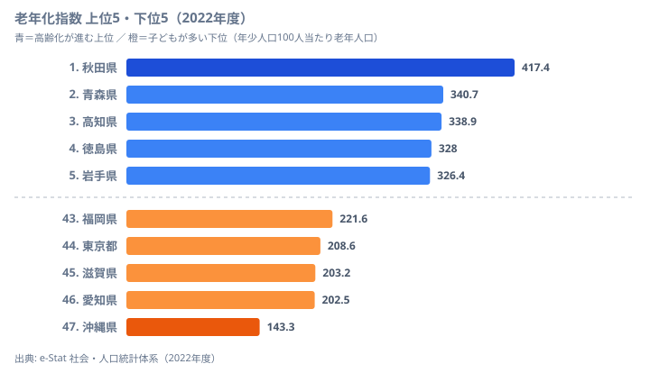

「東京は若い都市だ」──その直感は、半分だけ正しいです。東京都の老年化指数は208.6で、秋田県（417.4）や青森県（340.7）よりはるかに低く、全国でも下位グループに入ります。それなのに年少人口指数（生産年齢人口100人当たりの子どもの数）は全国最低の16.5で、子どもの割合は秋田（17.8）よりもさらに少ないのです。

高齢化していないのに、子どもも極めて少ない。生産年齢人口が流入し続けることで高齢化率は抑えられていますが、出生率の低さは確実に進行しています。これが東京の「隠れた少子化」の構造です。

老年化指数──年少人口（0〜14歳）100人に対する老年人口（65歳以上）の比率──で見ると、都道府県によって最大で約2.9倍の地域差があります。この記事では、どの県で子どもと高齢者のバランスが崩れているのか、そしてなぜ東京が「若いのに危うい」のかを順に読み解いていきます。

## 老年化指数ランキング──上位5と下位5

まず全体像です。2022年度の老年化指数を上位5県・下位5県で並べると、年齢構成の偏りが一目で見えてきます。

老年化指数が最も高いのは秋田県（417.4）です。年少人口100人に対して老年人口が417人いる計算で、子ども1人あたり高齢者が約4.2人という極端なバランスになっています。2位の青森県（340.7）、3位の高知県（338.9）、4位の徳島県（328.0）、5位の岩手県（326.4）と続き、東北と四国が上位を占めます。これらの地域は若い世代の県外流出が長く続き、残った人口が高齢層に偏ったことが背景にあります。産業の中心が農林水産業や地場の小規模事業で、進学・就職のたびに都市圏へ人口が抜けていく構造が、年少人口を細らせてきました。

一方、最も低いのは沖縄県（143.3）です。下位には福岡県（221.6・43位）、東京都（208.6・44位）、滋賀県（203.2・45位）、愛知県（202.5・46位）が並びます。沖縄は全国で唯一150を下回る水準を保っており、これは全国平均271.8を大きく下回ります。沖縄の合計特殊出生率が長年全国トップであること、福岡・滋賀・愛知が大都市圏への通勤・通学で子育て世代を引き寄せていることが、下位グループの「若さ」を支えています。1位の秋田と47位の沖縄の差は約2.9倍に達し、同じ日本でも人口の年齢構成がこれほど違うことがわかります。子どもの割合そのものは[年少人口指数ランキング](/ranking/young-population-index)で、働き手の負担度合いは[従属人口指数ランキング](/ranking/dependent-population-index)で確かめられます。

<source-link href="/ranking/aging-index">老年化指数ランキングをもっと見る</source-link>

> [!NOTE]
> 老年化指数は「年少人口（0〜14歳）100人に対する老年人口（65歳以上）の比率」です。値が100を超えると、その地域では高齢者数が子どもの数を上回っていることを意味します。2022年度時点で全47都道府県が100を超えており、すべての県で高齢者が子どもより多い状態になっています。

## 地域パターンの読み方──東北と四国の濃淡

都道府県ごとの分布を見ると、高齢化の濃淡がはっきりと地域でまとまっています。単に「地方が高い」というより、いくつかの帯に分かれている点が読みどころです。

- **東北が際立って濃い**──秋田（417.4）・青森（340.7）・岩手（326.4）が上位5に並び、山形（320.4）も300を超えます。豪雪地帯で若年層の流出が早く、農村部の高齢化が突出しています。
- **四国も高水準**──高知（338.9）・徳島（328.0）が上位5入り。山がちな地形で平地が限られ、都市への人口集中が進みました。
- **北海道が318.1と東北並み**──広大な面積に集落が分散し、医療や雇用の拠点へのアクセスが悪い地域ほど高齢化が進みます。
- **大都市圏は低い**──東京（208.6）・愛知（202.5）はいずれも下位グループ。生産年齢人口の流入が老年化指数を押し下げています。

つまり老年化指数の高低は、出生率そのものよりも「若い世代がその県に残るか・流入するか」で大きく決まります。だからこそ、出生率が低くても人口流入の多い大都市圏は指数が低く出るという、直感とずれた現象が起きるのです。

<ad-slot></ad-slot>

## 東京の「隠れた少子化」──下位なのに危うい構造

ここからが本題です。老年化指数だけを見ると東京都は208.6で下位グループに入り、「高齢化していない若い都市」に見えます。ところが年少人口指数（生産年齢人口100人当たりの年少人口）に目を移すと、東京は16.5で全国最低です。子どもの割合だけを取り出すと、東北の秋田（17.8）よりもさらに少ないのです。

なぜこの矛盾が生まれるのでしょうか。鍵は分母にあります。東京には毎年、進学・就職で20〜30代が大量に流入します。この生産年齢人口の厚みが老年化指数の「分母側の支え」となり、高齢者比率を見かけ上低く抑えています。しかし流入してくる若者がそのまま結婚・出産に至るとは限らず、出生率はむしろ全国最低水準にとどまります。結果として「高齢化はしていないが、子どもも増えない」という、地方とは別タイプの人口問題が進行しているのです。

対照的なのが沖縄県です。老年化指数143.3・年少人口指数27.1で、子どもが多く高齢者が相対的に少ないという、両面で最も「若い」ポジションにあります。秋田県は老年化指数417.4・年少人口指数17.8と、沖縄の対角にあたる極端な位置を占めます。東京の特異さは、この2県のどちらとも違い「老年化指数は低い／年少人口指数も低い」という第3の象限にある点です。

> [!WARNING]
> 「高齢化率が低い＝人口問題がない」と読むのは誤りです。東京都は年少人口指数が全国最低で、子どもの割合は秋田よりも少ない状態にあります。生産年齢人口の流入が止まれば、蓄積した低出生率が一気に表面化し、急速な高齢化に転じるリスクを抱えています。老年化指数の高低だけで「危ない県／安全な県」を判断しないことが重要です。

> [!TIP]
> 老年化指数と年少人口指数は、分母（生産年齢人口）と分子（子ども・高齢者）の組み合わせを変えた指標です。同じ県を両方の指標で見ると、地方型（老年化指数が高い）と東京型（年少人口指数が低い）という2つの異なる「少子化の顔」が見分けられます。県を評価するときは、必ず2つを並べて読むのがコツです。

## 約50年の推移──全国平均は7倍に

最後に時間軸で見ます。全国平均の老年化指数は、1975年の38.1から2022年度の271.8へと約7.1倍に膨らみました。半世紀で子どもと高齢者の比率が完全に逆転したことになります。

この推移には、見逃せない転換点が2つあります。

1. **1995年**──全国平均の指数が100を突破しました。高齢者数が子どもの数を初めて上回った歴史的な年で、ここから日本は少子高齢化が不可逆なフェーズに入りました。
2. **2022年度**──子ども1人に対して高齢者が2.7人。1975年からの47年間で7倍を超える水準まで来ました。

特に1995年の100突破は象徴的です。この年を境に、地方ではすでに進んでいた高齢化が全国規模の構造問題として固定化しました。今後は東京のように「老年化指数が低くても子どもが増えない」県が、流入の鈍化とともにどう変化するかが焦点になります。高齢層の厚みそのものは[65歳以上人口割合ランキング](/ranking/ratio-65-plus)で、地域ごとの死亡構造への影響は[粗死亡率ランキング](/ranking/crude-death-rate)で合わせて確認できます。

## まとめ

老年化指数という1つの指標から、47都道府県の高齢化の実態を読み解いてきました。要点は次のとおりです。

- 老年化指数1位は秋田県（417.4）、最下位は沖縄県（143.3）で、開きは約2.9倍。
- 上位は東北・四国に集中し、秋田・青森・高知・徳島・岩手が並びます。若年層の流出が長く続いた地域です。
- 下位は大都市圏と沖縄。福岡・東京・滋賀・愛知は人口流入で、沖縄は高い出生率で「若さ」を保っています。
- 東京都は老年化指数が下位（208.6）でありながら年少人口指数は全国最低という逆説を抱え、「若い都市」という認識に修正を迫ります。
- 県の人口問題を理解するには、高齢化率だけでなく年少人口指数も合わせて見る必要があります。

## データ出典

- e-Stat 社会・人口統計体系「人口・世帯」老年化指数・年少人口指数（2022年度）
- 老年化指数の定義: 年少人口（0〜14歳）100人当たりの老年人口（65歳以上）

<site-link category="population"></site-link>
