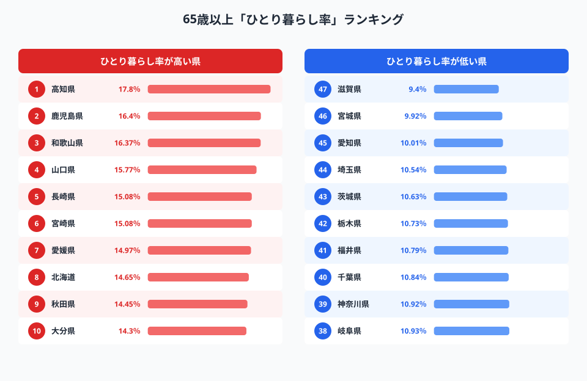
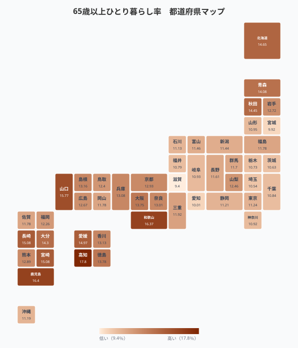
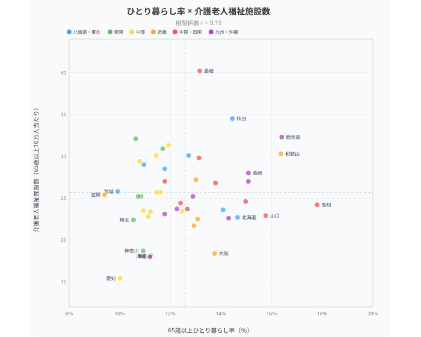
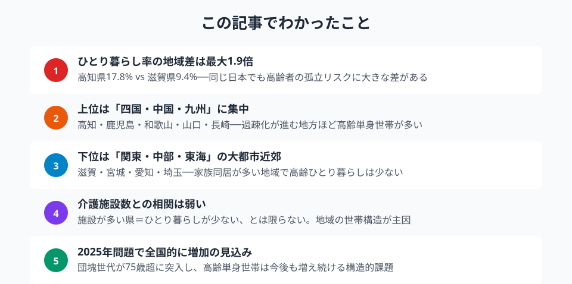

「おばあちゃんの一人暮らしが心配」──そんな声は全国どこでも聞かれますが、実態は都道府県によって大きく異なります。65歳以上の高齢者のうち、一人暮らしの割合が**最も高い県は17.8%**、最も低い県は**9.4%**。約1.9倍もの格差があるのです。

団塊世代が75歳以上になる「2025年問題」が現実を迎えた今、高齢者の孤立はどの地域で深刻なのか。総務省の統計データから、47都道府県のリアルを読み解きます。

> [!NOTE]
> 本記事のデータは総務省「社会生活統計指標」の65歳以上世帯員のうち単独世帯の割合（2020年）です。国勢調査ベースの指標であり、5年ごとに更新されます。

## 65歳以上ひとり暮らし率ランキング──高知県が全国1位

<data-source url="https://www.e-stat.go.jp/dbview?sid=0000010201" label="e-Stat 社会生活統計指標"></data-source>

**1位は[高知県](/areas/39000)の17.8%**。65歳以上の高齢者のおよそ5.6人に1人が一人暮らしです。2位の鹿児島県（16.4%）、3位の和歌山県（16.37%）と続き、**上位5県のうち4県が四国・九州・中国地方**に集中しています。詳細は[都道府県別 65歳以上ひとり暮らし率ランキング](/ranking/single-person-household-old-population-ratio)を参照。

一方、最も低いのは**[滋賀県](/areas/25000)の9.4%**。宮城県（9.92%）、愛知県（10.01%）と、大都市近郊の「ベッドタウン」型の県が下位に並びます。

上位と下位の傾向は明確です。

- **高い県**：過疎化が進む地方。若年層の都市部流出で高齢者だけが残り、配偶者との死別後に一人暮らしになるパターンが多い
- **低い県**：三世代同居の文化が残る地域、または子育て世代の流入が多い大都市近郊

注目すべきは**北海道**（8位・14.65%）。地方圏でありながら上位に入っているのは、札幌への一極集中で地方部の高齢単身化が進んでいることを反映しています。

## タイルマップで見る地域パターン

<data-source url="https://www.e-stat.go.jp/dbview?sid=0000010201" label="e-Stat 社会生活統計指標"></data-source>

マップで俯瞰すると、**西日本・四国・九州の赤色（高率）**と**関東・中部・東海の緑色（低率）**のコントラストが鮮明です。

特徴的なのは次の3つの地域パターンです。

**1. 四国・南九州ベルト**（高知・鹿児島・宮崎・愛媛・長崎）──過疎化の最前線。若者の流出が数十年続き、残された高齢者の単身化が進行しています。

**2. 東海・北関東の「同居圏」**（滋賀・愛知・埼玉・茨城）──三世代同居の慣行が比較的残っている地域。また子育て世帯の転入が多く、家族構成が若い。

**3. 大都市圏の「意外な中間」**（東京・大阪・神奈川）──絶対数では高齢単身世帯が多いものの、**割合**で見ると全国平均（12.6%）前後にとどまります。若い世代の人口が多いため、全体の中での比率が薄まる構造です。

> [!TIP]
> 東京都の65歳以上ひとり暮らし率は12.16%で全国20位。「高齢者が多い東京」というイメージがありますが、率で見ると中位です。ただし絶対数では全国最多であり、見守りや孤独死対策の需要は極めて大きい点に注意が必要です。

<ad-slot></ad-slot>

## ひとり暮らし率と介護施設数に相関はあるか？

「ひとり暮らしの高齢者が多い地域は、介護施設も充実しているのでは？」──直感的にはそう思えますが、データはどうでしょうか。

<data-source url="https://www.e-stat.go.jp/dbview?sid=0000010201" label="e-Stat 社会生活統計指標"></data-source>

散布図を見ると、**相関係数はr = 0.19と弱い正の相関**にとどまります。つまり、ひとり暮らし率が高い県だからといって介護施設が充実しているわけではありません。

**注目すべき4つの象限：**

- **右上**（ひとり暮らし率高い × 施設多い）：鹿児島、和歌山──過疎地ゆえに施設整備が進んでいるが、それでも追いつかない
- **右下**（ひとり暮らし率高い × 施設少ない）：高知、北海道──ひとり暮らしの高齢者が多いのに施設が足りない、最も深刻な地域
- **左上**（ひとり暮らし率低い × 施設多い）：島根、秋田、茨城──家族同居が多く施設も整備されている
- **左下**（ひとり暮らし率低い × 施設少ない）：東京、大阪、愛知──大都市圏は同居率がやや高いが、施設数は人口比で不足

**高知県は最も厳しい位置**にあります。ひとり暮らし率が全国1位（17.8%）でありながら、介護施設数は人口比で全国平均を下回っています。在宅介護の負担が大きく、孤独死リスクも高い地域です。

一方、**島根県は介護施設数が全国1位**（65歳以上10万人あたり40.2か所）ですが、ひとり暮らし率は全国平均程度。施設整備だけでは高齢者の孤立を防げないことを示唆しています。

<source-link href="/correlation?x=single-person-household-old-population-ratio&y=nursing-welfare-facility-count-per-100k-65plus">ひとり暮らし率 × 介護施設数の相関をもっと見る</source-link>

## なぜ地域差が生まれるのか──3つの構造要因

高齢者のひとり暮らし率に地域差が生まれる背景には、主に3つの構造的な要因があります。

### 1. 若年層の流出と過疎化

四国・九州・中国地方の高率県に共通するのは、**数十年にわたる若年層の都市部への流出**です。子ども世代が県外に出てしまうと、配偶者と死別した高齢者は一人暮らしにならざるを得ません。高知県の人口は1985年のピーク時から約2割減少しており、残された高齢者の単身化が加速しています。

### 2. 三世代同居の文化

滋賀県、宮城県、福井県など**ひとり暮らし率が低い県**は、三世代同居の慣行が比較的残っています。特に北陸・東海では「長男が家を継ぐ」文化が根強く、親世代と同居する割合が高い。結果として高齢者の単身化が抑制されています。

### 3. 未婚高齢者の増加

今後の最大のリスク因子は**未婚高齢者の増加**です。現在の50代で生涯未婚率は男性約28%、女性約18%に達しています。この世代が高齢期を迎える2040年代には、「そもそも配偶者がいない」高齢者が大幅に増加し、ひとり暮らし率はさらに上昇する見込みです。

> [!WARNING]
> 本記事のデータは2020年国勢調査ベースです。2025年国勢調査の結果が公表されれば、団塊世代の後期高齢者入りによる変化が明らかになるでしょう。

<ad-slot></ad-slot>

## まとめ

65歳以上のひとり暮らし率は、高知県の17.8%から滋賀県の9.4%まで約1.9倍の格差があります。過疎化が進む四国・九州で高く、家族同居が多い東海・北関東で低い──その背景には若年層の流出、同居文化、未婚率の上昇という構造的要因があります。

介護施設の整備だけでは解決しない。地域の見守りネットワーク、デジタル技術の活用、住まいの選択肢の多様化──高齢者の孤立を防ぐには、地域ごとの事情に合わせた総合的な対策が求められています。

## データ出典

本記事のデータはe-Stat（政府統計の総合窓口）を基に作成しています。

本記事の対象データ: [関連カテゴリ](/category/population)
