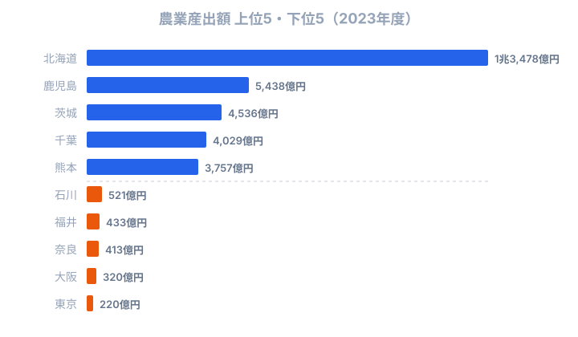
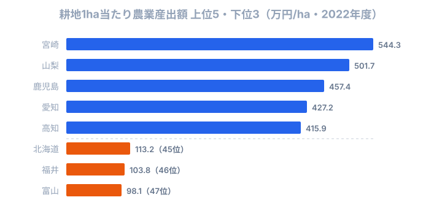

「農業といえば北海道」──多くの人がそう答えるでしょう。実際、2023年度の[農業産出額](/ranking/agricultural-output)は北海道が約1兆3,478億円で堂々の全国トップです。[耕地面積](/ranking/cultivated-area)も114万haで2位以下を圧倒します。まさに「規模日本一」です。

ところが、同じ北海道を**「耕地1ha当たりどれだけ稼いだか」**という物差しで測り直すと、順位は全国の下から3番目まで転落します。土地生産性のトップは宮崎県（544.3万円/ha）、2位は山梨県（501.7万円/ha）──いずれも総額ランキングの上位常連ではない県です。同じ「農業が強い県」でも、何を基準にするかで勝者がまるで入れ替わります。

> [!NOTE]
> 「農業産出額」とは、農産物の生産量に販売価格を乗じて推計した農業生産の総額です。耕種（米・野菜・果実等）と畜産（肉・乳・卵等）の合計で、地域の農業の経済規模を測る基本指標。一方の「土地生産性」は産出額を耕地面積で割った派生値で、両者は別の物差しである点に注意してください。

農業の「強さ」は、どの物差しで測るかで答えが変わります。この記事では (1) 総額、(2) 就業者1人当たり、(3) 耕地1ha当たり の3つの観点を並べ、北海道の「広さで稼ぐ」モデルと、宮崎・山梨に代表される「狭い土地を高く活かす」モデルの違いを読み解いていきます。

## 農業産出額トップ──畜産型 vs 耕種型

<data-source url="https://www.e-stat.go.jp/dbview?sid=0000010103" label="e-Stat 社会・人口統計体系"></data-source>

1位の**北海道は約1兆3,478億円**で、2位・鹿児島県の約5,438億円に対して2.5倍の差をつけています。3位以下は茨城県（約4,536億円）、千葉県（約4,029億円）、熊本県（約3,757億円）と続きます。下位を見ると、東京都（220億円）・大阪府（320億円）・奈良県（413億円）など、耕地そのものが小さい都市部や近畿の県が並びます。ただしこれは耕地面積の小ささの反映であって、農業の「効率」が低いわけではありません。実際、東京は1ha当たりの土地生産性では346.6万円で全国10位と健闘しており、総額の小ささと効率の高さは別問題なのです。

トップ層を産業構造の観点から分類すると、大きく3タイプに分かれます。**畜産型**は鹿児島県（2位）・宮崎県（6位）・熊本県（5位）・岩手県（9位）です。鹿児島は黒毛和牛・豚・鶏の産出額がいずれも全国上位で、畜産だけで産出額の6割超を占めます。宮崎はブロイラーと肉用牛が主力で、口蹄疫からの復興後も着実に産出額を伸ばしてきました。**耕種型**は茨城県（3位）・千葉県（4位）で、首都圏への近接立地を活かした野菜産地です。茨城はメロン・レンコン・白菜の産出額が全国1位、千葉は落花生・にんじん・ねぎなどが強く、大消費地に近い「近郊農業」の典型といえます。そして**複合型**の代表が北海道で、畜産（生乳・肉用牛）と耕種（馬鈴薯・小麦・てん菜・米）の両方がバランスよく発達しています。北海道の[乳用牛飼育頭数は約79万頭で全国の6割超](/ranking/dairy-cattle-count)を占め、広大な耕地面積を背景に大規模経営による効率化が進んでいます。青森県（7位）はりんご・にんにくなどの果樹・野菜と畜産の複合型、愛知県（8位）は花き・野菜の施設園芸と畜産が拮抗しています。

このように、総額の上位には「広い面積に作物を広く展開する複合型（北海道）」「高付加価値の畜産で稼ぐ畜産型（九州）」「大消費地向けの近郊農業（関東）」という3つの勝ち筋が混在しています。総額という一つの物差しでは、この産業構造の違いまでは見えてきません。だからこそ、次に物差しを変えて測り直す必要があるのです。

<source-link href="/ranking/agricultural-output">47都道府県の農業産出額ランキングをもっと見る</source-link>

<ad-slot></ad-slot>

## 就業者1人当たりで見ると景色が変わる

総額ランキングでは上位に入らない県でも、就業者1人当たりに換算すると景色が変わります。1人当たり農業産出額（2018年度）の1位は北海道の**1,304万円**で、2位・鹿児島（840万円）を大きく上回ります。北海道の農家1戸当たり経営耕地面積は全国平均の約10倍にのぼり、大規模機械化農業が1人当たり生産性を押し上げているのです。

注目すべきは**宮崎県**（3位・762万円）です。総額では6位ですが、1人当たりでは3位に浮上します。ブロイラー・肉用牛の高付加価値畜産が、比較的少ない就業者数で大きな産出額を生む構造を反映しています。また、群馬県（5位）や沖縄県（8位・496万円）のように、総額ランキングでは上位に入らない県が1人当たりでは上位に食い込みます。群馬は豚・こんにゃくいもの集約的農業、沖縄はさとうきびと肉用牛に特化した構造が背景にあります。

> [!WARNING]
> 就業者1人当たり農業産出額は2018年度、土地生産性は2022年度、総額は2023年度と、3つの観点で集計年次が異なります。年次をまたいだ順位の直接比較ではなく、それぞれの「物差しでの傾向」として読み解いてください。とくに2018年度の1人当たり値は最新の作付け転換を反映していない点に留意が必要です。

総額1位の北海道が1人当たりでも1位という事実は、北海道の強さが単なる「面積の広さ」だけではなく「経営規模の大きさ＝1人が担う耕地の広さ」にも支えられていることを示します。一方で宮崎のように、面積でも就業者数でも北海道に及ばないのに1人当たりで肉薄する県は、高単価品目への特化という別の戦略で生産性を高めています。同じ「強い」でも、その中身は規模型と特化型に分かれているのです。

<source-link href="/ranking/agricultural-output-per-employed-person">47都道府県の就業者1人当たり農業産出額ランキングをもっと見る</source-link>

## 「広さで稼ぐ」北海道、「狭く高く」の宮崎・山梨

冒頭の問いに戻りましょう。北海道は総額1位・耕地1位なのに、なぜ土地生産性では下位に沈むのでしょうか。耕地1ヘクタール当たりの産出額（2022年度）を並べると、その構造がはっきり見えてきます。

<data-source url="https://www.e-stat.go.jp/dbview?sid=0000010103" label="e-Stat 社会・人口統計体系"></data-source>

土地生産性のトップは宮崎県（544.3万円/ha）、2位は山梨県（501.7万円/ha）、3位は鹿児島県（457.4万円/ha）と続きます。4位の愛知県（427.2万円/ha）、5位の高知県（415.9万円/ha）まで、上位は畜産・果樹・施設園芸といった**単位面積当たりの付加価値が高い品目**に特化した県が占めます。山梨はぶどう・ももの果樹、高知はなす・しょうがの施設園芸、愛知は花き・野菜の施設園芸が、それぞれ狭い土地で高い売上を生み出しています。

対照的に、**北海道は113.2万円/haで全国45位**と下位に沈みます。下には福井県（103.8万円/ha・46位）、富山県（98.1万円/ha・47位）という水稲中心の県しかありません。北海道の114万haという耕地は、耕地面積2位の新潟（16.7万ha）の約7倍にのぼります。そこに馬鈴薯・小麦・てん菜・牧草・酪農を広く展開する「土地集約型」モデルのため、1ha当たりの密度は低くても、圧倒的な面積で総額1位を実現しているのです。これは弱さではなく、北海道だからこそ成立する規模の経済といえます。一方、宮崎・山梨は限られた耕地に高単価品目を凝縮する「労働・資本集約型」で、同じ「農業が強い県」でも勝ち筋がまったく異なります。

> [!TIP]
> 土地生産性が高い県（宮崎・山梨・愛知・高知）は、単位面積当たりの付加価値が高い品目に特化しています。逆に北海道や富山・福井のように、米・小麦・てん菜・牧草といった広い面積を要する作物が中心の県は、面積当たりの数字では伸びにくくなります。「総額1位＝効率1位」と読み違えないことが、農業統計を見るコツです。

ここで耕地面積そのものの順位も確認しておきましょう。耕地面積（2024年度）でも北海道は1位、新潟が2位ですが、新潟の農業産出額は約2,281億円で14位にとどまります。水稲単作地帯では米の単価が畜産物や施設園芸作物に比べて低いため、広い耕地を持っていても産出額の伸びには直結しません。同様の傾向は秋田・山形など東北の水稲産地にも共通しています。「広い耕地＝高い産出額」とも限らないのです。

<source-link href="/ranking/land-productivity-per-ha">47都道府県の土地生産性ランキングをもっと見る</source-link>

<source-link href="/ranking/cultivated-area">47都道府県の耕地面積ランキングをもっと見る</source-link>

<ad-slot></ad-slot>

## まとめ

農業産出額は総額だけでは都道府県の農業力を正確に測れません。大規模経営・畜産・施設園芸といった産業構造の違いが、物差しを変えるたびに順位を大きく入れ替えます。北海道は総額1位・耕地1位・1人当たり1位という規模の王者ですが、土地生産性では45位と下位に沈み、代わりに宮崎・山梨が効率の頂点に立ちます。

注目すべきは畜産県の台頭です。鹿児島・宮崎・熊本は畜産物の価格上昇を追い風に産出額を伸ばしており、1人当たり生産性でも上位に位置します。一方、新潟を筆頭とする水稲産地は耕地面積の大きさに対して産出額が伸び悩んでいます。水田のフル活用──園芸作物への転換や飼料用米の拡大──が今後の課題となるでしょう。農業の「強さ」を一つの数字で語らず、総額・1人当たり・面積当たりの3つを重ねて見ることで、各県の本当の勝ち筋が浮かび上がってきます。

### データ出典

- e-Stat 生産農業所得統計（農業産出額・都道府県別、2023年度）
- e-Stat 作物統計調査（耕地面積、2024年度）
- 土地生産性は農業産出額（2022年度）を耕地面積で除した派生値

数値は各統計の確報値に基づきます。
