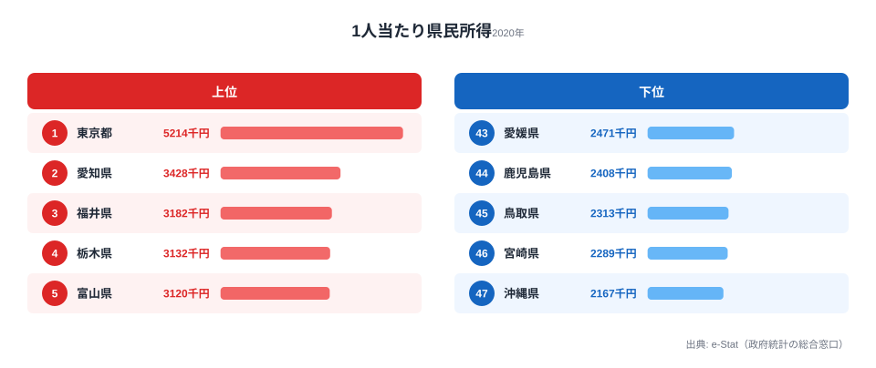

「47 都道府県の県民所得を、議会答弁用に明日までに揃えてほしい」——県庁で働いていたとき、こんな依頼は珍しくありませんでした。

e-Stat から CSV をダウンロードし、Excel で結合し、グラフを作り、Word に貼り付ける。1 つの指標で半日仕事です。本記事では、この作業を **Claude Code に置き換えて 15 分で終わらせる** 具体的な 7 ステップを公開します。

筆者は元県庁職員で、現在は個人で [stats47.jp](https://stats47.jp/)（47 都道府県の統計サイト）を運営しています。1 人で 331 ランキングを毎日更新できているのは、Claude Code による自動化があるからです。同じ仕組みは、自治体の議会資料・補助金交付要綱・決算カード作成にもそのまま転用できます。


## 自治体で統計を扱う担当者の「半日仕事」

自治体の統計担当の典型的な 1 日を思い出してみます。

- 議員からの照会で「県民所得の全国順位の推移」を求められます
- e-Stat を開き、該当の統計表を探します（最初の 15 分はここで消えます）
- CSV をダウンロードし、Excel で「セル参照のずれ」と戦います
- VLOOKUP で他県データと結合し、ピボットテーブルで集計します
- グラフを作り、Word に貼り付け、簡単なコメントを添えます
- 半日経過し、デスクの周りはコーヒーカップだらけになります

これを月に何回繰り返しているでしょうか。決算カード、補助金交付要綱の参考資料、議会答弁、首長の挨拶原稿、記者発表資料——統計データを引用する場面は枚挙にいとまがありません。

しかも、毎回ほぼ同じ作業です。データソースは e-Stat、整形はピボット、出力は Word/Excel。**「定型化されているのに自動化されていない」** 業務の代表例だといえます。地域の統計に何が含まれるかを俯瞰したいときは、[都道府県データのカテゴリ一覧](https://stats47.jp/category/economy)から自分の担当指標を探すと、出発点が見つけやすくなります。

> [!NOTE]
> 本記事で扱う「自動化」とは、単にマクロを組むことではありません。「自然言語で指示するだけで、データ取得から資料出力まで一気通貫で走る」状態を指します。Claude Code は AI が手順書（スキル）に従って実行するので、毎回プログラムを書き直す必要はありません。


## Claude Code とは｜統計実務での価値

Claude Code は、Anthropic 社が提供する **CLI 型の AI コーディングエージェント** です。VSCode やターミナルから自然言語で指示を出すと、ファイル編集・コマンド実行・API 呼び出しまでを自律的にこなします。

統計実務における価値は 3 つあります。

- **データ取得の自動化**：e-Stat API を直接叩き、CSV を介さずに整形まで完了します。手作業のダウンロードとセル参照の修正がまるごと消えます。
- **コードの再利用性**：1 度書いた取得スクリプトを「スキル」化しておけば、翌月以降は引数を差し替えるだけで同じ資料が再生成できます。
- **レポートの自動生成**：Markdown から PDF や Word へ、チャート画像や Excel への流し込みまで一括で処理できます。

ポイントは「Excel や Access が苦手な人でも使える」ことです。プログラミング経験がなくても、**自然言語で「やってほしいこと」を伝えれば、Claude Code が裏でコードを書いて実行** します。

筆者の体感では、Excel マクロを習得するより Claude Code を覚えるほうが、公務員の方には合っていると思います。マクロは VBA の独自構文があり、ネット検索しても自分の業務にピタッと合うサンプルは少ないものです。一方 Claude Code は「県民所得を上位 10 県でグラフにして」と日本語で頼めば、その場でコードを書いてくれます。


## 7 ステップワークフロー｜半日仕事を 15 分に圧縮する

ここからが本題です。Claude Code を使って 47 都道府県分析を自動化する 7 ステップを順に解説します。

### Step 1: e-Stat API 鍵を取得する

最初に必要なのは e-Stat の API 鍵（appId）です。以下から無料登録できます。

- [e-Stat API 機能 利用ガイド](https://www.e-stat.go.jp/api/)
- 個人利用は無料で、自治体利用も特に申請は不要です（利用規約は要確認です）

登録後、マイページで appId が発行されます。これを環境変数 `ESTAT_APP_ID` として保存しておきます。

> [!WARNING]
> 庁内ネットワークから外部 API にアクセスできない環境では、自宅 PC や個人スマホのテザリングで動作確認するのが現実的です。本格運用時は情報セキュリティ部門に「e-Stat は公開データのみを扱う API である」ことを説明し、ホワイトリスト登録を依頼してください。閉域網の制約を確認せずにスクリプトを組むと、現場で動かず差し戻しになります。

### Step 2: Claude Code 環境を構築する

Claude Code のインストールは、ターミナルから 1 行で完了します。

```bash
npm install -g @anthropic-ai/claude-code
```

VSCode と統合するなら、Claude Code 公式拡張機能をインストールして、コマンドパレットから `Claude Code: Start` を実行するだけです。

Pro プラン（月額 $20）に契約すれば、追加の API 料金なしで一定量まで使えます。後述しますが、47 都道府県分析を月に 10 本程度こなす規模なら Pro プランで十分です。

### Step 3: 自然言語で 47 都道府県データを取得する

ここから AI に頼む工程です。Claude Code に以下のように話しかけます。

```
e-Stat API を使って、都道府県別の県民所得（最新年度）を取得して、
prefecture_income.csv に保存して。
```

すると Claude Code は、e-Stat の統計表 ID を検索し、該当データを取得して CSV に整形するコードを書き、実行までしてくれます。

裏で動くコードのイメージはこんな形です（Python の例）。

```python
import requests
import pandas as pd
import os

APP_ID = os.environ["ESTAT_APP_ID"]
STATS_DATA_ID = "0003445758"  # 県民所得統計（例）

url = "https://api.e-stat.go.jp/rest/3.0/app/json/getStatsData"
params = {
    "appId": APP_ID,
    "statsDataId": STATS_DATA_ID,
    "lvArea": "2",  # 都道府県レベル
}

response = requests.get(url, params=params)
data = response.json()

# DataValue 配列を DataFrame に変換
values = data["GET_STATS_DATA"]["STATISTICAL_DATA"]["DATA_INF"]["VALUE"]
df = pd.DataFrame(values)
df.to_csv("prefecture_income.csv", index=False)
```

Claude Code を使う最大の利点は、**「このコードを書く時間がゼロ」** という点です。「県民所得を取りたい」と日本語で言うだけで、AI が統計表 ID を調べ、API 呼び出しを書き、CSV 整形までやってくれます。実際にどんな指標が公開されているかは、[1 人当たり県民所得のランキング](https://stats47.jp/ranking/prefectural-income-per-capita)のように完成形を先に眺めておくと、ゴールイメージが固まります。

### Step 4: 都道府県別ランキングを自動生成する

CSV ができたら、次は順位付けです。これも自然言語で頼みます。

```
prefecture_income.csv を読み込んで、都道府県別の県民所得を
高い順に並べたランキング表を作って。1人当たり所得も列に追加して。
```

Claude Code は pandas で並び替えと計算列の追加を行い、結果を整形して出力します。

```python
import pandas as pd

df = pd.read_csv("prefecture_income.csv")
df_ranked = df.sort_values("value", ascending=False).reset_index(drop=True)
df_ranked["rank"] = df_ranked.index + 1
df_ranked["per_capita"] = df_ranked["value"] / df_ranked["population"]
print(df_ranked.to_markdown(index=False))
```

出力結果を実際の数値で確認してみます。最新の 1 人当たり県民所得（2020 年度）を上位 5 県・下位 5 県で並べると、次のようになります。



1 位は東京都の 5,214 千円で、2 位の愛知県（3,428 千円）に 1,786 千円の差をつけています。本社機能と企業所得が東京都に集中するため、1 人当たりで見ても突出する構図です。3 位には製造業が厚い福井県（3,182 千円）が入り、太平洋ベルトの大都市圏とは別の経済構造で上位に食い込んでいます。一方、最下位は沖縄県の 2,167 千円で、46 位の宮崎県（2,289 千円）とともに南九州・沖縄が下位に並びます。上位の東京都と最下位の沖縄県では 2.4 倍の開きがあり、この一枚の図だけで「どの県をベンチマークに置くか」という議論の出発点が作れます。Claude Code に「上位 5 県と下位 5 県を 1 枚の図にして」と頼めば、この比較図もそのまま生成できます。

このランキングをそのまま議会資料や記者発表資料に貼り付けられます。<source-link href="/ranking/prefectural-income-per-capita">1 人当たり県民所得のランキングをもっと見る</source-link>

> [!TIP]
> 順位付けの段階で「総額」と「1 人当たり」を両方そろえておくと、議会答弁で角度の違う質問が来ても即答できます。たとえば総額（県内総生産）では大きく見える県でも、人口で割った 1 人当たり県民所得では順位が入れ替わることがあります。「総額で N 位、1 人当たりで M 位」と両方を手元に置いておくのが、角度の違う質問に即答する読み筋です。

### Step 5: チャート出力（D3.js または matplotlib）

数値だけでは伝わらないので、グラフ化します。Claude Code に頼みます。

```
ランキング上位 10 県の県民所得を棒グラフにして、
PNG で出力して。フォントは日本語対応で。
```

裏では matplotlib（Python）か D3.js（JavaScript）でグラフが生成されます。stats47.jp では D3.js で SVG を生成して Web 表示していますが、自治体内部資料なら matplotlib で PNG を出すのが扱いやすいです。

```python
import matplotlib.pyplot as plt
import japanize_matplotlib  # 日本語フォント対応

top10 = df_ranked.head(10)
plt.figure(figsize=(10, 6))
plt.barh(top10["prefecture"], top10["value"])
plt.xlabel("県民所得（百万円）")
plt.gca().invert_yaxis()
plt.tight_layout()
plt.savefig("ranking_top10.png", dpi=150)
```

`japanize_matplotlib` を入れておけば日本語の文字化けも回避できます。これも Claude Code に「日本語フォントで」と頼めば自動で追加してくれます。

### Step 6: レポートを PDF/Word に変換する

ランキングとグラフが揃ったら、最終アウトプットの資料化です。

```
ランキングとグラフを使って、
「県民所得の全国比較レポート」というタイトルで Word ファイルを作って。
```

Claude Code は `python-docx` ライブラリで Word ファイルを生成します。PDF が必要なら `pandoc` 経由で Markdown から PDF にも変換できます。

```python
from docx import Document
from docx.shared import Inches

doc = Document()
doc.add_heading("県民所得の全国比較レポート", level=1)
doc.add_paragraph("最新年度の都道府県別県民所得ランキングを以下に示します。")
doc.add_picture("ranking_top10.png", width=Inches(6))
doc.save("report.docx")
```

これで議会答弁用の資料下書きが完成します。あとは担当者が文章を整え、必要な解釈を追記するだけです。**「機械的な 90%」を AI が、「判断の 10%」を人間が担う** という分業が自然にできます。

### Step 7: 定期実行スクリプト化する

最後の仕上げは「人間がボタンを押さなくても動く」状態にすることです。

毎月 1 日の朝 7 時に自動実行したいなら、Mac の場合は launchd、Windows ならタスクスケジューラ、Linux なら cron に登録します。

```bash
# crontab -e で以下を追加（毎月 1 日 7:00 に実行）
0 7 1 * * cd /path/to/project && python generate_report.py
```

これで翌月以降、出勤するとデスクに最新の県民所得レポートが届いている状態になります。属人化も解消できます。担当者が異動・退職しても、スクリプトと SKILL.md（手順書）が残っていれば、後任者がそのまま運用を引き継げます。


## 実例｜県民所得ランキング自動生成のフルコード

7 ステップを実際に動かすと、コードはこのくらいで完結します。

```python
# generate_income_ranking.py
import os
import requests
import pandas as pd
import matplotlib.pyplot as plt
import japanize_matplotlib
from docx import Document
from docx.shared import Inches

APP_ID = os.environ["ESTAT_APP_ID"]
STATS_DATA_ID = "0003445758"

# Step 1-3: データ取得
url = "https://api.e-stat.go.jp/rest/3.0/app/json/getStatsData"
params = {"appId": APP_ID, "statsDataId": STATS_DATA_ID, "lvArea": "2"}
data = requests.get(url, params=params).json()
values = data["GET_STATS_DATA"]["STATISTICAL_DATA"]["DATA_INF"]["VALUE"]
df = pd.DataFrame(values)

# Step 4: ランキング化
df_ranked = df.sort_values("$", ascending=False).reset_index(drop=True)
df_ranked["rank"] = df_ranked.index + 1

# Step 5: グラフ化
top10 = df_ranked.head(10)
plt.figure(figsize=(10, 6))
plt.barh(top10["@area"], top10["$"].astype(float))
plt.xlabel("県民所得（百万円）")
plt.gca().invert_yaxis()
plt.tight_layout()
plt.savefig("ranking_top10.png", dpi=150)

# Step 6: Word 出力
doc = Document()
doc.add_heading("県民所得の全国比較レポート", level=1)
doc.add_picture("ranking_top10.png", width=Inches(6))
doc.save("report.docx")
```

50 行程度のコードですが、これを 1 から書こうとすると、e-Stat API のレスポンス構造を調べるだけで半日かかります。Claude Code に「県民所得を取って Word レポートにして」と頼めば、このコードが自動で生成されます。同じ要領で、[公務員の業務効率化 × AI の実例記事](https://stats47.jp/blog/koumuin-claude-code-estat-automation)のように、指標を変えて横展開していけます。

> [!WARNING]
> 県民所得は「県内総生産」とは異なる指標で、企業所得・財産所得・雇用者報酬を合算したものを県内人口で割った値です。県内総生産（GDP）よりも住民の所得実感に近い指標ですが、本社所在地の影響で東京都が高く出やすい性質があります。議会資料で引用する際は、「1 人当たり県民所得は本社集中の影響を受ける」と注釈を入れるのが誠実です。AI が出した数字をそのまま貼るのではなく、定義の確認は人間が担ってください。


## コスト感｜月額いくらで運用できるか

Claude Code の料金体系は 2 通りあります。

- **Claude Pro**：月額 $20（約 3,000 円）。個人で月数十回利用する規模に向きます。公務員の月次レポート作成程度なら、この 1 契約で十分カバーできます。
- **Claude API 従量課金**：100 万トークンあたり約 $3〜15。大量の自動化を組む場合や、複数部署で共有して回す場合に向きます。

公務員の月次レポート作成程度であれば、**Claude Pro 1 契約（月 3,000 円）で十分** です。Excel マクロのスペシャリストを 1 人雇うコストと比較すれば、極めて安価だといえます。

ただし、機密データを扱う場合は AWS Bedrock 経由で Claude を呼び出す構成にして、データが Anthropic 社のサーバーを経由しないようにする選択肢もあります。詳細は後述の Tips を参照してください。


## 公務員向け Tips｜機密データ・ローカル実行・Bedrock 経由

### Tip 1: 機密データは Claude Code に渡さない

人事情報・税情報・生活保護受給者リストなど、外部に出してはいけないデータは Claude Code（クラウド版）に投入してはいけません。

ガイドラインとして、**「e-Stat のような公開データはクラウド OK、庁内 DB の個別データは閉域網 OK」** という線引きを部署内で明文化するのが第一歩です。どの指標がそもそも公開統計なのかは、[ICT 分野のランキング一覧](https://stats47.jp/category/ict)のような公開データの並びを見て判断材料にできます。

### Tip 2: ローカル LLM で完全閉域運用

機密データを扱う場合は、**Ollama** や **LM Studio** で Llama 3 などのオープンソース LLM をローカル PC 上で動かす選択肢があります。精度は Claude より落ちますが、データが PC の外に出ない安心感はあります。

```bash
# Ollama で Llama 3 を起動（macOS / Linux / Windows 対応）
ollama run llama3
```

Claude Code は Anthropic API 専用ですが、同様の CLI として **Aider** や **Continue.dev** はローカル LLM にも対応しています。

### Tip 3: AWS Bedrock 経由で Claude を呼び出す

「クラウド LLM を使いたいが、Anthropic のサーバーを経由したくない」場合、AWS Bedrock 経由で Claude を呼び出すと **データは AWS 内に留まり、Anthropic 社には送信されません**。多くの自治体・公共機関が AWS と契約済みのため、追加の調達手続きも最小化できます。

```python
import boto3
client = boto3.client("bedrock-runtime", region_name="ap-northeast-1")
response = client.invoke_model(
    modelId="anthropic.claude-3-5-sonnet-20241022-v2:0",
    body=json.dumps({"messages": [{"role": "user", "content": "..."}]})
)
```

実装はやや複雑になりますが、調達ガバナンス的にはこちらが本命だと思います。

### Tip 4: スキル（SKILL.md）化で属人化を防ぐ

Claude Code には「スキル」という再利用可能な手順書の仕組みがあります。`SKILL.md` という Markdown ファイルに「何をどの順番で実行するか」を書いておくと、毎回同じ作業を 1 コマンドで呼び出せます。

```markdown
---
name: fetch-prefecture-income
description: 県民所得の最新データを取得してランキングレポートを生成
---

## 手順
1. e-Stat API から県民所得データ取得
2. 都道府県別ランキング作成
3. 上位 10 県の棒グラフを PNG 出力
4. Word レポート生成
5. 指定フォルダに保存
```

これを `.claude/skills/` 配下に置けば、Claude Code に「`fetch-prefecture-income` を実行して」と頼むだけで、毎回同じ品質の資料が出力されます。**業務マニュアルの「文書化」と「実行可能化」が同時に解決** されるのが、SKILL.md の最大の価値です。

異動・退職時の引き継ぎも、SKILL.md を渡すだけで完結します。


## まとめ｜「半日仕事」を「15 分」に変える発想

自治体の統計業務は、**定型化されているのに自動化されていない** 領域の宝庫です。e-Stat、議会資料、決算カード、補助金交付要綱の参考データ——どれも毎月・毎年ほぼ同じ手順で作っているはずです。

Claude Code を導入する真の価値は「コードを書く時間の短縮」ではなく、**「業務を分解し、機械化できる部分を AI に任せる」発想の獲得** にあります。データを取る・整形する・グラフにする・資料化する、それぞれの工程を独立した部品として捉え直せれば、Claude Code はそれを高速に実行してくれます。

stats47.jp では、今回紹介した 7 ステップを発展させ、**331 ランキング・124 本のブログ記事を 1 人で運用** しています。同じ仕組みは中規模自治体（職員数千人規模）の月次業務にもそのまま転用できる規模感です。

まずは「県民所得ランキング 1 本」を 15 分で作るところから始めてみてください。手応えを掴んだら、議会答弁・記者発表・庁内ダッシュボードへと展開していけます。


## データ出典

- e-Stat（政府統計の総合窓口、総務省）の公開 API。本記事の県民所得は内閣府「県民経済計算」の系列を例として参照
- 統計表 ID・年度はサンプルコード内の例示であり、実運用時は最新の統計表 ID を e-Stat 上で確認すること
