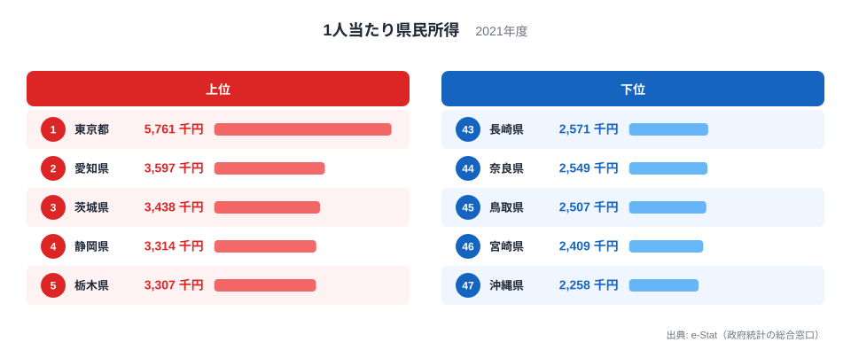

「47 都道府県の県民所得を、議会答弁用に明日までに揃えてほしい」——県庁で働いていたとき、こんな依頼は珍しくありませんでした。

e-Stat から CSV をダウンロードし、Excel で結合し、グラフを作り、Word に貼り付ける。1 つの指標で半日仕事になりがちです。本記事では、この作業を **Claude Code に任せる** 具体的な 7 ステップを公開します。どれだけ短縮できるかは、指標の数や庁内の環境によって変わります。そのため本記事では時間の数字は約束せず、各工程で何を AI に任せられるのかを具体的に示します。

筆者は元県庁職員で、現在は個人で [stats47.jp](https://stats47.jp/)（47 都道府県の統計サイト）を運営しています。1 人で多数のランキングを継続的に更新できているのは、Claude Code による自動化があるからです。同じ考え方は、自治体の議会資料・補助金交付要綱・決算カード作成などにも応用できます。


## 自治体で統計を扱う担当者の「半日仕事」

自治体の統計担当の典型的な 1 日を思い出してみます。

- 議員からの照会で「県民所得の全国順位の推移」を求められます
- e-Stat を開き、該当の統計表を探します（ここだけでかなりの時間を使います）
- CSV をダウンロードし、Excel で「セル参照のずれ」と戦います
- VLOOKUP で他県データと結合し、ピボットテーブルで集計します
- グラフを作り、Word に貼り付け、簡単なコメントを添えます
- 半日経過し、デスクの周りはコーヒーカップだらけになります

では、なぜ半日もかかるのでしょうか。原因は計算そのものではなく、毎回手作業で発生する 3 つの工程にあります。1 つ目は探す工程です。e-Stat には統計表が数多くあり、目的の指標がどの表のどの項目なのかを見つけるまでに時間がかかります。2 つ目は揃える工程です。ダウンロードした CSV は、列の並びや年・単位・地域の表記が表ごとに違うため、Excel で形式を揃えてセル参照のずれを直す作業が繰り返し発生します。

3 つ目は貼る工程です。グラフを作って Word に貼り、コメントを添える資料化の作業が、毎回ゼロから発生します。半日の大半は「判断」ではなく、この探す・揃える・貼るという定型の手作業に使われています。本記事の 7 ステップは、この 3 つの工程を AI に任せるための手順です。

これを月に何回繰り返しているでしょうか。決算カード、補助金交付要綱の参考資料、議会答弁、首長の挨拶原稿、記者発表資料——統計データを引用する場面は枚挙にいとまがありません。

しかも、毎回ほぼ同じ作業です。データソースは e-Stat、整形はピボット、出力は Word/Excel。「**定型化されているのに自動化されていない**」業務の代表例だといえます。地域の統計に何が含まれるかを俯瞰したいときは、[都道府県データのカテゴリ一覧](https://stats47.jp/category/economy)から自分の担当指標を探すと、出発点が見つけやすくなります。

本記事でいう「自動化」とは、単にマクロを組むことではありません。「自然言語で指示するだけで、データ取得から資料出力まで一気通貫で走る」状態を指します。


## Claude Code とは｜統計実務での価値

Claude Code は、Anthropic 社が提供する **CLI 型の AI コーディングエージェント** です。VSCode やターミナルから自然言語で指示を出すと、ファイル編集・コマンド実行・API 呼び出しまでを自律的にこなします。

統計実務における価値は 3 つあります。

- **データ取得の自動化**：e-Stat API を直接叩き、CSV を介さずに整形まで完了します。手作業のダウンロードとセル参照の修正がまるごと消えます。
- **コードの再利用性**：1 度書いた取得スクリプトを「スキル」化しておけば、翌月以降は引数を差し替えるだけで同じ資料が再生成できます。
- **レポートの自動生成**：Markdown から PDF や Word へ、チャート画像や Excel への流し込みまで一括で処理できます。

ポイントは「Excel や Access が苦手な人でも使える」ことです。プログラミング経験がなくても、**自然言語で「やってほしいこと」を伝えれば、Claude Code が裏でコードを書いて実行** します。

筆者の体感では、Excel マクロを習得するより Claude Code を覚えるほうが、公務員の方には合っていると思います。マクロは VBA の独自構文があり、ネット検索しても自分の業務にピタッと合うサンプルは少ないものです。一方 Claude Code は「県民所得を上位 10 県でグラフにして」と日本語で頼めば、その場でコードを書いてくれます。


## 7 ステップワークフロー｜半日仕事を AI に任せる流れ

ここからが本題です。Claude Code を使って 47 都道府県分析を自動化する 7 ステップを順に解説します。題材は 1 人当たり県民所得です。

各ステップのコードは、Claude Code が書くコードのイメージです。Step 3 から Step 6 のコードは、`df` と `df_ranked` という同じ変数名と、`prefecture`・`value` という同じ列名でつながっています。e-Stat の応答の構造は実際に取得して確かめ、動かない箇所があればエラーメッセージを Claude Code に見せて直してもらってください。

### Step 1: e-Stat API 鍵を取得する

最初に必要なのは e-Stat の API 鍵（appId）です。以下から登録できます。

- [e-Stat API 機能 利用ガイド](https://www.e-stat.go.jp/api/)
- 利用条件（個人・組織での利用可否や、利用に必要な手続き）は、利用ガイドと利用規約で確認してください

登録後、マイページで appId が発行されます。これを環境変数 `ESTAT_APP_ID` として保存しておきます。

> [!WARNING]
> 庁内ネットワークから外部 API にアクセスできない環境では、自宅 PC や個人スマホのテザリングで動作確認するのが現実的です。本格運用時は情報セキュリティ部門に「e-Stat は公開データのみを扱う API である」ことを説明し、ホワイトリスト登録を依頼してください。閉域網の制約を確認せずにスクリプトを組むと、現場で動かず差し戻しになります。

### Step 2: Claude Code 環境を構築する

Claude Code のインストール方法は、[公式のセットアップ手順](https://code.claude.com/docs/en/setup)に従ってください。npm からも導入できます。その場合は Node.js が必要なので、対応バージョンは公式手順で確認してください。npm で入れる場合のコマンドは次のとおりです。

```bash
npm install -g @anthropic-ai/claude-code
```

VSCode を使っている場合は、公式の拡張機能もあります。起動方法は拡張機能の説明に従ってください。

個人で試すなら、月額の定額プランで始める方法があります。プランに含まれる使用量には上限があるため、足りるかどうかは使用量次第です。まず 1 か月、実際の業務の一部で試してから判断することをおすすめします。詳しくは後述の「コスト感」を参照してください。

### Step 3: 自然言語で 47 都道府県データを取得する

ここから AI に頼む工程です。Claude Code に以下のように話しかけます。

```
e-Stat API を使って、都道府県別の 1 人当たり県民所得（最新年度）を取得して、
prefecture_income.csv に保存して。
```

すると Claude Code は、e-Stat の統計表 ID を検索し、該当データを取得して CSV に整形するコードを書き、実行までしてくれます。

裏で動くコードのイメージはこんな形です（Python の例）。統計表 ID `0000010203` は e-Stat の社会・人口統計体系の統計表、項目コード `#C01321` は 1 人当たり県民所得（千円）で、本記事の図と同じ系列です。e-Stat の応答では、値は `$`、地域は `@area`、時点は `@time` という列名で返ります。そのため、コードの中で分かりやすい列名に付け替えています。

```python
import os
import requests
import pandas as pd

APP_ID = os.environ["ESTAT_APP_ID"]
STATS_DATA_ID = "0000010203"  # 社会・人口統計体系の統計表
CD_CAT01 = "#C01321"          # 1人当たり県民所得（千円）

url = "https://api.e-stat.go.jp/rest/3.0/app/json/getStatsData"
params = {"appId": APP_ID, "statsDataId": STATS_DATA_ID, "cdCat01": CD_CAT01}

response = requests.get(url, params=params)
stat = response.json()["GET_STATS_DATA"]["STATISTICAL_DATA"]

# 地域コード → 都道府県名の対応表を CLASS_INF から作る
area_obj = next(o for o in stat["CLASS_INF"]["CLASS_OBJ"] if o["@id"] == "area")
area_names = {c["@code"]: c["@name"] for c in area_obj["CLASS"]}

# DataValue 配列を DataFrame に変換し、列名を統一する
df = pd.DataFrame(stat["DATA_INF"]["VALUE"])
df = df.rename(columns={"@area": "area_code", "@time": "time", "$": "value"})
df["prefecture"] = df["area_code"].map(area_names)
df["year"] = df["time"].str[:4]
df["value"] = pd.to_numeric(df["value"], errors="coerce")  # 文字列を数値へ

# 都道府県（01000〜47000）だけに絞り、値のある最新年だけを残す
df = df[df["area_code"].str.fullmatch(r"(0[1-9]|[1-3][0-9]|4[0-7])000")]
df = df.dropna(subset=["value"])
df = df[df["year"] == df["year"].max()]
df[["prefecture", "year", "value"]].to_csv("prefecture_income.csv", index=False)
```

Claude Code を使う最大の利点は、「**このコードを書く時間がゼロ**」という点です。「県民所得を取りたい」と日本語で言うだけで、AI が統計表を探し、API 呼び出しを書き、CSV 整形までやってくれます。実際にどんな指標が公開されているかは、[1 人当たり県民所得のランキング](https://stats47.jp/ranking/per-capita-prefectural-income-h27)のように完成形を先に眺めておくと、ゴールイメージが固まります。

ただし、AI が選んだ統計表と項目が目的の指標かどうかは、人間が確かめてください。e-Stat の 1 つの統計表には複数の項目が並ぶものがあり、項目コードの指定が漏れると、別の項目の値を取得してしまうことがあります。取得後は、単位が千円であること、都道府県が 47 件そろっていること、上位の県名が妥当であることを見てください。

### Step 4: 都道府県別ランキングを自動生成する

CSV ができたら、次は順位付けです。これも自然言語で頼みます。

```
prefecture_income.csv を読み込んで、都道府県別の 1 人当たり県民所得を
高い順に並べたランキング表を作って。順位も列に追加して。
```

Claude Code は pandas で並び替えと順位の列の追加を行い、結果を整形して出力します。

```python
import pandas as pd

df = pd.read_csv("prefecture_income.csv")
df_ranked = df.sort_values("value", ascending=False).reset_index(drop=True)
df_ranked["rank"] = df_ranked["value"].rank(ascending=False, method="min").astype(int)
print(df_ranked.to_string(index=False))
```

上のコードは、1 人当たり県民所得を高い順に並べて順位を付けます。ここから先の図は、このコードの出力そのものではなく、stats47.jp が公開している同じ指標の値です。平成 27 年基準の系列のうち、stats47.jp に収録している最新の 2021 年度の 1 人当たり県民所得を、上位 5 県・下位 5 県で並べると次のようになります。



1 位は東京都で 5,761 千円、2 位は愛知県で 3,597 千円で、東京都との差は 2,164 千円あります。3 位は茨城県で 3,438 千円、4 位は静岡県で 3,314 千円、5 位は栃木県で 3,307 千円と、2 位から 5 位までは 3,307 千円から 3,597 千円の間に収まっており、東京都だけが大きく離れた位置にいます。東京都が突出する理由として、本社機能や企業所得が東京都に集まっている可能性があります。ただし、このデータだけでは確かめられません。

一方、下位は最下位が沖縄県で 2,258 千円、46 位が宮崎県で 2,409 千円、45 位が鳥取県で 2,507 千円、44 位が奈良県で 2,549 千円、43 位が長崎県で 2,571 千円です。下位 5 県には、九州・沖縄の 3 県に鳥取県と奈良県が加わっています。1 人当たりの値が低い県の背景は、人口構成や産業構造など別の統計と並べて読むと考える手がかりになります。このデータだけでは理由は確かめられません。上位の東京都と最下位の沖縄県では約 2.6 倍の開きがあり、この一枚の図だけで「どの県をベンチマークに置くか」という議論の出発点が作れます。Claude Code に「上位 5 県と下位 5 県を 1 枚の図にして」と頼めば、この比較図もそのまま生成できます。

この図の 2021 年度は、stats47.jp に収録している平成 27 年基準の系列の最新年度であり、公表されている最新の年度とは限りません。議会資料や記者発表資料に引用するときは、内閣府の県民経済計算で最新の値と年度を確認し、出典と年度を明記してください。

<source-link href="/ranking/per-capita-prefectural-income-h27">1 人当たり県民所得のランキングをもっと見る</source-link>

順位付けの段階で、県民所得の総額と 1 人当たりの値を両方そろえておくと、議会答弁で角度の違う質問が来ても即答しやすくなります。総額は人口の多い県が上位に来やすく、1 人当たりは人口の違いをならして比べるため、並びが変わることがあります。「総額で N 位、1 人当たりで M 位」と両方を手元に置き、資料にはどちらの指標で並べたかを明記してください。

### Step 5: チャート出力（D3.js または matplotlib）

数値だけでは伝わらないので、グラフ化します。Claude Code に頼みます。

```
ランキング上位 10 県の 1 人当たり県民所得を棒グラフにして、
PNG で出力して。フォントは日本語対応で。
```

裏では matplotlib（Python）か D3.js（JavaScript）でグラフが生成されます。stats47.jp では D3.js で SVG を生成して Web 表示していますが、自治体内部資料なら matplotlib で PNG を出すのが扱いやすいです。

```python
import matplotlib.pyplot as plt
import japanize_matplotlib  # 日本語フォント対応

top10 = df_ranked.head(10)
plt.figure(figsize=(10, 6))
plt.barh(top10["prefecture"], top10["value"])
plt.xlabel("1人当たり県民所得（千円）")
plt.gca().invert_yaxis()
plt.tight_layout()
plt.savefig("ranking_top10.png", dpi=150)
```

`japanize_matplotlib` を入れておけば日本語の文字化けも回避できます。ただし、Python 3.12 以降は標準ライブラリから `distutils` が外れました。Python 3.13 で試したところ、`setuptools` も入れないと `japanize_matplotlib` の読み込みでエラーになりました。これも Claude Code に「日本語フォントで」と頼めば、環境に合わせて対処してくれます。

### Step 6: レポートを PDF/Word に変換する

ランキングとグラフが揃ったら、最終アウトプットの資料化です。

```
ランキングとグラフを使って、
「県民所得の全国比較レポート」というタイトルで Word ファイルを作って。
```

Claude Code は `python-docx` ライブラリで Word ファイルを生成します。PDF が必要なら `pandoc` 経由で Markdown から PDF にも変換できます。

```python
from docx import Document
from docx.shared import Inches

doc = Document()
doc.add_heading("県民所得の全国比較レポート", level=1)
doc.add_paragraph("最新年度の都道府県別 1 人当たり県民所得ランキングを以下に示します。")
doc.add_picture("ranking_top10.png", width=Inches(6))
doc.save("report.docx")
```

これで議会答弁用の資料下書きが完成します。あとは担当者が文章を整え、必要な解釈を追記するだけです。**「機械的な作業」を AI が、「判断」を人間が担う** という分業が自然にできます。

### Step 7: 定期実行スクリプト化する

最後の仕上げは「人間がボタンを押さなくても動く」状態にすることです。

毎月 1 日の朝 7 時に自動実行したいなら、Mac の場合は launchd、Windows ならタスクスケジューラ、Linux なら cron に登録します。

```bash
# crontab -e で以下を追加（毎月 1 日 7:00 に実行）
0 7 1 * * cd /path/to/project && python generate_income_ranking.py
```

これで翌月以降、出勤するとデスクに最新の県民所得レポートが届いている状態になります。属人化も解消できます。担当者が異動・退職しても、スクリプトと SKILL.md（手順書）が残っていれば、後任者がそのまま運用を引き継げます。


## 実例｜県民所得ランキング自動生成のフルコード

7 ステップを 1 本のスクリプトにまとめると、コードは次のようになります。Step 3 から Step 6 のコードをつないだもので、変数名と列名は各ステップと同じです。

```python
# generate_income_ranking.py
import os
import requests
import pandas as pd
import matplotlib.pyplot as plt
import japanize_matplotlib
from docx import Document
from docx.shared import Inches

APP_ID = os.environ["ESTAT_APP_ID"]
STATS_DATA_ID = "0000010203"  # 社会・人口統計体系の統計表
CD_CAT01 = "#C01321"          # 1人当たり県民所得（千円）

# Step 1-3: データ取得
url = "https://api.e-stat.go.jp/rest/3.0/app/json/getStatsData"
params = {"appId": APP_ID, "statsDataId": STATS_DATA_ID, "cdCat01": CD_CAT01}
stat = requests.get(url, params=params).json()["GET_STATS_DATA"]["STATISTICAL_DATA"]

area_obj = next(o for o in stat["CLASS_INF"]["CLASS_OBJ"] if o["@id"] == "area")
area_names = {c["@code"]: c["@name"] for c in area_obj["CLASS"]}

df = pd.DataFrame(stat["DATA_INF"]["VALUE"])
df = df.rename(columns={"@area": "area_code", "@time": "time", "$": "value"})
df["prefecture"] = df["area_code"].map(area_names)
df["year"] = df["time"].str[:4]
df["value"] = pd.to_numeric(df["value"], errors="coerce")

# 都道府県（01000〜47000）だけに絞り、値のある最新年だけを残す
df = df[df["area_code"].str.fullmatch(r"(0[1-9]|[1-3][0-9]|4[0-7])000")]
df = df.dropna(subset=["value"])
df = df[df["year"] == df["year"].max()]

# Step 4: ランキング化
df_ranked = df.sort_values("value", ascending=False).reset_index(drop=True)
df_ranked["rank"] = df_ranked["value"].rank(ascending=False, method="min").astype(int)

# Step 5: グラフ化
top10 = df_ranked.head(10)
plt.figure(figsize=(10, 6))
plt.barh(top10["prefecture"], top10["value"])
plt.xlabel("1人当たり県民所得（千円）")
plt.gca().invert_yaxis()
plt.tight_layout()
plt.savefig("ranking_top10.png", dpi=150)

# Step 6: Word 出力
doc = Document()
doc.add_heading("県民所得の全国比較レポート", level=1)
doc.add_paragraph("最新年度の都道府県別 1 人当たり県民所得ランキングを以下に示します。")
doc.add_picture("ranking_top10.png", width=Inches(6))
doc.save("report.docx")
```

約 50 行のコードですが、これを 1 から書こうとすると、e-Stat API のレスポンス構造を調べるだけでも時間がかかります。Claude Code に「1 人当たり県民所得を取って Word レポートにして」と頼めば、このようなコードを書いてもらえます。同じ要領で、[公務員の業務効率化 × AI の実例記事](https://stats47.jp/blog/koumuin-claude-code-estat-automation)のように、指標を変えて横展開していけます。

このコードは、e-Stat の応答の構造を踏まえて書いたイメージです。実際に動かすときは、取得した列名と件数を確かめ、Step 3 で挙げた単位・件数・県名の確認を通してから資料に使ってください。

> [!WARNING]
> 県民所得は「県内総生産」とは異なる指標です。何を合算し、何で割った値なのかという定義は、出典の県民経済計算年報（内閣府の公表資料）で確認してください。この記事の図は、e-Stat の社会・人口統計体系に収録された 1 人当たりの値です。企業が集まる地域では 1 人当たりの値が高く出る可能性がありますが、このデータだけでは確かめられません。議会資料で引用する際は、定義と出典を明記してください。AI が出した数字をそのまま貼るのではなく、定義の確認は人間が担ってください。


## コスト感｜費用の考え方

Claude Code を使う方法は、大きく 3 つの経路に分かれます。料金とプランの内容は変わるため、この記事には金額を書きません（2026 年 10 月時点の整理です）。最新の金額と使用量の上限は、[公式の料金ページ](https://claude.com/pricing)で確認してください。

- **月額の定額プラン**：個人で試すときの入口です。プランに含まれる使用量には上限があり、内容はプランごとに異なります。
- **API の従量課金**：使った量に応じて課金されます。単価はモデルによって異なります。大量の自動化を組む場合や、複数部署で共有して回す場合に向きます。
- **クラウド事業者経由**：Amazon Bedrock などを通して使う方法です。費用と契約は、そのクラウド事業者の条件に従います。

どの経路で足りるかは、1 回に扱うデータ量と回数で変わります。まず 1 か月、実際の業務の一部で試して使用量を測ってから契約を決めると、過不足を避けられます。機密性の高いデータを扱う場合の選択肢は、後述の Tips を参照してください。


## 公務員向け Tips｜機密データ・ローカル実行・クラウド事業者経由

### Tip 1: 機密データは Claude Code に渡さない

人事情報・税情報・生活保護受給者リストなど、外部に出してはいけないデータは Claude Code（クラウド版）に投入してはいけません。

ガイドラインとして、「**e-Stat のような公開データはクラウド OK、庁内 DB の個別データは閉域網 OK**」という線引きを部署内で明文化するのが第一歩です。どの指標がそもそも公開統計なのかは、[ICT 分野のランキング一覧](https://stats47.jp/category/ict)のような公開データの並びを見て判断材料にできます。

### Tip 2: ローカル LLM で完全閉域運用

機密データを扱う場合は、**Ollama** や **LM Studio** などのツールで、重みが公開されたオープンウェイトの LLM（Llama など）をローカル PC 上で動かす選択肢があります。精度はクラウドの大規模モデルより落ちることが多いものの、データが PC の外に出ない安心感はあります。なお、重みが公開されていることと、一般的な「オープンソース」であることは同じではなく、利用条件はモデルごとに異なります。庁内で使う前に、各モデルのライセンスを確認してください。

```bash
# Ollama でローカルモデルを起動する例
# <モデル名> には、Ollama のモデル一覧で確認した最新のモデル名を入れます
ollama run <モデル名>
```

Claude Code 自体も、Amazon Bedrock などのクラウド事業者経由で使う構成が公式ドキュメントで案内されています（次の Tip 3 を参照）。完全にローカルで動かすことを前提にするなら、ローカル LLM に対応した別のツール（Aider など）を使う方法があります。対応状況は各ツールの公式ドキュメントで確認してください。

### Tip 3: Amazon Bedrock などクラウド事業者経由で使う

「クラウドの LLM を使いたいが、組織がすでに契約しているクラウドの枠内で扱いたい」場合、Amazon Bedrock のようなクラウド事業者経由で Claude を呼び出す構成があります。Claude Code は、環境変数で Bedrock を使う設定にできると公式ドキュメントで案内されています。手順の詳細は [Amazon Bedrock での利用方法（公式）](https://code.claude.com/docs/en/amazon-bedrock)を参照してください。

```bash
# Claude Code が Amazon Bedrock を使うようにする設定の例
# 認証情報やリージョンの設定は、公式ドキュメントの手順に従います
export CLAUDE_CODE_USE_BEDROCK=1
```

ただし、「データが Anthropic 社に送信されない」「データが特定のリージョンの外に出ない」といった点は、この記事では断定しません。サービスの公式ドキュメントと契約条件で確認してください。クラウド事業者によっては、複数のリージョンにまたがって処理する設定が用意されている場合があります。自治体のデータの所在に関する決まりと合っているかは、情報セキュリティ部門と一緒に確認することをおすすめします。どの構成が自分の組織に合うかは、契約・調達のルールと情報セキュリティの方針で決まります。

### Tip 4: スキル（SKILL.md）化で属人化を防ぐ

Claude Code には「スキル」という再利用可能な手順書の仕組みがあります。`SKILL.md` という Markdown ファイルに「何をどの順番で実行するか」を書いておくと、毎回同じ作業を 1 コマンドで呼び出せます。

```markdown
---
name: fetch-prefecture-income
description: 県民所得の最新データを取得してランキングレポートを生成
---

## 手順
1. e-Stat API から県民所得データ取得
2. 都道府県別ランキング作成
3. 上位 10 県の棒グラフを PNG 出力
4. Word レポート生成
5. 指定フォルダに保存
```

これを `.claude/skills/fetch-prefecture-income/SKILL.md` のように、スキルごとのフォルダの中に置けば、Claude Code に「`fetch-prefecture-income` を実行して」と頼むだけで、毎回同じ手順で資料が出力されます。**業務マニュアルの「文書化」と「実行可能化」が同時に解決** されるのが、SKILL.md の最大の価値です。

異動・退職時の引き継ぎも、SKILL.md を渡すだけで完結します。


## まとめ｜「半日仕事」を AI に任せる発想

自治体の統計業務は、**定型化されているのに自動化されていない** 領域の宝庫です。e-Stat、議会資料、決算カード、補助金交付要綱の参考データ——どれも毎月・毎年ほぼ同じ手順で作っているはずです。

Claude Code を導入する真の価値は「コードを書く時間の短縮」ではなく、**「業務を分解し、機械化できる部分を AI に任せる」発想の獲得** にあります。データを取る・整形する・グラフにする・資料化する、それぞれの工程を独立した部品として捉え直せれば、Claude Code はそれを高速に実行してくれます。

stats47.jp では、今回紹介した 7 ステップを発展させ、**多数のランキングとブログ記事を 1 人で運用** しています。同じ考え方は、自治体の月次業務にも応用できます。

まずは「県民所得ランキング 1 本」を Claude Code に作らせるところから始めてみてください。手応えを掴んだら、議会答弁・記者発表・庁内ダッシュボードへと展開していけます。


## データについて

- 図の 1 人当たり県民所得は、e-Stat（政府統計の総合窓口）の社会・人口統計体系に収録された、県民経済計算年報を出典とする系列で、平成 27 年基準の 2021 年度の値です。単位は千円です
- サンプルコードの統計表 ID（0000010203）と項目コード（#C01321）は、この図と同じ系列を指します。コードは取得できた中で最新の年度を使うため、図の 2021 年度と一致するとは限りません。実運用では、e-Stat 上で最新の統計表と年度を確認してください
- Claude Code・料金・クラウド事業者の記述は、2026 年 10 月時点の一般的な説明です。最新の内容は、各公式ドキュメントと公式の料金ページで確認してください
