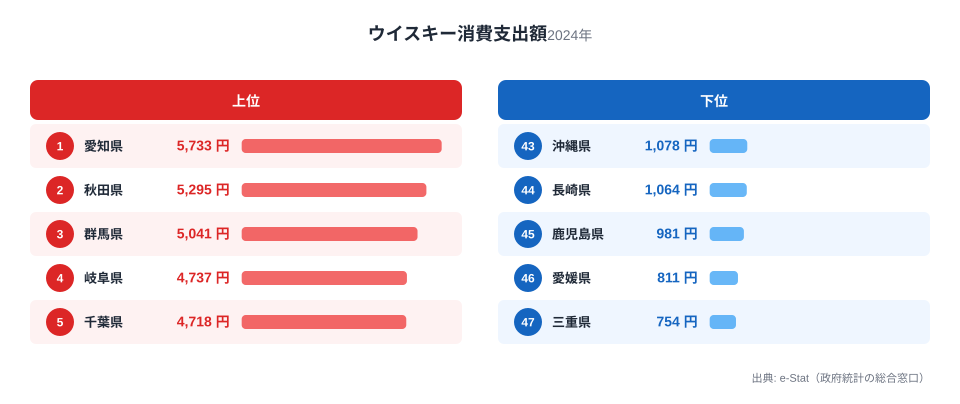
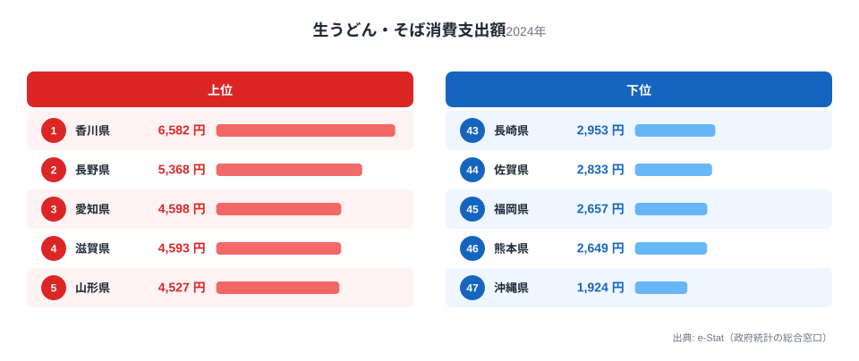
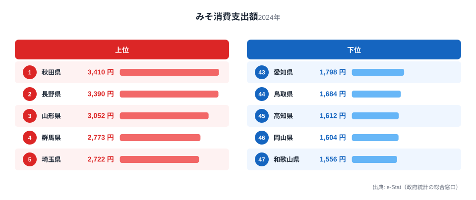
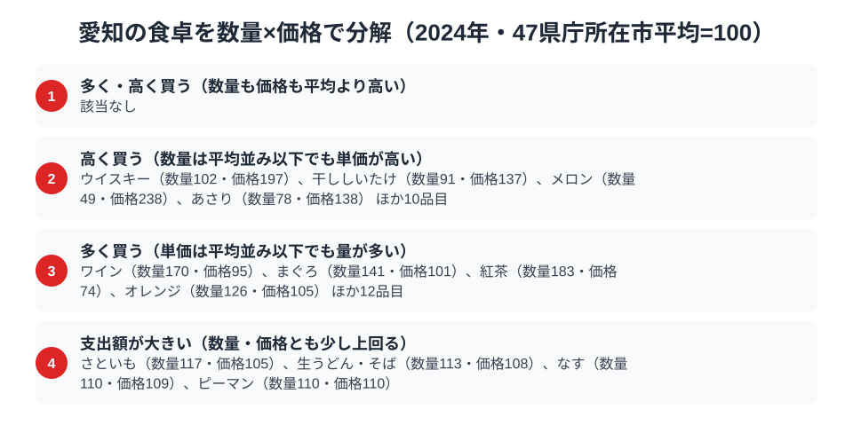

愛知県は「名古屋めし」で知られる独自の食文化圏です。味噌カツ・味噌煮込みうどん・きしめんといった濃厚な味わいの料理が全国的な知名度を持ち、豆味噌（八丁味噌）の産地としても有名です。ところが総務省の家計調査で品目別の支出額を見ると、この「味噌の国」のイメージとは裏腹な順位が浮かび上がります。

家計調査（品目別）2024年のデータでは、愛知県はウイスキー消費支出額で全国1位、生うどん・そば消費支出額でも全国3位と健闘しています。一方でみそ消費支出額は全国43位と、名古屋めしの主役級食材であるはずのみそが下位に沈んでいるのです。この記事では、ウイスキー・生うどん・そばの2品目・みその3品目を通じて、愛知県民の食卓の実像を数字から読み解きます。

> [!NOTE]
> 本記事のデータは総務省統計局「家計調査（品目別）」2024年、都道府県庁所在市（愛知県は名古屋市）の二人以上世帯の年間支出額（円）です。消費「量」ではなく「支出額」であり、価格差・購入頻度・世帯構成の影響も含みます。全47都道府県のうち、都道府県庁所在市の代表値として算出されています。

## ウイスキー消費支出額 — 全国1位5,733円、なぜ愛知が首位?

<source-link href="/ranking/whisky-consumption-expenditure">ウイスキー消費支出額ランキングをもっと見る</source-link>

家計調査2024年によると、愛知県のウイスキー消費支出額は年間5,733円で全国1位です。2位は秋田県で5,295円、3位は群馬県で5,041円と続き、いずれも愛知に近い水準で並んでいます。

愛知が首位に立つ背景には、名古屋圏に根付く「喫茶店文化」があります。名古屋の喫茶店はモーニングサービスだけでなく、夜には「ハイボール」や水割りを提供する業態も多く、家庭外だけでなく家庭内でもウイスキーを楽しむ習慣が定着していると考えられます。また、愛知県は製造業を中心とした所得水準の高さでも知られ、可処分所得の余裕が嗜好品への支出に反映されやすい面もあります。

## 生うどん・そば消費支出額 — 全国3位4,598円、きしめん文化の下支え

<source-link href="/ranking/fresh-udon-soba-consumption-expenditure">生うどん・そば消費支出額ランキングをもっと見る</source-link>

生うどん・そば消費支出額では、愛知県は年間4,598円で全国3位につけています。1位は香川県で6,582円、2位は長野県で5,368円と、いずれもうどん・そばの名産地として知られる県です。愛知はこの2県に続く形で、麺文化の厚みを数字で裏付けています。

愛知が上位に食い込む理由は、味噌煮込みうどんやきしめんという郷土料理の存在が大きいと考えられます。特に味噌煮込みうどんは硬めの生麺を使う独特の調理法で知られ、家庭でも生麺を購入して調理する習慣が根付いています。きしめんも同様に生麺での購入・調理が一般的で、乾麺中心の地域とは異なる消費パターンを形成しているとみられます。

## みそ消費支出額 — 全国43位1,798円、豆味噌の産地なのに

<source-link href="/ranking/miso-consumption-expenditure">みそ消費支出額ランキングをもっと見る</source-link>

もっとも意外なのがみそ消費支出額です。愛知県は年間1,798円で全国43位と、47都道府県中でも下位に沈んでいます。1位の秋田県は3,410円で愛知の1.9倍近く、2位の長野県も3,390円で愛知の約1.9倍です。愛知は八丁味噌をはじめとする豆味噌の一大産地であるにもかかわらず、家計調査の「みそ」支出額としては上位に現れていません。

この逆説には複数の要因が考えられます。第一に、家計調査の「みそ」は購入した味噌そのものの支出であり、味噌煮込みうどんや味噌カツのように外食・中食で味噌を使う場合はこの品目に計上されません。名古屋圏では味噌料理を外食で楽しむ機会が多く、家庭内でみそを直接購入する頻度が相対的に低い可能性があります。第二に、豆味噌は米味噌と比べて単価当たりの使用量が少なく済む場合があり、購入金額ベースでは伸びにくい面も考えられます。上位の秋田・長野は寒冷地で保存食としてのみそ汁文化が濃く、家庭内での大量購入・大量消費が支出額を押し上げているとみられます。

> [!WARNING]
> 家計調査の品目別支出額は「購入した量」を直接示すものではなく、価格帯や購入頻度の影響を受けます。八丁味噌のような愛知特有の豆味噌は、外食・中食で消費される分がこの統計に反映されない点にも注意が必要です。

## 愛知の食卓を貫くもの

ウイスキー1位・生うどん/そば3位・みそ43位という3つの数字を並べると、愛知県の食文化には一見矛盾する二つの顔が見えてきます。ひとつは、喫茶店文化に象徴される「外で楽しむ食」への支出の厚さです。ウイスキーやコーヒーショップへの支出は全国的にも上位にあり、家庭外での飲食にお金をかける傾向がうかがえます。もうひとつは、名古屋めしという郷土料理の存在感の強さに対して、その原材料である個別食材（みそ）の家庭内購入量が必ずしも比例しないという構造です。

これは、味噌を郷土色として捉える[静岡の食卓](/blog/shizuoka-food-culture)のようにお茶という単一品目が突出する県や、みそが全国1位・2位を占める[長野の食卓](/blog/nagano-food-culture)とは対照的なパターンです。愛知は「郷土料理として名高い食材が、家計統計の上では必ずしも上位に来ない」という、名産地イメージと消費統計のズレを示す事例といえます。ウイスキーについては別の切り口から[ウイスキー消費量の都道府県格差](/blog/whisky-consumption-prefecture-gap)でも取り上げているので、あわせて確認すると消費量ベースとの違いも見えてきます。

> [!TIP]
> 郷土料理の名産地だからといって、その原材料の家計消費額が全国上位とは限りません。外食・中食での消費比率が高い品目ほど、家計調査の「購入支出額」ランキングと郷土イメージが乖離しやすい傾向があります。愛知のみそはその典型例です。

## 数量×価格で分解する名古屋市の食卓

<source-link href="/ranking/whisky-consumption-quantity">ウイスキー消費量ランキングをもっと見る</source-link>

ここまで見てきたウイスキー・生うどん、そば・みその3品目は、いずれも「支出額」という一つの物差しで比較したものです。ですが家計調査では、支出額を数量と価格に分解できる品目が数多くあります。47都道府県庁所在市それぞれの平均を100とした指数で見ると、愛知の食卓を構成する125品目のうち、数量・価格ともに平均を大きく上回る「多く・高く買う」品目は一つもありません。代わりに、数量は平均並みでも単価が高い「高く買う」品目が14、単価は平均並みでも量が多い「多く買う」品目が16見つかります。ウイスキーはこの「高く買う」の代表例で、ウイスキー消費量の指数は102とほぼ平均並みにとどまる一方、価格指数は197と平均のおよそ2倍に達しています。名古屋市の世帯が他都市よりウイスキーを多く飲んでいるわけではなく、単価の高い銘柄を選んで買う度合いが強いために、支出額では全国1位という結果になっていると読めます。同じ「高く買う」の分類には、メロンやあさり、干ししいたけといった品目も含まれ、量よりも質にお金をかける傾向が食卓のあちこちに表れているようです。

同じ枠組みで生うどん・そばを見ると、数量指数は113、価格指数は108とどちらも平均をやや上回る程度にとどまります。ウイスキーのように片方だけが突出するのではなく、購入量と単価がそろって少しずつ高いというバランス型の伸び方が、支出額全国3位という順位を後押ししています。味噌煮込みうどんやきしめんに使う生麺は乾麺よりも単価が高くなりやすく、しかも家庭での購入頻度自体も高いとみられるため、数量と価格の双方が上乗せに働いていると考えられます。125品目のうち「支出額が大きい」に分類されたのは生うどん・そばを含む4品目だけで、量・価格のどちらかが突出するのではなく、両方がわずかずつ効いてくる伸び方は愛知の食卓では珍しいパターンといえます。

> [!TIP]
> 支出額の順位だけを見ると「たくさん消費している」のか「単価の高いものを買っている」のか区別がつきません。ウイスキーのように支出額は全国1位でも購入量指数は102とほぼ平均並みという品目は、数量指数と価格指数に分解して初めて実態が見えてきます。

一方でみそは、数量指数89、価格指数90とどちらも平均をわずかに下回る水準にとどまり、極端に少ない量を極端に安く買っているわけではありません。八丁味噌をはじめとする豆味噌の産地でありながら、家庭での購入量そのものが突出して少ないのではなく、平均に近い量を平均並みの単価で買っているというのが実態に近いようです。これは先に触れた「味噌煮込みうどんや味噌カツなど、外食・中食で味噌を消費する機会が多い」という見立てとも矛盾しません。家庭内購入という一側面だけを見た支出額ランキングでは下位に見えても、郷土料理としての存在感の大きさとは別の物差しで測っていると捉えるほうが実態に近いといえるでしょう。数量・価格のどちらも大きく崩れていない点は、みそが「買われていない」のではなく「別の経路で消費されている」可能性を示しているとも読めます。

> [!NOTE]
> ここでの指数は総務省統計局「家計調査（品目別）」の47都道府県庁所在市（二人以上世帯）平均を100とした相対値で、家計調査の全国値そのものとは基準が異なります。また価格指数は支出額を数量で割った1単位あたり金額の相対値であり、購入する銘柄・品種・グレードの違いも反映するため、純粋な店頭価格の高低だけを表すものではありません。数値はいずれも2024年の年間値です。

## まとめ

- ウイスキー消費支出額は愛知県が全国1位（5,733円）、名古屋の喫茶店文化を反映
- 生うどん・そば消費支出額は全国3位（4,598円）、味噌煮込みうどん・きしめん文化の下支え
- みそ消費支出額は全国43位（1,798円）、八丁味噌の産地でありながら家計購入額は下位
- 郷土料理の存在感と原材料の家計消費額は必ずしも一致しない構造が浮かび上がる
- 愛知は「外食での食文化」と「家庭内購入の統計」がズレる典型的な事例

愛知県の地域全体の統計は[愛知県の地域プロフィール](/areas/23000)、他の経済指標は[経済カテゴリ一覧](/category/economy)からも確認できます。

## データ出典

総務省統計局「家計調査（品目別）」2024年、都道府県庁所在市（二人以上世帯）。e-Stat 経由で取得・整備。
