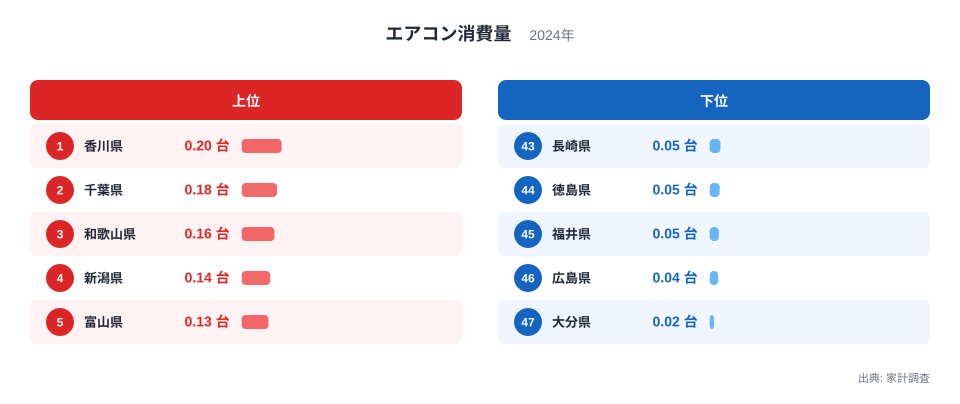
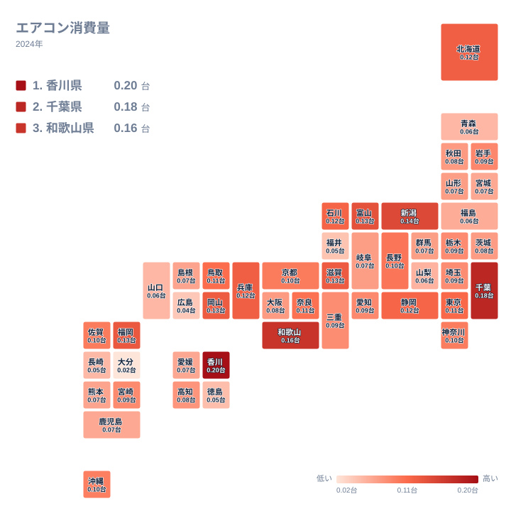

1世帯あたり何台のエアコンを買っているか、という数字にも大きな地域差があります。家計調査の2024年のデータを見ると、購入量が最も多い県と最も少ない県の差は9倍を超えています。単純に夏の暑さだけでは説明がつかない分布から、住宅事情や買い替えのタイミングという別の切り口が見えてきます。

## エアコン購入量が多い県、少ない県

<source-link href="/ranking/air-conditioner-consumption-quantity">エアコン消費量ランキングをもっと見る</source-link>

香川県は0.2台で1位です。2位は千葉県で0.177台、3位は和歌山県で0.164台、4位は新潟県で0.143台、5位は富山県で0.134台と続きます。上位には瀬戸内海側で夏の日射が強い香川県や和歌山県が並ぶ一方で、日本海側で冬の積雪が多い新潟県や富山県も入っている点が目を引きます。

6位から10位も見逃せません。福岡県は0.129台で6位、岡山県は0.126台で7位、滋賀県は0.125台で8位、北海道は0.122台で9位、兵庫県も同じく0.122台で10位です。真冬の寒さが厳しい北海道が上位10県に入っている点は、購入量が夏の暑さだけで決まる指標ではないことを示す一つの手がかりになります。

下位を見ると、大分県は0.022台で47位となり、1位の香川県の10分の1程度の水準にとどまっています。46位は広島県で0.043台、45位は福井県で0.046台、44位は徳島県で0.05台、43位は長崎県で0.054台です。徳島県や長崎県は温暖な気候で知られる地域ですが、それでも下位に沈んでいるため、購入量の多寡は気温差だけでは説明しきれないことがわかります。41位の青森県は0.055台、同じく0.055台で42位の山口県、40位の山梨県は0.058台、39位の福島県は0.063台と、いずれも中位から下位に位置する結果になっています。

> [!NOTE]
> この指標は普及台数ではなく、家計調査が集計した1世帯あたりの年間購入数量です。すでに設置済みのエアコンの保有状況を示すものではなく、その年に新たに購入した台数を表しています。買い替え需要が強い年ほど数値が押し上げられます。

## 地理分布から見える傾向

タイルマップで全国の分布を確認すると、購入量の多い県は瀬戸内海沿岸と北陸に分かれて散らばっており、ひとつの地域に集中していない様子がうかがえます。この指標は普及率そのものではなく、その年に新たに購入した台数を表すため、暑さへの反応というより買い替え需要の強さを映している可能性があります。

新潟県や富山県が上位に入る背景には、積雪地域特有の高気密・高断熱住宅の普及が関わっているかもしれません。断熱性能の高い住宅では、夏場の冷房だけでなく除湿や空気循環のためにエアコンを複数台設置する世帯が多いという見方もできます。ただし、こうした関係はこのランキングから直接読み取れるものではなく、今後の検証が必要な仮説にとどまります。

> [!WARNING]
> 家計調査は全世帯を対象にした全数調査ではなく、抽出調査です。都道府県別の集計は対象となるサンプル数が限られるため、単年の数値には振れ幅が生じやすい点に注意が必要です。

## 気候・住宅事情との関わり

香川県や和歌山県のように夏の蒸し暑さが際立つ地域で購入量が多いのは、体感的にも理解しやすい結果です。瀬戸内式の気候は年間を通じて晴天が多く、夏場の日射による室温上昇が大きいことで知られています。一方で、下位にとどまる長崎県や徳島県も温暖な地域であるため、気候だけでは説明のつかない要因が働いていると考えられます。たとえば住宅の建て替えサイクルや世帯の所得水準、賃貸か持ち家かといった住まい方の違いも、購入のタイミングを左右する要因として考えられます。

[千葉県のデータ](/areas/12000)を確認すると、大都市圏の郊外に位置する千葉県が2位に入っている理由として、比較的新しい戸建て住宅が多く部屋数に応じて複数台のエアコンを設置する世帯が多いことが挙げられます。同様に[香川県のデータ](/areas/37000)では、夏の高温に加えて渇水対策として住宅の気密性を高める工夫がされてきた地域性も背景として考えられます。

全国を大きく瀬戸内側・日本海側・太平洋側に分けて眺めると、それぞれの地域で購入量の水準にばらつきがあることがわかります。瀬戸内側は香川県や岡山県のように上位に入る県が多く、夏場の高温多湿な気候が反映されているように見えます。日本海側は新潟県や富山県のように上位に入る県がある一方で、福井県のように下位にとどまる県もあり、地域内でも差が生まれています。太平洋側は千葉県が上位に入る一方、長崎県や徳島県が下位に沈んでおり、同じ太平洋側でも一様な傾向にはなっていません。こうしたばらつきは、気候要因に加えて住宅の築年数や世帯構成といった個別の事情が絡んでいることを示唆しています。

> [!TIP]
> 購入量は世帯の部屋数や住宅の築年数の影響を受けやすい指標です。気候だけでなく、持ち家率や住宅の建て替え時期とあわせて読むと、地域差の背景がより立体的に見えてきます。

## まとめ

エアコンの購入量は、暑さへの対応だけでなく、住宅の断熱性能や世帯構成、買い替えのタイミングなど複数の要因が重なって決まる指標です。このランキングだけでは断定できない部分も多いため、住宅関連の統計や[同じカテゴリの統計一覧](/category/economy)とあわせて確認することで、地域ごとの暮らし方の違いがより見えやすくなります。上位と下位の差が9倍を超えるという事実は、単純な気候の差以上に、住宅事情や生活習慣の違いを映し出していると言えそうです。

今回のランキングは1年分の抽出調査に基づく数値であるため、翌年以降の値と見比べることで、より安定した傾向がつかめる可能性があります。特に上位県と下位県の顔ぶれが年をまたいでも変わらないかどうかは、気候要因の影響の強さを見極める手がかりになります。単年の順位だけを切り取って地域の性質を断定せず、複数年のデータを重ねて確認する姿勢が大切です。

## データ出典

出典: 家計調査（総務省）
年: 2024年
