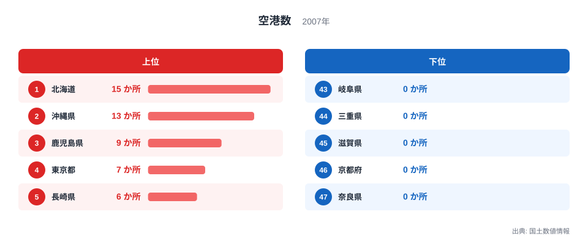
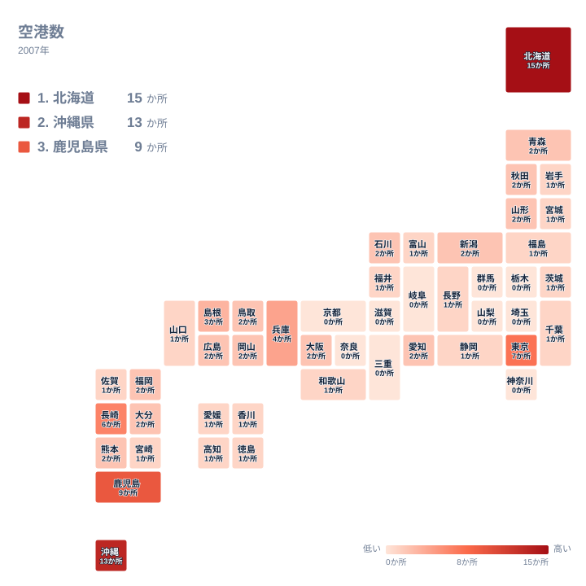

飛行機で旅をするとき、多くの人は近くの空港からではなく、隣の都道府県まで移動してから搭乗することがあります。それは決して珍しいことではなく、多くの県民にとって当たり前の行動になっています。実は日本には、空港がまったく存在しない都道府県が少なくありません。国土数値情報の空港データを都道府県別に並べると、島や離島を多く抱える県が上位に、平野が広がる内陸の県が下位に集まるという、はっきりした地理的な傾向が見えてきます。

## 上位と下位を分ける差

<source-link href="/ranking/airport-count">空港数ランキングをもっと見る</source-link>

全国で最も空港が多いのは北海道で、15か所を数えます。2位は沖縄県の13か所、3位は鹿児島県の9か所、4位は東京都の7か所、5位は長崎県の6か所と続きます。上位5県に共通しているのは、広い面積や多くの離島を抱えているという条件です。北海道や鹿児島県、長崎県は離島が多く、船だけでは移動が不便な地域への足として小規模空港が整備されてきました。

4位の東京都が7か所を数えているのも、意外に思われるかもしれません。これは羽田空港だけでなく、伊豆諸島や小笠原諸島に点在する小規模な飛行場が含まれているためです。都心から遠く離れたこれらの島々では、船とあわせて空路が生活を支える重要な移動手段となっており、東京都の空港数を押し上げる要因になっています。

一方、空港数の下位を見ると、栃木県、群馬県、埼玉県、神奈川県、山梨県、岐阜県、三重県、滋賀県、京都府、奈良県の10県が、いずれも空港数0か所で並んでいます。この10県は今回のランキングで38位から47位までを占めており、空港数だけで見れば同率の最下位グループということになります。

> [!NOTE]
> ここでいう空港数は国土数値情報に登録された飛行場の数であり、ヘリポートや自衛隊専用の基地は原則として区別されています。空港数が0か所であっても、その県に飛行場そのものが一切存在しないとは限らず、近隣県の空港が広域の航空需要を担っている場合があります。空港の規模や年間の便数、発着枠の大きさもこの数には反映されていない点にも注意してください。

## 地理でみる分布

地図で見ると、空港の多い地域は北海道と沖縄県、そして九州から中国地方にかけての離島を抱える県に集中していることがわかります。逆に空港数0か所の10県は、関東の内陸部から中部、近畿にかけて帯のようにつながって分布しています。海に面していない、あるいは面していても大都市圏の主要空港に近いという立地条件が、この地域に共通しています。

日本には海に面していない、いわゆる内陸県が栃木県、群馬県、埼玉県、山梨県、長野県、岐阜県、滋賀県、奈良県の8県あります。今回の空港数0か所の10県のうち、栃木県、群馬県、埼玉県、山梨県、岐阜県、滋賀県、奈良県の7県はこの内陸8県に含まれています。内陸8県のうち空港を持っているのは長野県だけで、1か所を確保しています。松本盆地にある信州まつもと空港がこれにあたり、周囲を山に囲まれた内陸県でも、平地さえ確保できれば空港を整備できることを示す例だといえます。

経済規模の大きさが必ずしも空港数に直結しないことも、このデータからは読み取れます。愛知県や大阪府はいずれも日本を代表する経済圏を形成していますが、空港数はそれぞれ2か所にとどまっています。中部国際空港や大阪国際空港・関西国際空港のような大規模な拠点空港が1つあれば、その地域一帯の航空需要の大半をまかなうことができるため、経済活動が活発でも空港の数そのものは必ずしも増えないと考えられます。

> [!WARNING]
> このデータは2007年時点の国土数値情報にもとづいています。空港の新設・廃止は年単位で発生するため、現在の運用状況とは異なる可能性があります。特に小規模な飛行場は集計の対象範囲によって扱いが変わることがある点にも注意してください。

## なぜこの順位になるのか

空港数0か所の10県のうち、神奈川県、三重県、京都府の3県は海に面していますが、それでも空港を持っていません。神奈川県は羽田空港を抱える東京都に隣接しており、京都府は大阪国際空港や関西国際空港にほど近い立地にあります。つまり、必ずしも内陸かどうかだけでなく、近隣に大規模な拠点空港があるかどうかも、その県が独自に空港を整備するかどうかを左右してきたと考えられます。

北海道が15か所という圧倒的な数を誇っているのも、面積の広さに加えて、離島や遠隔地への交通手段として空港が地域政策の一環で整備されてきた経緯があります。同じ[インフラ関連の統計一覧](/category/infrastructure)では、鉄道駅数やダム数など、地形や歴史を映す他の指標も確認できます。空港数1位の[北海道のデータ](/areas/01000)と、2位の[沖縄県のデータ](/areas/47000)をあわせて見ると、離島の多さが空港数を押し上げている様子がより具体的にわかります。

> [!TIP]
> 空港数を読むときは、単に多い・少ないだけでなく、その県が離島を抱えているか、あるいは近隣県の主要空港をどれだけ使えるかという立地条件をあわせて考えると、数字の背景にある交通事情が見えやすくなります。

福岡県や熊本県のように、空港数が2か所となっている県も少なくありません。福岡県は九州最大の拠点である福岡空港のほかに北九州空港を、熊本県は熊本空港のほかに天草諸島への便を担う小規模な飛行場を抱えています。いずれも大都市圏の主要空港とは別に、県内の一部地域への交通を支える空港を維持している点が共通しています。

鹿児島県が9か所で3位に入っているのも、種子島や屋久島、奄美群島など多数の離島を抱えているためです。長崎県も6か所で5位に入っており、五島列島や対馬などへの航路を補うかたちで空港が整備されてきました。離島の多さと空港数の多さは、このランキングの中でも特にわかりやすい対応関係だといえます。

空港数が1か所にとどまる17県の中には、観光需要を支える空港もあります。和歌山県の南紀白浜空港はその代表例で、紀伊半島南部の温泉地や観光施設へのアクセスを担っています。同じく1か所の宮崎県や高知県、香川県も、それぞれ県庁所在地の近くに空港を1つ置き、都市部との行き来を支える拠点として機能してきました。

## まとめ

- 空港数の1位は北海道で15か所、2位は沖縄県の13か所です。
- 3位は鹿児島県の9か所、4位は東京都の7か所、5位は長崎県の6か所です。
- 栃木県、群馬県、埼玉県、神奈川県、山梨県、岐阜県、三重県、滋賀県、奈良県、京都府の10県は空港数0か所で並んでいます。
- 海に面していない内陸8県のうち7県が空港数0か所にあたり、空港を持つのは長野県のみです。
- 空港の多い県は離島を多く抱える傾向があり、少ない県は内陸か大規模空港に近い立地であることが背景にあります。
- 愛知県や大阪府のように経済規模が大きい県でも、拠点空港が1つあれば需要をまかなえるため、空港数は2か所にとどまっています。

## データ出典

- 国土数値情報（2007年）
