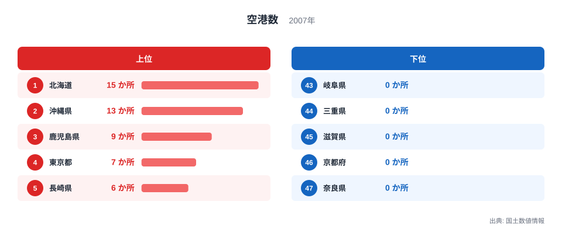
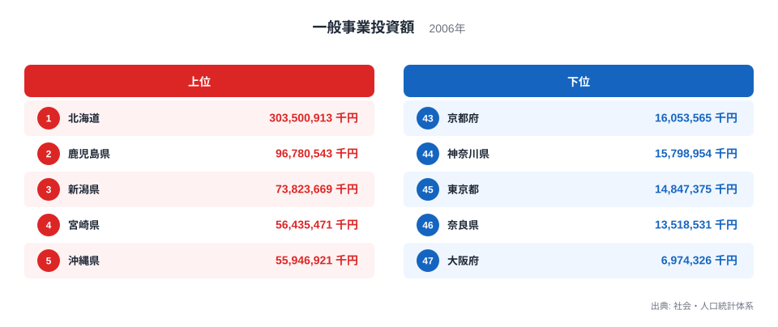
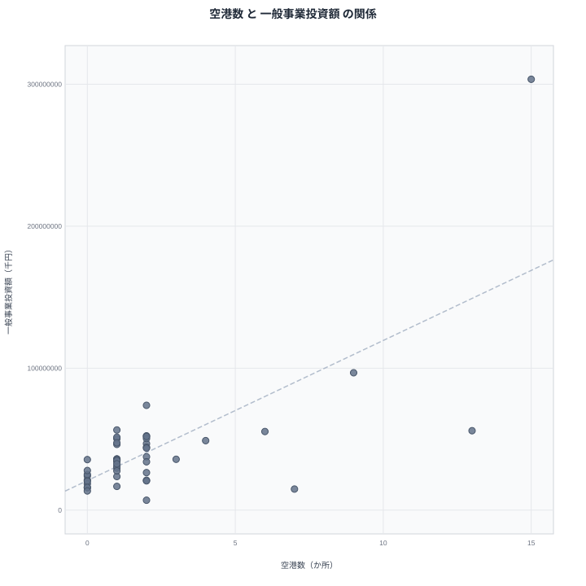

空港の数が多い都道府県は、農林水産業への投資も盛んなのでしょうか。国土数値情報がまとめる空港数と、社会・人口統計体系が公表する一般事業投資額(農林水産業向け)を突き合わせると、上位の顔ぶれに重なりが見えます。ただし、その重なりが本当に空港が投資を呼び込んでいる証拠なのかは、慎重に見る必要があります。

結論から先に触れると、両指標をもっとも押し上げているのは北海道という単独の外れ値です。北海道を除いた46都道府県で見ると、空港数と投資額の関係はかなり緩やかになります。この記事では、なぜそう言えるのかをランキングと散布図から順番に確認していきます。

## 空港数の分布を見る

<source-link href="/ranking/airport-count">空港数ランキングをもっと見る</source-link>

空港数のランキングは、北海道が15か所で1位となっています。2位は沖縄県で13か所、3位は鹿児島県で9か所です。4位は東京都で7か所、5位は長崎県で6か所となっています。上位に共通するのは、離島や広い面積を抱え、鉄道や道路だけでは移動を支えきれない地理条件です。北海道は面積が広大なうえ冬季の陸路移動に制約があり、沖縄県と鹿児島県は多くの離島を抱えているため、空路が生活と物流を支える基盤になっています。

一方、下位を見ると栃木県、群馬県、埼玉県、神奈川県、山梨県、岐阜県、三重県、滋賀県、京都府、奈良県が0か所で並んでいます。これらの県はいずれも内陸に位置するか、東京や大阪といった大都市圏の近くにあり、新幹線や高速道路網が発達しているため、独自の空港を持つ必要性が低い地域だと考えられます。空港の有無は人口の多さよりも、地理的な立地や既存の交通インフラとの補完関係で決まりやすいことがこの分布から読み取れます。

## 一般事業投資額の分布を見る

一般事業投資額のランキングでは、北海道が303,500,913千円で1位となり、2位の鹿児島県96,780,543千円を大きく引き離しています。3位は新潟県で73,823,669千円、4位は宮崎県で56,435,471千円、5位は沖縄県で55,946,921千円です。北海道は農業産出額そのものが全国最大で、農地の大規模化や畑作・酪農の設備投資が継続的に行われているため、投資額の規模も他県と一桁近く異なる水準になっています。

下位を見ると、大阪府が6,974,326千円で最も少なく、次いで奈良県13,518,531千円、神奈川県15,798,954千円、東京都14,847,375千円、京都府16,053,565千円が並びます。これらはいずれも都市化が進み、農地面積が限られている都府県です。農林水産業への投資額は、その地域における農地の広さや一次産業の産業規模にほぼ比例して決まるため、都市部で低くなるのは自然な結果と言えます。

## 空港数と投資額の関係を散布図で確かめる

散布図を見ると、北海道が右上の突出した位置に単独で存在しています。空港数15か所という最多の値と、投資額303,500,913千円という最大の値が同じ都道府県で重なっているため、見かけ上は空港数が多いほど投資額も多いという右肩上がりの傾向が生まれやすくなります。しかし北海道を除いた残り46都道府県を見ると、空港数が2か所以下の県が大半を占める一方で、投資額は5,000万円台から10,000万円台まで幅広く分布しており、空港数だけでは投資額の大小をほとんど説明できていません。

例えば空港数が0か所の京都府や奈良県よりも、同じく0か所の栃木県や岐阜県のほうが投資額はやや高い水準にあります。逆に空港数が2か所ある山形県は投資額が21,041,010千円にとどまり、空港数が1か所の宮城県51,369,189千円を下回っています。つまり空港の有無や数そのものが投資額を決めているのではなく、両者に共通する第三の要因、具体的にはその地域の農地面積や一次産業の産業規模、地方財政の投資余力といった条件が、それぞれ独立に空港整備と農林水産投資を後押ししている可能性が高いと考えられます。相関が見えるからといって、空港を増やせば投資額が増えるという因果関係を意味するわけではありません。

> [!NOTE]
> この記事で扱う一般事業投資額は、社会・人口統計体系が集計する農林水産業向けの投資額で、公共事業費とは別の民間・団体による投資を含む指標です。空港数は国土数値情報の空港データを都道府県別に集計した施設数で、滑走路の規模や旅客数の違いは反映されていません。

> [!WARNING]
> 空港数の年は2007年、投資額の年は2006年と、集計時点が1年ずれています。また北海道という極端な外れ値が全体の相関係数を押し上げているため、単純な相関の強さだけを見て両者に強い関係があると判断するのは適切ではありません。

> [!TIP]
> 散布図を読むときは、まず外れ値を除いた場合に傾向がどう変わるかを確認する習慣をつけると、見かけの相関に惑わされにくくなります。空港数よりも農地面積や農業産出額のランキングと投資額を比べるほうが、より直接的な関係を捉えられる可能性があります。

同じカテゴリの他の指標を見るには[同じカテゴリの統計一覧](/category/infrastructure)が参考になります。投資額そのものの全県データは[一般事業投資額ランキング](/ranking/general-project-investment-agriculture-forestry-fisheries)で確認できます。北海道の位置づけをより詳しく知りたい場合は[北海道のデータ](/areas/01000)、離島を多く抱える[沖縄県のデータ](/areas/47000)もあわせて参照してみてください。

## まとめ

空港数と一般事業投資額の間には、散布図上では緩やかな右肩上がりの傾向が見られますが、その大部分は北海道という単独の外れ値によって生み出されています。空港数が多い都道府県は離島や広大な面積といった地理条件を反映しているのに対し、投資額は農地面積や一次産業の産業規模を反映しており、両者は別々の要因によって決まっていると考えるほうが自然です。ランキングの上位・下位の顔ぶれが似て見える場合でも、背後にある要因を分けて考えることが、統計を正しく読み解くうえで欠かせません。

## データ出典

空港数は国土数値情報(2007年)、一般事業投資額は社会・人口統計体系(2006年)による集計です。
