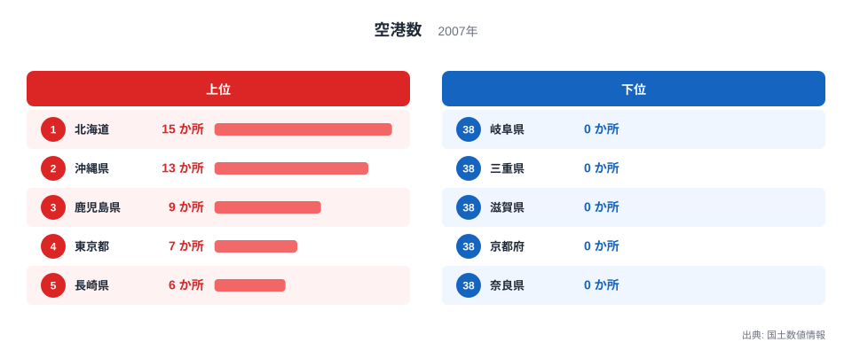
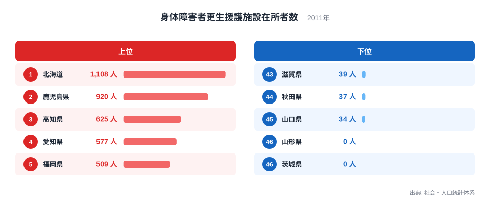
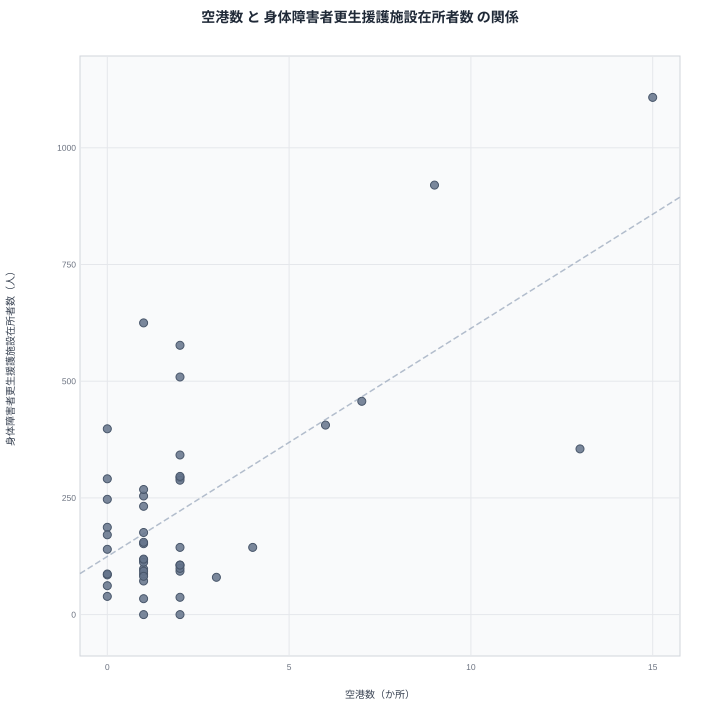

空港の数が多い都道府県では、身体障害者更生援護施設の在所者数も多いのでしょうか。一見すると無関係に思える2つの指標ですが、国土数値情報の空港データと社会・人口統計体系の施設在所者数を並べると、上位に同じ都道府県が並ぶ場面が目に付きます。この記事では、その重なりが何を意味しているのかを、ランキングと散布図から検証していきます。

先に見通しを示すと、両指標の上位に共通して顔を出すのは北海道、鹿児島県、沖縄県、長崎県といった離島や広い面積を抱える地域です。これは空港が福祉施設の在所者を増やしているという因果関係ではなく、どちらの指標も総人口や県土の広さといった別の要因から強い影響を受けているためだと考えられます。

## 空港数の分布を見る

<source-link href="/ranking/airport-count">空港数ランキングをもっと見る</source-link>

空港数は北海道が15か所で1位、沖縄県が13か所で2位、鹿児島県が9か所で3位となっています。4位は東京都で7か所、5位は長崎県で6か所です。上位の顔ぶれを見ると、離島を多く抱える沖縄県と鹿児島県、そして広大な面積を持つ北海道が並んでおり、空港数の多さは陸路や海路だけでは移動を支えきれない地理条件を反映していると考えられます。

下位に目を移すと、栃木県、群馬県、埼玉県、神奈川県、山梨県、岐阜県、三重県、滋賀県、京都府、奈良県が0か所で並んでいます。これらは内陸に位置するか大都市圏の近くにあり、新幹線や高速道路網で十分に移動需要を満たせる地域です。空港の有無は人口規模そのものよりも、既存の交通インフラとの補完関係で決まりやすいことがこの分布からうかがえます。

## 施設在所者数の分布を見る

身体障害者更生援護施設在所者数のランキングでは、北海道が1,108人で1位、鹿児島県が920人で2位となっています。3位は高知県で625人、4位は愛知県で577人、5位は福岡県で509人です。この指標は人口規模が大きい都道府県ほど施設数も多くなりやすく、北海道や愛知県、福岡県のように人口の多い地域が上位に来やすい傾向があります。

一方で下位を見ると、山形県と茨城県がともに0人で並び、山口県34人、秋田県37人、滋賀県39人と続きます。ここで注目したいのは、施設在所者数が少ない県が必ずしも人口の少ない県とは限らない点です。茨城県は人口規模がそれほど小さくないにもかかわらず0人となっており、これは施設の設置状況や統計の集計方法によって、実際の障害者数とは別の要因で数値が左右されている可能性を示しています。

上位と下位の間には、順位の刻みごとに緩やかな減少が見られる一方で、途中の順位帯にはっきりとした地方性は現れていません。高知県が3位に入っているのは、四国地方の中で施設の集約が進んでいることを示唆する一方、同じ四国の愛媛県は22位、徳島県は27位にとどまっており、四国という括りだけで施設在所者数を語ることはできません。都道府県ごとの施設整備の歴史や社会福祉法人の設立経緯といった個別事情が、順位の細部を左右していると考えられます。

## 空港数と在所者数の関係を散布図で確かめる

散布図を見ると、北海道が空港数15か所、在所者数1,108人という組み合わせで右上に位置し、鹿児島県も空港数9か所、在所者数920人でそれに続く位置にあります。この2県が目立つ位置にあるため、一見すると空港数が多いほど在所者数も多いという関係があるように見えます。しかし空港数が0か所の県の中にも、京都府398人や大阪府288人のように在所者数が中位に位置する県があり、逆に空港数が2か所ある山形県は在所者数が0人となっています。

このように空港数が同じ水準でも在所者数には大きなばらつきがあり、空港数だけで在所者数を説明することはできません。北海道と鹿児島県が両方の指標で上位に来ているのは、どちらも総人口が全国でも上位に位置し、かつ離島や広域分散型の県土構造を持つため、空港整備と福祉施設の設置がそれぞれ独立に進んできた結果だと考えるのが妥当です。見かけの相関から因果関係を推測することには慎重であるべきです。

散布図全体を俯瞰すると、大半の都道府県は空港数0か所から2か所の範囲に密集しており、その中で在所者数は0人から500人近くまで幅広く分布しています。つまり空港数という軸ではほとんど差がつかない都道府県の集団の中で、在所者数だけが大きくばらついているのが実態です。もし空港数が在所者数を左右する直接の要因であれば、空港数がほぼ同じ都道府県の間では在所者数も似た水準に収まるはずですが、実際にはそうなっていません。この点からも、両指標を結びつけているのは空港そのものではなく、人口規模や施設整備の歴史的経緯といった別の要因だと考えるべきです。

> [!NOTE]
> 身体障害者更生援護施設在所者数は、更生援護施設に入所している人数を示す指標であり、地域に住む身体障害者の総数そのものではありません。施設の定員や設置数によって数値が左右される点に注意が必要です。

> [!WARNING]
> 空港数の集計年は2007年、施設在所者数の集計年は2011年であり、両者には4年の時間差があります。また山形県と茨城県の在所者数が0人となっているのは、施設が存在しないことを意味する場合と、統計上の秘匿処理による場合の両方が考えられ、この記事のデータだけでは区別できません。

> [!TIP]
> 2つの指標を比較するときは、値そのものだけでなく人口10万人当たりに換算した値と見比べると、人口規模の違いによる見かけの相関を切り分けやすくなります。

福祉施設の全県データを詳しく見たい場合は[身体障害者更生援護施設在所者数ランキング](/ranking/physical-disability-rehabilitation-facility-residents)、関連する指標をまとめて確認したい場合は[同じカテゴリの統計一覧](/category/infrastructure)が参考になります。両指標で共通して上位に位置する[北海道のデータ](/areas/01000)や、離島を多く抱える[沖縄県のデータ](/areas/47000)もあわせてご覧ください。

## まとめ

空港数と身体障害者更生援護施設在所者数は、北海道や鹿児島県といった一部の都道府県で両方とも上位に位置するため、見かけ上は関係があるように映ります。しかし空港数が少ない県の中にも在所者数が中位から上位に位置する県があり、逆に空港数がある県で在所者数が0人になる例もあることから、両者の間に直接的な関係があるとは言えません。人口規模や県土の広さといった共通の背景要因が、それぞれの指標を独立に押し上げていると考えるのが自然です。

## データ出典

空港数は国土数値情報(2007年)、身体障害者更生援護施設在所者数は社会・人口統計体系(2011年)による集計です。
