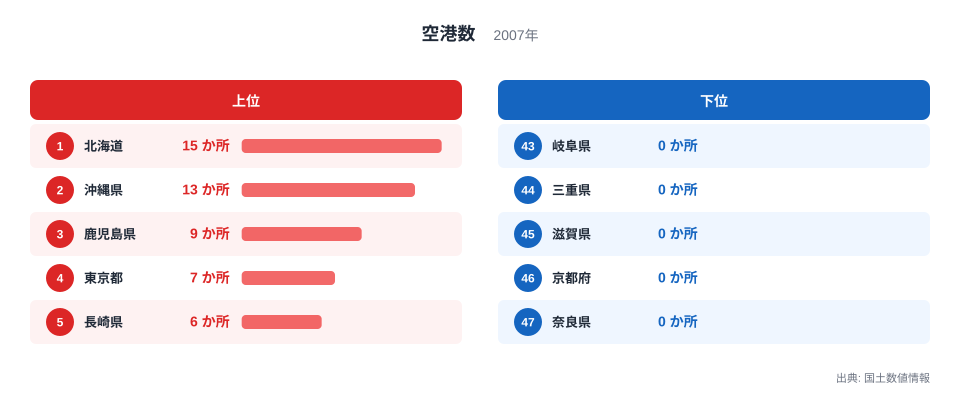
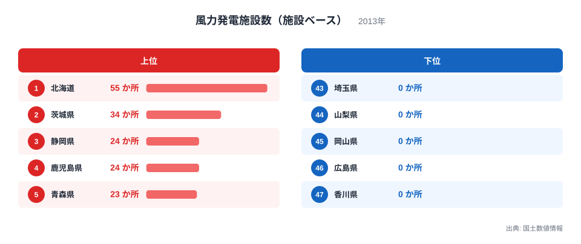
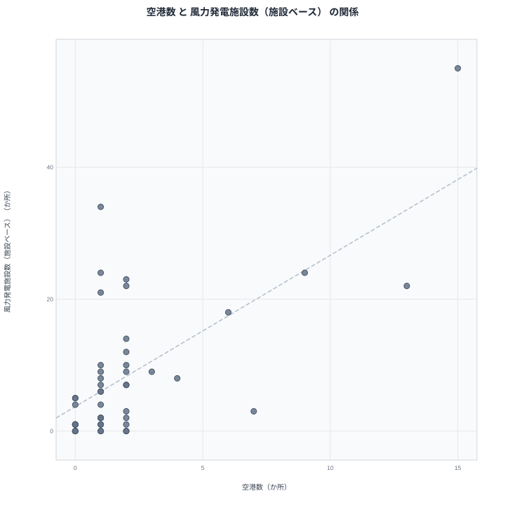

空港と風力発電施設は、一見するとまったく関係のないインフラです。片方は人を運び、もう片方は電気をつくるという、目的そのものが大きく異なる設備です。空港は人やモノを運ぶための拠点であり、風力発電施設は自然の風を電力に変える設備です。ところが都道府県別のデータを並べてみると、北海道をはじめとする一部の県で両方の数値が高くなっているという、興味深い重なりが見えてきます。

## 空港数から見る出発点

<source-link href="/ranking/airport-count">空港数ランキングをもっと見る</source-link>

空港数は北海道が15か所で1位、沖縄県が13か所で2位、鹿児島県が9か所で3位、東京都が7か所で4位、長崎県が6か所で5位です。離島を多く抱える県が上位を占めており、栃木県や群馬県、埼玉県など内陸の10県は空港数0か所で並んでいます。

> [!NOTE]
> ここでの風力発電施設数は施設単位で数えた値で、発電量や設備容量を示すものではありません。空港数が2007年時点、風力発電施設数が2013年時点の国土数値情報にもとづいており、6年の集計年の差がある点にも注意してください。施設1つあたりの発電能力は地域や設置年によって異なります。

## 風力発電施設数から見る出発点

風力発電施設数でも1位は北海道で、55か所を数えます。2位は茨城県の34か所、3位は静岡県の24か所、4位は鹿児島県の24か所、5位は青森県の23か所です。最も少ないのは香川県の0か所で、広島県、岡山県、山梨県、埼玉県、栃木県、宮城県もいずれも0か所となっています。

空港数で2位だった沖縄県は、風力発電施設数では22か所で7位に入っており、こちらも比較的高い順位です。一方、空港数で4位だった東京都は、風力発電施設数では3か所で28位にとどまっています。さらに、空港数では1か所しかない茨城県が、風力発電施設数では34か所と2位に入っているのは、両者の関係を考えるうえで見逃せない点です。

静岡県はさらに対照的な例です。空港数はわずか1か所で29位にとどまっている一方、風力発電施設数は24か所で全国3位に入っています。太平洋に面した遠州灘沿岸は年間を通じて安定した風が吹くことで知られ、風力発電の適地として開発が進められてきました。一方で空港については、新幹線や高速道路による東京・名古屋方面への交通の便がよいこともあり、県内に1つの空港があれば需要をまかなえると考えられます。

> [!WARNING]
> 空港数と風力発電施設数のどちらもが多い県があるとしても、空港があるから風力発電施設が増える、あるいはその逆、という因果関係を示すものではありません。それぞれ異なる立地条件によって整備が進められています。

## 2つの指標の関係を散布図で確認する

散布図で見ると、北海道は空港数・風力発電施設数のどちらも突出した位置にありますが、それ以外の県では両者の対応関係はそれほど強くありません。茨城県は空港数が1か所と少ない一方で風力発電施設数は34か所と全国2位に入っており、逆に東京都は空港数が7か所と多い一方で風力発電施設数は3か所にとどまっています。この2県は、散布図の中でも典型的な例外として位置づけられます。

こうした食い違いが生まれるのは、2つの指標がそれぞれ異なる立地条件に左右されているためです。空港は離島への交通手段としての役割や、大都市圏の拠点空港としての役割によって整備されており、東京都の空港数の多さは伊豆諸島や小笠原諸島など多くの離島を抱えていることが背景にあります。一方、風力発電施設は安定して強い風が吹く沿岸部や台地に立地しやすく、茨城県の鹿島灘沿岸のように、風況に恵まれた地域で数多く建設されてきました。千葉県も同様の傾向を示しており、空港数は1か所で25位にとどまる一方、風力発電施設数は21か所で8位に入っています。房総半島や九十九里浜沿岸の風況が、航空需要とは独立に風力発電施設の立地を後押ししてきたと考えられます。

> [!TIP]
> 空港数と風力発電施設数がともに高い県を見つけたときは、その県が離島を多く抱えているのか、それとも強い風が吹く沿岸部を持っているのかを区別して考えると、数字の背景にある立地条件をより正確に読み取ることができます。片方だけが高い県も、同じように区別して読むと理解が深まります。

## 見かけの相関の裏にあるもの

北海道が空港数・風力発電施設数のどちらも1位を占めているのは、広い面積の中に多くの離島や遠隔地への航空路線が必要とされる一方で、道内の沿岸部や台地に風況の良い立地が数多く存在しているためだと考えられます。鹿児島県も空港数3位・風力発電施設数4位、沖縄県も空港数2位・風力発電施設数7位と、どちらも高い水準でそろっています。これらの県に共通しているのは、離島や海岸線が多い地理的条件であり、離島への交通アクセスと沿岸部の風況という、性質の異なる2つの条件が同時に満たされやすい土地柄だといえます。

空港数と風力発電施設数は、どちらも海岸線の長さに影響を受けやすい指標です。かりに面積あたりに換算して比べれば、離島を多く抱える北海道や沖縄県、鹿児島県の突出ぶりはやわらぎ、単位面積あたりでは茨城県や静岡県のように海岸線に恵まれた県が相対的に浮かび上がってくると考えられます。人口で比べた場合はさらに関係が崩れやすく、風力発電施設は人口の少ない沿岸部に立地する傾向がある一方、空港は人口の多い都市圏にも拠点空港として必要とされるため、単純な統制をかければ両者の関係はいっそう弱まる可能性があります。

一方で、茨城県や東京都のように、片方の指標だけが突出している県があることは、この関係が一様な相関ではないことを示しています。[風力発電施設数（施設ベース）ランキング](/ranking/wind-power-plant-count-facility)や、空港と同じ[インフラ関連の統計一覧](/category/infrastructure)を見ると、他の指標との関係もあわせて確認できます。両方の指標で1位の[北海道のデータ](/areas/01000)と、空港数2位・風力発電施設数7位の[沖縄県のデータ](/areas/47000)を見比べると、離島の多さがどちらの指標にも影響している様子がより具体的にわかります。

## まとめ

- 空港数は北海道が15か所で1位、風力発電施設数も北海道が55か所で1位です。
- 沖縄県は空港数2位・風力発電施設数7位、鹿児島県は空港数3位・風力発電施設数4位と、両指標が高い水準でそろっています。
- 茨城県は空港数が1か所と少ない一方、風力発電施設数は34か所で全国2位です。
- 東京都は空港数が7か所で4位である一方、風力発電施設数は3か所で28位にとどまっています。
- 静岡県は空港数が1か所で29位と少ない一方、風力発電施設数は24か所で3位に入っており、両者の関係が一様ではないことを示しています。
- 空港数は離島への交通アクセスに、風力発電施設数は沿岸部の風況にそれぞれ左右されており、両者の重なりは離島や海岸線の多さという共通の地理条件を介した見かけの関係だと考えられます。

## データ出典

- 国土数値情報（2007年）
- 国土数値情報（2013年）
