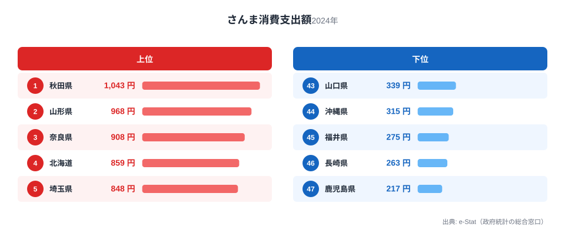
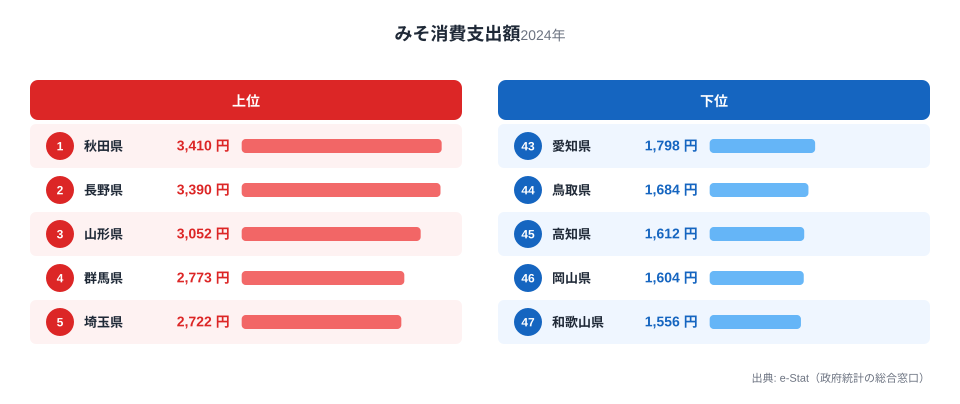
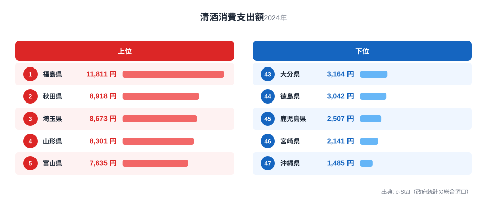

米どころとして知られる秋田県。その食卓は、発酵と醸造の文化に彩られています。総務省の家計調査（品目別）で秋田市の二人以上世帯を見ると、さんま・みそで全国1位、日本酒でも全国2位と、北の海の幸と発酵食・醸造品で全国トップクラスに並びます。

北の秋を告げるさんま、きりたんぽ鍋にも欠かせないみそ、そして米どころならではの日本酒。この記事では、さんま・みそ・日本酒という3つの品目を横断しながら、秋田県民の食卓を読み解きます。

> [!NOTE]
> 家計調査の都道府県データは、県庁所在市（秋田県は秋田市）の二人以上世帯を対象にした年間支出額です。県全体ではなく秋田市在住世帯の家計簿から見た傾向であり、支出「金額」であって消費「量」そのものではない点にご注意ください。

## さんま — 全国1位1,043円、北の秋の味覚

<source-link href="/ranking/saury-consumption-expenditure">さんま消費支出額ランキングをもっと見る</source-link>

秋田県のさんま消費支出額は1,043円で全国1位です。2位の山形県968円を上回ります。さんまは秋に北の海から南下する回遊魚で、東北・北日本で秋の味覚として親しまれています。秋田では、塩焼きのさんまを大根おろしと一緒に食べるのが秋の定番です。

上位に東北の県が並ぶのは、さんまの回遊ルートに近く、旬の新鮮なさんまが手に入りやすいためと考えられます。近年はさんまの不漁も伝えられますが、秋の食卓にさんまを欠かさない食文化が、秋田の全国一の支出額を支えています。

## みそ — 全国1位3,410円、発酵食の底力

<source-link href="/ranking/miso-consumption-expenditure">みそ消費支出額ランキングをもっと見る</source-link>

みその消費支出額も秋田県が3,410円で全国1位です。2位の長野県3,390円と首位を争っています。秋田はみそ・しょうゆといった発酵調味料の消費が多い土地で、寒冷な気候が発酵食文化を育んできました。

秋田の郷土料理「きりたんぽ鍋」や「だまこ鍋」にはみそや味噌だれが使われ、みそ漬けの保存食も豊富です。寒く長い冬を越すための発酵食文化が、みその全国一の支出額を支えています。長野と首位を争う点は、寒冷な内陸・北国が発酵食で強いことを示しています。

## 日本酒 — 全国2位8,918円、東北の酒どころ

<source-link href="/ranking/sake-consumption-expenditure">日本酒消費支出額ランキングをもっと見る</source-link>

醸造品でも秋田は全国トップクラスです。日本酒（清酒）の消費支出額は8,918円で全国2位。首位は福島県（1位・11,811円）ですが、秋田もそれに次ぐ位置につけています。秋田は良質な米と清らかな水に恵まれた「美酒王国」で、県内各地に多くの酒蔵があります。

米どころ秋田では、日本酒造りが盛んで、晩酌や会食で地元の日本酒を楽しむ文化が根づいています（首位の福島も同じ酒どころで、[福島県の食卓](/blog/fukushima-food-culture)では日本酒が全国1位です）。さんまという海の幸、みそという発酵食、日本酒という醸造品。この3つが全国トップクラスに並ぶ点に、秋田の「発酵・醸造の食文化」がはっきり表れています。

> [!WARNING]
> 家計調査は支出金額の調査であり、消費量そのものではありません。物価や単価の違いも金額に影響します。また秋田名産のいぶりがっこやしょっつるの一部は、家計調査の主要品目として個別に集計されないため、順位だけでは秋田の食文化の全体像は測れない点にご注意ください。

## 秋田の食卓を貫くもの

秋田県民の食卓を貫くのは、「寒冷な気候が育んだ発酵・醸造の文化」です。北の海のさんま、きりたんぽのみそ、米どころの日本酒。寒く長い冬を越すための発酵食と、米を生かした醸造文化が、秋田の食卓の骨格をなしています。

同じ東北の福島（桃・日本酒・納豆）と並べると、秋田は「発酵・醸造型」、福島は「果樹・酒・発酵食型」と、日本酒という共通点を持ちながらも食卓の個性が異なります。米どころ・寒冷地という共通条件が、東北各県に発酵・醸造の食文化を育てています。

> [!TIP]
> 秋田・長野・福島のように「みそ・日本酒・納豆」といった発酵・醸造品で上位の県は、寒冷な気候と米どころという共通条件を持つことが多いです。発酵食・醸造品の順位を見ると、その県の気候と農業の特徴が見えてきます。

## まとめ

- さんま消費支出額は秋田県が全国1位（1,043円）、北の秋の味覚
- みそも全国1位（3,410円）、きりたんぽなど発酵食文化の底力
- 日本酒は全国2位（8,918円）、米どころの美酒王国
- 寒冷な気候が育んだ発酵・醸造の食文化が、秋田の豊かな食卓を支える

秋田県の他の統計は[秋田県の地域プロフィール](/areas/05000)、食品・家計消費の地域差は[経済カテゴリ一覧](/category/economy)からご覧いただけます。

## データ出典

総務省統計局「家計調査（品目別）」（2024年、都道府県庁所在市 二人以上世帯）をもとに、e-Stat（政府統計の総合窓口）経由で整備したデータを使用しています。
