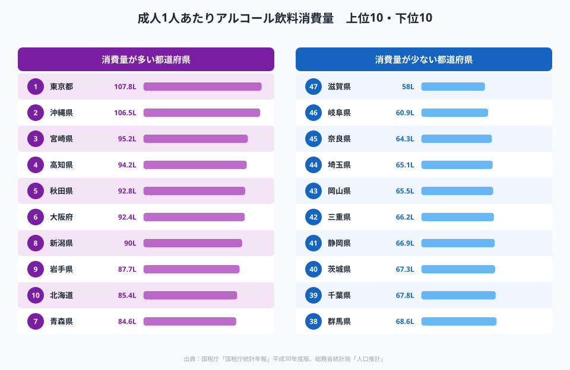
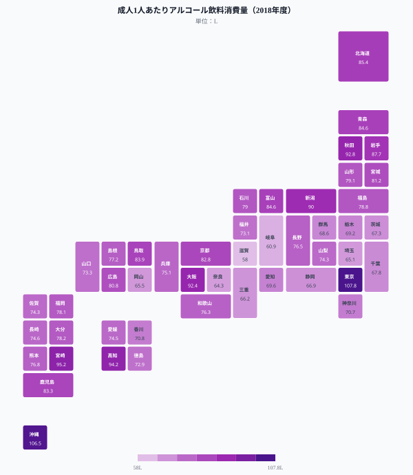
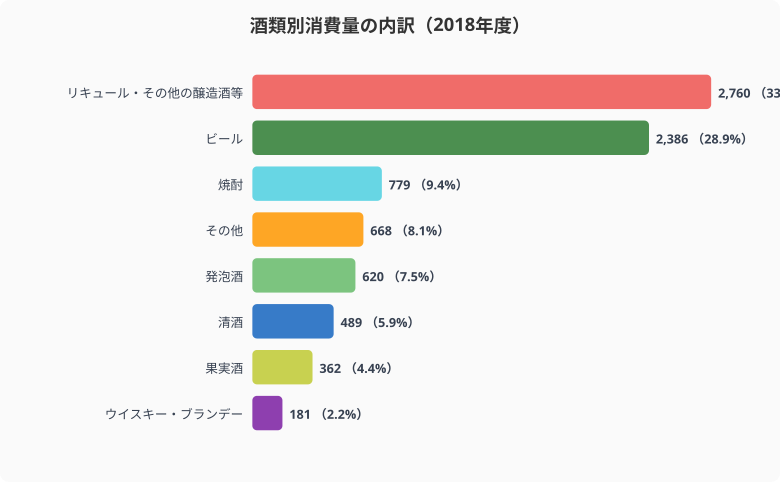
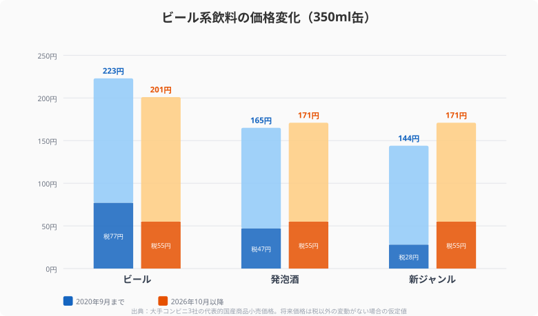

「成人1人あたりのアルコール消費量は東京が日本一」──この統計には読み解き方の注意点があります。酒類の消費量データは**購入地（販売・課税移出地）で集計**されるため、都内の飲食店で「仕事帰りに飲んで帰る」通勤者の消費が東京に計上されます。東京は飲酒量が多い「県民」がいる場所というより、**飲酒が行われる場所**として数値が膨らむ構造です。

この点を念頭に置くと、日本の「飲酒地図」はまったく違う姿を見せてきます。

> [!NOTE]
> 本記事のデータは2018年度の国税庁統計年報に基づきます。酒類消費量は「課税移出数量」（国内向け出荷量）を基準にしており、購入地が消費地とみなされます。そのため、昼間人口が多い都市部は居住人口あたりの数値が高く出る傾向があります。

## 成人1人あたりアルコール飲料消費量ランキング

<data-source url="https://www.nta.go.jp/publication/statistics/kokuzeicho/tokei.htm" label="国税庁統計年報（平成30年度版）"></data-source>

**1位は東京都**（107.8L）。前述の通り、都内で飲食する通勤者の消費が算入される構造です。前年度比では3.8L減少しており、大都市部の消費は緩やかに縮小しています。

**2位は沖縄県**（106.5L）。泡盛やオリオンビールの地域文化が根強く、家庭での日常的な飲酒率が高い県です。「第三のビール」（リキュール等）の消費量も全国1位（43.2L）で、外飲み・家飲みともに高い文化圏を反映しています。

**3位は宮崎県**（95.2L）、**4位は高知県**（94.2L）。九州・四国の焼酎文化圏で、通勤者流入の影響を受けにくい地方県が上位に並ぶ点は注目です。

**最下位は滋賀県**（58.0L）。大阪・京都のベッドタウンとして機能しており、住民の多くが大阪・京都の飲食店で消費し帰宅します。その消費は大阪・京都の数値に計上されるため、滋賀の数値は低くなります。

> [!TIP]
> 「消費量が少ない県 = 飲まない県民」とは限りません。滋賀・奈良・埼玉・神奈川といった大都市ベッドタウン県は「隣の大都市で飲む構造」によって数値が低くなっています。文化的な飲酒習慣を見るには、県外流出の少ない地方県（宮崎・高知・秋田など）を参照するほうが実態に近いでしょう。

## 全国マップ──大都市と飲酒文化圏の2極構造

<data-source url="https://www.nta.go.jp/publication/statistics/kokuzeicho/tokei.htm" label="国税庁統計年報（平成30年度版）"></data-source>

マップを俯瞰すると2つのグループが見えてきます。

- **大都市圏（東京・大阪）**: 昼間人口集積による「飲酒集積地」効果
- **地方飲酒文化圏（沖縄・宮崎・高知・秋田・東北日本海側）**: 地域独自の飲酒文化を反映した実態値

一方、首都圏のベッドタウン（埼玉・千葉・神奈川）と中部地方の内陸県（岐阜・滋賀・三重）が低い数値を示しています。

<source-link href="/ranking/alcohol-consumption-per-adult">47都道府県のアルコール消費量ランキングをもっと見る</source-link>

## 何を飲んでいるのか──酒類別の二系統構造

<data-source url="https://www.nta.go.jp/taxes/sake/shiori-gaikyo/shiori/2024/index.htm" label="国税庁 酒のしおり"></data-source>

2018年度の酒類別消費量を見ると、**リキュール等（第三のビール含む）が全体の33.5%（2,760千kL）** と最大シェアを占めます。次いでビール28.9%、焼酎9.4%の順です。

消費者はビール→発泡酒→第三のビールへと、税率の低い方向に誘導されてきた歴史があります。

### ビール──「都市の外飲み飲料」

ビール消費量の上位は**東京**（39.8L）、**大阪**（29.3L）、**京都**（26.5L）と大都市圏が独占します。飲食店でのビール注文が多いことが背景にあります。

### 第三のビール──「地方の家飲み飲料」

リキュール等の消費量トップは**沖縄**（43.2L）、次いで**青森・秋田**（33.7L台）。家庭での日常的な飲酒に利用されており、価格の安さが選択を促しています。

<ad-slot></ad-slot>

## 2026年10月、酒税一本化の到来

<data-source url="https://www.nta.go.jp/taxes/sake/kaisei/kaisei.htm" label="国税庁 酒税法改正の概要"></data-source>

2018年の酒税法改正に基づき、2026年10月にビール・発泡酒・新ジャンル（第三のビール）の税率が**350ml缶あたり一律55円**に統一されます。

| 種別 | 改正前（税額） | 改正後（税額） | 価格への影響 |
|---|---|---|---|
| ビール | 77円 | 55円 | 値下がり（約22円減） |
| 発泡酒 | 47円 | 55円 | 微上昇（約8円増） |
| 新ジャンル | 28円 | 55円 | 大幅値上がり（約27円増） |

**影響が最も大きいのは「第三のビール大国」の県**です。沖縄（43.2L/人）・青森・秋田で消費量が多い第三のビールが価格優位性を失い、消費構造が変わる可能性があります。

> [!WARNING]
> 沖縄・東北では第三のビールの消費が家計の食費構造に組み込まれており、価格転嫁が進むと家庭の食費支出に影響が出る可能性があります。一方でビール回帰が起きるとすれば、むしろ外飲み文化のある大都市圏ほどその恩恵を受けやすいでしょう。

## コロナ禍が変えた飲酒の形

2020年以降の感染拡大は酒類消費構造に大きな変化をもたらしました。

- **外飲みの激減**: 飲食店の時短・休業要請でビール系の店頭消費が急減。2020年8月のビール系販売数量は前年同月比87%
- **家飲みの台頭**: スーパー・コンビニでの酒類販売は増加したが、外飲み減少を完全には補えず
- **缶チューハイ・RTD需要の伸長**: 家庭ではビールよりも缶チューハイ（RTD）やワインの需要が増加

東京・大阪の消費量低下は、この「外飲み文化の消滅」が直撃した結果です。逆に、もともと家飲み文化が根強い地方県（沖縄・東北・九州）はコロナ前後の変化が相対的に小さかったと推測されます。

## まとめ：3つの構造的発見

日本の飲酒地図から読み取れる構造を整理します。

**1. 東京1位は集計構造のアーティファクト**。居住地ベースに近い地方県（沖縄・宮崎・高知）が「文化的飲酒圏」として浮かび上がります。

**2. 酒類の種類に東西格差がある**。ビールは大都市外飲み文化、第三のビールは地方家飲み文化と明確に棲み分けられています。

**3. 2026年酒税改正は地方の家飲み構造を変える**。第三のビール依存度が高い沖縄・東北で消費パターンの変化が予想されます。

## データ出典

- 国税庁統計年報（平成30年度版）: https://www.nta.go.jp/publication/statistics/kokuzeicho/tokei.htm
- 国税庁 酒のしおり（2024年版）: https://www.nta.go.jp/taxes/sake/shiori-gaikyo/shiori/2024/index.htm
- 国税庁 酒税法改正の概要: https://www.nta.go.jp/taxes/sake/kaisei/kaisei.htm

本記事の対象データ: [関連カテゴリ](/category/economy)

都道府県別の飲酒文化の詳細は、1位[沖縄県](/areas/47000)・2位[東京都](/areas/13000)のエリアプロフィールでも確認できます。家飲み文化が根強い地方の動向は[宮崎県](/areas/45000)のデータも参照ください。
