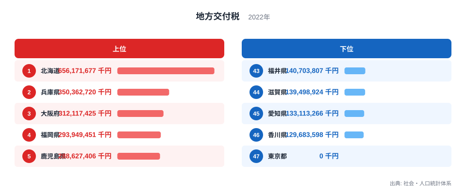
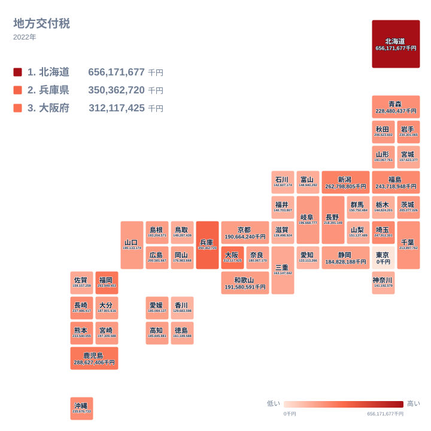
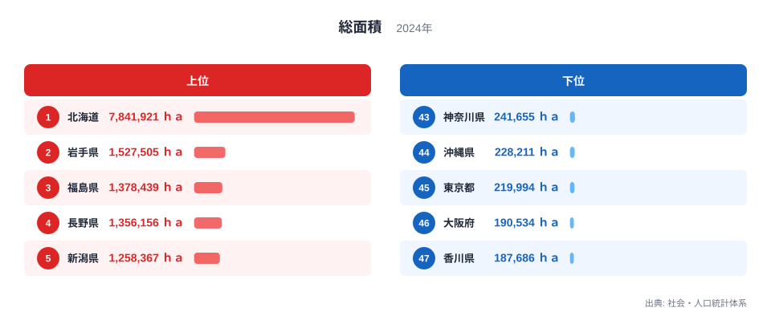
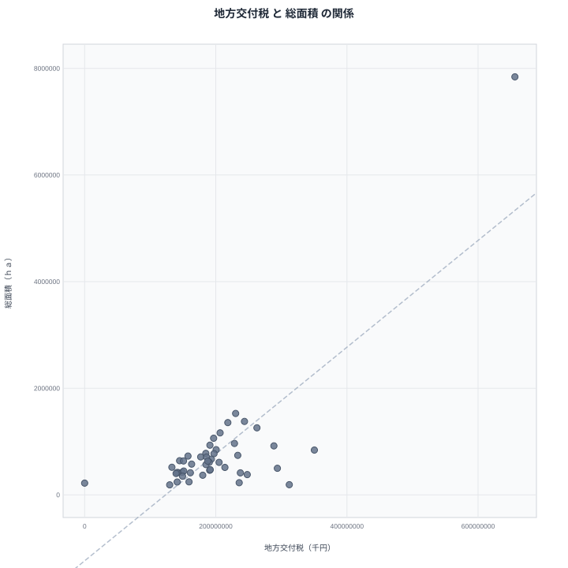

都道府県が国から受け取る地方交付税。その額のランキングには、2つの驚きが詰まっています。1位の北海道は約6,562億円と他県を大きく引き離し、最下位の東京都はゼロ、つまり1円も受け取っていません。

そしてもうひとつ。この交付税額は、県の総面積と相関係数0.80で結びついています。人口ではなく、面積です。実際、人口規模の影響を統計的に取り除いても、偏相関係数は0.80とほぼ変わりません。

当サイトでは「強い相関のほとんどは見かけの相関」という記事を繰り返し書いてきましたが、今回は逆です。この相関は偶然でも第三の変数のいたずらでもなく、地方交付税という制度が意図的に生み出している「本物の相関」です。なぜ広い県ほど多くの交付税を受け取るのか、データと制度の両面から読み解きます。

## 地方交付税ランキング──北海道が突出し、東京は0円です

1位は北海道で約6,562億円です。2位の兵庫県は約3,504億円なので、ほぼ2倍の差をつけた独走です。3位は大阪府で約3,121億円、4位は福岡県で約2,939億円、5位は鹿児島県で約2,886億円と続きます。

下位に目を移すと、46位は香川県で約1,297億円、45位は愛知県で約1,331億円、44位は滋賀県で約1,395億円です。そして47位の東京都は0円。地方交付税は自前の税収で標準的な行政サービスを賄えない自治体に配分される仕組みなので、税収が需要を上回る東京都は「不交付団体」として1円も受け取らないのです。

上位の顔ぶれは一見バラバラに見えます。広大な北海道、人口の多い兵庫・大阪・福岡、離島を多く抱える鹿児島。この混在ぶりこそが、交付税の配分ロジックを解くヒントになります。

> [!NOTE]
> ここで見ている地方交付税は都道府県分の値です（2022年度、社会・人口統計体系）。市町村に配分される交付税は含みません。地方交付税は国税の一定割合を原資に、自治体間の財源の不均衡を調整する制度で、自治体が自由に使える一般財源として配分されます。

<source-link href="/ranking/local-allocation-tax-prefecture">地方交付税ランキングをもっと見る</source-link>

## 地図で見ると「都市圏の外側」に厚く配られています

47都道府県を地図に落とすと、濃い色は北海道・東北・九州南部に分布し、首都圏や東海の色は薄くなります。税収の豊かな大都市圏から、財源の乏しい地方圏へ再配分するという制度の目的が、そのまま地図の濃淡になっている形です。

ただし、よく見ると単純な「都会と田舎」の図式では説明できない濃さもあります。人口規模の大きい兵庫県が2位、大阪府が3位に入るのは、人口が多ければ行政需要の絶対額も大きくなるからです。つまり交付税の額は、人口と、それ以外の何かの両方で決まっています。その「何か」を探るために、次は面積のランキングを見ます。あわせて見る: [北海道の県データ](/areas/01000) / [香川県の県データ](/areas/37000)

## 総面積ランキング──北海道は香川の約42倍です

総面積の1位は北海道で約784万haです。次点の岩手県が約153万haなので、1つの道だけでその5倍以上という規格外の広さです。3位は福島県で約138万ha、4位は長野県で約136万ha、5位は新潟県で約126万haと、東北・信州の県が続きます。

最下位は47位の香川県で約19万ha。46位の大阪府も約19万haでほぼ並び、45位は東京都で約22万ha、44位は沖縄県で約23万ha、43位は神奈川県で約24万haです。1位の北海道と47位の香川県の差は約42倍に達します。

ここで交付税ランキングと見比べてください。面積上位の北海道・新潟は交付税でも上位。面積最下位の香川は交付税46位。そして面積の小さい大都市圏のうち、東京だけが0円で、大阪・神奈川は交付を受けています。この対応関係の強さと例外が、次の散布図に凝縮されています。

<source-link href="/ranking/total-area-excluding-northern-territories-and-takeshima">総面積ランキングをもっと見る</source-link>

## 散布図で見る相関係数0.80

2つの指標を散布図にすると、右上がりの関係がはっきり現れます。相関係数は0.80。右上の端には両指標とも1位の北海道が孤立した点として浮かび、この1点が相関を象徴しています。

帯の中の動きも意味深です。面積4位の長野県は交付税では14位で約2,184億円と、面積の割に控えめです。逆に面積39位の埼玉県は交付税7位で約2,479億円と、面積の小ささを人口の多さが補って上位に入ります。そして左下の隅、面積45位で交付税0円の東京都が、この散布図の唯一の特異点です。

> [!WARNING]
> 相関係数0.80という値は「面積だけで交付税額が決まる」ことを意味しません。後で見るように配分の算定には人口をはじめ多くの要素が使われます。また交付税は2022年度、総面積は2024年の値で調査時点が異なるほか、東京都の0円は算定の結果としての制度上の値であり、欠測ではありません。

## 真因を考える──制度が面積を「わざと」織り込んでいます

これまで当サイトで扱ってきた強い相関の多くは、東西の食文化や人口密度といった第三の変数が生む見かけの相関でした。しかし交付税と面積の相関は性質が違います。人口を統制した偏相関係数は0.80と、統制前とほぼ同じ値のまま残ります。つまり面積は、人口とは独立に交付税額へ直接効いているのです。

種明かしは地方交付税の算定方法にあります。各自治体への配分額は、標準的な行政サービスに必要な「基準財政需要額」から自前の税収見込みを差し引いて決まります。そしてこの需要額の計算には、人口だけでなく、道路の面積や延長、農地や林野の面積、積雪などの自然条件といった、地理的な要素が測定単位として組み込まれています。

考えてみれば当然の設計です。面積が広ければ、維持すべき道路は長く、学校や消防署は分散配置になり、除雪の負担も増えます。同じ人口でも、広い県は行政コストが高くつきます。交付税制度はその現実を数式に落とし込んでいるため、「広い県ほど交付税が多い」という相関が制度の出力として現れるのです。北海道の突出した1位は、日本最大の面積と、それに伴う行政コストの反映にほかなりません。

一方で兵庫・大阪・福岡のような人口大県が上位に入るのは、需要額の主役があくまで人口だからです。それでも税収の大きい東京都だけは、需要を税収が上回って0円になります。交付税ランキングは、「広さのコスト」と「人口の需要」と「税収の偏り」という3つの力の合成結果として読むのが正解です。

> [!TIP]
> 相関の強さそのものは、見かけの相関か本物かを教えてくれません。見分ける鍵は、両者をつなぐ仕組みを具体的に説明できるかどうかです。交付税のように配分ルールが公開されている制度なら、仕組みまで遡って確認できます。都道府県の財政データは[地方財政のテーマページ](/themes/local-finance)にまとまっています。

## データ出典

- 地方交付税（都道府県財政）: 総務省統計局「社会・人口統計体系」（2022年度値）
- 総面積（北方領土および竹島を除く）: 総務省統計局「社会・人口統計体系」（2024年値）
- 相関係数・偏相関係数（人口を統制）は上記2指標の47都道府県値から算出
