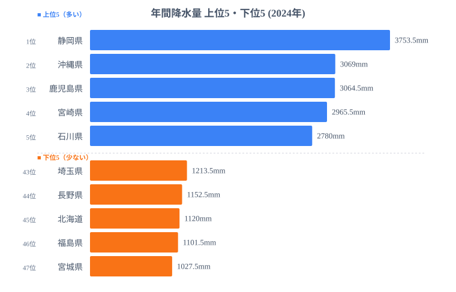
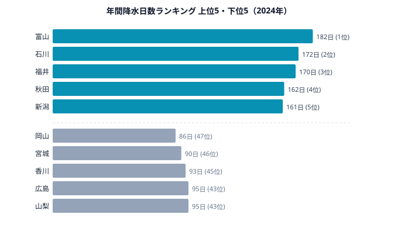
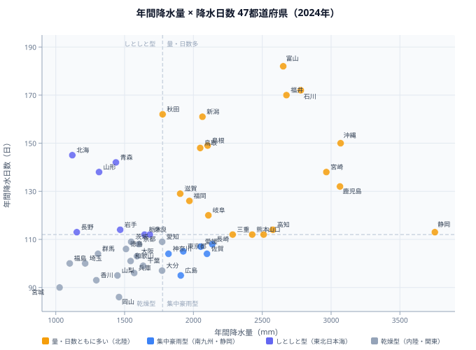

「雨が多い県はどこか」——梅雨入りの季節になると自然に湧く疑問ですが、統計を見ると「降水量が多い県」と「雨の日が多い県」は驚くほど一致しません。

2024年のデータで確認すると、[年間降水量ランキング](/ranking/annual-precipitation)の全国トップは静岡県（3753.5mm）です。一方、[年間降水日数ランキング](/ranking/annual-precipitation-days)の最多は富山県（182日）で、静岡の降水日数は113日と全国中位にすぎません。同じ「雨が多い」という言葉が、まったく異なる気候のパターンを指しているのです。

この差は単なる偶然ではなく、梅雨・台風・日本海型冬季降水という三つの異なる気象メカニズムが47都道府県に異なる「雨の質」を与えているからです。静岡は台風と地形による集中豪雨型、富山・石川・福井は日本海からの水蒸気による冬のしとしと型——気候の構造が「量」と「日数」の乖離を生み出しています。本記事では散布図を使って全47都道府県を4タイプに分類し、その背景を読み解いていきます。[気候・天気カテゴリ](/category/landweather)には他の気候指標ランキングも揃っています。

## 年間降水量ランキング｜静岡・南九州・沖縄が上位を占める理由

> [!NOTE]
> 「年間降水量」は各都道府県の代表気象観測所（アメダス）のデータをもとに算出した値で、2024年の年間合計降水量。観測地点の標高・地形条件によって同じ県内でも大きな差が生じることがあり、あくまで代表値として扱う。

<source-link href="/ranking/annual-precipitation">年間降水量ランキング（47都道府県）をもっと見る</source-link>

2024年、静岡県の年間降水量は3753.5mmで全国トップでした。上位グループには南国・離島の沖縄県（3069mm）、鹿児島県（3064.5mm）、宮崎県（2965.5mm）、石川県（2780mm）が続きます。最下位の宮城県（1027.5mm）と比べると約3.7倍の差があります。

静岡がトップになる主因は「台風の通り道」と「南アルプスの地形効果」の組み合わせです。静岡には急峻な南アルプス山脈が連なり、南から流れ込む湿った空気が山岳地帯で強制的に上昇させられます。この地形性降雨が年間を通じて多量の降水をもたらします。さらに夏から秋にかけて台風が直撃・接近するたびに記録的な豪雨が加算されます。2024年は台風の接近が複数回あり、1回の降雨イベントで100mmを超えるケースが相次いだことが年間総量を押し上げました。

沖縄・鹿児島・宮崎が上位を占めるのも同様の理由によります。これらの地域は梅雨前線が長期間停滞し、さらに台風の直撃頻度が高いのが特徴です。特に沖縄は5月下旬から梅雨入りし、関東より1か月以上長く雨季が続きます。台風については年に複数回の直撃があり、1つの台風が数百mmの降水をもたらすこともあります。鹿児島は桜島の火山地帯特有の地形が加わり、南からの湿気をせき止める効果も働いています。

石川県（2780mm）は南九州・沖縄とは異なる理由で降水量が多くなっています。石川は冬季の日本海側気候が卓越しており、12〜2月に日本海から大量の水蒸気が流れ込み、北陸の山々にぶつかって大量の雪・雨をもたらします。後述するように、石川は降水日数でも全国上位（172日・全国ランキング2位）に入る「量も日数も多い」タイプです。

一方、下位を見ると宮城県（1027.5mm・最下位）、福島県（1101.5mm）、北海道（1120mm）が並びます。東北の太平洋側が雨の少ない地域になる理由は複雑です。東北太平洋側は夏に「やませ」と呼ばれる冷涼な北東風が入り込み、梅雨前線の北上を抑制します。また日本海側の山岳地帯で雨を出し切った空気が太平洋側に流れ込む際に「フェーン現象」的に乾燥することも多いです。北海道は単純に梅雨がなく、年間を通じて降水イベントが少ない亜寒帯気候の影響が大きくなっています。

## 年間降水日数ランキング｜北陸・東北が「しとしと型」の実態

> [!NOTE]
> 「降水日数」は日降水量が1mm以上の日を1日としてカウントした年間合計日数。強い雨でも短時間で終われば1日、弱い雨でも1日続けば1日と同じ扱いになる。そのため「雨が激しい」地域と「雨の日が多い」地域は一致しないことが多い。

<source-link href="/ranking/annual-precipitation-days">年間降水日数ランキング（47都道府県）をもっと見る</source-link>

降水日数のランキングは降水量とは大きく異なる顔ぶれになります。2024年の1位は富山県の182日——実に365日の約半分に相当します。2位の石川県（172日）、3位の福井県（170日）、4位の秋田県（162日）、5位の新潟県（161日）と、北陸・東北日本海側が上位を独占しています。

富山・石川・福井が突出して雨の日が多い理由は「日本海型冬季降水」にあります。11月〜3月、日本上空に強い寒気が流れ込むたびに、温かい日本海から大量の水蒸気が蒸発し、北西の季節風に乗って北陸地方に押し寄せます。この湿った気流が北アルプス・白山・越前海岸の山地にぶつかって雪・雨になります。真冬でも降水（雪）イベントが続くため、年間180日を超える「降水日」が記録されます。富山の降水量は2652mm（全国7位）で決して少なくはありませんが、それ以上に「日数」が際立つのは、この冬季のしとしと・じとじと型が原因です。

秋田・新潟も同じ日本海型気候圏に属しますが、富山・石川よりやや降水日数が少なくなっています。これは地理的に日本海の距離が若干遠いこと、また内陸に向かう山岳の配置がやや異なることによります。それでも162日・161日という値は全国平均（約113日）を大幅に上回り、「雨・雪の季節が長い地域」であることは変わりません。

最下位は岡山県の86日で、「晴れの国おかやま」というキャッチフレーズを裏付ける統計値です。岡山に晴れが多い理由は地形にあります。北に中国山地、四国に伊予国境の山脈があり、日本海側・太平洋側の両方からの湿った気流がこれらの山地でブロックされてしまうのです。梅雨前線の雨雲も播州〜山陽道付近で消散しやすく、瀬戸内海気候特有の少雨が岡山に恩恵をもたらしています。46位の宮城県（90日）も、先述の降水量ランキング最下位と同様に、東北太平洋側の「少雨」という特性が降水日数にも表れています。

広島県（95日・43位タイ）と香川県（93日・45位）も降水日数が少なくなっています。瀬戸内海沿岸の地域は岡山と同様の山岳ブロック効果を受けており、「瀬戸内式気候」と呼ばれる温暖少雨の典型となっています。

## 散布図で見る「集中豪雨型」vs「しとしと型」の2分類

梅雨・台風・日本海型冬季降水という三つのメカニズムが組み合わさると、47都道府県は「降水量の多少」×「降水日数の多少」という二次元マトリクスで4タイプに分類できます。

<source-link href="/ranking/annual-precipitation-days">年間降水日数ランキング（47都道府県）でさらに詳しく</source-link>

散布図の右上（量が多く日数も多い）には[石川県](/areas/17000)・[富山県](/areas/16000)・福井・沖縄が並びます。北陸は冬のしとしと型が量を稼ぎ、日数も最多クラスです。沖縄は台風と長い梅雨で量・日数ともに多い、南国型の「量も日数も多い」タイプといえます。

右下（量は多いが日数は少ない）が集中豪雨型の典型です。[静岡県](/areas/22000)（3753.5mm・113日）、宮崎（2965.5mm・138日）、高知（2577mm・114日）がここに位置します。特に静岡は全47都道府県の中で最も「量に対して日数が少ない」極端な位置にあります。これは短時間・集中型の大雨イベントが少数ながら極めて大量の降水をもたらすことを意味します。台風が1日で200〜300mmをもたらし、それが年間の合計量を大きく引き上げる一方、晴れている日は徹底的に晴れる気候です。

左上（量は少ないが日数は比較的多い）には[北海道](/areas/01000)（1120mm・145日）・青森（1437mm・142日）・秋田（1776mm・162日）の東北日本海側が集まります。特に北海道は降水量が45位と下から3番目ですが、降水日数は9位（145日）という特異な存在です。梅雨がないため一度の降雨量は少ないものの、年間を通じて天気が変わりやすく雨の日が多い、亜寒帯型気候の特徴を示しています。

左下（量も日数も少ない）の乾燥型には[岡山県](/areas/33000)・[宮城県](/areas/04000)・広島・香川・兵庫が集まります。中でも岡山は「量の少なさ」（37位・1459.5mm）と「日数の少なさ」（47位・86日）を兼ね備える、日本で最も「乾燥した好天型」の都道府県です。

> [!WARNING]
> 散布図が示すのは降水量と降水日数の相関パターンであって、因果関係ではありません。また2024年は台風の接近本数が多かった影響で、静岡・南九州の降水量が平年値より高い可能性があります。本記事は1年分のスナップショットであり、気象庁の平年値（30年平均）とは順位が入れ替わる年もある点に注意してください。

## 梅雨と「雨の質」が変える生活リスクと農業条件

> [!TIP]
> 「降水量が多い地域＝水害リスクが高い」とは必ずしも言えない。時間雨量（何mm/hで降るか）や地形の傾斜・治水設備の整備状況が重要で、短時間集中豪雨が河川氾濫につながるリスクは静岡・南九州など集中豪雨型の地域で特に高い。一方、しとしと型の北陸は土壌の保水能力が強く、総量が多くても洪水リスクの性質が異なる。

集中豪雨型（静岡・南九州型）の地域に住む人にとって最大のリスクは「短時間大雨による河川の急激な増水」です。静岡の場合、天竜川・大井川・安倍川といった急流河川が流域を貫いており、山岳地帯で受け止めた大雨が短時間で海岸部へ流れ下ります。2024年だけでも複数の洪水警報が発令され、一度の降雨イベントで平常水位の数倍に達することがありました。防災の観点では「雨の日数」よりも「一度に降る量（時間雨量）」の監視が重要になります。

しとしと型（北陸型）の地域では、長期にわたる積雪・融雪の管理が課題になります。富山・石川・福井は降水の多くが冬季の雪として蓄積し、春の融雪期に一斉に流れ出します。農業用水の観点では、春の融雪水が豊富な灌漑水源となり、北陸はコメの大産地にもなっています。富山・新潟のコシヒカリが高品質なのは、豊かな雪解け水と夏の日照の組み合わせという「しとしと型気候」の副産物といえるでしょう。

乾燥型（岡山・香川型）の地域では、水不足・渇水対策が長年の課題です。香川県は全国有数の少雨地域であり、過去に何度も渇水を経験してきました。ため池の密度が全国トップクラスで、「ため池大国香川」と呼ばれるほど、水の確保に地域全体で取り組んできた歴史があります。岡山でも用水路の整備が進んでいますが、梅雨の降水量が平年を下回る年は農業用水の不足が問題になります。

梅雨入りの時期そのものも地域差が大きく、雨の量・日数との組み合わせで「今年の夏の水事情」が決まります。気象庁の速報値では2024年の梅雨入りは沖縄が5月21日、九州・四国が6月初旬で、関東甲信越は6月10日前後と平年よりやや遅めでした。梅雨の長さが1週間変わるだけで、集中豪雨型の地域では年間降水量が数百mm変動することもあります。

## データ出典

本記事のデータは、気象庁が整備する都道府県別年間降水量・降水日数データを e-Stat 経由で統計47が整備したものです（2024年版）。気象庁アメダス各観測地点の月別データを集計し、都道府県単位のランキングとして算出しています。

<source-link href="/category/landweather">気候・天気の都道府県ランキング一覧を見る</source-link>
