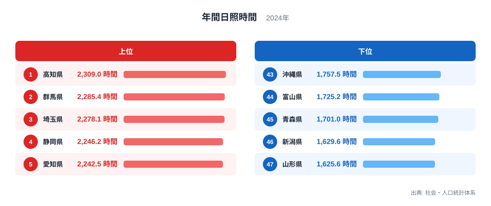
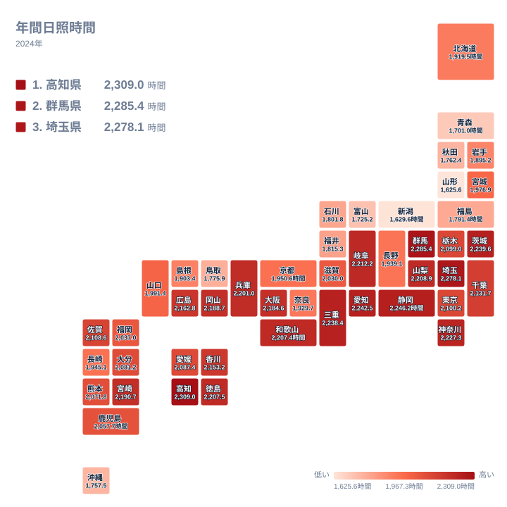

晴れた日が多い県、曇りや雨が多い県。皆さんが暮らす都道府県は、どちらに近いでしょうか。

気象庁が観測する年間日照時間は、太陽が雲などに遮られずに地表を照らした時間の合計を示す指標です。社会・人口統計体系の2024年データでは、全国1位の高知県と最下位の山形県の間に大きな開きがあり、そこには日本列島特有の気候構造が映し出されています。この記事では、都道府県別の日照時間ランキングをもとに、なぜ太平洋側の県が上位を占め、日本海側の県が下位に集まるのかを地理的な視点から読み解いていきます。

## 日照時間が多い県と少ない県

<source-link href="/ranking/annual-sunshine-duration">年間日照時間ランキングをもっと見る</source-link>

2024年の年間日照時間で全国1位になったのは高知県で、2,309時間でした。2位は群馬県の2,285.4時間、3位は埼玉県の2,278.1時間と続き、4位の静岡県、5位の愛知県までを合わせると、上位5県のうち4県が太平洋沿岸か内陸の関東平野に位置しています。高知県は太平洋に面し、黒潮の影響で冬場も比較的温暖な気候が続くうえ、四国山地が北からの雲を遮る位置関係にあるため、年間を通じて日照時間が確保されやすい土地柄です。群馬県や埼玉県も、冬に山地を越えた乾いた季節風が吹き込む地域で、上位に名を連ねています。

一方、下位に目を移すと、47位の山形県は1,625.6時間、46位の新潟県は1,629.6時間、45位の青森県は1,701時間、44位の富山県は1,725.2時間、43位の沖縄県は1,757.5時間となっています。上位4県はいずれも日本海側に位置しており、冬の間に大陸から吹く季節風が日本海の水蒸気を含んで雪雲をつくり、空を覆い続けることが日照時間を押し下げる要因になっています。沖縄県だけは太平洋側の島しょ県でありながら下位に入っていますが、これは梅雨の期間が長いことや、台風の通過による曇天が多いことが影響していると考えられます。

高知県と山形県の日照時間を比べると、その差は683.4時間に及びます。1日あたりに換算するとおよそ1.9時間の差になり、同じ日本国内でも太陽の当たり方がこれほど違うことがわかります。

## 地理から見る日照時間の分布

タイルマップで全国を見渡すと、日照時間の長い県が太平洋側と瀬戸内海沿岸、そして関東内陸部に帯状に連なっている様子が確認できます。群馬県や埼玉県、栃木県といった関東内陸の県は、冬の間に「からっ風」と呼ばれる乾いた北西の季節風が吹き込みますが、この風はすでに越後山脈や関東山地で水分を落としたあとの乾燥した空気であるため、雲をあまりつくらず晴天が続きやすくなっています。

対照的に、東北から北陸にかけての日本海側の県は、地図の中でも明確に濃い色の帯として現れています。同じ季節風でも、日本海を渡ってくる前の湿った空気が山地にぶつかって雪雲を発生させるため、冬季の日照時間が大きく落ち込みます。この、山を挟んで気候が正反対になるという構造は、日本列島が南北に長い山脈を背骨のように持つ地形だからこそ生まれるものです。関東から中部にかけての内陸県が上位にまとまり、東北から北陸にかけての日本海側が下位にまとまっているのは、偶然ではなく地形が作り出した必然だと言えます。

## なぜ地域によってこれほど差が生まれるのか

日照時間の地域差を生む最大の要因は、冬の季節風と山地の位置関係です。日本列島の中央には脊梁山脈が南北に連なっており、大陸からの北西季節風は日本海側で水蒸気を集めて雪や曇りをもたらす一方、山を越えた太平洋側では乾いた空気となって晴天をもたらします。この構造は気象の解説でもよく取り上げられる典型的なパターンで、今回のランキングでも上位と下位がきれいに太平洋側と日本海側に分かれた形で表れています。

また、同じ太平洋側でも順位に差があるのは、緯度や海流、地形の細かな違いが影響しているためです。高知県のように黒潮の影響を強く受け、かつ山地に囲まれた地形を持つ地域は、雲の発生源となる湿った空気の流入が抑えられやすく、結果として日照時間が長くなる傾向があります。逆に沖縄県のように海に囲まれた島しょ県では、梅雨前線や台風の通過そのものが日照時間を左右する大きな要因になり、本州の太平洋側とは異なる理由で日照時間が伸び悩んでいます。

## まとめ

- 2024年の年間日照時間で全国1位は高知県の2,309時間でした
- 最下位は山形県の1,625.6時間で、1位との差は683.4時間に達します
- 上位5県には高知県、群馬県、埼玉県、静岡県、愛知県が入り、太平洋側と関東内陸に集中しています
- 下位5県には山形県、新潟県、青森県、富山県、沖縄県が入り、日本海側の県が目立ちます
- 冬の季節風と脊梁山脈の位置関係が、太平洋側と日本海側の日照時間の差を生む主な要因です

[同じカテゴリの統計一覧](/category/landweather)では、気候にまつわる他の指標も比較できます。1位になった[高知県のデータ](/areas/39000)や、2位の[群馬県のデータ](/areas/10000)を県別に詳しく見ることもできます。

> [!NOTE]
> 日照時間は各都道府県の気象官署がある地点、多くは県庁所在地周辺での観測値です。同じ県の中でも、沿岸部と山間部では日照時間が大きく異なることがあるため、県全体を代表する値というより観測地点での値として読むのが正確です。

> [!WARNING]
> このランキングは2024年単年のデータです。日照時間は梅雨の長さや台風の通過状況、冬の降雪量によって年ごとに変動するため、ある年だけ突出して多い、あるいは少ない県が出ることがあります。長期的な傾向を知りたい場合は複数年のデータを合わせて確認する必要があります。

> [!TIP]
> 日照時間が長いことは必ずしも暑いことを意味しません。日照時間と気温、降水量はそれぞれ別の指標なので、暮らしやすさを比較したいときは日照時間だけでなく気温や降水量もあわせて確認すると、より実態に近い気候のイメージがつかめます。

## データ出典

社会・人口統計体系、2024年のデータをもとに作成しています。
