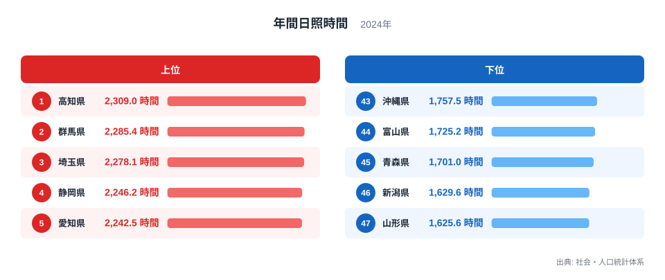
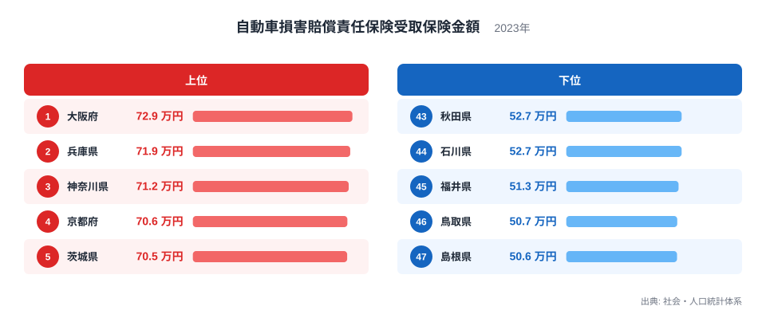
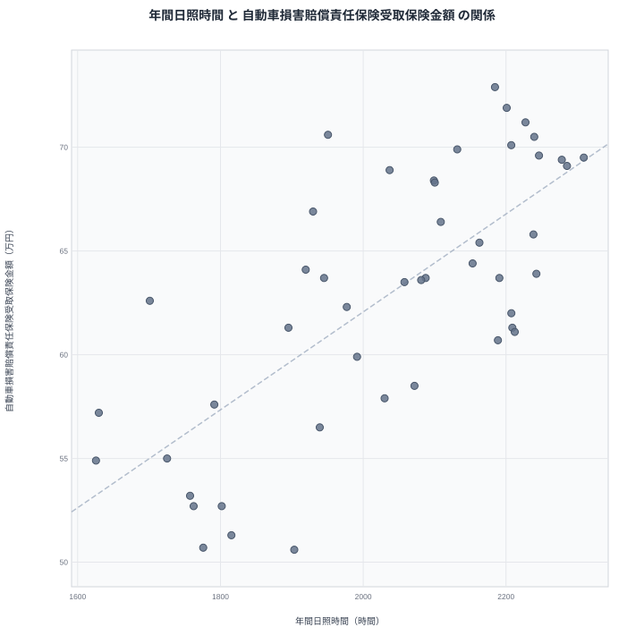

日照時間が長い地域は、交通量が多く道路も混み合いやすい傾向があります。そこで気になるのが、年間日照時間と自動車損害賠償責任保険受取保険金額のあいだにどのような関係があるかという点です。晴天が多いほど外出や運転の機会が増え、事故に伴う保険金の受け取りも増えるのでしょうか。この記事では2024年の年間日照時間と2023年の自動車損害賠償責任保険受取保険金額を都道府県別に並べ、その重なりと食い違いを確認していきます。

結論から言うと、両者には統計的にはっきりとした重なりが見られますが、それは日照時間が事故や保険金額を直接左右しているからではありません。高知県は日照時間で1位でありながら保険金額では9位にとどまり、逆に大阪府は日照時間で16位にもかかわらず保険金額では1位です。この記事では、その理由を都市の道路事情や交通量という切り口から読み解いていきます。

## 年間日照時間の上位と下位

<source-link href="/ranking/annual-sunshine-duration">年間日照時間ランキングをもっと見る</source-link>

年間日照時間の1位は高知県で2,309時間です。2位は群馬県で2,285.4時間、3位は埼玉県で2,278.1時間と続きます。上位には太平洋側や内陸の盆地に位置する県が並んでいて、冬場に晴天が続きやすい気候の特徴が表れています。高知県は太平洋に面した黒潮の影響を受ける地域で、冬でも比較的乾燥した晴れの日が多いことで知られています。群馬県や埼玉県は関東平野の内陸に位置し、冬型の気圧配置のもとで乾いた晴天が続きやすい地形です。

一方、最下位は山形県で1,625.6時間です。46位は新潟県で1,629.6時間、45位は青森県で1,701時間と、日本海側の県が下位に集まっています。これは冬季に日本海側特有の曇天や降雪が続く気候の影響で、太平洋側の地域とは対照的な傾向です。同じ日本国内でも、日照時間には47都道府県で最大683.4時間もの開きがあることがわかります。

## 自動車損害賠償責任保険受取保険金額の上位と下位

自動車損害賠償責任保険受取保険金額の1位は大阪府で72.9万円です。2位は兵庫県で71.9万円、3位は神奈川県で71.2万円と、大都市圏の県が上位を占めています。大阪府や兵庫県、神奈川県はいずれも人口密度が高く、幹線道路や生活道路の交通量も多い地域です。交通量が多いほど接触事故や衝突事故が起きやすくなり、1件あたりの保険金額も高くなりやすいと考えられます。

一方、最下位は島根県で50.6万円です。46位は鳥取県で50.7万円、45位は福井県で51.3万円と、地方部の県が下位に並んでいます。人口が少なく道路も比較的空いている地域では、事故そのものの発生機会が限られるため、受取保険金額も低い水準にとどまる傾向があります。1位の大阪府と47位の島根県のあいだには22.3万円の開きがあり、都市部と地方部で保険金額の水準がかなり異なることが読み取れます。

## 見かけの相関と真因

散布図を見ると、日照時間が長い県ほど保険金額も高い傾向がはっきりと見えます。実際、日照時間の上位10県のうち埼玉県、静岡県、茨城県、神奈川県は保険金額でも上位10県に入っています。ただし、この重なりがあるからといって日照時間が保険金額の高さを引き起こしているとは言えません。日照時間1位の高知県は保険金額で9位、日照時間3位の埼玉県は保険金額で10位と、上位同士でも順位のずれが目立ちます。

> [!WARNING]
> 日照時間と保険金額には見かけ上の重なりがありますが、これは相関であって因果関係ではありません。日照時間が事故を直接引き起こすわけではなく、両者に共通して影響している別の要因を考える必要があります。

より丁寧に見ると、両者を結びつけているのは日照時間そのものではなく、人口密度と交通量という別の変数だと考えられます。大阪府、兵庫県、神奈川県といった保険金額の上位県は、いずれも都市化が進み道路の交通量が多い地域です。これらの県は日照時間でも比較的上位に位置しますが、それは太平洋側に多い大都市圏の気候特性が偶然重なっているためであり、日照時間自体が事故を増やしているわけではありません。逆に、日照時間が最も長い高知県は人口が少なく道路の交通量も限られていますが、それでも保険金額は9位につけています。人口密度と交通量という2つの変数だけで47県の順位がすべて説明できるわけではなく、都市化の度合いとは別の要因も働いていると見るのが自然です。

このように考えると、日照時間と保険金額のあいだに見られる重なりは、太平洋側の気候と都市部の人口集中という2つの独立した要因が、たまたま同じ地域で重なっていることの反映だと理解できます。相関そのものははっきりしていても、それは日照時間が事故や保険金額を引き起こしていることを意味しません。

## 上位・下位の入れ替わりから見える地域差

日照時間で下位に沈む日本海側の県のうち、新潟県は保険金額では38位です。山形県の保険金額の順位は41位です。日照時間の少なさが直接の原因というよりも、人口規模が比較的小さく交通量も限られていることが共通の背景にあると考えられます。日本海側の県は日照時間でも保険金額でも下位にまとまりやすいものの、両者の順位がぴったり一致するわけではなく、県ごとの道路事情や人口分布の違いが表れています。

> [!TIP]
> 2つの指標を重ねて読むときは、片方の数値だけでなく、その背景にある人口密度や道路の交通量といった構造的な要因まで視野に入れると理解が深まります。

## 47都道府県を俯瞰して見えること

47都道府県を並べて俯瞰すると、日照時間の順位が中位でも保険金額が上位に入る県があることに気づきます。京都府は日照時間で31位と決して上位ではありませんが、保険金額では4位に入っています。これは、太平洋側の晴天という気候条件がなくても、都市化と道路の交通量という別の要因だけで保険金額が押し上げられうることを裏づけています。

保険金額の順位を大きく左右しているのは、人口の集中度と道路の交通量です。都市部では信号待ちや車線変更、駐車場からの出入りなど、接触事故の発生機会そのものが地方部より多くなります。日照時間が長い地域と保険金額が高い地域が部分的に重なっているのは、太平洋側の気候と大都市圏の分布がたまたま似た地域に集まっているためであり、日照時間そのものが交通量や事故の発生を左右しているわけではありません。京都府のような例は、この2つの要因が別々に働いていることを示す手がかりになります。

## データ出典

年間日照時間は社会・人口統計体系の2024年データ、自動車損害賠償責任保険受取保険金額は社会・人口統計体系の2023年データを使用しています。

> [!NOTE]
> 自動車損害賠償責任保険受取保険金額は、事故の発生件数ではなく金額を表す指標です。上位県と下位県の差が22.3万円にとどまる一方で、事故の起きやすさそのものは県によってもっと大きく違う可能性があります。件数の多さと混同しないよう注意が必要です。

[自動車損害賠償責任保険受取保険金額ランキング](/ranking/auto-liability-insurance-amount-received-per-payment)や[同じカテゴリの統計一覧](/category/landweather)もあわせてご覧ください。日照時間1位の[高知県のデータ](/areas/39000)、2位の[群馬県のデータ](/areas/10000)では、それぞれの県の他の指標も確認できます。
