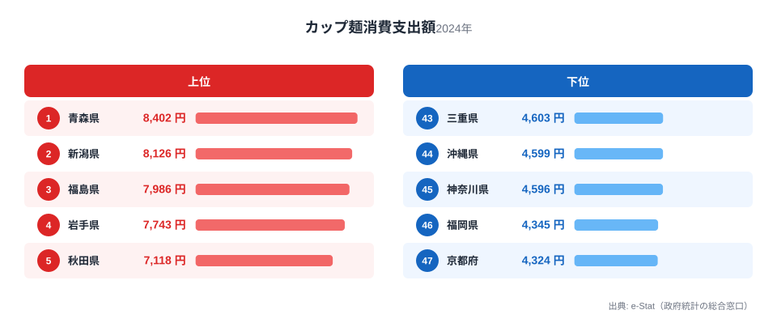
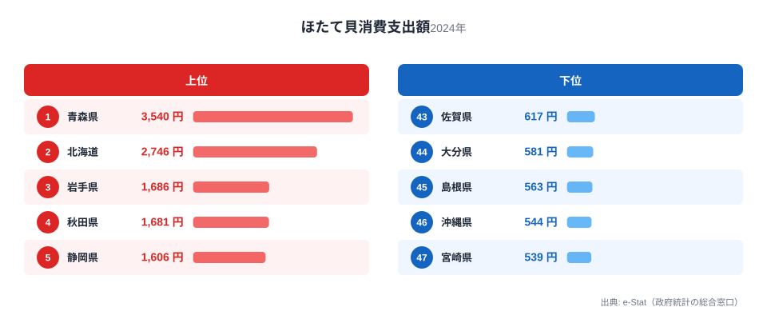
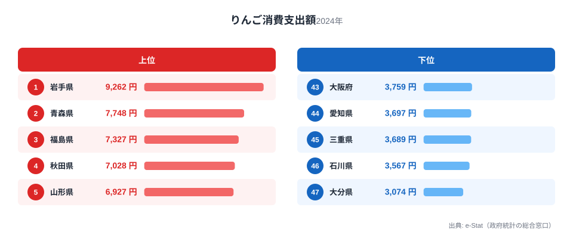
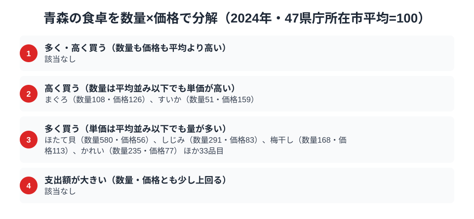

りんご生産量日本一の青森県。当然、りんごの消費も日本一だろうと思いきや、家計調査の数字は意外な結果を示します。2024年の青森市（二人以上世帯）のりんご消費支出額は7,748円で全国2位。1位は隣の岩手県で9,262円でした。

一方で、カップ麺は8,402円、ほたて貝は3,540円と、この2品目では青森が堂々の全国1位です。「りんごの国」のイメージとは少し違う、青森県民のリアルな食卓を家計調査のデータから読み解きます。

> [!NOTE]
> 家計調査の都道府県データは、県庁所在市（青森県は青森市）の二人以上世帯を対象にした年間支出額です。県全体ではなく青森市在住世帯の家計簿から見た傾向であり、支出「金額」であって消費「量」そのものではない点にご注意ください。

## カップ麺 — 全国1位8,402円、雪国の即席文化

<source-link href="/ranking/cup-noodles-consumption-expenditure">カップ麺消費支出額ランキングをもっと見る</source-link>

青森県のカップ麺消費支出額は8,402円で全国1位です。2位の新潟県8,126円、そして上位には東北・北陸の雪国が並び、最下位の京都府4,324円とは1.9倍の差があります。寒さの厳しい冬に手早く温かいものを食べたいという生活実感と、保存が利く即席食品を備蓄する習慣が、雪国のカップ麺消費を押し上げていると考えられます。

カップ麺が東北に集中する構図の詳細は、[カップ麺支出の東北集中を扱った記事](/blog/cup-noodles-expenditure-ranking)で掘り下げています。青森はラーメン文化の豊かな土地でもあり、「麺類への支出が全般に強い」という食卓の傾向が、即席麺にもそのまま表れている形です。

## ほたて貝 — 陸奥湾の恵みで全国1位3,540円

<source-link href="/ranking/scallop-consumption-expenditure">ほたて貝消費支出額ランキングをもっと見る</source-link>

ほたて貝の消費支出額も青森県が3,540円で全国1位です。2位は北海道の2,746円で、この2道県が3位以下を大きく引き離します。最下位の宮崎県539円と比べると6.6倍の差です。

青森1位の背景には、陸奥湾のほたて養殖があります。波の穏やかな陸奥湾は日本有数のほたて産地で、青森市の食卓には刺身・バター焼き・味噌貝焼きなど、ほたてを使った料理が日常的に上ります。産地の近さがそのまま消費額に直結する「産地=消費地」型の典型例で、寒流域の恵みが食卓の中心にある点は、黒潮のかつおに特化した高知の食卓とちょうど対をなします。

## りんご — 生産量日本一なのに消費は2位

<source-link href="/ranking/apple-consumption-expenditure">りんご消費支出額ランキングをもっと見る</source-link>

そして注目のりんごです。青森県の消費支出額は7,748円で全国2位。1位は岩手県の9,262円でした。りんご生産量で圧倒的日本一の青森が、消費支出額では隣県に首位を譲るという意外な結果です。

このねじれを解く鍵は、「支出額」という統計の性質にあります。生産県の青森では、市場を通さない「もらいもの」や親戚・知人からのお裾分け、庭先のりんごなど、お金を払わずに口に入るりんごが少なくありません。家計調査は購入金額の調査なので、こうした自家消費・贈与分は数字に表れないのです。産地であるほど支出額が実際の消費量より低く出やすいという構造は、[りんご消費支出の記事](/blog/apple-expenditure-ranking)でも詳しく扱っており、みかんなど他の産地県の果物にも共通して見られる現象です。

> [!WARNING]
> 家計調査は支出金額の調査であり、消費量そのものではありません。特に農産物の産地では、購入を介さない自家消費・贈与が多く、支出額が実際の消費実態より低く出る傾向があります。「青森のりんご消費が岩手より少ない」と断定するのではなく、「購入額では2位」と読むのが正確です。

## 青森の食卓を貫くもの

青森県民の食卓を貫くのは、「北の海と雪国の暮らし」です。陸奥湾のほたてには日本一の支出を注ぎ、厳しい冬はカップ麺をはじめとする麺類で温まる。そしてりんごは、買う前に手に入る「暮らしの一部」になっているからこそ、支出額では2位に見える。3つの品目それぞれが、青森の気候と産業構造を映し出しています。

かつお1本に支出が集中する高知型の「特化」とは違い、青森は海の幸・麺類・果物のそれぞれで全国トップ級という「多面型」です。同じ「食にお金を使う県」でも、その中身は地域の自然条件によってまったく異なることが、県別の食卓比較から見えてきます。

> [!TIP]
> 産地県の農産物消費を家計調査で見るときは、「支出額の順位」と「生産量の順位」のずれに注目すると発見があります。ずれが大きい品目ほど、市場を通さない自家消費・贈与の比重が大きい可能性があり、その土地で本当に日常的な食材であることの証拠とも読めます。

## 数量×価格で分解する青森市の食卓

<source-link href="/ranking/freshwater-clam-consumption-quantity">しじみ消費量ランキングをもっと見る</source-link>

ここまで見てきたカップ麺・ほたて貝・りんごの支出額は、実は「たくさん買っている」のか「高いものを買っている」のかで中身がまったく違います。家計調査には支出額だけでなく数量と価格のデータもある品目があり、支出額はこの2つを掛け合わせた結果にすぎません。そこで青森市の食卓を、数量・価格の両方がとれる品目について47都道府県庁所在市の単純平均を100とした指数に置き換え、平均を大きく上回る品目を「多く買う」か「高く買う」かで分けてみます。

最も目立つのはほたて貝です。購入量の指数は580で47市平均の5.8倍に達する一方、価格指数は56と平均の半分程度で、質より量の消費であることがわかります。しじみ消費量も指数291と平均の約2.9倍に対し、価格指数は83と平均を下回り、十三湖の産地に近い青森らしい「量の文化」といえます。梅干しやかれいも量の指数が168〜235と多い一方で価格指数は平均並みか安めで、地元で手に入りやすいものを日常的にたくさん食べている構図です。りんごもこの「多く買う」品目の一つで、購入量指数は233と平均の2.3倍です。それでも岩手県の購入量指数はさらに高く、支出額で見た順位関係が数量でも同じように保たれています。生産量では圧倒的な青森ですが、家計調査がとらえる「購入量」でも岩手県を上回れていない点は、自家消費の影響を差し引いても変わりません。

一方で「高く買う」品目に入るのはまぐろとすいかで、どちらも量はそれほど多くありません。まぐろは購入量指数108とほぼ平均並みですが、価格指数は126と平均より2割以上高く、すいかは購入量指数51と平均の半分ほどに抑えつつ価格指数は159まで上がります。海に面していても遠洋物のまぐろや、夏の短い青森では旬が短いすいかは、地元でたくさん出回る品目とは逆に、選んで買った分だけ単価が上がる側の食材だと読めます。

> [!TIP]
> ランキングの支出額だけを見ると「たくさん食べている」のか「高いものを買っている」のか区別がつきません。数量指数と価格指数に分解すると、ほたて貝やしじみのように「地元で量的に豊富」なのか、まぐろやすいかのように「選んで買うから単価が上がる」のかが見分けられます。

> [!NOTE]
> ここでの指数は家計調査の全国値ではなく、47都道府県庁所在市（青森県は青森市）の単純平均を100とした相対値です。また価格指数は支出額÷数量から逆算した値なので、同じ品目でも買っている品種やブランド、パッケージの違いが反映され、純粋な店頭価格の水準そのものではありません。対象は二人以上世帯の2024年の年間データです。

## まとめ

- カップ麺消費支出額は青森県が全国1位（8,402円）、雪国・麺文化の反映
- ほたて貝も全国1位（3,540円）、陸奥湾の養殖という「産地=消費地」型
- りんごは全国2位で7,748円、1位は岩手県で9,262円
- 生産量日本一のりんごが購入額で2位なのは、自家消費・贈与が統計に表れないため
- 高知の「かつお特化型」と対照的な、海の幸・麺・果物の「多面型」の食卓

青森県の他の統計は[青森県の地域プロフィール](/areas/02000)、食品・家計消費の地域差は[経済カテゴリ一覧](/category/economy)からご覧いただけます。

## データ出典

総務省統計局「家計調査（品目別）」（2024年、都道府県庁所在市 二人以上世帯）をもとに、e-Stat（政府統計の総合窓口）経由で整備したデータを使用しています。
