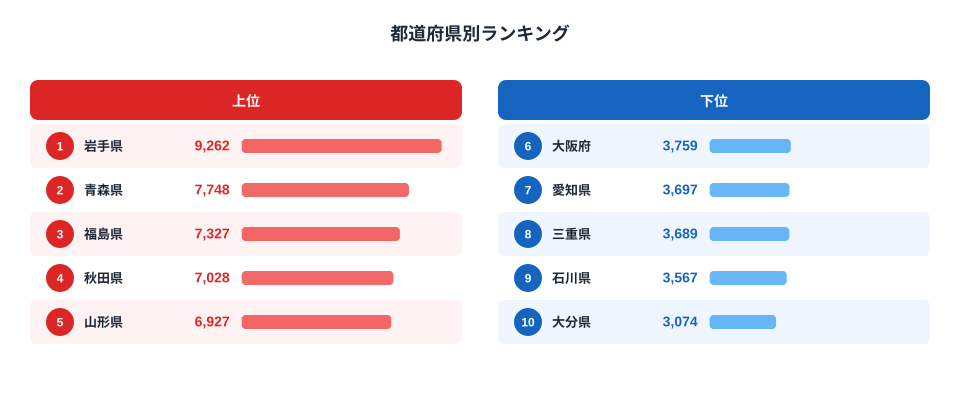

「りんごの消費量が一番多いのはやっぱり青森でしょう」——多くの人がそう予想するはずです。青森県は収穫量で全国シェア約6割を占める日本最大のりんご産地であり、「りんご県」を名乗る自治体もあります。ところが総務省の家計調査（二人以上世帯・都道府県庁所在市）でりんごの年間消費支出額を見ると、トップの座には別の県が入っていました。

2024年の家計調査によると、りんご消費支出額の1位は岩手県で9,262円。青森県は7,748円で2位にとどまります。最下位は大分県の3,074円で、1位との差は約3.0倍です。この記事では、なぜ「りんご県」青森が首位ではないのか、そして上位に東北勢と長野県が並ぶ理由を、産地との近さという観点から掘り下げます。

> [!NOTE]
> りんご消費支出額は総務省「家計調査（品目別）」の都道府県庁所在市データです。実際に住む都道府県全体の消費傾向ではなく、県庁所在市（盛岡市・青森市など）の二人以上世帯が対象である点に注意してください。地方部を含む県全体の消費とは値がずれる可能性があります。

## 上位と下位

上位5県は岩手（9,262円）、青森（7,748円）、福島（7,327円）、秋田（7,028円）、山形（6,927円）と、東北6県のうち5県が名を連ねます。6位以降は兵庫（6,781円）、長崎（6,715円）と続き、日本有数のりんご産地である長野は8位（6,353円）に入ります。上位10位以内は東北5県＋兵庫・長崎・長野・群馬・奈良という構成になりました。

東北勢が軒並み上位に来る背景には、りんごの一大産地が集中していることがあります。青森はもちろん、岩手・福島・秋田・山形もりんご生産量の全国上位県で、地元で採れたりんごが日常的に食卓に上りやすい環境にあります。産直市場や親戚・知人からの「お裾分け」文化が根強く残っている地域ほど、家計調査の支出額にも表れやすいと考えられます。

<source-link href="/ranking/apple-consumption-expenditure">りんご消費支出額ランキングをもっと見る</source-link>

## 下位グループ

下位5県は石川（3,567円）、三重（3,689円）、愛知（3,697円）、大阪（3,759円）、そして最下位の大分（3,074円）です。近畿・中部・九州の都市部や、りんご以外の果物（みかん・梨など）が地元で盛んな地域が並んでいます。

大分は日本梨や柑橘類の産地として知られ、地元産の果物としてはりんご以外の選択肢が豊富にあります。愛知や大阪のような大都市圏は、特定の果物の産地としての結びつきが薄く、消費が果物全体に分散しやすい傾向があります。石川や三重も同様に、りんごが県の代表的な特産品ではない地域です。

同じ家計調査の品目別データでは、[米の消費量ランキング](/blog/rice-consumption-quantity-ranking)でも地元の主食作物への依存度が地域ごとに大きく異なることが分かっています。りんごや米に限らず、家計の消費支出は産地との近さに強く影響される傾向があります。

## 発見: 生産量トップの青森が首位を逃す理由

最も興味深い発見は、生産量で圧倒的な青森県が消費支出額では首位を逃しているという点です。農林水産省の統計で青森はりんご収穫量の全国シェアが約6割に達する圧倒的な産地ですが、家計調査の消費支出額では岩手に次ぐ順位にとどまっています。

[仮説] 岩手県は青森ほど収穫量で突出してはいないものの、盛岡市を中心に「りんごの木のオーナー制度」や産直施設が普及しており、県庁所在市に住む世帯が購入する頻度・量が相対的に多い可能性があります。また青森県産りんごは県外・海外への出荷比率が高く、地元消費に回る割合が必ずしも生産量に比例しない可能性も考えられます。この点は家計調査の品目別購入数量データや青森県の産直販売統計と突き合わせた検証が必要です。詳しい県別の数値は[りんご消費支出額ランキング](/ranking/apple-consumption-expenditure)のページで確認できます。

もう一つの発見は、上位10県のうち兵庫・長崎・奈良のように、りんごの主要産地とは言い難い県も含まれていることです。これらの県では、贈答用としてりんごを購入する文化や、健康志向による果物消費の高さが影響している可能性があります。[仮説] であり、地域別の世帯属性データ（高齢化率や果物全体の消費支出）と合わせた分析が今後の検証課題です。

> [!TIP]
> りんごのような単一品目の消費支出は、生産量ランキングと合わせて見ると「地産地消がどれだけ機能しているか」が見えてきます。産地なのに消費が少ない、逆に産地でないのに消費が多い県を比較すると、流通や食文化の違いが浮かび上がります。

> [!WARNING]
> 家計調査は購入金額ベースの支出額であり、購入量（重量）とは異なります。りんごの価格は品種や時期によって変動するため、支出額が高い＝消費量が多いとは限らない点に留意してください。

## まとめ

- **1位**: 岩手県（9,262円）
- **47位（最下位）**: 大分県（3,074円）
- **倍率**: 約3.0倍
- **地域パターン**: 東北5県（岩手・青森・福島・秋田・山形）と長野が上位クラスタを形成
- **特筆点**: 生産量日本一の青森は消費支出額では首位を逃す。産地=消費量トップとは限らないという意外な結果

家計消費に関するその他の統計は[経済カテゴリ](/category/economy)でまとめて確認できます。

## データ出典

総務省統計局「家計調査（品目別）」都道府県庁所在市の二人以上世帯データ（2024年）を基に集計しています。e-Stat経由で整備した統計データを使用しました。
