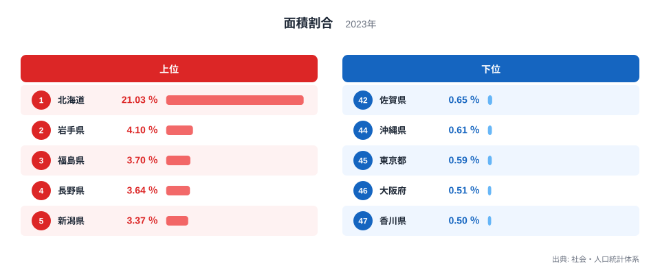

## 「5分の1」の分母から確かめます

2023年の面積割合は、北海道が21.03％で全国1位です。21.03％は5分の1を少し上回ります。ただし、ここでいう「全国面積」には重要な定義があります。

社会・人口統計体系の指標「#B01101 面積割合（全国面積に占める割合）」は、各都道府県の総面積を全国の総面積で割った値です。分子と分母はいずれも、北方地域と竹島を除く総面積を使います。北方地域は、歯舞群島、色丹島、国後島、択捉島を指します。

したがって、21.03％を「領土として掲げる範囲をすべて含む日本の面積に対する割合」と読むのは正確ではありません。この記事では、公式指標と同じ除外範囲を「集計対象面積」と呼びます。

> [!NOTE]
> この指標が示すのは行政区域の総面積の割合です。可住地面積、森林面積、市街地面積、人口密度の割合ではありません。湖沼は総面積に含まれます。

元になる面積は、国土地理院の「全国都道府県市区町村別面積調」などに基づきます。2023年面積調は、電子国土基本図の海岸線と行政界で囲まれた範囲を測定し、平方キロメートル単位で小数第2位まで公表しています。境界未定部がある都道府県には参考値が含まれるため、年次比較では値だけでなく注記も確認する必要があります。

## 北海道21.03％、香川県0.50％です

<source-link href="/ranking/area-ratio-of-total">面積割合ランキングをもっと見る</source-link>

上位5道県は、北海道21.03％、岩手県4.10％、福島県3.70％、長野県3.64％、新潟県3.37％です。北海道と2位岩手県の差は16.93ポイントあり、北海道の値が分布の中で大きく離れています。

下位5都府県は、神奈川県0.65％、沖縄県0.61％、東京都0.59％、大阪府0.51％、香川県0.50％です。その直前の42位は佐賀県で、表示値は神奈川県と同じ0.65％です。最上位の北海道と最下位の香川県を表示値で比べると約42.1倍になります。

上端と下端の差は、公式の地勢資料でも区域の形として確認できます。国土地理院の2023年面積調にある島別集計では、北海道本島だけで77,981.53平方キロメートルあります。北海道の公式地勢資料も、北海道が本島と多数の島で構成されると説明しています。今回の21.03％は北方地域を除いた値ですが、北海道本島そのものが大きいため、除外後も他県から大きく離れます。

一方、香川県の公式プロフィールは、県域を四国東北部の半月形の区域とし、南を讃岐山脈、北を瀬戸内海に挟まれた全国最小の県と説明しています。2023年面積調の香川県は1,876.87平方キロメートルです。大きな主島を中心とする北海道と、四国東北部に収まる香川県という区域構成の対照は、ランキングの上端と下端という配置と整合します。

ただし、岩手県、福島県、長野県、新潟県が上位に並ぶ理由を、一つの地形や制度でまとめることはできません。ランキングから確認できるのは各県域の広さまでです。個別県の成り立ちや地形を説明する場合は、それぞれの区域資料を追加で照合する必要があります。

ここから確実に言えるのは、同じ都道府県という区分でも区域の面積に大きな差があることです。北海道の人口、交通、行政サービスなどが面積だけで説明できるわけではありません。面積割合は地域運営の原因を示す指標ではなく、区域の物理的な広さを比較する入口です。

> [!TIP]
> ランキングを見るときは、1位と最下位だけでなく、1位と2位の差も確認すると分布の偏りをつかみやすくなります。今回は北海道21.03％に対し岩手県4.10％で、首位の突出がはっきりしています。

## 0.65％でも佐賀県42位、神奈川県43位です

面積割合は小数第2位で表示されます。このため、元の面積が異なっていても表示上は同じ値になる場合があります。佐賀県と神奈川県はいずれも0.65％ですが、同率にはしていません。

国土地理院の2023年10月1日時点の面積調では、佐賀県は2,440.68平方キロメートル、神奈川県は2,416.32平方キロメートルです。両県は同じ全国面積を分母にするため、丸め前の割合は佐賀県のほうが大きくなります。この元面積に基づき、佐賀県を42位、神奈川県を43位としました。

同じ確認方法で、表示値1.12％の福井県と石川県は福井県34位・石川県35位、1.11％の徳島県と長崎県は徳島県36位・長崎県37位です。図表と記事内の順位は、小数第2位の表示値だけで並べず、公式の元面積で順序を確認しています。

> [!WARNING]
> 0.65％という表示だけから、佐賀県と神奈川県を同率と断定することはできません。順位を使う場合は、丸め前の値または同じ分母に対する元の面積を確認します。

## この数字だけでは暮らしや行政は説明できません

面積割合から直接分かるのは、全国の集計対象面積に占める県域の比率だけです。人口が多いか、居住可能な土地が広いか、道路が長いか、災害対応が難しいかまでは分かりません。

たとえば東京都と大阪府は面積割合では下位ですが、この記事のデータだけでは人口密度や土地利用について評価できません。北海道についても、21.03％という値だけを根拠に、行政コスト、移動時間、インフラ維持の負担を断定することはできません。そうした問いには、人口分布、可住地面積、道路延長、施設位置、地形などの別データが必要です。

沖縄県も0.61％という陸地面積の比率だけでは、島の数や島間移動の条件を表せません。面積の大小と、生活圏のつながりやすさは別の指標です。本記事では、面積から因果関係を広げず、次に照合すべき項目として区別します。

## 面積割合を読み違えない3つの確認点

第一に、除外範囲を確認します。#B01101は北方地域と竹島を除く総面積を使います。タイトルやグラフだけを見て、別の「日本の総面積」と混ぜないことが重要です。

第二に、測定時点をそろえます。この記事の面積割合は2023年値です。海岸線や行政界の更新、境界未定部の扱いによって公表値が変わることがあるため、異なる年の面積を同じ分母へ混ぜません。

第三に、丸め前の順序を確認します。表示が同じ県について順位を述べるなら、元面積まで戻ります。表示値の合計も丸め誤差で100％と一致しない場合があります。

全47都道府県の値は[面積割合ランキング](/ranking/area-ratio-of-total)で確認できます。最多の[北海道のデータブック](/areas/01000)と最少の[香川県のデータブック](/areas/37000)では、面積とは別の地域指標も確認できます。関連する統計は[国土・気象カテゴリ](/category/landweather)にまとめています。

## 北海道の突出は県域の差を示します

2023年の面積割合は、北海道21.03％、香川県0.50％でした。北海道は集計対象面積の5分の1を超え、2位の岩手県4.10％とも大きく離れています。

このランキングの結論は、都道府県の区域面積には大きな差がある、というところまでです。なぜ暮らしや行政の条件が違うのかを考えるときは、面積割合を出発点にしつつ、人口密度、可住地面積、土地利用、交通網などを個別に照合します。指標が答えている問いと、答えていない問いを分けることで、面積の大きさを過剰に解釈せず比較できます。

## データ出典

- [e-Stat「社会・人口統計体系 #B01101 計算式」](https://www.e-stat.go.jp/koumoku/sihyo_keisansiki/B)（北方地域・竹島を除く総面積を分子・分母に使う定義）
- [e-Stat「B 自然環境 項目定義」](https://www.e-stat.go.jp/koumoku/koumoku_teigi/B)（B1101の除外範囲、湖沼・境界未定部の扱い）
- [国土地理院「令和5年全国都道府県市区町村別面積調」](https://www.gsi.go.jp/KOKUJYOHO/MENCHO/backnumber/GSI-menseki20231001.pdf)（2023年10月1日時点の都道府県面積と測定方法）
- [北海道「北海道データブック2026 地勢」](https://www.pref.hokkaido.lg.jp/ss/tkk/databook/260631.html)（北海道本島と島しょからなる区域構成）
- [香川県「香川県プロフィール 地勢」](https://www.pref.kagawa.lg.jp/mob/overview/topography.html)（四国東北部の半月形の県域と全国最小の面積）
