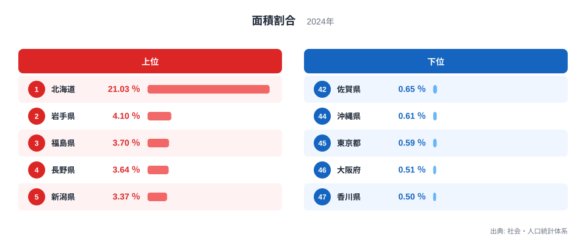

## 北海道だけで集計対象面積の21.03％を占めます

2024年度の集計対象面積に占める都道府県別の割合を見ると、北海道が21.03％で最多です。岩手県は4.10％、福島県は3.70％で、北海道と岩手県の差は16.93ポイントです。最少は香川県の0.50％です。

面積そのもので比べると、北海道は78,419.21平方キロメートル、香川県は1,876.86平方キロメートルで、約42倍の差があります。同じ都道府県という行政単位でも、管轄する土地の広がりは大きく異なります。この記事では、その広さの中身が何でできているのかを、可住地面積と人口密度のデータで確かめます。

> [!NOTE]
> この面積割合は、総務省統計局「社会・人口統計体系」の指標コード#B01101（総面積〈北方地域及び竹島を除く〉／全国総面積）です。北方地域は歯舞群島・色丹島・国後島・択捉島を指し、これらと竹島を除いた面積が分子と分母の両方に使われます。総面積には湖沼の面積も含まれます。人が住める土地の割合を示す指標ではありません。

## 北海道の突出が、特に目立つランキングです

<source-link href="/ranking/area-ratio-of-total">面積割合ランキングをもっと見る</source-link>

図は2024年度の面積割合の上位5と下位5です。上位5道県は、北海道21.03％、岩手県4.10％、福島県3.70％、長野県3.64％、新潟県3.37％です。北海道だけが20％を超え、岩手県以下は3〜4％台に集まります。

北海道の面積は、2位の岩手県の約5.1倍です。岩手県から福島県、長野県、新潟県、秋田県、岐阜県までの6県を足し合わせても、合計は77,463.48平方キロメートルで、北海道1道の78,419.21平方キロメートルにわずかに届きません。6位の秋田県は3.12％、7位の岐阜県は2.85％で、2位から7位までは東北3県（岩手県・福島県・秋田県）と中部3県（長野県・新潟県・岐阜県）が占めます。

下位側は、香川県0.50％、大阪府0.51％、東京都0.59％、沖縄県0.61％の順に小さくなります。面積では香川県が1,876.86平方キロメートルで全国最小、大阪府が1,905.34平方キロメートルで次に小さくなります。

割合は小数第2位までの表示なので、面積が違っても同じ値で並ぶ県があります。42位は、どちらも0.65％の神奈川県と佐賀県の同率で、図には佐賀県だけが載るため、図の順位は42位の次が44位に飛びます。佐賀県は2,440.64平方キロメートル、神奈川県は2,416.55平方キロメートルで、佐賀県がわずかに広くなります。表示値が同じ県どうしの順位の前後は、面積の大小を表すとは限りません。

広さが生まれた歴史や地形の理由は、この記事のデータでは確かめられないため扱いません。次の章で、データで確かめられる範囲の広さの中身を見ます。

## 広さの中身を、可住地面積と人口密度で確かめます

「広い県ほど使える土地も多い」と考えたくなりますが、総面積には林野や湖沼の面積も含まれます。e-Statの項目定義では、可住地面積は総面積から林野面積と主要湖沼面積を差し引いた面積で、可住地面積割合はこの可住地面積を総面積で割った値です。

面積上位7道県の2024年度の可住地面積割合は、北海道28.9％、岩手県24.6％、福島県30.7％、長野県24.0％、新潟県36.2％、秋田県27.8％、岐阜県20.8％で、7道県すべてが4割に届きません。ただし4割に届かない県は47都道府県のうち32あり、それだけでは珍しくありません。47都道府県の中央値は33.0％で、新潟県を除く6道県はこれを下回り、可住地面積割合の順位は28位から45位です。新潟県は17位です。岐阜県は総面積7位ですが、可住地面積割合は45位で、長野県も41位です。

一方、面積下位の都府県は、可住地が大きな割合を占めます。大阪府の可住地面積割合は70.0％で全国1位、東京都は64.9％で4位、神奈川県は61.0％で6位です。

可住地の絶対的な広さでは、総面積が上位5位以内の北海道、新潟県、福島県の3道県が、可住地面積の上位3位を占めます。可住地面積は、北海道が22,690.76平方キロメートル、新潟県が4,549.88平方キロメートル、福島県が4,230.98平方キロメートルです。ただし、茨城県は総面積では24位ですが、可住地面積は3,889.67平方キロメートルで4位に入ります。広さの順位と可住地の順位は、必ずしも一致しません。

人口密度では、広い県の人口のまばらさがはっきり出ます。2024年の総面積1平方キロメートルあたり人口は、北海道が64.3人で47位、岩手県が75.0人で46位、秋田県が77.1人で45位です。面積上位7道県は、人口密度がいずれも30位以下で、福島県は126.4人、長野県は146.5人、新潟県は166.8人、岐阜県は180.4人です。

面積の小さい都府県では、東京都が6,444.7人で1位、大阪府が4,596.0人で2位、神奈川県が3,817.4人で3位です。ただし、面積最少の香川県は488.6人で11位にとどまります。広さは土地の大きさを表し、人口密度は人の集まり方を表すため、二つは別々の問いです。面積上位の道県で人口がまばらなことは確かめられますが、このデータだけでは、道路や学校、医療の維持にかかる行政コストや、移動時間の差までは分かりません。

あわせて見る: [可住地面積割合ランキング](/ranking/habitable-area-ratio) / [総面積1km2当たり人口密度ランキング](/ranking/population-density-per-km2-total-area)

## 約42倍の差を、どう読むか

2024年度の集計対象面積に占める割合は、北海道21.03％から香川県0.50％まで約42倍の差がありました。北海道は集計対象面積の5分の1を超え、2位の岩手県とも約5.1倍離れています。

広さの中身を見ると、面積上位7道県のうち新潟県を除く6道県は可住地面積割合が中央値を下回り、7道県の人口密度はすべて30位以下でした。面積の順位だけでは、人が暮らせる土地の大きさや、人口の集まり方は分かりません。面積割合だけでなく、可住地面積割合と人口密度を重ねて読むと、広さの意味が県ごとに違って見えます。

最多の[北海道のデータブック](/areas/01000)と最少の[香川県のデータブック](/areas/37000)では、人口や産業、土地に関する指標も見比べられます。全県の割合は[面積割合ランキング](/ranking/area-ratio-of-total)、地理・気象の関連統計は[国土・気象カテゴリ](/category/landweather)から確認できます。

## データについて

図と割合は、2024年度の面積割合（#B01101）です。平方キロメートルで書いた面積は、同じ2024年度の総面積（北方地域及び竹島を除く）と可住地面積の値で、元の単位のヘクタールを100で割って換算しています。47都道府県の総面積を合計すると372,972.39平方キロメートルで、北海道の面積をこの合計で割ると、図の21.03％に一致します。

e-Statの項目定義では、総面積の時点は10月1日で、国勢調査の年は国勢調査の面積、それ以外の年は全国都道府県市区町村別面積調の面積を使うと説明されています。2024年は国勢調査の年ではないため、図の2024年度の面積は、2024年10月1日時点の面積調の値です。人口密度に使う総人口の時点も10月1日です。

同じ項目定義には、2014年（平成26年）の面積調から面積の測定方法が変わったとあります。この記事は2024年の1年分だけを扱い、年次の比較はしていません。人口密度は暦年表記の2024年、面積・可住地面積・面積割合は年度表記の2024年度の指標で、どちらも2024年の値です。

- [総務省統計局「社会・人口統計体系」自然環境 指標計算式](https://www.e-stat.go.jp/koumoku/sihyo_keisansiki/B)（面積割合と可住地面積割合の算式）
- [総務省統計局「社会・人口統計体系」人口・世帯 指標計算式](https://www.e-stat.go.jp/koumoku/sihyo_keisansiki/A)（総面積1k㎡当たり人口密度の算式）
- [政府統計の総合窓口「自然環境 項目定義」](https://www.e-stat.go.jp/koumoku/koumoku_teigi/B)（総面積・可住地面積の定義、時点、測定方法の変更）
- [政府統計の総合窓口「人口・世帯 項目定義」](https://www.e-stat.go.jp/koumoku/koumoku_teigi/A)（総人口の時点）
