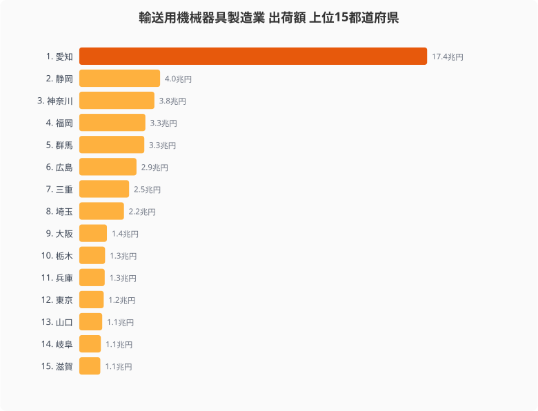
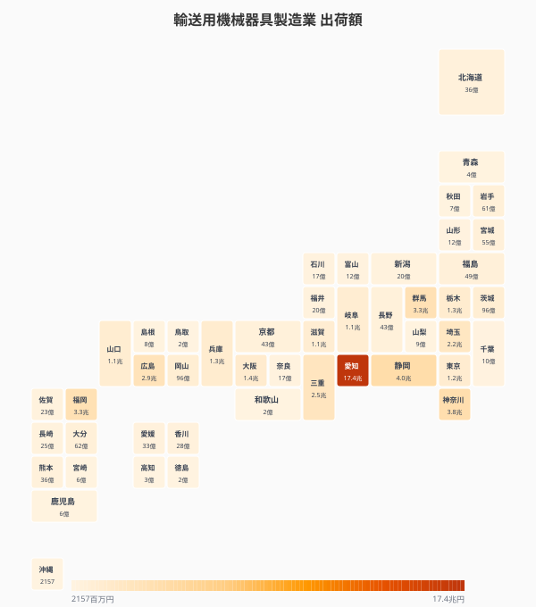
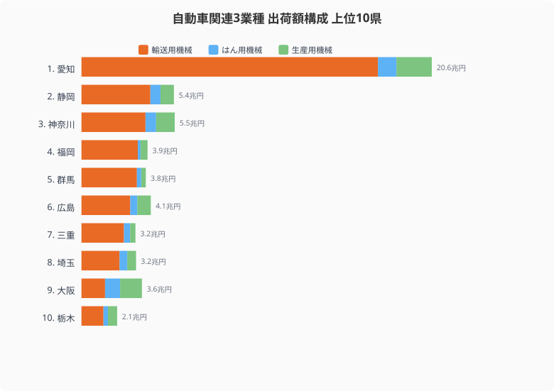
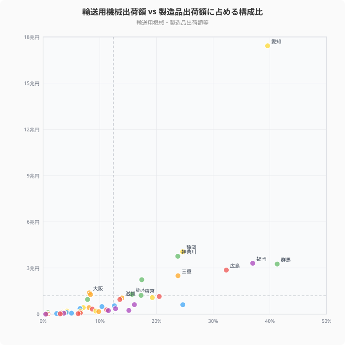
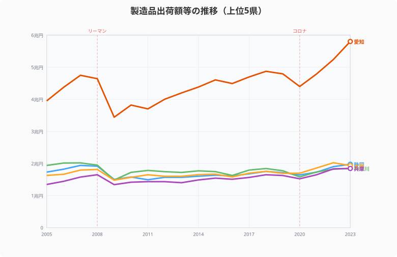

日本の自動車産業は、完成車メーカーを頂点に数万社の部品サプライヤーが連なるピラミッド構造を形成しています。その地理的な集積パターンは、都道府県の産業構造を大きく左右します。輸送用機械器具製造業の出荷額データから、自動車産業の「県別勢力図」を描き出します。

## 輸送用機械出荷額ランキング──愛知一極集中の実態

<data-source url="https://www.e-stat.go.jp/dbview?sid=0003448099" label="e-Stat 工業統計調査"></data-source>

輸送用機械器具製造業の出荷額は、愛知県が約17.4兆円で圧倒的な1位です。2位の静岡県（約4.0兆円）の4.3倍、3位の神奈川県（約3.8兆円）の4.6倍にのぼります。

愛知県にはトヨタ自動車の本社と主力工場が立地し、周辺にはデンソー、アイシン、豊田自動織機など主要Tier1サプライヤーが集中しています。この「トヨタ城下町」の経済規模が、2位以下を大きく引き離す数字に表れています。

4位の福岡県（約3.3兆円）にはトヨタ九州や日産自動車九州が立地し、九州の自動車生産拠点として存在感があります。5位の群馬県（約3.3兆円）はSUBARUの本拠地です。6位の広島県（約2.9兆円）はマツダの本社を擁しています。

<source-link href="/ranking/shipment-value-manufacturing-20">47都道府県の輸送用機械器具製造業 出荷額ランキングをもっと見る</source-link>

## 全国マップ──中部から北関東へ延びるサプライチェーンの「背骨」

<data-source url="https://www.e-stat.go.jp/dbview?sid=0003448099" label="e-Stat 工業統計調査"></data-source>

タイルグリッドマップを見ると、愛知県が突出して濃い色で際立ちます。その周辺に静岡県・三重県・岐阜県が続き、東海地方の産業集積がはっきりと浮かび上がります。

注目すべきは、愛知から北東方向へ延びる濃い色のラインです。静岡→神奈川→群馬→栃木→福島という経路で、自動車部品のサプライチェーンが「背骨」のように連なっています。これは高速道路網（東名・新東名・関越・東北道）に沿った物流経路と一致します。

一方、四国・山陰・東北北部・沖縄は淡い色が広がり、自動車産業の集積が薄い地域です。ただし岩手県は製造品出荷額に占める輸送用機械の構成比が24.6%と高く、トヨタ東日本（旧関東自動車工業）の進出による影響が見て取れます。

> [!TIP]
> 自動車産業の地図は「完成車工場の場所」だけでは読めません。1台の車に数万点の部品が使われるため、本当の集積は Tier1・Tier2 のサプライヤーがどこに連なるかで決まります。出荷額のラインが高速道路網と重なるのは、ジャストインタイム生産が物流距離に強く依存するためです。

<ad-slot></ad-slot>

## 自動車関連3業種で見る産業の厚み

<data-source url="https://www.e-stat.go.jp/dbview?sid=0003448099" label="e-Stat 工業統計調査"></data-source>

自動車産業は完成車だけではありません。エンジン部品やプレス金型を含むはん用機械、工作機械を含む生産用機械も自動車産業と深く関わります。この3業種を合算すると、産業の「厚み」がより鮮明になります。

愛知県は輸送用機械17.4兆円に加え、はん用機械約1.1兆円、生産用機械約2.1兆円を合わせて約20.6兆円です。2位の神奈川県（約5.5兆円）や3位の静岡県（約5.4兆円）の約3.8倍です。

広島県は輸送用機械が約2.9兆円ですが、はん用・生産用機械を加えると約4.1兆円に膨らみます。マツダの完成車工場に加え、部品加工や工作機械の裾野産業が広がっていることを示しています。

<source-link href="/ranking/shipment-value-manufacturing-14">47都道府県のはん用機械器具製造業 出荷額ランキングをもっと見る</source-link>
<source-link href="/ranking/shipment-value-manufacturing-15">47都道府県の生産用機械器具製造業 出荷額ランキングをもっと見る</source-link>

## 「自動車依存度」散布図──出荷額の40%が輸送用機械の県

<data-source url="https://www.e-stat.go.jp/dbview?sid=0003448099" label="e-Stat 工業統計調査"></data-source>

横軸に輸送用機械の構成比（製造品出荷額全体に占める割合）、縦軸に輸送用機械の出荷額をとると、「自動車依存度」が浮かび上がります。

右上に位置する愛知県は構成比39.6%・出荷額17.4兆円で、まさに自動車産業の一極集中を象徴しています。構成比でみると群馬県が41.3%で最も高く、製造品出荷額の4割以上がSUBARUを中心とする輸送用機械で占められています。

福岡県（37.0%）、広島県（32.3%）、岩手県（24.6%）、静岡県（24.6%）、三重県（23.8%）も構成比20%を超えます。これらの県はEV化による部品需要の変化が地域経済に直接影響するリスクを抱えています。

内燃機関車に必要な部品点数は約3万点といわれますが、EVでは約1万点に減少します。エンジン、トランスミッション、排気系統など内燃機関特有の部品がまるごと不要になるためです。構成比の高い県ほど、この構造変化の影響を強く受ける可能性があります。

> [!WARNING]
> 「構成比が高い＝EVで衰退」と単純に読むのは早計です。エンジン部品メーカーがモーター・インバーター・電池部材へ業態転換できれば、集積はむしろ強みになります。構成比は「変化にさらされる度合い」であって「衰退の予言」ではありません。転換に成功するかどうかが、地域経済の分かれ目になります。

<ad-slot></ad-slot>

## 製造品出荷額の推移──リーマンとコロナで見る変動パターン

<data-source url="https://www.e-stat.go.jp/dbview?sid=0000010103" label="e-Stat 社会・人口統計体系"></data-source>

> [!NOTE]
> このチャートは輸送用機械の業種別時系列データが利用できないため、製造品出荷額全体（全業種合計）の推移を示しています。愛知県の製造品出荷額は輸送用機械の構成比が約40%であるため、自動車産業の動向を反映しやすい傾向があります。

上位5県の製造品出荷額の推移を見ると、愛知県の振幅の大きさが際立ちます。2008年のリーマンショック後、愛知県は約46兆円から約34兆円へと12兆円もの急落を経験しました。同時期の他県の落ち込みが3〜5兆円程度だったことと比較すると、自動車産業への依存度の高さがリスクとして顕在化した格好です。

2020年のコロナ禍でも愛知県は約48兆円から約44兆円へ減少しましたが、リーマン時ほどの急落には至りませんでした。その後は半導体不足を乗り越え、2023年には過去最高の約58兆円に達しています。

静岡県・大阪府・神奈川県・兵庫県はほぼ横並びで推移しており、2023年時点で18〜20兆円の範囲に収まっています。愛知県だけが他県の3倍近い水準にある構図は、2005年以降一貫して変わっていません。

<source-link href="/ranking/manufacturing-shipment-amount">47都道府県の製造品出荷額等ランキングをもっと見る</source-link>

## まとめ

輸送用機械出荷額と関連3業種のデータから、日本の自動車産業の地理的集積パターンと構造的リスクを整理します。

- **愛知一極集中**：輸送用機械17.4兆円で2位静岡4.0兆円の4.3倍。関連3業種では約20.6兆円に達する。
- **サプライチェーンの背骨**：愛知から静岡→神奈川→群馬→栃木→福島へ、高速道路網に沿って集積が連なる。
- **EV依存リスク**：群馬41.3%・愛知39.6%など構成比の高い県は、部品点数3万→1万の変化にさらされる。
- **変動の振幅**：愛知はリーマンで12兆円急落、コロナを経て2023年に過去最高58兆円。依存度の高さが振幅に表れる。

EV化は「部品点数の削減」というかたちで、サプライチェーンの地理的再編を促す可能性があります。エンジン関連部品を製造する中小企業が集積する愛知・静岡・群馬などでは、既存の技術基盤をEV向けにどう転換するかが地域経済の将来を左右します。一方、電池・モーター・パワー半導体といったEV固有の部品は、従来の自動車産業集積地とは異なる立地パターンで発展する可能性もあります。自動車依存度の高い県ほど、この構造変化への対応力が問われることになります。製造業全体の中での位置づけは[愛知58兆円一強の製造業地図](/blog/manufacturing-aichi-dominance)、付加価値で見た「稼ぐ力」は[製造業の稼ぐ力ランキング](/blog/manufacturing-productivity)、EV周辺の[半導体・電子部品の製造地図](/blog/semiconductor-electronics-regional-map)と合わせて読むと、産業構造の全体像が見えてきます。

## データ出典

- 経済産業省「工業統計調査」/ e-Stat（輸送用機械器具・はん用機械・生産用機械の製造品出荷額、統計表 ID: 0003448099）
- e-Stat 社会・人口統計体系（製造品出荷額等の時系列、ID: 0000010103）
