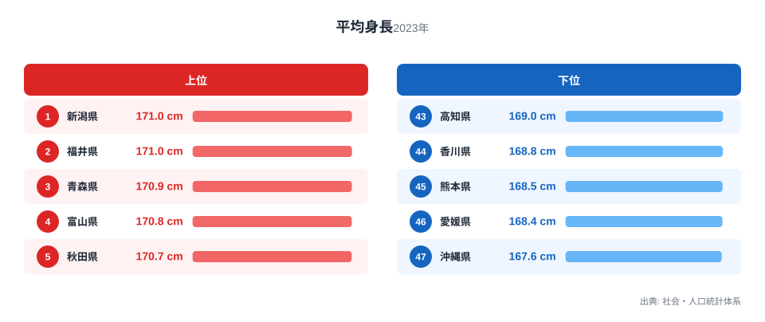
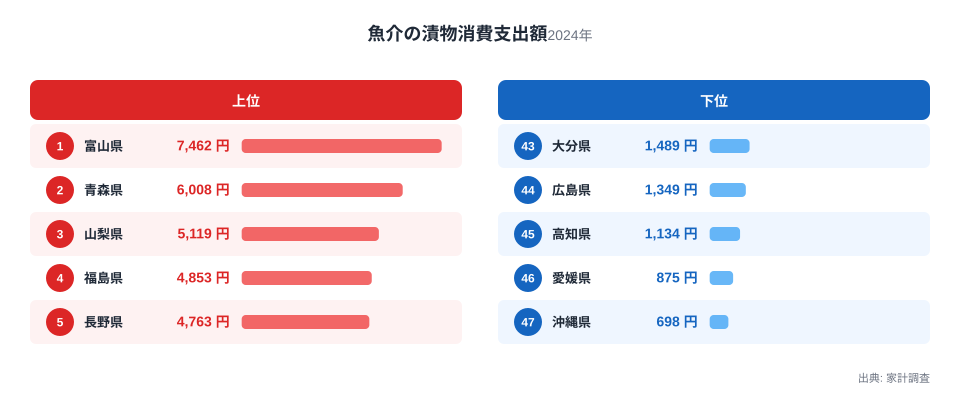

新潟県の高校2年生男子の平均身長は171cmで全国1位です。同じ新潟県は、魚介の漬物への消費支出額でも全国7位に入っています。もう一つの1位である福井県も、魚介の漬物では26位とやや順位を下げるものの、全国平均を上回る水準にあります。この2つの指標を並べたとき、身長の高い県ほど魚介の漬物をよく買う傾向があるように見えます。ですが、この見え方をそのまま「魚介の漬物を食べると背が伸びる」という話にしてしまうのは早計です。この記事では、平均身長と魚介の漬物消費支出額という一見結びつかない2つの統計を都道府県別に照らし合わせ、見かけの相関の背後に何があるのかを探ります。

平均身長は社会・人口統計体系による2023年のデータで、単位はcmです。魚介の漬物消費支出額は家計調査による2024年のデータで、単位は円です。集計年がそろっていない点はあらかじめ押さえておく必要がありますが、都道府県ごとの「順位の傾向」を見る目的では、この1年のずれが結論を大きく左右することはありません。

## 平均身長は北陸・東北で高く、九州・沖縄で低い

<source-link href="/ranking/avg-height-high-school-2nd-male">平均身長ランキングをもっと見る</source-link>

平均身長の上位は新潟県と福井県が171cmで並び、3位は青森県の170.9cmです。4位が富山県の170.8cm、5位が秋田県の170.7cmと続き、上位5県のうち4県が北陸か東北の県で占められています。一方で下位を見ると、47位は沖縄県の167.6cm、46位は愛媛県の168.4cm、45位は熊本県の168.5cmとなっており、九州や四国の県が並びます。

この地域差は、遺伝的な要因だけで説明できるものではありません。身長は栄養状態や成育期の生活環境の影響を強く受ける指標であり、同じ日本国内でも数十年単位の食生活の違いが積み重なって、こうした地域差として現れていると考えられます。北陸や東北の県では、伝統的に魚介類をよく食べる食文化が根づいており、これが動物性たんぱく質の摂取量に影響してきた可能性があります。

もう一つ注目したいのは、上位・下位のどちらも特定の地方に偏っているという点です。全国均一にばらついているのではなく、北陸・東北という地理的なまとまりが上位に、南九州・沖縄という別のまとまりが下位に現れています。この地域的なまとまりの存在こそが、次に見る魚介の漬物消費との関係を考える手がかりになります。

## 魚介の漬物消費支出額も北陸・東北に集中する

魚介の漬物消費支出額のランキングを見ると、1位は富山県の7,462円で、2位の青森県6,008円を大きく引き離しています。3位は山梨県の5,119円、4位は福島県の4,853円、5位は長野県の4,763円です。上位5県の顔ぶれは平均身長の上位5県と完全には一致しませんが、富山県と青森県が両方の指標で上位に入っている点は目を引きます。

下位に目を移すと、47位は沖縄県の698円、46位は愛媛県の875円、45位は高知県の1,134円となっており、こちらも平均身長の下位と重なる県が多く見られます。魚介の漬物は、いかの塩辛やこのわた、するめの粕漬けといった保存食を指すことが多く、寒冷な地域で魚介類を長期保存するために発達した食文化と関係が深いと考えられます。北陸や東北、甲信越には冬の保存食文化が根強く残っており、これが消費支出額の高さにつながっているのでしょう。

沖縄県や南九州の県で消費支出額が低いのは、こうした保存食文化そのものが根づいていない、あるいは代替する別の保存食文化があるためだと考えられます。気候が温暖で漁業の形態も異なるため、魚介の漬物という特定の加工食品への支出が北陸・東北ほど大きくならないのは自然なことです。

## 2つの指標の関係を散布図で確認する

47都道府県の平均身長と魚介の漬物消費支出額を1つの散布図に重ねると、右上がりの傾向、つまり魚介の漬物消費支出額が高い県ほど平均身長も高くなる傾向がみられます。新潟県や富山県、青森県、秋田県といった北陸・東北の県は、散布図の右上に集まる形で位置しています。逆に沖縄県や愛媛県、高知県といった南九州・四国の県は、左下に位置する傾向があります。

ただし、この散布図から読み取れるのは、あくまで「見かけの相関」です。魚介の漬物を多く食べているから身長が高くなる、という直接の因果関係を示すものではありません。むしろ両方の指標が「北陸・東北という地理的なまとまり」という共通の背景を持っているために、似た分布を示していると考えるのが自然です。北陸・東北は積雪の多い地域が多く、冬季の食生活が独特であることに加え、戦後の栄養改善策や学校給食の普及の度合いにも地域差があった可能性があります。これらの要因が身長にも魚介の漬物消費にも同時に影響していれば、直接の因果関係がなくても両者は似た地域パターンを描くことになります。

もう一つ考えられるのは、魚介の漬物消費支出額そのものが「魚介類全体の消費量の多さ」を映す代理指標になっている可能性です。魚介の漬物をよく買う県は、生の魚介類やその他の魚介加工品も同時によく食べている可能性が高く、身長との関連があるとすれば、漬物そのものというより魚介類全般の摂取量が背景にあるのかもしれません。この点は今回のデータだけでは検証できず、今後の課題として残ります。

> [!NOTE]
> 「魚介の漬物」は家計調査における品目分類の名称で、いかの塩辛やこのわた、するめの粕漬けなど、魚介類を塩や酒粕、麹などで漬け込んだ加工食品全般を指します。単一の商品ではなく複数の品目をまとめた分類である点に注意してください。

> [!WARNING]
> 平均身長は2023年、魚介の漬物消費支出額は2024年と集計年が異なります。また平均身長は高校2年生男子という特定の年齢・性別の集団を対象にした値であり、都道府県の住民全体の身長を表すものではありません。異なる集団・異なる年のデータを重ねて見ている点を踏まえた上で傾向を読み取ってください。

> [!TIP]
> 散布図で右上や左下に集まる県が多いときは、2つの指標に直接の因果関係があるとは限らず、地域や気候といった共通の背景要因が働いていることが多くあります。相関が見えたら、まず「両方に影響しそうな第三の要因」がないかを考えると読み違いを防げます。

## 地域のまとまりが示す食文化と体格の関係

ここまで見てきたように、平均身長と魚介の漬物消費支出額はどちらも北陸・東北で高く、南九州・四国・沖縄で低いという共通の地域パターンを持っています。これは偶然の一致というより、両者が「地理・気候に根ざした食文化の違い」という共通の土台の上に成り立っていることを示唆しています。

北陸・東北は冬の寒さが厳しく、古くから魚介類を保存食に加工する文化が発達してきました。この地域では魚介類全般の摂取量が多く、それが結果として動物性たんぱく質の豊富な食生活につながり、身長にも一定の影響を与えてきた可能性があります。一方で、温暖な気候の南九州や沖縄では、保存食としての漬物文化への依存度が低く、食生活の構成そのものが異なります。

こうした食文化の違いは、[魚介の漬物消費支出額ランキング](/ranking/fish-pickled-consumption-expenditure)から都道府県別の詳しい数値を確認することができます。また、身長や体格に関連する指標をさらに掘り下げたい場合は、[同じカテゴリの統計一覧](/category/educationsports)から関連するランキングをたどることもできます。今回の分析で上位に並んだ[新潟県のデータ](/areas/15000)と[福井県のデータ](/areas/18000)を個別に見ると、それぞれの県が持つ他の統計指標との関係もあわせて確認できます。

## まとめ

- 平均身長の1位は新潟県と福井県で171cm、最下位は沖縄県で167.6cmです。
- 魚介の漬物消費支出額の1位は富山県で7,462円、最下位は沖縄県で698円です。
- 両指標の上位はいずれも北陸・東北の県に集中し、下位は南九州・四国・沖縄に集中しています。
- 散布図では右上がりの傾向がみられますが、これは魚介の漬物と身長の直接の因果関係ではなく、地理・気候に根ざした共通の食文化的背景を反映していると考えられます。
- 集計年や対象集団が異なる点を踏まえた上で、傾向として読み取ることが重要です。

## データ出典

平均身長は社会・人口統計体系（2023年）によるデータです。魚介の漬物消費支出額は家計調査（2024年）によるデータです。
