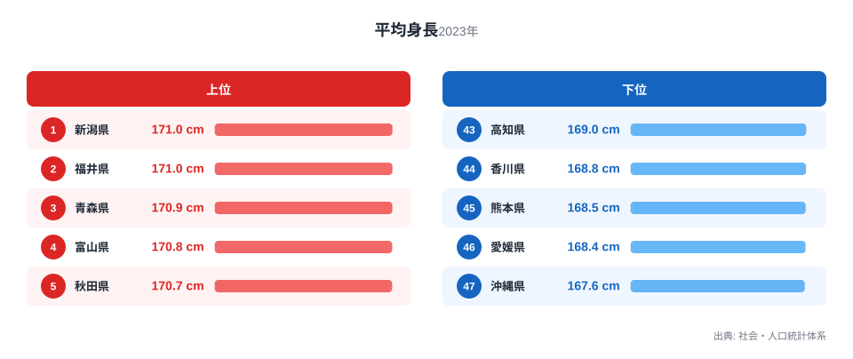
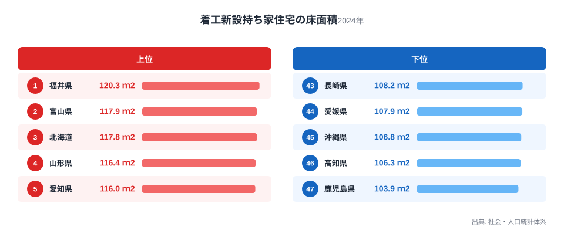

「背が高い県ほど家も広いのでは」という噂を耳にしたことはないでしょうか。都道府県別の平均身長と、新しく着工された持ち家住宅の床面積を並べてみると、たしかに似た顔ぶれが上位と下位に並びます。ですが、身長と住宅の広さの間に直接の結びつきがあるとは考えにくく、両方の数字を動かしている別の要因があると見るのが自然です。この記事では2023年の高校2年生男子の平均身長と、2024年の着工新設持ち家住宅の床面積という2つの都道府県ランキングを重ね、見かけの相関と、その背後にある真因を切り分けて考えます。以下では上位と下位の顔ぶれを見比べながら、両者がどこまで重なり、どこで食い違うのかを順番に確認していきます。

## 平均身長の上位と下位に見える地域差

<source-link href="/ranking/avg-height-high-school-2nd-male">平均身長ランキングをもっと見る</source-link>

> [!NOTE]
> 平均身長は高校2年生男子を対象にした調査による値です。着工新設持ち家住宅の床面積は、その年に着工された持ち家の平均値であり、既存の住宅ストック全体の平均ではありません。年によって着工件数の構成が変わるため、単年の数字であることを念頭に読んでください。

2023年の調査では、高校2年生男子の平均身長がもっとも高いのは新潟県と福井県で、ともに171cmに達しています。3位の青森県から10位の千葉県までは170.4cmから170.9cmの範囲に集まっており、上位20県ほどは170.1cmから171cmという狭い幅にひしめいています。上位には北陸や東北に加えて、神奈川県や千葉県のような関東の都市部も入っており、単純に地方の県だけが高いというわけではありません。

下位に目を向けると、47位の沖縄県が167.6cmでもっとも低く、46位の愛媛県、45位の熊本県、44位の香川県、43位の高知県と、九州や四国の県が並んでいます。上位と下位の差は3.4cmで、都道府県によって高校2年生男子の平均身長がはっきりと分かれていることがわかります。

## 着工新設持ち家住宅の床面積で見る都道府県の差

2024年の着工新設持ち家住宅の床面積を見ると、1位は福井県の120.3平方メートルで、2位の富山県117.9平方メートル、3位の北海道117.8平方メートルと続きます。4位の山形県116.4平方メートル、5位の愛知県116平方メートルもこれに近い水準です。福井県と富山県は北陸で、雪の多い地域では敷地に余裕のある持ち家が多い傾向がうかがえます。北海道も広い土地を背景に、床面積の大きな持ち家が新築される傾向にあります。

下位を見ると、47位の鹿児島県が103.9平方メートルでもっとも小さく、46位の高知県、45位の沖縄県、44位の愛媛県、43位の長崎県と、九州・四国・沖縄の県が並んでいます。上位と下位の差は16.4平方メートルで、床面積のランキングでも雪国や北の地域が広く、九州・四国・沖縄が狭いという傾向が見て取れます。

上位には5位の愛知県や8位の東京都のように、地価の高い都市部の県も入っている点が目を引きます。これは持ち家の平均ではなく、その年に着工された新築の持ち家だけを対象にした数字だからと考えられます。都市部で新たに持ち家を建てる世帯は、注文住宅などまとまった予算をかけられる層に偏りやすく、結果として床面積が大きくなりやすいのです。雪国の広い敷地とは異なる理由で、都市部の一部でも床面積の順位が上がっていると見られます。

## 身長と床面積は本当に関係しているのか

2つのランキングを見比べると、平均身長の上位10県のうち福井県、富山県、青森県、山形県、宮城県の5県は、床面積でも上位10県に入っています。逆に、平均身長の下位10県のうち長崎県、宮崎県、島根県、高知県、熊本県、愛媛県、沖縄県の7県は、床面積でも下位10県に含まれています。散布図で確認すると、右上と左下に多くの県が集まっており、平均身長が高い県ほど床面積も広いという緩やかな傾向が見えてきます。相関係数を計算すると約0.66となり、統計的には中程度からやや強い正の相関にあたります。

ただし、この傾向がそのまま当てはまらない県も少なくありません。平均身長が5位の秋田県は床面積では32位にとどまり、逆に平均身長が31位の鹿児島県は床面積で47位ともっとも低い順位です。平均身長で1位の新潟県も、床面積では21位と中位にとどまっており、身長の順位がそのまま床面積の順位に反映されるわけではないことがわかります。上位と下位でおおまかな重なりはあっても、県ごとに見ればずれが目立つ組み合わせも多く残っています。

> [!WARNING]
> 平均身長と床面積の間に緩やかな相関が見えても、身長が高いから家が広くなる、あるいは家が広いから身長が高くなるという因果関係を示すものではありません。両方の数字が似た方向に動く背景には、気候や土地の条件など別の要因が隠れている可能性があります。相関だけを見て一方が他方の原因だと決めつけないよう注意してください。

## 見えてくる真因、気候と土地の余裕

身長と床面積がともに上位に並ぶ新潟県、福井県、富山県、青森県、山形県、宮城県といった県には、日本海側や東北で積雪が多く、都市部に比べて土地の価格が抑えられているという共通点があります。土地に余裕があるほど、持ち家を新築する際に床面積を広く取りやすくなると考えられ、これは床面積の順位を押し上げる直接的な要因といえます。

一方で、身長の高さは遺伝や幼少期からの栄養状態、気候による生活習慣など、住宅事情とは別の要因で決まると考えるのが自然です。北陸や東北で身長が高い県が多いのは、こうした地域固有の食生活や体格の傾向が積み重なった結果と考えられ、床面積の広さそのものが身長を伸ばしているわけではありません。身長と床面積が似た地域で高くなっているのは、気候や地理条件という共通の背景を通じて、たまたま同じ方向に動いた結果と見るほうが妥当です。実際、都道府県の人口規模を統計的に制御した偏相関係数を計算しても約0.65とほとんど下がらず、人口の大小が生み出す見かけの相関ではないことがうかがえます。逆に言えば、床面積を広げれば身長が伸びるわけでも、身長の高い人が集まれば家が広くなるわけでもありません。

さらに言えば、床面積には持ち家を選ぶ世帯の年齢構成や、二世帯・三世帯で暮らす慣習の有無といった暮らし方の違いも関わっていると考えられます。身長には出生時からの栄養状態や成長期の生活環境が積み重なって影響するため、両者を動かしている時間の長さも仕組みもまったく異なります。同じ地域に住んでいるという共通点はあっても、床面積と身長を結びつける直接の経路は見当たらず、それぞれ別の理由で高い順位についていると考えるのが妥当です。

> [!TIP]
> ランキングの順位だけでなく散布図の位置も確認すると、傾向に沿う県と外れる県を見分けやすくなります。秋田県や鹿児島県のように、身長と床面積の順位が大きくかい離する県こそ、地域固有の事情を読み解く手がかりになります。

## あわせて確認できる関連データ

この記事で扱った着工新設持ち家住宅の床面積は、[着工新設持ち家住宅の床面積ランキング](/ranking/floor-area-new-owner-dwelling)で全47都道府県の順位を確認できます。平均身長は教育・スポーツ分野の統計に分類されており、同じ分野の統計をまとめて見たい場合は[同じカテゴリの統計一覧](/category/educationsports)が参考になります。今回上位に並んだ[新潟県のデータ](/areas/15000)や[福井県のデータ](/areas/18000)では、身長以外の統計もあわせて確認できます。

## まとめ

- 平均身長は新潟県と福井県がともに171cmで1位、沖縄県が167.6cmで47位、その差は3.4cmです。
- 着工新設持ち家住宅の床面積は福井県が120.3平方メートルで1位、鹿児島県が103.9平方メートルで47位、その差は16.4平方メートルです。
- 平均身長と床面積の上位10県では5県、下位10県では7県が重なり、緩やかな相関が見られます。
- 秋田県や鹿児島県のように、身長と床面積の順位が大きく食い違う県もあり、相関がそのまま因果関係を意味するわけではありません。
- 床面積の高さは土地の余裕や新築世帯の層に、身長の高さは栄養や成長環境に、それぞれ別の理由で結びついていると考えられます。

## データ出典

- 平均身長: 社会・人口統計体系（2023年）
- 着工新設持ち家住宅の床面積: 社会・人口統計体系（2024年）
