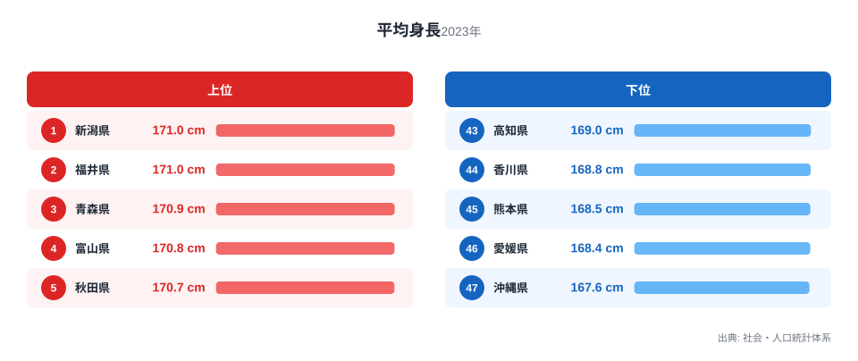
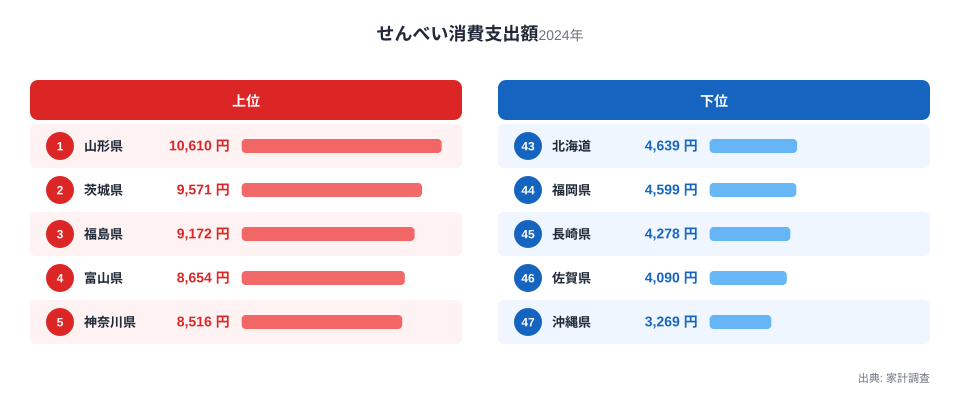

日本地図を思い浮かべたとき、身長が高い県といえば東北や北陸を想像する人が多いのではないでしょうか。実は同じ地域に、もうひとつ意外な特徴があります。せんべいの消費支出額です。高校2年生男子の平均身長が高い県と、せんべいをよく買う県には、驚くほど重なりが見られます。ただし、せんべいを食べれば背が伸びるという単純な話ではありません。この記事では、2つの指標を重ねて見えてくる地域的な偏りと、その背後にある本当の理由を探ります。

## 平均身長でみる47都道府県の差

学校保健統計調査を基にした社会・人口統計体系の2023年データによると、高校2年生男子の平均身長が最も高いのは新潟県で171センチメートルです。福井県も同じく171センチメートルで2位につけています。3位は青森県の170.9センチメートル、4位は富山県の170.8センチメートル、5位は秋田県の170.7センチメートルと、上位には新潟県、福井県、青森県、富山県、秋田県という東北・北陸の県が並びます。6位以降も山形県、宮城県、神奈川県、石川県、千葉県と続き、上位10県のうち7県を東北・北陸勢が占めています。

一方、平均身長が最も低いのは沖縄県の167.6センチメートルです。46位は愛媛県の168.4センチメートル、45位は熊本県の168.5センチメートル、44位は香川県の168.8センチメートル、43位は高知県の169センチメートルとなっており、下位には九州・四国の県がまとまっています。42位の島根県、41位の福岡県、40位の宮崎県も加えると、下位10県のほとんどを九州・四国・沖縄の県が占める構図です。

<source-link href="/ranking/avg-height-high-school-2nd-male">平均身長ランキングをもっと見る</source-link>

上位5県と下位5県を並べたグラフを見ると、平均身長の地域差はそれほど大きくありません。1位の新潟県と47位の沖縄県の差は3.4センチメートルで、身長そのものの開きはコンマ数センチ単位の差が積み重なったものです。それでも上位には東北・北陸の県、下位には九州・沖縄の県がまとまって並ぶことから、地域による緩やかな傾向があることがうかがえます。

東京都は170.3センチメートルで13位、大阪府は170.1センチメートルで18位となっており、大都市圏は上位と下位のちょうど中間に位置しています。都市部だから高い、地方だから低いという単純な構図ではなく、東北・北陸と九州・沖縄という南北の地域差が主な軸になっていることが分かります。

> [!NOTE]
> ここでの平均身長は、高校2年生の男子生徒を対象にした調査に基づく数値です。成人男性全体の平均身長や、他の学年・女子生徒の平均身長とは異なる指標なので、県民全体の体格を表すものではない点に注意してください。

## せんべい消費支出額でみる47都道府県の差

家計調査による2024年のせんべい消費支出額を見ると、1位は山形県で1世帯あたり10,610円です。2位は茨城県の9,571円、3位は福島県の9,172円、4位は富山県の8,654円、5位は神奈川県の8,516円と続きます。6位以降も岐阜県、奈良県、福井県、埼玉県、石川県と続き、いずれも8,000円台の支出額が並びます。[せんべい消費支出額ランキング](/ranking/rice-cracker-consumption-expenditure)では、47都道府県すべての順位を確認できます。

下位を見ると、47位は沖縄県の3,269円で、46位は佐賀県の4,090円、45位は長崎県の4,278円、44位は福岡県の4,599円、43位は北海道の4,639円となっており、九州各県と沖縄県、そして北海道が低い側に集まっています。42位の熊本県、41位の宮崎県も4,000円台後半にとどまり、下位10県の多くを九州・沖縄が占めています。

最も消費額が多い山形県と最も少ない沖縄県の差は3倍を超えます。10,610円という金額を3,269円で割ると3.2倍以上になり、平均身長の地域差と比べてはるかに大きな開きがあります。せんべいは米を原料とする米菓であり、原料との結びつきが強い食品であることを踏まえると、米どころとされる地域で消費が多いのは自然な流れといえるでしょう。

上位に入った山形県、富山県、福井県、石川県はいずれも米の生産量が多い地域として知られています。せんべいの消費支出額と米の産地には重なりがあり、地元で収穫される米を使った米菓が日常的に食卓に上る食文化が根付いていると考えられます。

> [!TIP]
> 2つの指標を比べるときは、値の開き方の違いにも注目すると読み違いを防げます。平均身長は1位の新潟県と47位の沖縄県で3.4センチメートルの差にとどまる一方、せんべい消費支出額は1位の山形県が10,610円、47位の沖縄県が3,269円で3倍以上の開きがあります。同じ「地域差」という言葉でも、指標によってスケールがまったく異なることを意識してください。

## 散布図で見る2つの指標の関係

平均身長とせんべい消費支出額の順位を重ねてみると、上位10県のうち福井県、富山県、山形県、神奈川県、石川県の5県が両方の上位10位以内に入っています。下位10県には共通して沖縄県、愛媛県、熊本県、宮崎県、長崎県、福岡県の6県が入っており、散布図では右上と左下に点が集まる傾向が見て取れます。

ただし、すべての県がこの傾向に当てはまるわけではありません。平均身長で1位の新潟県は、せんべい消費支出額では22位の7,252円にとどまっており、身長が高いからといって必ずしもせんべいの消費が多いわけではないことが分かります。散布図の点が一直線に並んでいるわけではなく、ばらつきを伴った緩やかな重なりであることに注意してください。

北海道も対照的な例です。せんべい消費支出額は4,639円で43位と低い一方、平均身長は170.1センチメートルで15位と上位に入っています。地域によっては2つの指標が逆方向に動くこともあり、南北の地域差だけですべてを説明できるわけではありません。

> [!WARNING]
> 平均身長とせんべい消費支出額の順位に重なりが見られても、せんべいを多く食べることで身長が伸びる、あるいは身長が高いからせんべいを好むという意味ではありません。相関はあくまで見かけ上のものであり、米どころという地理的な条件など、両方の指標に影響する別の要因が背景にある可能性があります。相関と因果を混同しないよう注意してください。

## なぜ同じ地域に偏るのか

平均身長とせんべい消費支出額という一見無関係な2つの指標に地理的な重なりが生まれる背景には、両者に共通する別の要因が影響している可能性があります。せんべいの消費が多い山形県、富山県、福井県、石川県は、いずれも米どころとして知られる地域です。米菓であるせんべいは、地元で収穫される米を使った食文化として根付いてきた歴史があり、米の生産量が多い地域ほど消費支出額も高くなりやすいと考えられます。

一方で、平均身長の地域差については、栄養状態や生活環境、気候など複数の要因が長期にわたって積み重なった結果と考えられています。東北・北陸と九州・沖縄という南北の分布は、せんべいの消費傾向とは別の理由で生じている可能性が高く、両者が同じ地域で高い、あるいは低いからといって、直接の因果関係があるとは言えません。

つまり、平均身長とせんべい消費支出額が同じ地域で重なって見えるのは、米どころという地理的な条件が食文化に影響し、その地域がたまたま身長の高い県とも重なっているという、いわば偶然に近い一致である可能性があります。データの重なりを見つけたときほど、背後にある別の要因を疑う視点が欠かせません。米の生産量や気候、地域の食文化といった切り口から、それぞれの指標を個別に掘り下げることが、地域差の本当の理由に近づく手がかりになるでしょう。

## まとめとデータの読み方

ここまで見てきたように、平均身長とせんべい消費支出額には地域的な重なりが見られるものの、それは因果関係ではなく、米どころという共通の地理的条件が生み出した見かけ上の一致である可能性が高いといえます。[同じカテゴリの統計一覧](/category/educationsports)では、教育・スポーツに関連するほかの指標も確認できます。

平均身長で1位となった[新潟県のデータ](/areas/15000)や、2位の[福井県のデータ](/areas/18000)を見ると、それぞれの県がどのような特徴を持つ地域なのかをより詳しく知ることができます。2つの指標を単独で眺めるだけでなく、重なりと外れ値の両方に目を向けることで、統計データの読み方がより立体的になるはずです。

## データ出典

- 平均身長: 社会・人口統計体系（2023年）
- せんべい消費支出額: 家計調査（2024年）
