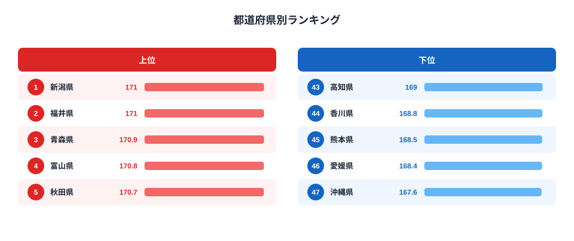

高校2年生の男子生徒が「同じ日本に住んでいるのに、なぜ県によって平均身長が違うのか」——文部科学省の学校保健統計調査をもとに都道府県別のデータを見ると、この問いへの答えが浮かび上がってきます。

2023年度のデータでは、1位の新潟県・福井県（171.0 cm）と最下位の沖縄県（167.6 cm）の差は **3.4 cm** にのぼります。「わずか3.4cmでは大した違いでは？」と思うかもしれませんが、成人男性の平均身長の地域差が1〜2cm程度であることを考えると、高校生段階でこれほどの差が生じている事実は注目に値します。

この記事では、2023年度の都道府県別ランキングを通じて、上位を占める北陸・東北と、下位に集中する四国・九州・沖縄のパターンを掘り下げます。単なる順位の紹介にとどまらず、「なぜその地域が上位（下位）なのか」という構造的な背景まで解説します。

## 上位5県と下位5県：北陸・東北 vs 四国・九州

2023年度の都道府県別高校2年生男子平均身長ランキングでは、上位には北陸・東北の県が目立ちます。

<source-link href="/ranking/avg-height-high-school-2nd-male">高校2年生男子の平均身長ランキング詳細を見る</source-link>

上位5県は以下のとおりです（2023年度）。

- **1位 新潟県**: 171.0 cm
- **1位 福井県**: 171.0 cm
- **3位 青森県**: 170.9 cm
- **4位 富山県**: 170.8 cm
- **5位 秋田県**: 170.7 cm

1位の新潟県と福井県が171.0 cmで並んでいるのが特徴的です。3位の青森県（170.9 cm）も東北を代表する高身長県として知られており、4位の富山県（170.8 cm）、5位の秋田県（170.7 cm）と合わせると、上位5県のうち4県が東北・北陸の日本海側に位置しています。

一方、下位5県は次のとおりです。

- **47位（最下位） 沖縄県**: 167.6 cm
- **46位 愛媛県**: 168.4 cm
- **45位 熊本県**: 168.5 cm
- **44位 香川県**: 168.8 cm
- **42位 島根県・高知県**: 169.0 cm

最下位の沖縄県（167.6 cm）は、1位の新潟県・福井県より3.4 cm低い数値です。46位の愛媛県（168.4 cm）、45位の熊本県（168.5 cm）、44位の香川県（168.8 cm）と、四国・九州の県が下位に固まっていることが分かります。

> [!NOTE]
> 本データは文部科学省「学校保健統計調査」（2023年度）に基づいています。身長の測定は毎年4〜6月に実施され、高校2年生（17歳）が対象です。都道府県別の平均値は公立・私立合算の在籍生徒全体を対象としており、学校ごとのサンプルサイズ差は平均値に反映されています。なお、本調査は年度ごとに実施されるため、複数年の比較をする際は調査方法の変更点にご注意ください。

## なぜ北陸・東北が高身長なのか

上位県が東北・北陸の日本海側に集中している背景には、いくつかの仮説が考えられます。

**食生活と栄養摂取の違い**が一つの要因として挙げられます。北陸・東北は米の産地として知られ、コメを中心とした豊富な食事文化が根付いています。また、日本海の豊富な魚介類（特にタンパク質と脂質を豊富に含む魚）が身近な食材として親しまれており、成長期に必要な栄養素を摂りやすい環境があります。

**寒冷な気候と体格の関係**も研究で指摘されています。寒い気候の地域では、体温を保つために体が大きくなりやすい傾向（ベルクマンの法則）が知られており、これが長期的な地域差として現れている可能性があります。

また、**乳製品の消費量**との相関も注目される点です。北陸・東北は酪農が盛んな北海道に隣接していることもあり、牛乳・乳製品の摂取が多い傾向にあります。カルシウムとビタミンDは骨格形成に直接関わるため、食習慣の差が身長に影響を与えている可能性があります。

> [!TIP]
> 身長には遺伝的要因が70〜80%寄与するとされていますが、残りの20〜30%は環境・食習慣・運動・睡眠などの後天的要因が影響します。都道府県別の差異は、この後天的要因の蓄積が世代をまたいで地域特性として現れたものと解釈できます。遺伝子プールの偏りというよりも、「その地域で続いてきた生活習慣」の差と考えるのが妥当でしょう。

## なぜ沖縄・四国・九州が下位なのか

最下位の沖縄県（167.6 cm）を中心に、四国・九州の県が下位に集中する背景にはどのような要因があるのでしょうか。

**沖縄県の特殊な食文化の変容**が大きな要因の一つです。沖縄の伝統的な食事は豚肉・海産物・豆腐・野菜を中心とした栄養バランスの優れたものでしたが、第二次世界大戦後にアメリカ文化の影響を強く受け、ファストフードや加工食品の普及が早まりました。炭水化物・脂質に偏りやすい食事への変化が、成長期の骨格形成に影響を与えた可能性が指摘されています。

**気候の影響**も見逃せません。沖縄をはじめとする南西諸島・九州南部は温暖な気候で、ベルクマンの法則に従えば体を小型化する方向に働きやすいとされます。この傾向は生物学的な視点から説明されるものであり、世代を経て緩やかに体格差に反映されると考えられています。

**四国の下位集中**については、島嶼部や山間部での食材・栄養摂取の多様性の問題も指摘されることがあります。愛媛県（168.4 cm、46位）、高知県（169.0 cm、42位）、香川県（168.8 cm、44位）と、四国4県のうち3県が下位40位以内に入っています。

> [!WARNING]
> 都道府県別の身長差を「遺伝的優劣」や「能力」と結びつける誤解が生じないよう注意が必要です。身長は遺伝・環境・栄養・睡眠など多因子が複雑に絡み合った結果であり、地域差はその土地の歴史・経済・食文化の蓄積を反映したものです。ランキング上位であることも下位であることも、そのまま健康上の優劣を意味しません。また、県内の個人差は地域差よりもはるかに大きく（標準偏差は約6〜7 cm）、「出身地で身長が決まる」わけでは決してありません。

## 全国の平均付近：関東・近畿が中間帯を形成

全47都道府県の中間層（20位〜30位台）を見ると、関東・近畿の主要都市圏が集中しています。

東京都は170.3 cm（11位）とやや高めですが、神奈川県は170.5 cm（7位）と首都圏でも上位にあります。大阪府は170.1 cm（15位）、京都府は169.9 cm（26位）と、大都市圏は中上位に位置しています。

興味深いのは、東北の中でも地域差があることです。秋田県（170.7 cm、5位）や青森県（170.9 cm、3位）が上位にある一方、岩手県は170.0 cm（21位）と中間帯にとどまっています。「東北=高身長」という単純な図式ではなく、各県の食文化・農業基盤・都市化の程度によって細かい差異が生じています。

長野県（169.7 cm、32位）が意外にも中下位にとどまっていることも注目点です。乳製品の消費が多いとされる長野県ですが、山間部の食環境の多様性や気候特性が複雑に影響している可能性があります。関連指標として[教育や体育の取り組みは教育スポーツカテゴリ](/category/educationsports)でも確認できます。

## まとめ：3.4cmの差が示す地域の食文化と環境

2023年度の高校2年生男子平均身長ランキングから分かることをまとめます。

- **1位は新潟県と福井県（171.0 cm）**。東北・北陸の日本海側に高身長県が集中している
- **最下位は沖縄県（167.6 cm）**で、1位との差は3.4 cm
- **上位クラスター**（北陸・東北）は栄養豊富な食文化・寒冷気候・乳製品摂取などが背景として挙げられる
- **下位クラスター**（四国・九州・沖縄）は食文化の変容や温暖気候の影響が考えられる
- 関東・近畿の主要都市圏は中上位の中間帯を形成している

身長の地域差はその土地の食文化・気候・生活習慣の長年の蓄積を映し出しています。単純に「どの県が高いか低いか」を比べるだけでなく、背景にある地域特性の違いに目を向けることで、日本の多様な生活文化への理解が深まります。

都道府県の体格・健康に関する他の統計として、[体育や教育に関する指標](/category/educationsports)や[新潟県のプロフィール](/areas/15000)、[沖縄県のプロフィール](/areas/47000)なども参照してみてください。また、[中学生の身長ランキング](/ranking/avg-height-middle-school-2nd-male)と比較すると、高校生段階でさらに地域差が広がるかどうかも確認できます。

## データ出典

本記事のデータは文部科学省「学校保健統計調査」（2023年度）をもとに、e-Stat（政府統計の総合窓口）経由で整備したものです。調査は毎年全国の学校（幼稚園〜高等学校）を対象に実施されており、身長・体重・視力・歯科などの健康状態を把握することを目的としています。

- 出典機関: 文部科学省
- 調査名: 学校保健統計調査
- 調査年度: 2023年度
- データ提供: e-Stat（[https://www.stat.go.jp/data/ssds/index.htm](https://www.stat.go.jp/data/ssds/index.htm)）
