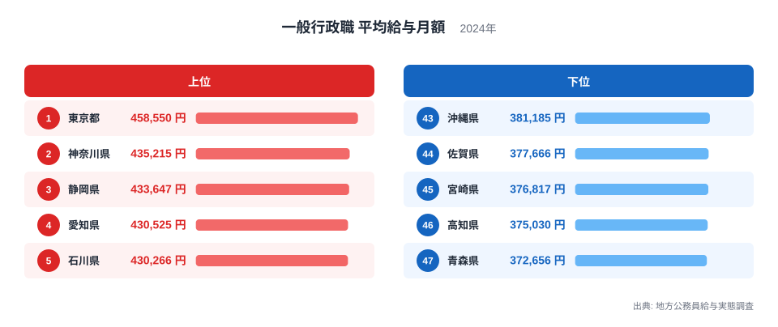
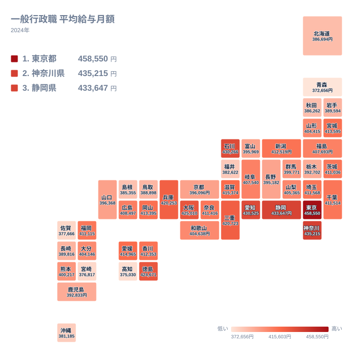

都道府県の一般行政職として働く職員の給与は、それぞれの都道府県が条例で定めています。国が一律に決めているわけではないため、金額には地域差が生まれます。2024年の地方公務員給与実態調査によれば、平均給与月額が最も高いのは東京都の458,550円、最も低いのは青森県の372,656円でした。その差は85,894円です。

この差がどこから生まれているのかを知るには、公務員の給与がどういう仕組みで決まっているかを押さえる必要があります。この記事では、都道府県別の数字を並べたうえで、その背後にある制度を整理します。

> [!NOTE]
> 平均給与月額には、基本給にあたる給料月額のほかに地域手当、扶養手当、住居手当などの諸手当が含まれます。期末手当や勤勉手当といった年に数回支給される分は含まれません。また、これは在職する職員全体の平均であり、特定の年齢や役職の職員の給与を示すものではありません。

## 給与が高い県と低い県

一般行政職の平均給与月額について、上位と下位を確認します。

<source-link href="/ranking/avg-salary-admin-prefecture">都道府県一般行政職の平均給与月額ランキングをもっと見る</source-link>

上位は東京都が458,550円、神奈川県が435,215円、静岡県が433,647円、愛知県が430,525円、石川県が430,266円と並びます。首都圏と東海の県が上位を占める中で、石川県が5位に入っている点が目を引きます。

下位は青森県が372,656円、高知県が375,030円、宮崎県が376,817円、佐賀県が377,666円、沖縄県が381,185円です。東北の北部と九州・沖縄の県が並んでいます。

上位と下位を見比べると、民間の賃金水準が高い地域で公務員の給与も高いという対応関係が見えます。これは偶然ではなく、制度としてそう設計されているためです。

## 地域手当という仕組み

分布を地図で見ると、対応関係がより明確になります。

地図で目を引くのは、色の濃い県が三大都市圏に集まる一方で、東北の北部と九州・沖縄が薄く沈んでいることです。太平洋ベルトに沿って濃い帯があり、その帯から外れた地域が下位に並びます。上位5位に入った石川県はこの帯の外にありますが、その理由はこの数字だけからは説明できません。県内の産業構成や職員の年齢構成といった別の条件が働いている可能性があり、順位の高さを一つの要因に帰することはできません。

公務員の給与を決めるとき、法律は民間企業の従業員の給与と均衡させることを求めています。この均衡原則を地域ごとに実現する仕組みが地域手当です。

地域手当は、その地域の民間賃金水準に応じて基本給に一定の率を上乗せする手当です。物価と賃金の水準が高い地域では支給率が高く、低い地域では支給されないか低い率にとどまります。給料月額を定める給料表そのものは国の水準を基準に組まれるため県ごとの開きは限られ、そこに地域手当が上乗せされることで平均給与月額の差が生まれます。

この仕組みには理由があります。同じ給与額でも、家賃や物価の水準が違えば実際に使えるお金は変わります。地域の生活費に合わせて給与を調整することで、どの地域でも同じような生活水準を確保するという考え方に立っています。

静岡県や愛知県が上位に入るのは、県内に製造業の事業所が集積し、民間の賃金水準が高く保たれていることで説明できます。人事委員会が毎年その地域の民間企業の給与を調査し、その結果をもとに給与改定を勧告する仕組みが働いています。

> [!WARNING]
> 平均給与月額の高低を、その県の職員が優遇されているかどうかの指標として読むことはできません。地域手当の支給率は民間賃金水準に連動して決まるため、給与が高い県ではその地域の民間賃金も高い水準にあります。県ごとの生活費の違いを考慮せずに金額だけを比べると、実質的な水準を見誤ります。

## 職員の年齢構成が平均値を動かす

もう一つ、平均給与月額を左右する要因があります。在職する職員の年齢構成です。

公務員の給与は勤続年数に応じて段階的に上がる仕組みになっています。したがって、平均年齢が高く勤続年数の長い職員が多い県では、同じ給与表を使っていても平均値は高くなります。逆に、退職者が多く新規採用が続いている県では、若い職員の割合が増えて平均値が下がります。

職員数の増減も影響します。行政改革で職員数を絞り込んだ時期に採用を抑えた県では、その世代が抜けた分だけ年齢構成に偏りが生まれます。県ごとの採用の歴史が、現在の平均値に反映されています。

このため、平均給与月額の順位は年によって入れ替わります。地域手当の率は制度改正がなければ大きく変わりませんが、年齢構成は毎年少しずつ動くためです。

> [!TIP]
> この数字を読むときは、金額そのものより「なぜその順位なのか」を分けて考えると理解しやすくなります。地域手当による差は制度上の調整であり、年齢構成による差はその県の採用の歴史を映しています。2つの要因は別のものです。

## 数字から見えること

都道府県の一般行政職の平均給与月額に85,894円の差があるのは、それぞれの県が独自に給与水準を決めているからではありません。民間賃金との均衡という共通の原則のもとで、地域ごとの賃金水準を反映させた結果です。

この仕組みは、県の財政状況とも関わります。人件費は都道府県の歳出の中で大きな割合を占めるため、給与水準と職員数の組み合わせが財政の姿を左右します。行政の運営を考えるうえで、この数字は基礎になる情報の一つです。

行政と財政に関わる[同じカテゴリの統計一覧](/category/administrativefinancial)を見ると、県ごとの歳出構造が確認できます。上位の[東京都のデータ](/areas/13000)と[神奈川県のデータ](/areas/14000)では、人口規模と産業構造も合わせて把握できます。

## データ出典

- 地方公務員給与実態調査（2024年）都道府県一般行政職の平均給与月額
