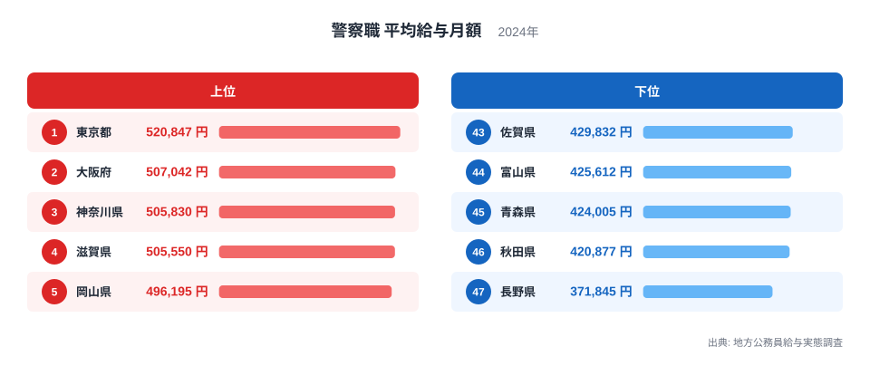
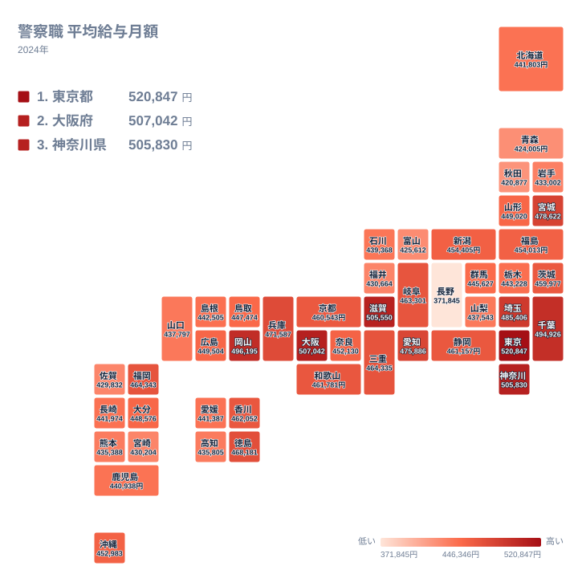

警察官として働く場合、給与は全国一律ではありません。地方公務員給与実態調査に基づく警察職の平均給与月額を都道府県別に見ると、最も高い都道府県と最も低い都道府県の間には10万円を超える開きがあります。同じ仕事内容であっても、勤務地によって給与水準が大きく変わるという事実は、地方公務員制度の仕組みを理解するうえで見逃せないポイントです。

この記事では、警察職の平均給与月額ランキングと地理分布のタイルマップから、上位と下位にどのような地域的な特徴があるのかを確認していきます。

## 給与月額の上位と下位を見る

<source-link href="/ranking/avg-salary-police-prefecture">警察職 平均給与月額ランキングをもっと見る</source-link>

ランキングを見ると、東京都が520,847円で1位となり、大阪府が507,042円で2位、神奈川県が505,830円で3位に続きます。4位は滋賀県で505,550円、5位は岡山県で496,195円です。上位5都道府県のうち東京都、大阪府、神奈川県は三大都市圏の中心地であり、物価や地価が高い地域では地域手当が手厚く支給される仕組みが背景にあると考えられます。地方公務員の給与は国家公務員の給与水準に地域手当の支給割合を掛け合わせて決まる仕組みが基本にあり、都市部ほど支給割合が高く設定される傾向があります。

一方、滋賀県と岡山県が上位に入っているのは意外に感じられるかもしれません。これは地域手当の支給割合が近隣の大都市圏や独自の給与体系によって左右されるためで、単純な都市規模だけでは説明しきれない面があります。

中位の顔ぶれにも注目すると、愛知県は475,886円で9位、福岡県は464,343円で12位と、いずれも人口規模の大きい県ではあるものの、上位5都道府県には入っていません。人口が多い都道府県が必ずしも給与水準の上位に来るわけではなく、名古屋市や福岡市を抱える県であっても、東京都や大阪府ほどの地域手当の支給割合は適用されていないことがうかがえます。逆に北海道は441,803円で32位にとどまっており、道内最大の都市である札幌市を擁しながらも、給与水準は全国平均を下回る位置にあります。これは北海道が広大な面積を持つ一方で、地域手当の対象となる地域が限定的であることを示していると考えられます。

下位を見ると、長野県が371,845円で最も低く、次いで秋田県420,877円、青森県424,005円、富山県425,612円、佐賀県429,832円と続きます。長野県は2位の秋田県と比べても5万円近い差があり、47都道府県の中で突出して低い水準になっています。長野県は地域手当の支給割合が低く設定されている地域であり、都市部からの距離や生活費水準の違いが給与水準に直接反映された結果だと考えられます。

## 地理分布のタイルマップで確認する

タイルマップで全国の分布を見ると、給与水準が高い都道府県は関東地方の南部から近畿地方にかけての太平洋ベルト地帯に集中していることが分かります。東京都、神奈川県、埼玉県、千葉県といった首都圏の各県は軒並み高い水準にあり、大阪府、兵庫県、京都府といった近畿圏も同様に高めの水準を示しています。これは首都圏・近畿圏という2つの大都市圏が経済活動の中心であり、地域手当の算定基準となる民間賃金水準や物価が全国平均を上回っていることの表れです。

一方で東北地方や中部地方の内陸県では給与水準が低めの地域が目立ちます。長野県や秋田県、青森県といった県は、地域手当の支給割合が低いか、そもそも支給対象になっていない地域が多く含まれています。ただし同じ東北でも宮城県は478,622円で8位に入っており、東北地方全体が一様に低いわけではなく、県庁所在地の都市規模や近隣の経済圏との結びつきによって差が生まれていることが読み取れます。四国地方では徳島県が468,181円で11位、香川県が462,052円で15位と比較的高めに入っている一方、高知県は435,805円で38位にとどまっており、同じ地方の中でも県ごとの違いが小さくないことが分かります。

もう一つ注目したいのは、順位が下がるにつれて給与額が緩やかに減っていく中で、最下位の長野県だけが際立って大きく落ち込んでいる点です。大阪府の507,042円を上限、秋田県の420,877円を下限として、2位から46位までの道府県はこの範囲に収まっており、順位が一つ下がるごとの差はおおむね数千円程度にとどまっています。ところが秋田県420,877円から長野県371,845円への落差は49,032円に達し、これは他のどの隣接順位間の差よりも大きい数値です。長野県だけが地域手当の支給対象からほぼ外れていることが、この急激な落差の要因になっていると考えられます。

> [!NOTE]
> この記事の給与月額は地方公務員給与実態調査に基づく警察職の平均給与月額であり、基本給に地域手当や扶養手当などの諸手当を加えた金額です。年齢構成や勤続年数の違いによっても平均値は変動するため、単純に手当の多寡だけを反映した数値ではありません。

> [!WARNING]
> 都道府県ごとの給与水準の差は、地域手当の支給割合の違いに加えて、警察職員の年齢構成や在職年数の分布によっても左右されます。給与が低い都道府県の職員が待遇面で一律に不利というわけではなく、生活費水準との相対関係で見る必要があります。

> [!TIP]
> 給与水準を比較する際は、地域手当が適用される都市部かどうかをまず確認すると、順位の背景を理解しやすくなります。同じ地方でも県庁所在地の規模や近隣の大都市圏との距離によって水準が変わる点にも注目してみてください。

警察職以外の行政・財政に関する統計をまとめて見たい場合は[同じカテゴリの統計一覧](/category/administrativefinancial)が参考になります。1位となった[東京都のデータ](/areas/13000)や、2位の[大阪府のデータ](/areas/27000)もあわせてご覧ください。

## まとめ

警察職の平均給与月額は、東京都の520,847円から長野県の371,845円まで、14万円を超える開きがあります。上位には東京都、大阪府、神奈川県といった大都市圏の都道府県が並び、地域手当の支給割合の高さが給与水準を押し上げています。下位には長野県や秋田県、青森県といった地域手当の支給割合が低い県が並んでおり、都道府県ごとの給与差は個々の職員の能力ではなく、制度上の地域手当の仕組みによって生じていることが分かります。

## データ出典

警察職 平均給与月額は地方公務員給与実態調査(2024年)による集計です。
