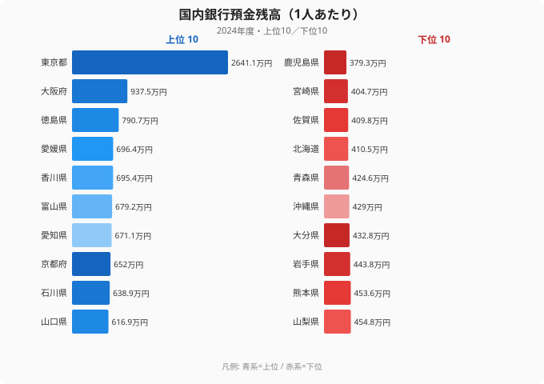

「日本でいちばん貯金が多い県は?」——そう聞かれたとき、四国の徳島県を思い浮かべる人はまずいないだろう。だが2024年度のデータは、その直感を裏切る。

1人あたりの国内銀行預金残高で、徳島県は全国**3位**。東京・大阪に次ぎ、愛知・神奈川・福岡といった大都市をすべて上回った。さらに徳島・愛媛・香川と、四国3県が上位10位のうち3席を占めている。

この記事では、47都道府県の1人あたり銀行預金残高を比較し、トップの東京（2,641.1万円）と最下位の鹿児島（379.3万円）で**7.0倍**もの差が開く実態を見る。そして「なぜ大都市でもない徳島が3位なのか」——この一見不可解な逆転の裏にある、統計の仕組みそのものを解き明かす。

> [!NOTE]
> ここでいう「国内銀行預金残高」は、**その都道府県内に所在する銀行店舗が抱える預金の合計**を、県の人口で割った値（e-Stat 社会・人口統計体系）。世帯の貯金そのものを直接測った「家計の貯蓄額」とは別物である。この違いが、後半の謎解きの鍵になる。

## 1人あたり預金残高ランキング 上位10・下位10

2024年度の1人あたり国内銀行預金残高は、次のような顔ぶれになった。

突出しているのは[東京都](/areas/13000)の2,641.1万円。2位の大阪府（937.5万円）の約2.8倍であり、東京だけが文字どおり別格の水準にある。一方で最下位の鹿児島県は379.3万円。トップとの差は**7.0倍**にのぼる。

注目すべきは3位以下だ。徳島（790.7万円）・愛媛（696.4万円）・香川（695.4万円）と四国3県が並び、続く富山・愛知・京都・石川を抑えている。神奈川（569.2万円・15位）、千葉（584.2万円・13位）、福岡（582.3万円・14位）といった大都市圏が、四国勢の後塵を拝する構図になっている。

<source-link href="/ranking/bank-deposit-balance-per-person">国内銀行預金残高ランキングをもっと見る</source-link>

## 最下位グループは九州・北海道に集中

下位を見ると、地域の偏りがはっきり現れる。

| 順位 | 都道府県 | 1人あたり預金残高 |
|---|---|---|
| 43 | 青森県 | 424.6万円 |
| 44 | 北海道 | 410.5万円 |
| 45 | 佐賀県 | 409.8万円 |
| 46 | 宮崎県 | 404.7万円 |
| 47 | 鹿児島県 | 379.3万円 |

最下位5県のうち、佐賀・宮崎・鹿児島と九州が3県を占める。沖縄（429.0万円・42位）、大分（432.8万円・41位）も含めると、九州・沖縄ブロックがそろって下位に沈んでいる。北海道（410.5万円・44位）、青森（424.6万円・43位）と、北の端も低い。

ここで素朴な疑問が湧く。「九州や北海道の人は、それほど貯金が少ないのか?」——しかしこの問いの立て方自体が、実は統計を読み違えている。

> [!WARNING]
> この指標は**県内に立地する銀行店舗の預金残高**を人口で割ったものだ。県民が実際にどれだけ貯め込んでいるかとは一致しない。たとえば本社が東京に集中する企業の法人預金は東京の数字を押し上げ、地元の住民が他県の銀行に預けた分はその県には計上されない。「県民の貯蓄ランキング」として読むと誤解する。

## 発見: 徳島3位・四国上位独占の「真因」

東京が1位なのは直感に合う。企業の本社が集中し、巨額の法人預金が東京の銀行に積み上がるからだ。問題は、大都市でもない**徳島がなぜ3位なのか**である。

ここで効いてくるのが、先ほどから繰り返している「分母は県の人口、分子は県内の銀行預金」という構造だ。徳島・香川・愛媛はいずれも**人口が少ない**県でありながら、地場の地方銀行が地域に深く根づき、相応の預金残高を抱えている。分子（預金）が大きく崩れないまま、分母（人口）が小さいため、1人あたりの数字が押し上げられる——これが「1人あたり預金残高で四国が上位に来る」からくりだと考えられる。

**[仮説]** 徳島・香川・愛媛が上位に並ぶのは、(a) 人口規模が小さく分母が効きやすいこと、(b) 地場金融機関への預金集中度が高いこと、の合わせ技による可能性が高い。検証するには、各県の銀行店舗数あたり預金、法人・個人別の預金内訳、貯蓄性向（収入に対する貯蓄の割合）を分解して見る必要がある。本記事のデータ（県単位の総額÷人口）だけでは断定できない。

裏を返せば、最下位グループの北海道・九州各県は「県民が浪費家だから」預金が少ないのではない。人口に対して**県内の預金総額が相対的に小さい**ことの反映であり、産業構造（一次産業の比重、所得水準、企業立地の薄さ）が背景にあると見るのが自然だ。

> [!TIP]
> 「県民が実際にいくら貯めているか」を知りたいなら、家計調査ベースの[貯蓄率ランキング](/ranking/avg-savings-rate-worker-households)や[消費支出ランキング](/ranking/consumption-expenditure-multi-person-households-per-month)を併せて見るのが正解だ。預金残高（ストック）と貯蓄率（フロー）は別の角度から「貯める力」を映している。

## 所得との関係: 預金が多い県＝豊かな県、ではない

1人あたり預金が多い県は、所得も高いのだろうか。1人あたり県民所得（2020年度・最新基準）と突き合わせると、関係は単純ではない。

- 東京都は所得も全国1位（521.4万円）で、預金1位と整合する。
- だが徳島県の県民所得は301.3万円で、全国9位の上位グループ。所得でも上位にありながら、預金残高ではさらに3位と、所得順位（9位）を大きく上回る。
- 逆に愛媛県は県民所得247.1万円と低めだが、預金残高は4位。

つまり「所得が高い→預金が多い」という直線的な関係は、東京を除けば必ずしも成り立たない。預金残高ランキングの正体は、住民の豊かさよりも「県の人口規模」と「県内の預金集中度」に強く引っ張られている。

> [!NOTE]
> 県民所得は2020年度、預金残高は2024年度と調査年が異なるため、両者の比較はあくまで傾向の確認にとどめる。年次をそろえた厳密な相関分析は別途必要だ。

<source-link href="/ranking/per-capita-kenmin-shotoku-h27">1人あたり県民所得ランキングをもっと見る</source-link>

## まとめ

- 2024年度の1人あたり国内銀行預金残高は、**1位が東京都（2,641.1万円）、最下位が鹿児島県（379.3万円）で7.0倍の格差**。
- 東京は2位大阪（937.5万円）の約2.8倍と別格で、企業の本社・法人預金の集中が効いている。
- **意外なのは徳島県が全国3位**（790.7万円）。愛媛・香川と合わせて四国3県が上位10位を占めた。
- 上位の四国勢は「人口が少なく分母が効く」構造が押し上げ要因と見られ、最下位は九州（佐賀・宮崎・鹿児島）・北海道に集中。
- この指標は「県内の銀行預金÷人口」であり、**県民の貯蓄額そのものではない**。豊かさのランキングとして読むと誤る。

## データ出典

国内銀行預金残高: 日本銀行・金融機関の預金等のデータをもとに整備された e-Stat「社会・人口統計体系」（2024年度、1人あたりは人口で除した派生値）。1人あたり県民所得: 内閣府「県民経済計算」をもとに整備された e-Stat「社会・人口統計体系」（2020年度・平成27年基準）。いずれも政府統計の総合窓口 e-Stat 経由で取得・整備した。
