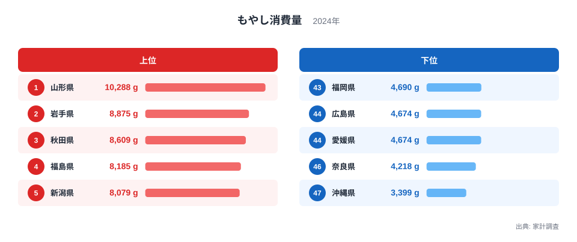
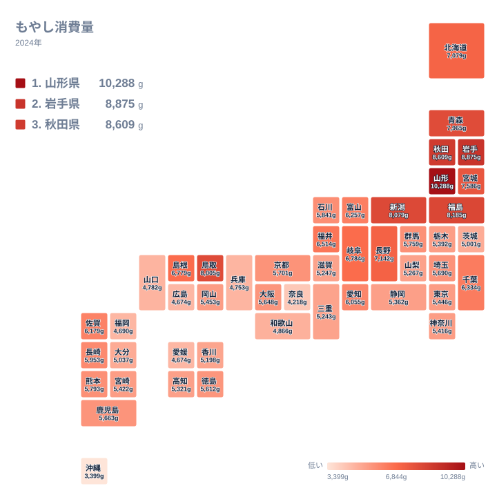

もやしは家計調査で毎年集計される、価格が安定していて通年手に入る野菜の代表格です。ところが都道府県別に消費量を見ると、そのばらつきは決して小さくありません。2024年の家計調査によると、もやし消費量の1位は山形県で10,288グラム、最下位は沖縄県で3,399グラムでした。単純に比較すると、山形県は沖縄県のおよそ3倍のもやしを消費していることになります。この記事では、上位と下位の分布を地図で確認しながら、この差がどこから生まれているのかを食文化と気候の面から読み解きます。

> [!NOTE]
> ここでのもやし消費量は、家計調査における1世帯当たりの年間購入数量をグラムで表したものです。世帯の人数や外食の頻度によって数値は変わるため、県民1人当たりの消費量そのものを表しているわけではありません。

## もやし消費量の上位5県と下位5県

まずは全体の順位から見ていきます。

<source-link href="/ranking/bean-sprouts-consumption-quantity">もやし消費量ランキングをもっと見る</source-link>

上位5県を確認すると、山形県が10,288グラムで1位、岩手県が8,875グラムで2位、秋田県が8,609グラムで3位、福島県が8,185グラムで4位、新潟県が8,079グラムで5位という順に並びます。山形県のくわしい統計データは[山形県のデータ](/areas/06000)から、岩手県のくわしい統計データは[岩手県のデータ](/areas/03000)から確認できます。上位5県はすべて東北地方または新潟県で占められており、地域としてのまとまりがはっきり見て取れます。中でも山形県は2位の岩手県を大きく上回っており、単独で突出した消費量になっていることが分かります。

一方で下位5県を見ると、福岡県が4,690グラムで43位、広島県が4,674グラムで44位、愛媛県も同じく4,674グラムながら45位、奈良県が4,218グラムで46位、そして沖縄県が3,399グラムで47位と最下位に位置しています。上位5県が東北地方に集中していたのに対し、下位5県は九州、中国、近畿、そして沖縄と、西日本の各地に広く分散していることが特徴です。

[仮説] 東北地方や新潟県、鳥取県で消費量が多い背景には、冬の積雪や寒さが長く続く地域ほど、天候に左右されず通年安定して手に入るもやしが鍋料理や炒め物の具材として日常的に使われてきたことが考えられます。実際に上位10県には北海道や長野県といった寒冷地も含まれており、気候条件との結びつきがうかがえます。ただしこの点はデータで直接検証されたものではなく、あくまで仮説にとどまります。

## 地理でみるもやし消費量の分布

上位と下位の傾向を地図で確認します。

タイルマップで全国を見渡すと、色の濃い東北6県と新潟県、それに鳥取県や島根県といった山陰地方に濃い色が集まっていることが分かります。反対に沖縄県、奈良県、瀬戸内海沿岸の県は色が薄く、消費量が少ない地域として浮かび上がります。東京都は5,446グラムで28位、大阪府は5,648グラムで25位と、いずれも全国のちょうど真ん中あたりに位置しており、大都市圏だからといって極端に多い、あるいは少ないというわけではないことも見て取れます。

地図全体を眺めると、日本海側から東北にかけての一帯と、太平洋側から西日本にかけての一帯とで、色の濃淡が緩やかに分かれていることも読み取れます。単に県境で消費量が変わるのではなく、広い地域単位で似た傾向がまとまっている点は、家庭ごとの好みというより地域全体の食習慣が影響している可能性を示しています。

> [!WARNING]
> 家計調査は都道府県庁所在市および政令指定都市の世帯を対象に集計されています。県内のほかの市町村まで含めた消費実態を表しているわけではない点に注意してください。

## なぜこれほど地域差が生まれるのか

[仮説] もやし消費量の地域差には、価格の安さを背景にした代替効果の強さが関わっている可能性があります。もやしは重量あたりの価格が野菜の中でも際立って安く、家計の食費を抑えたい家庭で選ばれやすい食材です。冬場に葉物野菜の価格が上がりやすい寒冷地では、この代替効果がより強く働くと考えられます。反対に沖縄県は一年を通じて温暖で、ゴーヤーやシークヮーサーなど地元で採れる野菜が手に入りやすいため、もやしへの依存度が相対的に低いとも推測できます。

家計調査には他の野菜の消費量データも集計されています。価格の安さだけで地域差が説明できるのであれば、価格帯が近いほかの野菜でも同じような東北優位の傾向が見られるはずですが、野菜によって上位県の顔ぶれは大きく異なります。もやしの地域差は価格だけでなく、鍋料理や炒め物といった調理文化との結びつきが強く影響していると考えるほうが自然です。

ただしこれらはいずれも[仮説]であり、統計的に検証されたものではありません。実際の消費行動には、世帯構成や購入頻度、外食の割合など、多くの要因が関わっています。

> [!TIP]
> 上位と下位だけでなく、隣り合う県同士の順位を見比べると、似た気候や食文化を持つ地域ほど近い順位に並びやすいことが分かります。地図の色の濃淡と合わせて確認すると、地域のまとまりが見えやすくなります。

## まとめ

- もやし消費量の1位は山形県で10,288グラムです
- 最下位は沖縄県で3,399グラムで、山形県はそのおよそ3倍にあたります
- 上位5県は山形県、岩手県、秋田県、福島県、新潟県と東北地方に集中しています
- 下位5県は福岡県、広島県、愛媛県、奈良県、沖縄県と西日本に広く分散しています
- 地域差の背景には気候や調理文化の違いが[仮説]として考えられますが、統計的な検証はこれからの課題です

もやしの地域差についてさらにくわしいデータは、[同じカテゴリの統計一覧](/category/economy)からまとめて確認できます。

## データ出典

出典は家計調査（2024年）です。e-Stat経由で整備した都道府県別のデータをもとに作成しています。
