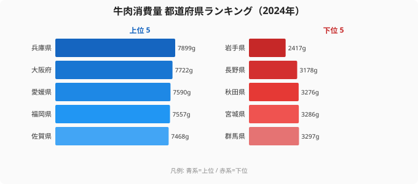

「すき焼きと言えば牛肉」という人と「うちは豚だった」という人——この分かれ目には、はっきりとした地理があります。総務省・家計調査が集計する都道府県庁所在市の世帯あたり年間牛肉消費量(2024年)を見ると、最も食べる[兵庫県](/areas/28000)の **7,899g** に対し、最も食べない[岩手県](/areas/03000)は **2,417g** しかありません。同じ日本で **3.3倍** の開きです。

注目すべきは順位の偏りそのものです。上位を占めるのはほぼ西日本で、逆に東北・北関東がそろって下位に沈んでいます。本記事では47都道府県の牛肉消費量を可視化し、「西高東低」と呼ばれる牛肉文化の地図が、いまもデータにくっきり残っていることを確かめていきます。

> [!NOTE]
> 本データは家計調査の「牛肉(生鮮肉)」の購入数量で、対象は各都道府県庁所在市(政令市)の二人以上世帯。県全体ではなく県都の世帯を代表値として扱う点に注意。外食やハム・加工肉は含まない、家庭で買う生の牛肉のみの数字。

## 牛肉消費量 上位5県と下位5県(2024年)

まず両極を上位5県と下位5県で並べてみます。単位は世帯あたり年間グラム(g)です。

上位5県の顔ぶれは、兵庫(7,899g)を筆頭に大阪(7,722g)、愛媛(7,590g)、福岡(7,557g)、佐賀(7,468g)と続き、いずれも7,000g台です。トップ集団には神戸ビーフ・但馬牛、佐賀牛、あか牛といった全国区の和牛ブランドの産地も並びます。ただ、産地の有無だけでは説明がつきません。和牛ブランドを持たない大阪・愛媛が2位・3位に食い込んでいるからです。むしろ「日常の食卓で牛肉を選ぶ」という消費習慣そのものが、近畿・中国・四国・北九州という西日本一帯に根づいていることが、この上位集団の地理にくっきりと表れています。

対照的に、下段の下位5県は東北〜北関東・中部内陸に固まっています。群馬(43位・3,297g)、宮城(44位・3,286g)、秋田(45位・3,276g)、長野(46位・3,178g)、岩手(47位・2,417g)は、いずれも3,000g台前後で頭打ちになっており、上位集団の半分にも届きません。最下位の岩手2,417gは、1位兵庫のおよそ3割という水準です。同じ「肉を買う」という行為でも、選ばれる肉の主役が西と東で入れ替わっていることが見えてきます。

<source-link href="/ranking/beef-consumption-quantity">牛肉消費量ランキングをもっと見る</source-link>

## なぜ下位は東北・北関東に偏るのか

下位5県のうち4県(宮城・秋田・岩手・群馬)が東北〜北関東に集中し、残る1県も中部内陸の長野です。これらの地域は、歴史的に豚肉や鶏肉の消費が厚いエリアと重なります。東北・北関東は養豚・養鶏が盛んな産地でもあり、家庭の食卓で「肉」と言えば牛より先に豚や鶏が思い浮かぶ土地柄だと言われています。つまり下位県は「肉そのものを食べない」のではなく、「主役の肉が牛ではない」と読むのが実態に近いのです。

岩手が突出して低い背景にも、産地ゆえの事情があります。岩手は全国有数の養豚・養鶏県であり、いわて短角和牛の産地でありながら、家庭の購入数量では牛肉が伸びていません。ブランド牛を「育てて出荷する」ことと「県都の世帯が日常的に買って食べる」ことは別の話だという点が、ここに端的に表れています。下位県の数字は、牛肉文化が東日本では生活レベルまで浸透しきっていないことを示しているのです。

> [!TIP]
> 牛肉が下位の県は、しばしば豚肉や鶏肉の消費が上位に来ます。「肉を食べない」のではなく「主役の肉が違う」と読むのが正しい見方です。実際、東北・北関東は養豚・養鶏の盛んな地域でもあり、牛肉の少なさは他の肉の多さと裏表の関係にあります。

> [!WARNING]
> 「西は牛・東は豚」という対比は通説として広く語られますが、本データだけで因果まで断定はできません。価格差・流通経路・銘柄産地の有無・調査対象が県都世帯に限られる点など、複数の要因が絡みます。あくまで2024年の県都世帯の購入数量という一断面である点に留意してください。

## 西高東低はどこまで徹底しているか:東日本最上位は東京の17位

このランキングの最大の特徴は、「西高東低」がほぼ例外なく成立していることです。上位10県を順に見ると、兵庫・大阪・愛媛・福岡・佐賀・奈良(6位)・三重(7位)・広島(8位)・京都(9位)・山口(10位)と、近畿以西で固められており、関東以東の府県は1つも入っていません。東北勢で唯一気を吐くのが11位の[山形県](/areas/06000)(6,959g)で、米沢牛を抱える土地として別格の位置にいますが、それでも上位10には一歩届きません。

では東日本(関東以東)の最上位はどこでしょうか。データを順に下っていくと、東京都が17位(6,425g)でようやく東日本の筆頭として現れます。続いて千葉(19位・6,150g)、神奈川(27位・5,699g)と首都圏が中位に並びます。**人口も所得も大きい首都圏ですら、西日本の中位県に届かない**——これが牛肉消費の地理的な根深さを物語っています。所得が高ければ高価な牛肉を多く買うはずだという素朴な予想は、ここでは成り立ちません。食習慣という文化の層が、所得という経済の層を上回って消費量を決めているように見えるのです。

<source-link href="/ranking/beef-consumption-expenditure">牛肉消費支出額ランキングを見る</source-link>

### [仮説] 「すき焼き=牛肉」文化圏との重なり

上位の近畿・中国・四国・北九州は、すき焼きや肉じゃがを「牛肉で作る」と答える人が多いとされる地域と重なります。一方、下位の東北・北関東は同じ料理を豚肉で作る家庭が多いと言われます。この消費習慣の差が数量に直結している可能性があります。

ただしこれは [仮説] であり、本データ単体では検証できません。豚肉消費量や鶏肉消費量との都道府県別クロス分析を行い、「牛が下位の県は豚・鶏が上位か」を突き合わせる検証が必要です。検証の方向性としては、下位5県(群馬・宮城・秋田・長野・岩手)の豚肉・鶏肉順位が実際に上位に来るかを確認するのが第一歩になるでしょう。

## まとめ

- **トップは兵庫**(7,899g)。神戸ビーフ・但馬牛を擁する牛肉王国が、消費量でもトップに立ちます。
- **最下位は岩手**(2,417g)で、兵庫とは **3.3倍** の開きがあります。
- 上位10県のうち **9県が西日本**(近畿以西)。東日本の府県はトップ10にゼロです。
- 下位5県は **群馬・宮城・秋田・長野・岩手** と、東北〜北関東・中部内陸に集中しています。
- 東日本の最上位は **東京**(6,425g・17位)で、全体では中位どまり。首都圏でも西日本の中位県に届かず、「西高東低」は所得や人口では覆りません。

## データ出典

総務省統計局「家計調査」(品目別都道府県庁所在市及び政令指定都市ランキング)より、二人以上世帯の年間牛肉(生鮮肉)購入数量。集計年は2024年。e-Stat(政府統計の総合窓口)経由で整備したデータを使用。
