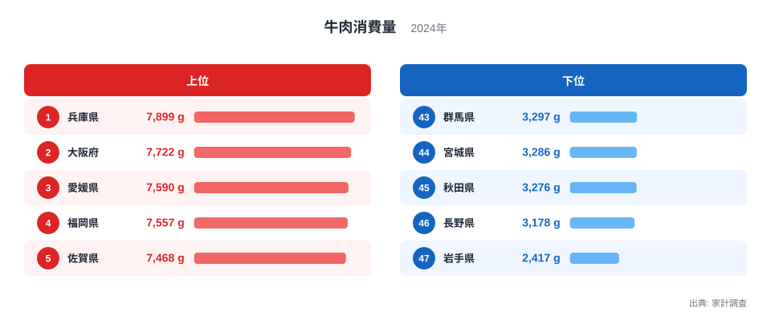
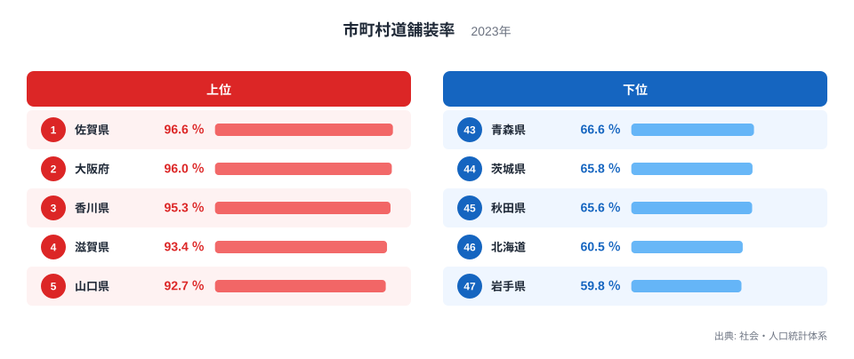
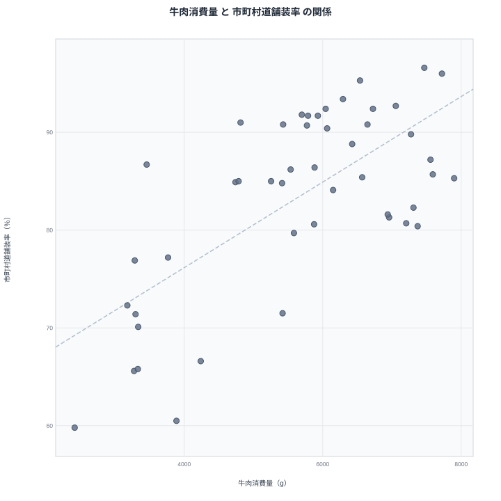

## 牛肉消費量と市町村道舗装率、47都道府県で見えた重なり

牛肉をどれだけ食べるかという食生活の指標と、地域の道路がどれだけ舗装されているかというインフラの指標は、一見すると何のつながりもなさそうです。しかし47都道府県のデータを並べてみると、牛肉消費量が多い県ほど市町村道舗装率も高い傾向が浮かび上がります。

牛肉消費量でもっとも多いのは兵庫県で、家計調査によると年間7,899グラムを購入しています。もっとも少ないのは岩手県で、2,417グラムにとどまります。一方の市町村道舗装率でもっとも高いのは佐賀県で96.6％、もっとも低いのは岩手県で59.8％です。牛肉消費量でも市町村道舗装率でも岩手県が最下位に並んでいる点は、単なる偶然なのでしょうか。それとも背景に共通する何かがあるのでしょうか。この記事では2つのランキングと散布図から、その重なりの正体を探ります。

> [!NOTE]
> 牛肉消費量は家計調査による二人以上世帯の年間購入数量で、個人ごとの摂取量ではありません。世帯構成や外食の比率によって数字が変わる点に注意が必要です。

## 牛肉消費量の上位と下位

<source-link href="/ranking/beef-consumption-quantity">牛肉消費量ランキングをもっと見る</source-link>

上位5県は次のとおりです。

- 1位 兵庫県 7,899グラム
- 2位 大阪府 7,722グラム
- 3位 愛媛県 7,590グラム
- 4位 福岡県 7,557グラム
- 5位 佐賀県 7,468グラム

下位5県は次のとおりです。

- 43位 群馬県 3,297グラム
- 44位 宮城県 3,286グラム
- 45位 秋田県 3,276グラム
- 46位 長野県 3,178グラム
- 47位 岩手県 2,417グラム

上位には兵庫県、愛媛県、佐賀県のように、和牛の産地として知られる県が目立ちます。兵庫県は神戸牛、佐賀県は佐賀牛の産地であり、地元での消費文化が根付いていると考えられます。大阪府や福岡県のように大都市圏を抱える県が上位に入っているのは、外食産業や焼肉店の集積が購入量を押し上げている可能性を示しています。

下位には東北や北関東の県が並びます。群馬県、宮城県、秋田県、長野県、岩手県はいずれも豚肉や鶏肉、あるいは地域独自の食文化が根強く、牛肉が食卓の主役になりにくい地域です。こうした食文化の違いが、そのまま消費量の差として表れているといえます。

牛肉消費量の上位5県と下位5県を見比べると、その差は明らかです。上位の兵庫県は7,899グラムで、下位の岩手県は2,417グラムにとどまり、同じ2人以上世帯であっても購入量に大きな開きがあります。この差の背景には、単なる好みだけでなく、精肉店や小売店での取り扱い量、地元産のブランド牛の有無といった供給側の事情も関わっていると考えられます。

## 市町村道舗装率の上位と下位

上位5県は次のとおりです。

- 1位 佐賀県 96.6％
- 2位 大阪府 96％
- 3位 香川県 95.3％
- 4位 滋賀県 93.4％
- 5位 山口県 92.7％

下位5県は次のとおりです。

- 43位 青森県 66.6％
- 44位 茨城県 65.8％
- 45位 秋田県 65.6％
- 46位 北海道 60.5％
- 47位 岩手県 59.8％

市町村道舗装率の上位には、平地が多く都市化が進んだ県が並びます。佐賀県や香川県は平野の割合が大きく、道路整備のコストが比較的抑えやすい地形です。大阪府のように面積が小さく市街地の密度が高い県も、舗装率が高くなりやすい条件を備えています。

> [!WARNING]
> 市町村道舗装率は路線の延長のうち舗装済みの割合を示す指標であり、交通量や道路の幅員、維持管理の質までは表していません。舗装率が高いからといって、道路事情全体が優れているとは限りません。

一方で下位には北海道や東北の県が集中しています。北海道は道路網の総延長そのものが長く、面積も広いため、舗装を全域に行き渡らせるには時間とコストがかかります。積雪や凍結といった気候条件も、舗装維持のコストを押し上げる要因になります。岩手県も山間部が多く、集落が分散していることが未舗装区間を残しやすい背景にあると考えられます。

市町村道は都道府県道や国道に比べて延長が長く、財政力の弱い自治体ほど整備が後回しになりやすい面があります。舗装率の上位5県と下位5県の差を見ると、佐賀県の96.6％に対して岩手県は59.8％で、同じ市町村道であっても整備の進み具合には大きな開きがあることが分かります。

## 散布図で見る、消費量と舗装率の重なり

散布図を見ると、牛肉消費量が多い県ほど市町村道舗装率も高い側に集まる傾向が確認できます。両方の指標で上位に入る県として代表的なのが大阪府です。大阪府は牛肉消費量で2位、市町村道舗装率でも2位と、どちらのランキングでも上位に位置しています。反対に岩手県は牛肉消費量で47位、市町村道舗装率でも47位と、どちらのランキングでも最下位です。

ただし、すべての県がこの傾向どおりに並ぶわけではありません。兵庫県は牛肉消費量では1位ですが、市町村道舗装率では上位10県には入らず、24位にとどまります。牛肉をよく食べる県が必ずしも道路整備で先行しているとは限らない例といえます。

> [!TIP]
> 散布図で全体の傾向に沿う県と、傾向から外れる県の両方に注目すると、単純な「AだからB」という説明では捉えきれない地域差が見えてきます。外れ値がどの県かを確認することが、相関を読み解く近道です。

この2つの指標が重なって見える理由として考えられるのは、都市化の度合いや地域の経済力といった、両方に共通して影響する要素です。都市部を抱える県は外食産業が発達しやすく牛肉消費量が伸びやすい一方、道路整備の予算や事業者数も確保しやすいため、市町村道舗装率も高くなりやすいと推測できます。牛肉を食べることが道路整備を進めるわけではなく、道路が舗装されているから牛肉を食べやすくなるわけでもありません。相関が見えても、それを因果関係と決めつけないことが大切です。

香川県も両方の指標で目を引く県です。市町村道舗装率では3位の95.3％と高い水準にある一方、牛肉消費量は16位の6,539グラムと中位にとどまります。舗装率が高い県のすべてが牛肉消費量でも上位に来るわけではなく、地域ごとの食文化の強さが最終的な順位を左右していることがうかがえます。

## この2つの指標から見えてきたこと

- 牛肉消費量は兵庫県が1位で7,899グラム、最下位は岩手県で2,417グラムです。
- 市町村道舗装率は佐賀県が1位で96.6％、最下位は岩手県で59.8％です。
- 岩手県は牛肉消費量と市町村道舗装率のどちらでも最下位に位置しています。
- 大阪府は両方の指標で上位に入っており、都市化と2つの指標の関係を考えるヒントになります。
- 兵庫県のように片方の指標だけが突出する県もあり、相関には例外が伴います。

散布図全体の傾向と個別の県の位置を照らし合わせることで、統計の重なりが何を意味しているのか、そして何を意味していないのかを見極める手がかりになります。牛肉消費量については[同じカテゴリの統計一覧](/category/economy)からも他の食品との比較ができ、地域ごとの傾向を[兵庫県のデータ](/areas/28000)や[大阪府のデータ](/areas/27000)で詳しく確認できます。市町村道舗装率のより詳細な内訳は、[市町村道舗装率ランキング](/ranking/municipal-road-paving-rate)で確認できます。

## データ出典

- 牛肉消費量: 家計調査(2024年)
- 市町村道舗装率: 社会・人口統計体系(2023年)
