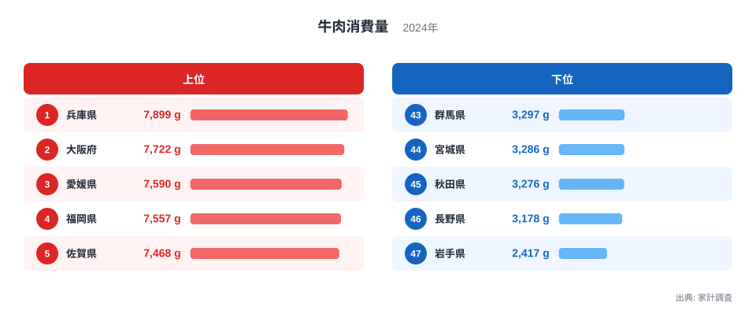
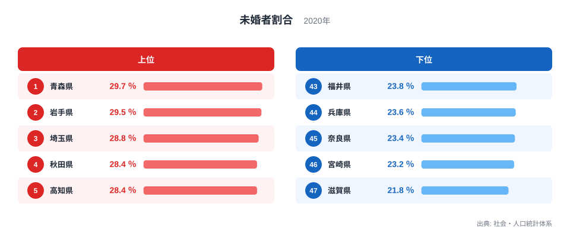
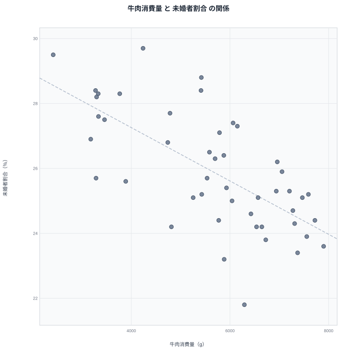

## 牛肉消費量と45〜49歳男性の未婚者割合、47都道府県で見えた重なり

牛肉をどれだけ食べるかという食生活の指標と、結婚しているかどうかという指標は、一見すると結びつくはずのないものです。しかも今回取り上げる未婚者割合は都道府県の男女全世代を対象にしたものではなく、45歳から49歳までの男性に限定した割合です。それでも47都道府県のデータを並べてみると、牛肉消費量が多い県ほどこの世代の男性の未婚者割合が低い傾向が浮かび上がります。

牛肉消費量でもっとも多いのは兵庫県で、家計調査によると年間7,899グラムを購入しています。もっとも少ないのは岩手県で、2,417グラムにとどまります。一方の45〜49歳男性の未婚者割合でもっとも高いのは青森県で29.7％、もっとも低いのは滋賀県で21.8％です。牛肉消費量が全国トップの兵庫県は45〜49歳男性の未婚者割合では下位に位置し、牛肉消費量が最下位の岩手県はこの割合で上位に位置しています。この重なりはどこから来るのでしょうか。

> [!NOTE]
> ここで扱う未婚者割合は、都道府県の男女全世代を集計したものではなく、45歳から49歳までの男性人口に占める未婚者の割合です。同じ都道府県でも女性や他の年齢層では傾向が異なる場合があるため、この記事の数値を都道府県全体の未婚率と読み替えないようご注意ください。数値は社会・人口統計体系による集計値で、地域の人口移動や産業構造の影響を受けます。牛肉消費量とは調査主体も対象年も異なる統計であり、直接同じ人を追跡した数字ではありません。

## 牛肉消費量の上位と下位

<source-link href="/ranking/beef-consumption-quantity">牛肉消費量ランキングをもっと見る</source-link>

上位5県は次のとおりです。

- 1位 兵庫県 7,899グラム
- 2位 大阪府 7,722グラム
- 3位 愛媛県 7,590グラム
- 4位 福岡県 7,557グラム
- 5位 佐賀県 7,468グラム

下位5県は次のとおりです。

- 43位 群馬県 3,297グラム
- 44位 宮城県 3,286グラム
- 45位 秋田県 3,276グラム
- 46位 長野県 3,178グラム
- 47位 岩手県 2,417グラム

上位には兵庫県、佐賀県のように和牛の産地として知られる県や、大阪府、福岡県のように大都市圏を抱える県が並びます。産地としての消費文化と、外食産業の集積による購入量の押し上げの両方が働いていると考えられます。上位5県と下位5県の差は大きく、兵庫県の7,899グラムに対して岩手県は2,417グラムにとどまり、同じ2人以上世帯でも購入量に開きがあります。

下位には東北や北関東の県が集まります。群馬県、宮城県、秋田県、長野県、岩手県は豚肉や鶏肉を中心とした食文化が根強く、牛肉が食卓の主役になりにくい地域です。地域ごとの食文化の違いが、そのまま消費量の差として表れています。

牛肉消費量の上位5県のうち、兵庫県、愛媛県、佐賀県の3県は肥育牛の産地としても知られています。地元での肥育や流通の仕組みが整っていることが、購入のしやすさにつながっていると考えられます。一方で下位5県は太平洋側や日本海側の内陸部にあり、豚肉や鶏肉、あるいは魚介類が食卓の中心になりやすい地域です。

## 45〜49歳男性の未婚者割合の上位と下位

上位5県は次のとおりです。

- 1位 青森県 29.7％
- 2位 岩手県 29.5％
- 3位 埼玉県 28.8％
- 4位 秋田県 28.4％
- 5位 高知県 28.4％

下位5県は次のとおりです。

- 43位 福井県 23.8％
- 44位 兵庫県 23.6％
- 45位 奈良県 23.4％
- 46位 宮崎県 23.2％
- 47位 滋賀県 21.8％

> [!WARNING]
> この割合が高いことは、その地域の男女全体で結婚しにくい事情があることを直接示すものではありません。あくまで45〜49歳という特定の年齢層の男性に限った数値であり、女性や他の年齢層を含めた都道府県全体の未婚率とは別の統計です。年齢構成や転出入による人口移動、産業構造の違いなど、複数の要因が同時に影響しています。

45〜49歳男性の未婚者割合の上位には青森県、岩手県、秋田県のように東北地方の県が目立ちます。地方から都市部への若年層の転出が続く地域では、結婚適齢期にある人口の男女比が変化しやすく、この世代の未婚者割合が押し上げられている可能性があります。埼玉県や高知県が上位に入っている点は、東北地方だけの傾向ではないことを示しており、都市部に近い埼玉県のような地域でも、通勤圏として人口が流入する一方で男性の結婚が先延ばしになりやすい事情があるのかもしれません。

下位には滋賀県、宮崎県、奈良県、兵庫県、福井県が並びます。滋賀県は21.8％ともっとも低く、47位です。関西圏に含まれる滋賀県や兵庫県、奈良県が下位に集まっている点は興味深く、通勤圏としての安定した雇用環境や住宅事情が、この世代の男性の結婚のしやすさに結びついている可能性があります。

45〜49歳男性の未婚者割合の上位5県と下位5県を比べると、青森県の29.7％に対して滋賀県は21.8％と、大きな開きがあります。同じ都道府県単位の集計であっても、地域や年代の切り取り方によって未婚者の割合はこれほど幅があるということです。

## 散布図で見る、牛肉消費量と45〜49歳男性の未婚者割合の重なり

散布図を見ると、牛肉消費量が多い県ほど45〜49歳男性の未婚者割合が低い側に集まる傾向が確認できます。兵庫県は牛肉消費量で1位ですが、この割合では44位と低い側に位置しています。反対に岩手県は牛肉消費量で47位ともっとも少なく、この割合では2位と高い側に位置しています。大阪府も牛肉消費量で2位、この割合では37位と、同じ方向の重なりを見せています。

ただし、この傾向にあてはまらない県もあります。鹿児島県は牛肉消費量が34位と中位より低い一方、45〜49歳男性の未婚者割合は41位と低い側に位置しており、牛肉消費量が少なくてもこの世代の未婚者割合が高くなるとは限らない例です。

> [!TIP]
> 散布図では全体の傾きに沿う県だけでなく、傾きから外れる県にも注目してみてください。特に今回のように対象を特定の年齢・性別に絞った指標では、全世代・男女計の統計から想像する一般的な傾向と一致しない県が出てくることがあります。傾向に沿わない県が何を共有し、何を共有していないかを考えることが、単純な結びつけを避ける手がかりになります。

牛肉消費量と45〜49歳男性の未婚者割合が重なって見える背景として、地域の経済力や雇用の安定度といった、両方に影響する共通の要因が考えられます。ただし、この世代の男性の未婚者割合は、単純な「都市か地方か」では説明しきれない面があります。埼玉県や高知県のように、都市への近さも産業構造も異なる県がそろって上位に入っている一方、関西圏の通勤圏に位置する滋賀県や奈良県、兵庫県は下位でそろっています。都市化の度合いそのものよりも、その地域で働く男性が経済的・生活基盤的に家庭を持ちやすい環境にあるかどうかが、牛肉消費量にも未婚者割合にも間接的に影響している可能性があります。牛肉を食べることが結婚を後押しするわけではなく、結婚しているから牛肉を多く食べるようになるわけでもありません。相関が見えたとしても、それを因果関係と決めつけないことが大切です。

佐賀県も両方の指標で目を引く県です。牛肉消費量では5位と上位に入る一方、45〜49歳男性の未婚者割合も32位と全国平均より低い側に位置しています。産地としての消費文化と、地域の雇用や生活基盤の安定が同時に効いている可能性がある県といえます。

## この2つの指標から見えてきたこと

- 牛肉消費量は兵庫県が1位で7,899グラム、最下位は岩手県で2,417グラムです。
- 45〜49歳男性の未婚者割合は青森県が1位で29.7％、最下位は滋賀県で21.8％です。
- 兵庫県は牛肉消費量が全国トップですが、この年代の未婚者割合は下位に位置しています。
- 岩手県は牛肉消費量が最下位ですが、この年代の未婚者割合は上位に位置しています。
- 鹿児島県のように、牛肉消費量が少なくてもこの年代の未婚者割合が低い県もあり、単純な図式では説明しきれません。
- ここで扱う未婚者割合は45〜49歳の男性に限った統計であり、都道府県全体・全世代・男女計の未婚率とは別の数値です。

今回取り上げた2つの指標は、どちらも都道府県単位で見ると全国の中で大きな差がある統計です。散布図全体の傾向を確認したうえで、個別の県がその傾向にどれだけ沿っているか、あるいは外れているかを見比べることで、統計の重なりが持つ意味と限界の両方を押さえることができます。

牛肉消費量については[同じカテゴリの統計一覧](/category/economy)からも他の食品との比較ができ、上位県の傾向を[兵庫県のデータ](/areas/28000)や[大阪府のデータ](/areas/27000)で詳しく確認できます。45〜49歳男性の未婚者割合のより詳細な内訳は、[45〜49歳男性の未婚者割合ランキング](/ranking/unmarried-ratio-male-45-49)で確認できます。

## データ出典

- 牛肉消費量: 家計調査(2024年)
- 未婚者割合(45〜49歳男性): 社会・人口統計体系(2020年)
