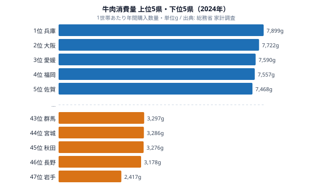

「和牛の名産地に住んでいれば、きっと牛肉をよく食べているはずだ」——多くの人が抱くこの直感は、データを見ると裏切られます。総務省「家計調査」の2024年データによると、1世帯あたりの年間牛肉購入量が最も多いのは兵庫県（7,899g）です。神戸ビーフを擁する和牛王国が消費でもトップに立つ一方で、「前沢牛」で知られる岩手県は2,417gで最も少ない水準に沈んでいます。その開きは約3.3倍。産地の知名度と食卓に並ぶ量は、必ずしも一致しません。

牛肉消費に「西高東低」の傾向があることは経験的に語られてきましたが、47都道府県の数字を並べると、その輪郭がはっきり見えてきます。同時に、和牛ブランドの産地が必ずしも消費量上位ではないという「ズレ」も浮かび上がります。本記事では、2024年の牛肉消費量を地域ごとに読み解き、なぜ西日本で牛肉がよく食べられ、東日本で少ないのかという構造に踏み込みます。

> [!NOTE]
> データは総務省「家計調査」の都道府県庁所在市・二人以上世帯における年間牛肉購入量（g）です。あくまで家庭での購入量であり、外食やスーパー惣菜などで消費される牛肉は含みません。各県庁所在市の数字を都道府県の代表値として扱っています。

## 牛肉消費量ランキングの全体像 — 兵庫と岩手で約3.3倍の開き

まず全体の構図を押さえます。最も牛肉を買っているのは兵庫県（7,899g）、最も少ないのは岩手県（2,417g）です。トップと最下位では約3.3倍の開きがあり、同じ日本でも県によって食卓の肉の中身がかなり違うことがわかります。

<source-link href="/ranking/beef-consumption-quantity">47都道府県の牛肉消費量ランキングを詳しく見る</source-link>

上位は兵庫県（7,899g）・大阪府（7,722g）・愛媛県（7,590g）・福岡県（7,557g）・佐賀県（7,468g）が並び、以下に奈良（7,371g）・三重（7,311g）・広島（7,276g）・京都（7,206g）・山口（7,056g）と続きます。一方の最下位グループは秋田県（3,276g）・長野県（3,178g）・岩手県（2,417g）で、上位と下位の差がそのまま東西の違いに重なっています。

上位10県を地域別に見ると、近畿が4県（兵庫・大阪・奈良・京都）、九州が2県（福岡・佐賀）、山陽が2県（広島・山口）、四国が1県（愛媛）、東海が1県（三重）という分布になります。いずれも西日本に属しており、東日本の県は1つも入っていません。牛肉消費の「西高東低」が、上位の顔ぶれだけでもはっきりと読み取れます。

兵庫県や大阪府が物理的に近接していること、関西圏が伝統的に牛肉文化の中心であることを踏まえると、近畿の強さは食文化の蓄積を反映していると考えられます。なお11位以降に目を移すと、山形県（6,959g）が東北で唯一の上位常連として顔を出し、岡山県（6,939g）・福井県（6,726g）と西日本が続きます。東日本でも例外的に牛肉をよく買う地域があることは押さえておきたいところです。

## 上位グループの解説 — 近畿を軸に九州・山陽・四国が続く

上位の中心は近畿です。1位兵庫（7,899g）、2位大阪（7,722g）が抜けており、6位奈良（7,371g）、9位京都（7,206g）と続きます。関西では「肉といえば牛」という意識が根強く、すき焼き・しゃぶしゃぶといった牛肉中心の鍋文化が家庭に浸透していることが背景にあると見られます。

近畿に次いで存在感を放つのが西日本の各エリアです。九州からは4位福岡（7,557g）と5位佐賀（7,468g）、山陽からは8位広島（7,276g）と10位山口（7,056g）、四国からは3位愛媛（7,590g）がトップ10入りしました。福岡・佐賀のように肉用牛の産地を抱える県もあれば、愛媛のように産地イメージが強くない県も上位に並んでいます。つまり「産地だから多い」という単純な説明では片付きません。

> [!TIP]
> 関西で牛肉消費が多い理由として、明治期の牛鍋文化や、すき焼き・しゃぶしゃぶといった牛肉を主役にした料理が日常に根づいていることがよく挙げられます。「肉まん」「肉うどん」の「肉」が関西では牛肉を指すことが多いのも、その表れの一つです。

東海の三重県は7位（7,311g）に入りました。三重は「松阪牛」の産地として全国に知られていますが、後述するように、産地の知名度と家庭の消費量は別物です。三重が上位なのは事実ですが、ブランド名から想像するほど突出しているわけではない点に注意したいところです。和歌山県（6,570g、15位）や滋賀県（6,293g、18位）まで含めると、近畿圏は上位から中位にかけて層が厚く、牛食文化の地盤の広さがうかがえます。

## 下位グループと逆説 — 前沢牛の岩手が最下位という構造

ランキングを下から見ると、地域の偏りはさらに鮮明になります。最下位の岩手県（2,417g）は、1位兵庫の約30.6%にとどまります。下位10県の地域分布は東北が4県、北関東が3県、甲信越が2県、北海道が1県で、すべて東日本です。上位がいずれも西日本、下位がいずれも東日本という、見事なまでの東西の対比になっています。最下位付近を具体的に挙げると、福島県（3,335g）・茨城県（3,330g）・群馬県（3,297g）・宮城県（3,286g）・秋田県（3,276g）・長野県（3,178g）が3,000g台に固まり、最下位の岩手県（2,417g）だけが一段低い水準に沈んでいます。

ここで核心となるのが、和牛ブランドの産地と消費量の「ズレ」です。岩手県は「前沢牛」という全国区の和牛ブランドを持つにもかかわらず、47都道府県で最も牛肉を買わない県になっています。代表的な和牛ブランドの産地県と、その県の牛肉消費量の順位を並べると、ズレの大きさがよくわかります。

- 神戸ビーフ（兵庫県）── 牛肉消費量 1位（7,899g）
- 松阪牛（三重県）── 牛肉消費量 7位（7,311g）
- 前沢牛（岩手県）── 牛肉消費量 47位（2,417g）

神戸ビーフの兵庫が1位なのは産地と消費が一致した例ですが、松阪牛の三重は7位、前沢牛の岩手は最下位と、産地の名声が家庭の消費量に直結していないことがわかります。地域別の食肉消費の違いは、[鶏肉消費量ランキング](/ranking/chicken-consumption-quantity)など他の食肉と比べるとより立体的に見えてきます。

> [!WARNING]
> ブランド牛の産地県だからといって、その県の家庭が安く大量に食べているとは限りません。前沢牛・松阪牛のような高級ブランド和牛は、東京・大阪などの大消費地の料理店や百貨店向けに出荷される比率が高く、産地に住んでいても日常的に口にできるとは限りません。産地（生産）と消費地（購入）はまったく別の軸である点に注意が必要です。

岩手や宮城が属する東北、群馬・茨城・栃木の北関東、長野・新潟・山梨の甲信越が下位に集まる構図は、これらの地域の食文化と肉の選好を反映していると考えられます。下位グループの中では、養豚や養鶏が盛んな県が目立つことも見逃せません。産地である岩手の[岩手県のプロフィール](/areas/03000)と、1位[兵庫県のプロフィール](/areas/28000)を比べると、同じ「牛と縁の深い県」でも食卓の姿が大きく異なることが見えてきます。

## なぜ「西高東低」になるのか — 牛食文化と豚肉との競合

牛肉消費の東西差を生む要因は一つではありませんが、いくつかの構造が考えられます。

第一に、歴史的な牛食文化の濃淡です。関西を中心とする西日本では、近代以降、牛肉を中心とした食肉文化が発達しました。すき焼き・しゃぶしゃぶ・ステーキといった牛肉料理が家庭料理として定着し、「肉=牛肉」という食習慣が世代を超えて受け継がれてきました。これが近畿4県すべてが上位10位以内に入る背景にあると見られます。

第二に、東日本における豚肉との競合です。最下位グループに東北・北関東・甲信越が並ぶ一方で、これらの地域は養豚が盛んで、家庭の食肉消費に占める豚肉の比率が高い傾向があります。牛肉の少なさは、必ずしも「肉を食べない」のではなく、「主役が牛から豚に置き換わっている」ことを示している可能性があります。

> [!NOTE]
> 「西は牛、東は豚」という対比は、家計調査の食肉別データでもしばしば語られます。本記事は牛肉単体のデータに基づくため、豚肉・鶏肉との総合的なたんぱく源の構成は別途検証が必要です。食肉全体の地域差に関心があれば[経済カテゴリのランキング一覧](/category/economy)も参考になります。

第三に、価格と入手性の影響です。牛肉は豚肉・鶏肉より高価なため、家庭での購入頻度は地域の所得・物価・小売構成にも左右されます。西日本で牛肉専門の精肉店や牛肉中心の総菜文化が根づいていることも、消費量を押し上げる一因と考えられます。

これらは単独で東西差を説明するものではなく、食文化・代替肉・価格が重なり合った結果として「西高東低」が現れていると見るのが妥当でしょう。なお、東日本でも山形県（6,959g、11位）のように上位に食い込む県があり、「東日本=必ず少ない」と一括りにできない例外がある点も、構造を考えるうえで重要です。より詳しい数値の分布は[牛肉消費量ランキング](/ranking/beef-consumption-quantity)で確認できます。

## データ出典

- 総務省「家計調査」（都道府県庁所在市・二人以上世帯）2024年（e-Stat 経由）

## まとめ

- 牛肉消費量1位は兵庫県（7,899g）、最下位は岩手県（2,417g）で、トップと最下位の開きは約3.3倍（2024年）。
- 上位10県は近畿4・九州2・山陽2・四国1・東海1とすべて西日本に偏り、下位10県は東北4・北関東3・甲信越2・北海道1とすべて東日本。牛肉消費の「西高東低」が明確。
- 神戸ビーフの兵庫が消費1位な一方、松阪牛の三重は7位、前沢牛の岩手は最下位。和牛ブランドの産地と家庭の消費量は一致しない。
- 関西を中心とした牛食文化の蓄積、東日本での豚肉との競合、価格と入手性が重なって東西差を生んでいると考えられる。
- 食肉の地域差は[鶏肉消費量ランキング](/ranking/chicken-consumption-quantity)や関連記事[鶏肉消費量の解説](/blog/chicken-consumption-quantity)と合わせて読むと、より立体的に理解できる。
