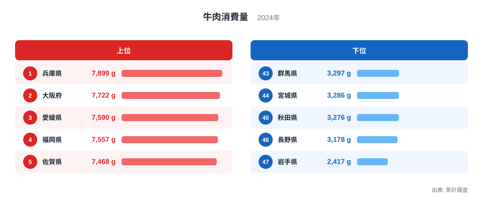
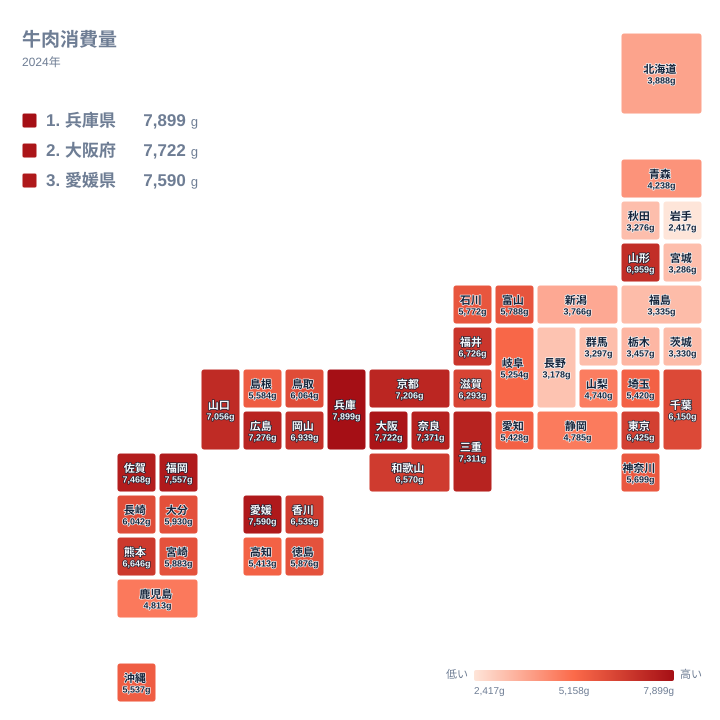
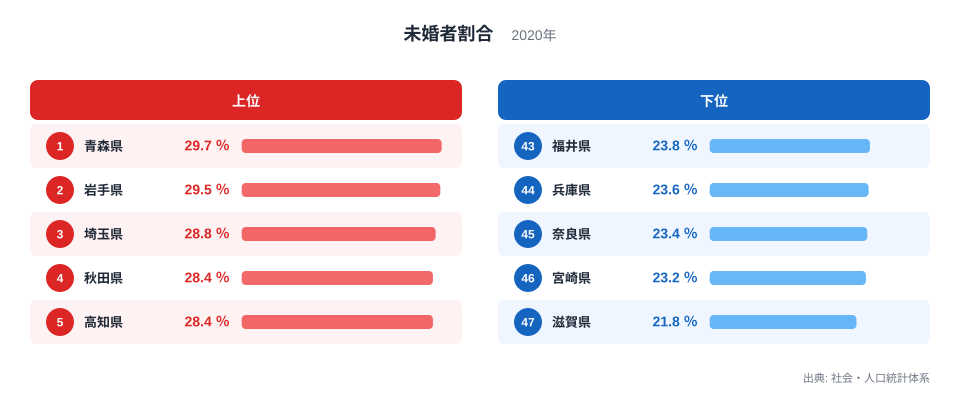
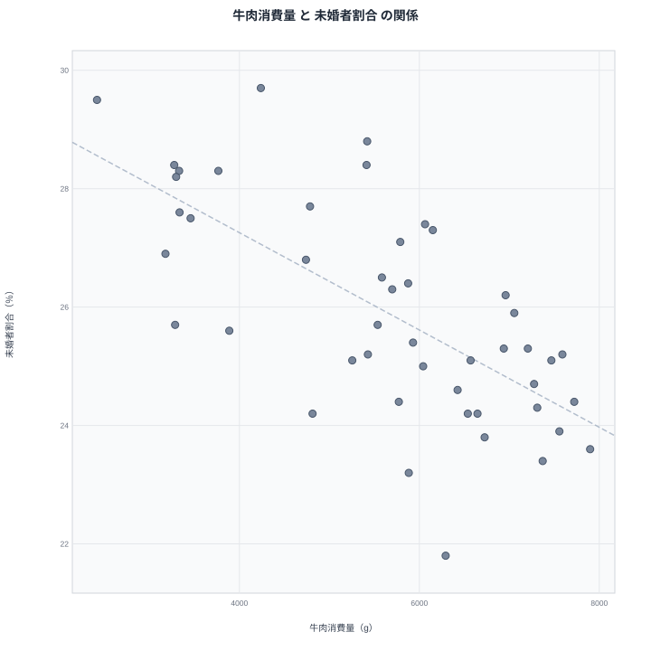

牛肉の消費量が多い県ほど、45〜49歳男性の未婚者割合が低い──47都道府県のデータを突き合わせると、相関係数−0.68という無視できない逆相関が現れます。牛肉1位の兵庫県は未婚率で44位。牛肉最下位の岩手県は未婚率2位。ここまできれいに反転すると、何か関係があるのではと思いたくなります。

先に結論を言うと、牛肉と結婚のあいだに直接の関係はありません。この逆相関は、牛肉消費が西日本に偏り、中高年男性の未婚率が東日本、とりわけ東北で高いという、2つの独立した「東西差」が重なって生まれた見かけの相関です。

ただし、見かけの相関だと分かったうえでデータを眺めると、日本の食文化の東西境界と、未婚率の地域構造という2つの本物のテーマが浮かび上がってきます。順番に見ていきます。

## 牛肉消費量ランキング──上位は見事に西日本です

1位は兵庫県で7,899gです。神戸牛のお膝元が面目躍如の首位で、2位は大阪府で7,722g、3位は愛媛県で7,590g、4位は福岡県で7,557g、5位は佐賀県で7,468gと続きます。6位の奈良県、7位の三重県まで含めて、上位は近畿・四国・九州がきれいに独占します。

下位はその正反対です。47位は岩手県で2,417g、46位は長野県で3,178g、45位は秋田県で3,276g、44位は宮城県で3,286g、43位は群馬県で3,297g。東北・信州・北関東が並び、1位の兵庫県と47位の岩手県の差は約3.3倍に達します。

これは「西の牛肉文化・東の豚肉文化」として知られる、日本の食の東西差そのものです。すき焼きに牛を使うか豚を使うか、肉じゃがの肉は何か──関西と関東で答えが分かれる定番の話題が、家計簿の数字にもはっきり刻まれています。

> [!NOTE]
> 牛肉消費量は家計調査に基づく二人以上世帯の年間購入量です（2024年）。家計調査の地域区分は都道府県全体ではなく県庁所在市（および政令指定都市）なので、正確には「神戸市の世帯」「盛岡市の世帯」の値を県の代表値として使っています。外食の焼肉やステーキは含まれず、家庭で調理するために買った牛肉の量です。

<source-link href="/ranking/beef-consumption-quantity">牛肉消費量ランキングをもっと見る</source-link>

## 地図で見る牛肉文化圏──境界は中部地方にあります

地図に落とすと、濃い色は近畿を中心に中国・四国・九州へ広がり、東へ行くほど急速に薄くなります。中部地方のあたりで色調がはっきり切り替わり、東日本はほぼ全域が淡い色です。7位の三重県までが濃く、その東側で一段落ちる境界線は、東西の食文化の分水嶺としてよく語られる地域とおおむね重なります。

この「西高東低」の分布をまず頭に入れてください。次に見る未婚率の地図は、これと逆向きの偏りを持っています。あわせて見る: [兵庫県の県データ](/areas/28000) / [岩手県の県データ](/areas/03000)

## 45〜49歳男性の未婚者割合──今度は東日本で高くなります

未婚者割合は、45〜49歳の男性のうち一度も結婚したことのない人の割合です（2020年国勢調査ベース）。1位は青森県で29.7%、2位は岩手県で29.5%、3位は埼玉県で28.8%、4位は秋田県で28.4%、5位は高知県で28.4%、6位は茨城県で28.3%と続きます。北東北の3県が最上位圏を占める構図です。

そのなかで3位に入る埼玉県は異彩を放ちます。東北が上位を占めるなかで首都圏の県が交ざるのは一見不思議ですが、単身者が大都市圏に集まり続ける人口移動の構造を考えると、むしろ自然な位置です。

下位は47位が滋賀県で21.8%、46位は宮崎県で23.2%、45位は奈良県で23.4%、44位は兵庫県で23.6%、43位は福井県で23.8%。西日本の県が目立ち、1位の青森県と47位の滋賀県の差は7.9ポイントあります。同じ世代の男性でも、住む県によって未婚の割合がこれだけ違うのです。

<source-link href="/ranking/unmarried-ratio-male-45-49">未婚者割合ランキングをもっと見る</source-link>

## 散布図で見る逆相関──r=−0.68

2つの指標を散布図にすると、右下がりの傾向がはっきり現れます。相関係数は−0.68。右下の「牛肉を食べて未婚率が低い」領域には兵庫県・奈良県・福岡県が、左上の「牛肉を食べず未婚率が高い」領域には青森県・岩手県・秋田県が位置します。

例外も確認しておきます。埼玉県は未婚率3位の28.8%と高い一方、牛肉消費は中位で、帯から右にずれます。高知県は西日本ながら未婚率5位の28.4%と高く、牛肉消費は32位の5,413gにとどまります。四国でも愛媛県は牛肉3位なのに対し高知県は下位と、西日本の内部でも食文化と未婚率はそれぞれ独立に動いていることが、これらの外れ方から読み取れます。

> [!WARNING]
> 相関は因果関係を意味しません。牛肉消費量は2024年の家計調査（県庁所在市ベース）、未婚者割合は2020年の国勢調査に基づく値で、調査年も対象も異なります。「牛肉を食べれば結婚につながる」といった読み方はできませんし、未婚であることを問題視する趣旨の指標でもありません。

## 真因を考える──2つの東西差がたまたま重なりました

人口規模の影響を統計的に取り除いてもこの相関は消えません。単純な相関係数が−0.678なのに対し、人口を統制した偏相関係数は−0.676と、ほぼ同じ強さのまま残ります。「都会か田舎か」では説明できない相関だということです。鍵は、両方の指標がそれぞれ別の理由で東西の軸に沿って動いていることにあります。

牛肉側の理由はすでに見ました。西日本の牛肉文化と東日本の豚肉文化という、明治以来の食文化の分布です。これは結婚とは何の関係もありません。

未婚率側はもう少し複雑です。中高年男性の未婚率が東北で高い背景としては、若い世代、特に女性の東京圏への流出が続き、地元に残る同世代の男女比が崩れてきたことや、雇用機会の構造がよく指摘されます。一方で未婚率が低い滋賀県や福井県は、製造業の安定した雇用と持ち家・同居型の家族構造を持つ県です。つまり未婚率の地図は、人口移動と雇用の地図なのです。

「西で低く東で高い」未婚率と、「西で多く東で少ない」牛肉消費。この2つが重なれば、機械的に負の相関が生まれます。牛肉は無実です。そして、この種の相関は探せばいくらでも見つかります。東西どちらかに偏る指標同士は、内容が無関係でも高い相関係数を出してしまうのです。

> [!TIP]
> 都道府県データで強い相関を見つけたら、まず両方の指標を地図にしてみてください。どちらも「東西」や「日本海側・太平洋側」で色が分かれるなら、第三の要因による見かけの相関を疑うのが定石です。人口・世帯・結婚まわりの統計は[人口動態のテーマページ](/themes/population-dynamics)にまとまっています。

## データ出典

- 牛肉消費量: 総務省統計局「家計調査」（二人以上世帯・県庁所在市および政令指定都市、2024年）
- 未婚者割合（男性45〜49歳）: 総務省統計局「社会・人口統計体系」（国勢調査報告に基づく2020年値）
- 相関係数・偏相関係数（人口を統制）は上記2指標の47都道府県値から算出
