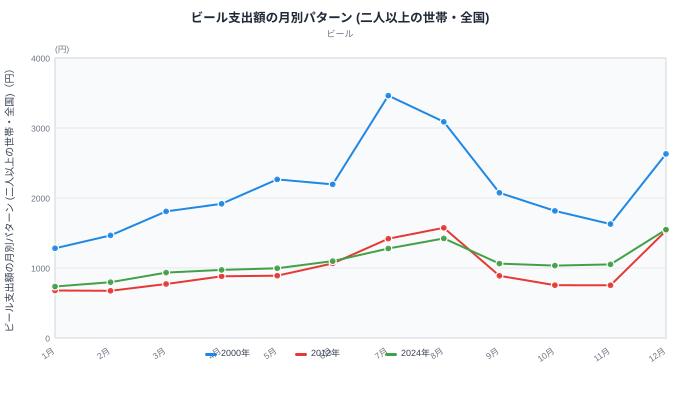
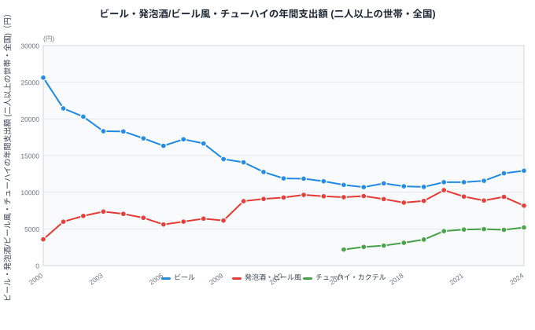
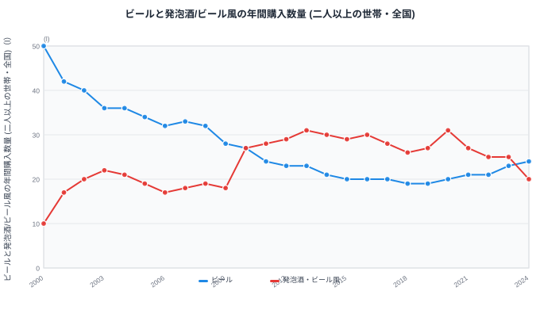

夏はビールがいちばんおいしい季節、と思っている方は多いと思います。ですが、家計調査でビールの月別支出額を追っていくと、その「旬」が静かに移動していることがわかります。2000年、家庭のビール支出がもっとも多かったのは7月でした。ところが2012年には8月に、そして2024年にはついに12月になっています。

この記事では、総務省の家計調査（家計収支編・二人以上の世帯・全国）から、2000年・2012年・2024年の月別ビール支出パターンと、ビール・発泡酒/ビール風・チューハイの24年間の支出額・購入数量の推移を確認します。ビールが夏の飲み物から年末のごちそうへと役割を変えていく様子と、その裏で起きている酒類全体の主役交代を、実際の数字で見ていきます。

## 支出のピークが夏から冬へ動いた

<source-link href="/ranking/beer-consumption-expenditure">ビール消費支出額ランキングをもっと見る</source-link>

> [!NOTE]
> このグラフは総務省「家計調査」（家計収支編・二人以上の世帯・全国）の月別支出額を、指定した3つの年で重ねたものです。都道府県別の順位ではなく、全国平均の1世帯当たり月間支出額を示しています。

全国のビール消費支出額を月別に見ると、2000年にもっとも多かったのは7月の3,463円で、次いで8月の3,088円、3番目が12月の2,630円でした。夏場の暑さとともに支出が伸びる、いかにも季節商品らしい形です。7月の支出額は12月より約32%多く、まだ「夏のビール」の存在感がはっきり残っていました。

ところが2012年になると、順番が入れ替わります。もっとも多いのは8月の1,575円で変わりませんが、2番目に多いのは12月の1,533円となり、7月の1,418円を上回りました。7月と12月の差は、わずか8%まで縮んでいます。

そして2024年、順番はさらに動きました。もっとも支出額が多い月は12月の1,549円で、2番目が8月の1,423円、3番目が7月の1,278円です。もっとも支出が少ない1月（736円）と比べると、12月は約2.1倍。そして12月は7月より約21%多くなっています。24年前とはまったく逆の形になったわけです。

## 24年で入れ替わった酒の主役

<source-link href="/ranking/happoshu-consumption-expenditure">発泡酒・ビール風アルコール飲料消費支出額ランキングをもっと見る</source-link>

> [!NOTE]
> チューハイ・カクテルは家計調査の品目分類（2020年改定）で独立した項目として集計されているのが2015年からのため、2000〜2014年の値は掲載できません。グラフも2015年以降の系列になっています。

月別のピーク移動の背景には、酒類全体の支出構成の変化があります。ビールの年間支出額は2000年の25,631円から2024年には12,933円まで減り、24年間で約49.5%減少しました。ほぼ半分の水準です。

一方、発泡酒・ビール風アルコール飲料消費支出額は2000年の3,580円から2003年の7,361円まで急に増えたあと、2006年には5,601円まで一度落ち込み、2010年に8,783円へ再び急増しています。その後も緩やかに伸びを続け、2020年には10,291円でピークを迎えました。2024年は8,163円と、ピークの2020年から約21%下がっていますが、それでもビールの3分の2近い水準を保っています。

さらに新しい担い手として伸びているのがチューハイ・カクテルです。データが取れる2015年の2,185円から2024年には5,198円まで、9年間で約2.4倍に増えました。発泡酒・ビール風が24年かけて2.3倍になったのと比べると、はるかに速いペースで支出額を伸ばしています。

あわせて見る: [チューハイ・カクテル消費支出額ランキング](/ranking/chuhai-consumption-expenditure)

こうした変化の結果、ビールと発泡酒・ビール風の支出額の差は劇的に縮まりました。2000年、ビールは発泡酒・ビール風の約7.2倍の支出がありましたが、2024年にはその差が約1.6倍まで縮んでいます。ビールが「唯一の選択肢」だった時代から、複数の酒が並び立つ時代へと変わったことがわかります。

この主役交代の進み具合は、都道府県によって差があります。都道府県別データ（家計調査、県庁所在市、2024年）を見ると、高知県はビール消費支出額が9,931円であるのに対し発泡酒・ビール風消費支出額は17,033円で、すでに発泡酒・ビール風がビールを上回っています。一方、京都府はビールが14,613円、発泡酒・ビール風が4,686円で、ビールが約3.1倍の水準を保っており、全国平均の約1.6倍という差よりもさらに「ビール優位」の傾向が強く残っています。全国で見えた主役交代は、地域によって進み方が大きく違うことがわかります。

## 数量で見ると、2024年に再逆転していた

<source-link href="/ranking/beer-consumption-quantity">ビール消費量ランキングをもっと見る</source-link>

> [!WARNING]
> ここまでの支出額は、酒税や物価の変動を含んだ名目値です。支出額の増減がそのまま「飲む量」の増減を意味するわけではないため、数量の推移とあわせて確認する必要があります。また、家計調査の対象は二人以上の世帯であり、チューハイの伸びが目立つ若年層を含む単身世帯は集計に含まれていません。単身世帯を含めれば、ここで見た変化とは異なる姿になる可能性があります。

ビール消費量（購入数量、リットル）で見ると、支出額とはまた違う動きが見えてきます。ビールの購入量は2000年の年間50Lから2024年には24Lまで減り、こちらもほぼ半分（52%減）です。発泡酒・ビール風は2000年の10Lから2003年の22Lまで急に増えたあと、2006年には17Lまで一度落ち込み、2010年には27Lへ急増してビールと並び、2011年には28L対24Lでビールを上回りました。

以降、発泡酒・ビール風の数量は2013年・2020年に31Lまで達し、2011年から2023年までの13年間、一貫してビールより多く飲まれ続けています。ところが2024年、状況が動きました。ビールの購入量は23Lから24Lへわずかに増えた一方、発泡酒・ビール風は25Lから20Lへと20%減り、ビールが再び発泡酒・ビール風を上回ったのです。

[仮説] この再逆転の背景には、酒税の段階的な一体化があるかもしれません。国税庁は2020年10月・2023年10月・2026年10月の3段階で、ビール・発泡酒・新ジャンルの酒税率を「350ml換算154円」に統一する改正を進めています（[国税庁「酒税関係法令等の改正」](https://www.nta.go.jp/taxes/sake/kaisei/mokuji.htm)、確認日: 2026-09-06）。ビールの税率が下がり発泡酒・新ジャンルの税率が上がる方向の改正のため、両者の価格差が縮まり、ビールへ回帰する動きが生まれた可能性がありますが、これは1年分の反転だけから断定できる話ではなく、今後数年分の推移を見て検証する必要があります。

## なぜ12月にビールが集まるのか

支出額・数量のどちらで見ても、ビールにとって12月の存在感が大きくなっているのは共通しています。理由として考えられるのは、お歳暮や忘年会・年末年始の集まりといった贈答・行事需要です。かつては真夏の水分補給・暑気払いとして飲まれることが多かったビールが、冷房の普及や家庭での飲酒スタイルの変化とともに夏場の突出した需要を失う一方で、年末のごちそう・贈り物としての役割が相対的に重みを増した、という見方ができます。

[仮説] ただし、この記事のデータだけでは「なぜ」の部分を証明することはできません。冷房の普及率や贈答用ビールの出荷統計、忘年会の開催件数といった別のデータと突き合わせる必要があり、現時点では月別支出パターンの変化から読み取れる仮説にとどまります。

> [!TIP]
> 酒税の一体化は2026年10月に完了する予定です。税率の差がなくなれば、ビールと発泡酒・新ジャンルの価格差もさらに縮まり、月別の支出パターンや数量の逆転がどう動くか、来年以降のデータでも追いかける価値があります。あわせて、[ビールと発泡酒の県別の違い](/blog/beer-vs-happoshu-shift)も参考にしてみてください。

年収による酒への支出の違いに関心がある方は、[年収階級別に見たお酒への支出](/blog/income-quintile-alcohol)もあわせてご覧ください。ビール以外の経済関連の指標は、[経済カテゴリの一覧](/category/economy)からまとめて確認できます。

## まとめ

- ビール支出額がもっとも多い月は、2000年は7月（3,463円）、2012年は8月（1,575円）、2024年は12月（1,549円）と移り変わりました
- 2024年の12月は7月より約21%多く、24年前とは逆の季節パターンになっています
- ビールの年間支出額は2000年から2024年で約49.5%減少（ほぼ半分の水準）した一方、発泡酒・ビール風は同期間で約2.3倍、チューハイ・カクテルは2015年からの9年で約2.4倍に増えました
- 購入数量では2011〜2023年の13年間、発泡酒・ビール風がビールを上回っていましたが、2024年にビールが再逆転しました
- 支出額はビールから発泡酒・チューハイへ主役が広がる一方、数量では2024年に「原点回帰」の動きも見られます

## データ出典

- 総務省統計局「家計調査 家計収支編 二人以上の世帯 品目分類（2020年改定）」月次・金額（統計表ID: 0003343671）
- 総務省統計局「家計調査 家計収支編 二人以上の世帯 品目分類（2020年改定）」月次・数量（統計表ID: 0003343670）
- 集計期間は2000年〜2024年、対象は全国・二人以上の世帯の1世帯当たり平均です。e-Stat（政府統計の総合窓口）経由で取得。
