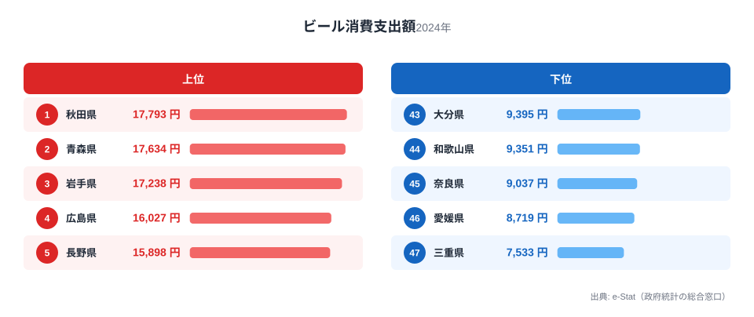
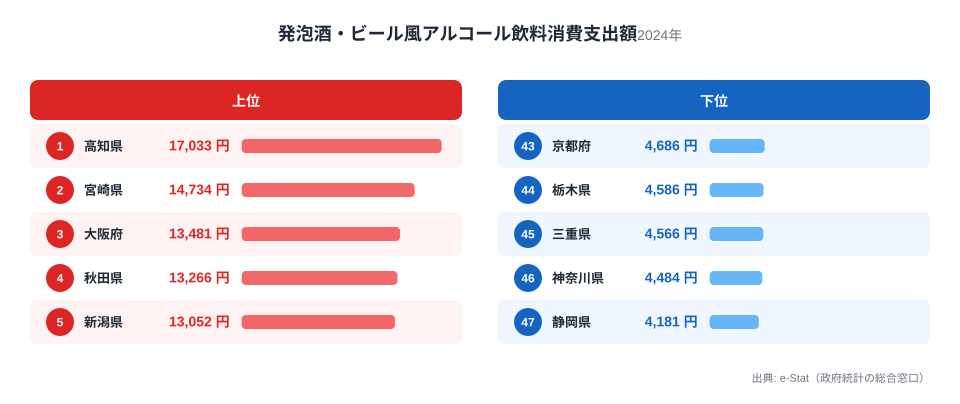

同じ「晩酌のビール」でも、中身は県によって違います。総務省家計調査（2024年）を見ると、
ビール消費支出は秋田県が17,793円で全国1位、最下位の三重県は7,533円と2.4倍の差があります。
一方で発泡酒の消費支出は高知県が17,033円で1位、最下位は静岡県の4,181円で4.1倍の開きです。

この記事で見えてくるのは、「ビールをよく飲む県」と「発泡酒をよく飲む県」が必ずしも一致しないということです。
秋田県はビール1位ですが発泡酒では4位、逆に発泡酒1位の高知県はビールでは41位まで下がります。
背景には酒税の構造があります。ビール・発泡酒・新ジャンル（いわゆる「第3のビール」）は税率が段階的に異なり、
家計の選び方そのものを動かしてきました。まずは酒税の変遷を押さえてから、県ごとの分かれ方を見ていきます。

> [!NOTE]
> 「発泡酒」は麦芽比率が低い、または副原料を使うことで酒税法上ビールと区別される酒類です。ビールより税率が低く設定されてきたため、
> 1990年代半ば以降に「ビールに似た低価格の選択肢」として急速に普及しました。さらに税率の低い「新ジャンル（第3のビール）」は
> 家計調査の分類上、発泡酒とは別区分になっているため、本記事の発泡酒データには新ジャンルは含まれません。

## 酒税が変えた「ビールの立ち位置」

酒税法上、ビール・発泡酒・新ジャンルには長年税率差があり、酒税が低いほど小売価格を抑えやすい構造でした。
この差が、家計にとって「ビールは特別な日の一本」「発泡酒・新ジャンルは日常の晩酌」という使い分けを生んだと考えられます。
実際、家計調査の品目別支出額を見ると、ビールは秋田・青森・岩手という東北勢が上位を占め、
発泡酒は高知・宮崎・大阪という西日本・都市部が上位に来るという、はっきりした構図の違いが見えます。

> [!WARNING]
> 酒税は2020年10月・2023年10月・2026年10月と段階的に税率差が縮小する制度改正が進んでいます（ビール減税・発泡酒/新ジャンル増税の方向）。
> 本記事のデータは2024年時点のもので、税率差が縮小した後の消費行動は今後変化する可能性があります。年をまたいで比較する際は、
> どの税制下のデータかを必ず確認してください。

ビール消費支出の上位は秋田県17,793円・青森県17,634円・岩手県17,238円と東北3県が並び、4位広島県16,027円、
5位長野県15,898円と続きます。最下位は三重県7,533円、46位愛媛県8,719円、45位奈良県9,037円で、
西日本・近畿圏に偏っています。東北勢が上位に集中する理由の一つは、寒冷地では屋内で過ごす時間が長く、
晩酌の頻度そのものが高い生活習慣があることです。ビールは新ジャンルや発泡酒より単価が高いため、
消費量だけでなく「割安な代替を選ばない傾向」も支出額を押し上げている可能性があります。

<source-link href="/ranking/beer-consumption-expenditure">ビール消費支出ランキングをもっと見る</source-link>

## 発泡酒は西日本・都市部が上位

発泡酒消費支出は高知県17,033円が1位で、2位宮崎県14,734円、3位大阪府13,481円、4位秋田県13,266円、
5位新潟県13,052円と続きます。最下位は静岡県4,181円、46位神奈川県4,484円、45位三重県4,566円です。
ビールの上位が東北中心だったのに対し、発泡酒の上位には高知・宮崎・大阪という西日本と都市部が混ざっており、
単純な「寒冷地は酒好き」では説明がつきません。高知県は酒どころとして知られる土地柄で晩酌文化が根強く、
価格を抑えられる発泡酒が日常の選択肢として定着したと考えられます。大阪府のように都市部で発泡酒支出が高い場合は、
世帯当たりの飲酒頻度に加えて、コンビニ・スーパーでの購入のしやすさも影響している可能性があります。

<source-link href="/ranking/happoshu-consumption-expenditure">発泡酒消費支出ランキングをもっと見る</source-link>

## ビールと発泡酒、両方少ない県・両方多い県

秋田県はビール1位（17,793円）でありながら発泡酒でも4位（13,266円）と、両方の支出が高い「酒どころ」型です。
逆に三重県はビール最下位（7,533円）に加え発泡酒も45位（4,566円）と、両方の酒類で支出が低い水準にとどまります。
一方で高知県はビールが41位（9,931円）と低めなのに発泡酒は1位（17,033円）、静岡県はビールが29位（11,565円）
に対し発泡酒は最下位（4,181円）というように、「ビール党」寄りか「発泡酒党」寄りかで県ごとに個性が分かれています。

> [!TIP]
> この2つの指標を人口あたりの酒類全体支出と合わせて見ると、「そもそも飲酒量が多い県」なのか「価格帯の選び方が違うだけ」
> なのかを切り分けやすくなります。[日本酒の消費量](/blog/sake-consumption-prefecture-gap)や
> [ウイスキーの消費量](/blog/whisky-consumption-prefecture-gap)など他の酒類ランキングと重ねて確認すると、
> 県ごとの飲酒スタイルの全体像がより見えてきます。

三重県のようにビール・発泡酒とも下位に沈む県がある一方、秋田県のように両方で上位を占める県もあり、
「酒類全体への支出が多い/少ない」という単純な軸と、「税率の違う酒類のどちらを選ぶか」という軸の
両方が重なって現在の地域差を作っていると見られます。1位の秋田県は[都道府県ページ](/areas/05000)、
最下位の三重県は[都道府県ページ](/areas/24000)でほかの指標も確認できます。

## まとめ

- ビール消費支出は秋田県が17,793円で1位、最下位は三重県7,533円で2.4倍差
- 発泡酒消費支出は高知県が17,033円で1位、最下位は静岡県4,181円で4.1倍差
- ビール上位は東北勢（秋田・青森・岩手）、発泡酒上位は高知・宮崎・大阪など西日本・都市部が中心
- 三重県はビール・発泡酒とも下位、秋田県は両方で上位という対照的な県が存在する
- 酒税の税率差が、家計の「ビールか発泡酒か」の選択に影響してきたと考えられる

## データ出典

総務省統計局「家計調査」（2024年、政府統計の総合窓口 e-Stat 経由で整備）を用いています。
