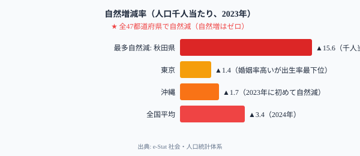
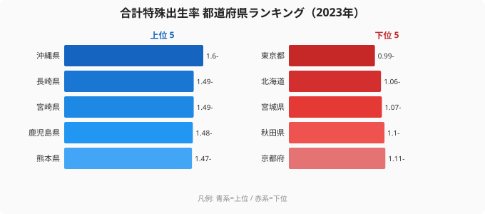

「東京は婚姻率が全国トップクラスなのに、出生率は0.99で全国最下位」──このデータが少子化の本質的な構造を明らかにしています。

**2023年、日本で生まれた赤ちゃんは約72.7万人。亡くなった人は約157.6万人。** 差し引き約84.8万人──「中核市ひとつ分」が消えました。そして**全47都道府県すべてで自然増はゼロ**。2023年には[沖縄県](/areas/47000)まで自然減に転落しました。

なぜ東京は婚姻率が高いのに出生率が最低なのか。その答えは「結婚 → 子ども」という連鎖が大都市で機能しなくなっていることを示しています。

> [!NOTE]
> 本記事のデータはe-Stat 社会・人口統計体系（出生数・死亡数・合計特殊出生率・婚姻率・未婚率・初婚年齢）を使用しています。合計特殊出生率は1人の女性が一生の間に産む子どもの数の推計値です。

## 全47都道府県で自然増はゼロ──沖縄の転落

<!-- 自然増減率の都道府県ランキング -->

[秋田県](/areas/05000)は人口千人当たり15.6人の自然減──全国で最も速いスピードで人口が縮小しています。2045年までに人口が約41%減少する見込みで、青森・山形・高知・長崎も30%以上の減少が推計されています。

一方、[東京都](/areas/13000)は微増〜横ばい。しかし東京の「自然減の少なさ」は出生率の高さではなく、若者の転入超過が補っているためです。

<source-link href="/ranking/births">出生数ランキングをもっと見る</source-link>
<source-link href="/ranking/population-growth-rate">人口増減率ランキングをもっと見る</source-link>

## 合計特殊出生率ランキング──東京0.99の意味

人口を維持するのに必要な「人口置換水準」は約2.07。しかし日本全体のTFRは**1.20**（2024年速報値）で、置換水準の6割にも満たない状態です。

**全47都道府県で、人口を自力で維持できる県はゼロ**。沖縄県の1.60は全国トップですが、置換水準（2.07）には遠く及びません。

東京都は全国で唯一、TFRが「1」を下回りました（0.99）。これは東京で暮らす女性が、統計上は1人未満の子どもしか産んでいない計算です。

> [!TIP]
> 出生率の上位には九州の県（沖縄1.60、鹿児島・宮崎1.48など）が集まる一方、下位は東京0.99、北海道1.06・宮城1.07の大都市圏と東北が並びます。地方のほうが出生率は高い──しかし若い世代が都市部に流出するため、出生率が高い地方でも人口を維持できていません。

<source-link href="/ranking/total-fertility-rate">合計特殊出生率ランキングをもっと見る</source-link>

## 東京の逆説──婚姻率トップなのに出生率最下位の構造

ここが少子化の本質です。東京都は婚姻率が全国トップクラスであるにもかかわらず、出生率は最下位（0.99）です。

他の先進国では婚外子（結婚していない親から生まれた子）が出生の30〜60%を占めますが、日本では婚外子の割合が**約2.4%**と極めて低い。出生のほぼすべてが婚姻関係の中で起きています。

これは「**結婚すれば子どもが生まれる**」という連鎖が成立している社会構造を意味します。だとすれば、東京の婚姻率の高さはなぜ出生率に結びつかないのか。

答えは「**住居費・長時間労働・保育所不足**」です。東京で結婚した夫婦は、子どもを持つための経済的・環境的ハードルが地方と比べて極めて高い。

<data-source url="https://www.e-stat.go.jp/dbview?sid=0000010101" label="e-Stat 社会・人口統計体系"></data-source>

<source-link href="/correlation?x=total-fertility-rate&y=marriages-per-total-population">出生率×婚姻率の相関をインタラクティブに確認する</source-link>

## 少子化の真因──「産まない」ではなく「結婚しない」構造

散布図が示す東京の逆説は例外ですが、日本全体で見ると「**結婚しない → 子どもが生まれない**」という連鎖が少子化の主因です。

男性の45〜49歳未婚率：1980年の2.6% → 2020年の**25.8%**。女性：4.4% → **17.0%**。かつて「結婚して当たり前」だった社会は、いまや**男性の約4人に1人が結婚しないまま50歳を迎える**社会へと変貌しました。

晩婚化も加速しています。1975年に夫27.0歳・妻24.7歳だった平均初婚年齢は、2023年には夫31.1歳・妻29.7歳に。**夫は4.1歳、妻は5.0歳**遅くなりました。30歳を超えてから出産を始めると、2人目・3人目を望んでも時間的・体力的な制約が大きくなります。

> [!WARNING]
> 「未婚率が高い = 本人が結婚を望んでいない」ではありません。内閣府の意識調査では、未婚者の多数が「いずれは結婚したい」と答えています。経済的余裕の不足、長時間労働、出会いの機会の減少など**社会構造の要因**が結婚と出産のハードルを上げています。

<data-source url="https://www.e-stat.go.jp/dbview?sid=0000010201" label="e-Stat 社会・人口統計体系（未婚者割合）"></data-source>

## まとめ──「結婚支援だけでは足りない」理由

東京の逆説（婚姻率高・出生率最低）と全国の構造（未婚率上昇 → 出生率低下）を重ね合わせると、少子化対策に必要なことが見えてきます。

「結婚支援だけでは足りない」──東京がそれを証明しています。結婚した夫婦が安心して子どもを持てる環境──経済的支援、働き方改革、住居政策、保育環境の整備──が揃って初めて出生率の改善が期待できます。

そして地方は「出生率が高くても若者が流出する」という別の壁を抱えています。人口維持には出生率の改善と同時に、若者が地域に残る・戻る経済的インセンティブが必要です。

## データ出典

- e-Stat 社会・人口統計体系（人口動態）statsDataId: 0000010101
- e-Stat 社会・人口統計体系（未婚者割合）statsDataId: 0000010201
- 国立社会保障・人口問題研究所「日本の地域別将来推計人口」2023年推計
