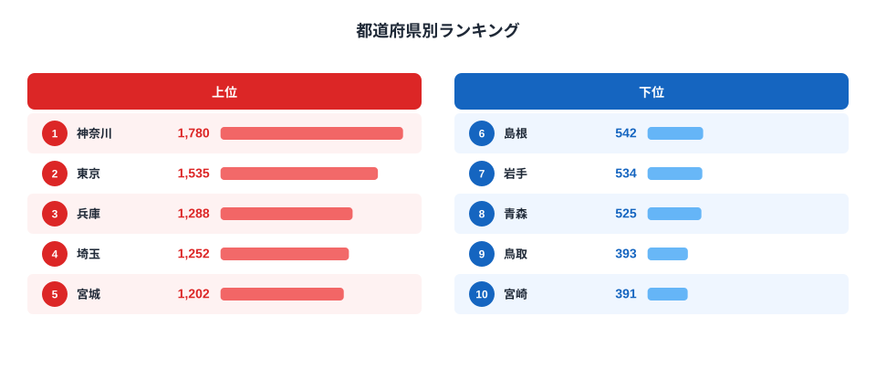

紅茶消費支出額は、総務省の家計調査に基づく「都道府県庁所在市の二人以上世帯が1年間に紅茶に使った金額」を示す指標です。2024年のデータでは、1位の神奈川県が1780円、最下位の宮崎県が391円と、その差は4.6倍にのぼります。

コーヒーがどの県でも一定の支出があるのに対し、紅茶は県ごとの差がはっきり出やすい飲み物です。この記事では、紅茶をよく買う県とそうでない県の分布を確認し、なぜ大都市圏や港町が上位に集まりやすいのかを見ていきます。

> [!NOTE]
> この指標は「紅茶(ティーバッグ・リーフ・インスタント紅茶飲料を含む)」への年間支出額です。飲食店での喫茶代は含まれず、あくまで家庭での購入額を集計したものです。都道府県庁所在市のデータのため、県内の他都市の消費傾向とは異なる場合があります。

## 上位5県と下位5県

<source-link href="/ranking/black-tea-consumption-expenditure">紅茶消費支出額ランキングをもっと見る</source-link>

上位は[神奈川](/areas/14000)(1780円)、東京(1535円)、兵庫(1288円)、埼玉(1252円)、宮城(1202円)という顔ぶれです。神奈川・東京・埼玉は首都圏、兵庫は関西の大都市圏、宮城は東北最大の都市圏と、いずれも人口規模の大きい都市部が並んでいます。

ここで注目したいのが3位の兵庫県です。兵庫の県庁所在地は神戸市で、家計調査のランキングは県庁所在市の消費行動を代表しています。神戸は1868年の開港以来、外国人居留地を中心に西洋の生活文化が根づいた港町です。異人館街に象徴されるように、紅茶・洋菓子・パン食といった西洋由来の食習慣がまちの暮らしに溶け込んでおり、モーニング文化や喫茶店文化が盛んな土地としても知られています。紅茶が「輸入された嗜好品」から「日常の飲み物」へ定着した歴史の長さが、支出額の高さに表れていると考えられます。同じく開港場だった横浜を県庁所在地に持つ神奈川が1位であることも、この見方と符合します。

一方で、東京・埼玉・宮城のように開港の歴史を持たない大都市圏も上位に入っており、港町であることだけが理由ではありません。紅茶は輸入品を中心とした嗜好品で、専門店やデパ地下、輸入食品店で扱う銘柄も多い飲み物です。こうした店舗が集積しやすい大都市圏では、紅茶を日常的に選択肢に入れる世帯が相対的に多くなると考えられます。また紅茶は緑茶やコーヒーに比べて単価が高いブランド品も多く、可処分所得の高い世帯が多い地域で支出額が押し上げられやすい面もあります。つまり上位県には「都市部特有の所得・店舗アクセスの効果」と「神奈川・兵庫に限られる港町固有の食文化効果」の、性質の異なる2つの要因が重なっていると整理できます。

## 最下位グループの特徴

下位は宮崎(391円)、鳥取(393円)、青森(525円)、島根(542円)、岩手(534円)という並びです。人口規模が比較的小さく、地方圏に位置する県が目立ちます。

> [!WARNING]
> このランキングは「金額」であり「杯数」ではありません。同じ量を飲んでいても、割安な大容量パックを選ぶ県では支出額が低く出ます。地域差の一部は購買行動の違いによるものである可能性があり、消費量そのものの差とは限らない点に注意が必要です。

下位県に共通するのは、紅茶専門店やセレクトショップよりも、地元の茶生産・緑茶文化が根付いている地域が多いことです。宮崎は県内に高千穂などの茶産地を抱え、鹿児島とともに九州南部は緑茶・番茶の生産・消費が盛んな地域として知られています。岩手・青森・島根も、急須で緑茶を淹れて飲む習慣が家庭に根強く残る地方圏です。**[仮説]** 緑茶の生産・消費が盛んな地域ほど、紅茶が「わざわざ選ぶ嗜好品」という位置づけにとどまり支出が伸びにくい、という代替関係が働いている可能性があります。ただし本データの緑茶消費支出額ランキングは直近が2007年時点の値までしか整備されておらず、2024年の紅茶データと直接比較できないため、この記事では検証できていません。今後、両指標の同年データが揃った時点での相関確認が課題です。

もうひとつの要因として、下位県の多くが喫茶店・カフェの集積が薄い地方都市である点も挙げられます。神戸のようなモーニング喫茶文化、東京や横浜のような輸入食品店・専門店の多さと対照的に、宮崎・鳥取・島根の県庁所在市は人口規模が小さく、紅茶を「外で飲む・買う」機会そのものが都市部より少ないと考えられます。都市の店舗集積という切り口で見ると、上位グループの「店舗アクセスの良さ」と下位グループの「店舗アクセスの薄さ」が鏡合わせの関係になっていることがわかります。

## 発見: なぜ港町・大都市圏が強いのか

紅茶は歴史的に、開港とともに日本に持ち込まれた飲み物です。横浜(神奈川)や神戸(兵庫)は開港以来、西洋文化の窓口として紅茶・洋菓子・パン食文化が根付いてきた港町として知られています。今回のデータでも神奈川が1位、兵庫が3位と、この2県が上位に入っています。

なかでも神戸は象徴的な例です。神戸港は横浜港と並ぶ日本の代表的な開港場で、外国人居留地には英国人・フランス人など西洋の商人・技術者が数多く暮らしました。彼らの生活様式とともに紅茶とアフタヌーンティーの習慣、パンや洋菓子を作る技術が神戸の街に持ち込まれ、今日でもモーニング喫茶(トーストと紅茶・コーヒーがセットになる朝食文化)が根付く土地として知られています。異人館街や旧居留地には老舗の紅茶専門店・洋菓子店が今も営業を続けており、こうした歴史的な店舗の蓄積が、家庭での紅茶購入にも波及していると考えられます。

> [!TIP]
> 紅茶と洋食文化の結びつきは、パン消費のランキングと合わせて見るとより立体的に見えてきます。神戸のように「パンも紅茶も強い」県があるかどうかは、[パン消費ランキングの記事](/blog/bread-vs-rice-expenditure)も参考にしてください。

一方で、東京・埼玉・宮城のように港町ではない大都市圏も上位に入っており、「港町だから紅茶が強い」と単純には言い切れません。むしろ「人口規模が大きく可処分所得が高い都市部ほど、紅茶という嗜好品にお金をかける世帯が多い」という所得要因が主軸で、そこに神奈川・兵庫のような紅茶文化の歴史的蓄積が上乗せされている構図と見るのが妥当です。**[仮説]** 紅茶はコーヒーよりも所得弾力性が高い(所得が上がるほど支出が増えやすい)飲み物である可能性があります。これを検証するには県民所得データとの相関分析が必要で、今後の検証課題です。

まとめると、上位県の強さは単一の理由では説明しきれません。神奈川・兵庫は「港町由来の紅茶文化」と「都市部の所得・店舗アクセス」の両方が重なった特別なケースで、東京・埼玉・宮城は「港町由来」の要因を持たない代わりに「都市部の所得・店舗アクセス」だけで上位に食い込んでいます。逆に下位県は、地方圏で店舗アクセスが薄いことに加え、緑茶という国産の代替飲料がすでに生活に根付いているため、紅茶にあえて支出を振り向ける動機が弱いという、複数の要因が重なった結果と整理できます。

コーヒーの消費についても地域差があります。[コーヒー消費のランキング記事](/blog/coffee-consumption-prefecture-gap)と比較すると、コーヒーは全国的に幅広く飲まれる一方、紅茶は都市部への偏りがより強く出る傾向がうかがえます。両者を見比べることで、日本の家庭でどちらの飲み物がどのような立ち位置にあるかが見えてきます。

## まとめ

- 1位: 神奈川県 1780円
- 最下位: 宮崎県 391円
- 倍率: 約4.6倍
- 地域パターン: 首都圏・近畿・宮城など大都市圏が上位、地方の内陸県が下位に偏る傾向
- 特筆点: 港町の神奈川・兵庫が上位に入り、紅茶と洋食文化の歴史的結びつきがうかがえる一方、東京・埼玉のような非港町の大都市圏も上位に入るため、所得規模の影響も大きいと考えられる

## データ出典

総務省統計局「家計調査」(都道府県庁所在市及び政令指定都市ランキング、2024年)をもとに集計。e-Stat経由でデータを取得・整備しています。
