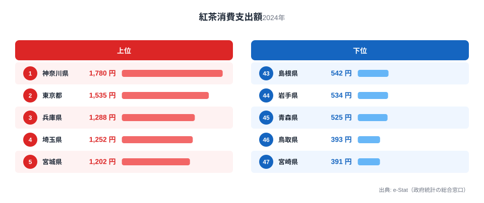
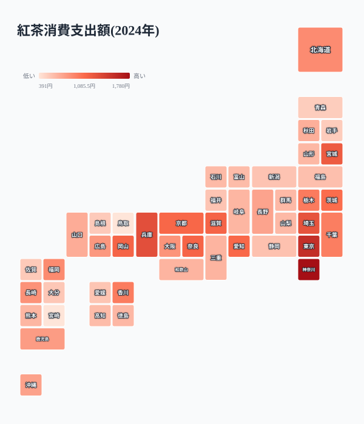
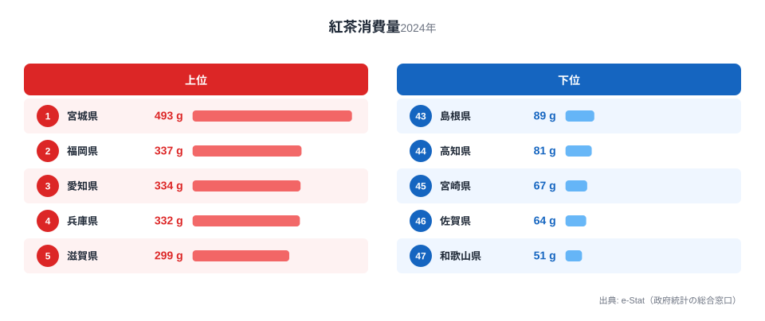
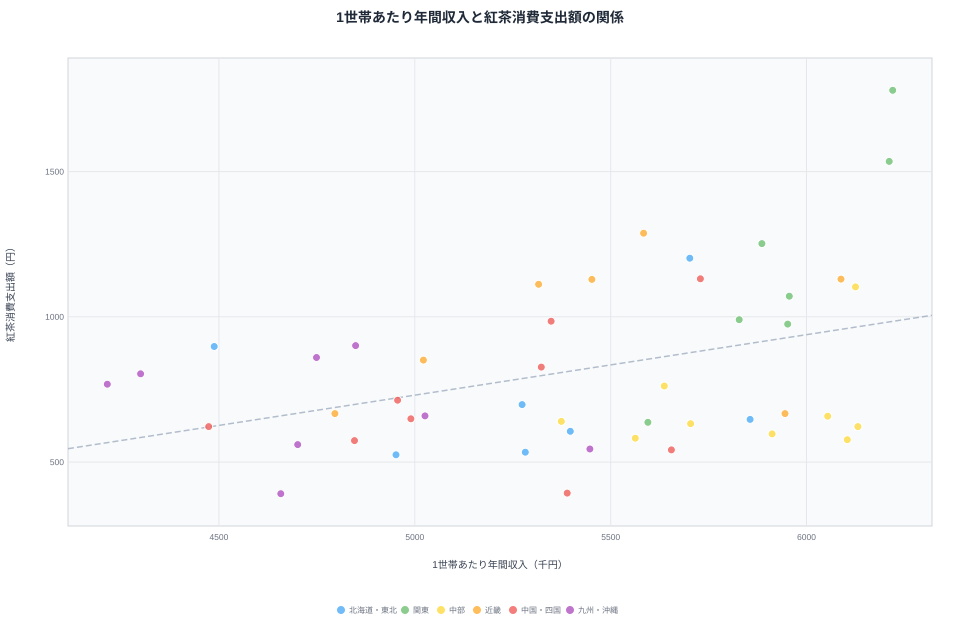

紅茶消費支出額は、総務省「家計調査」で都道府県庁所在市の二人以上世帯が1年間に紅茶へ使った金額を示す指標です。2024年のデータでは、1位の[神奈川県](/areas/14000)が1,780円、最下位の[宮崎県](/areas/45000)が391円で、その差は4.6倍にのぼります。

紅茶は必需品ではなく嗜好品なので、「お金に余裕がある県ほどよく飲むのでは」と考える人も多いはずです。そこで1世帯あたり年間収入(2019年度・社会・人口統計体系)と紅茶消費支出額を都道府県コードで突き合わせてみたところ、相関係数は0.39というやや弱い正の相関にとどまり、支出額の上位10県のうち年収でも上位10県に入っていたのはわずか4県でした。

この記事では、紅茶消費支出額の上位・下位の顔ぶれ、消費「量」との違い、そして年収との関係が実際どこまで一致するのかを、47都道府県のデータで確認していきます。

## 紅茶消費支出額ランキング — 1位は神奈川、最下位は宮崎

上位5県は神奈川県1,780円、東京都1,535円、兵庫県1,288円、埼玉県1,252円、宮城県1,202円と続きます。神奈川・東京・埼玉は南関東で固まっていますが、3位の兵庫県を筆頭に、7位滋賀県1,130円、8位奈良県1,129円、9位京都府1,112円と、近畿の府県が上位10県のうち4つを占めているのが目立ちます。

下位5県は43位島根県542円、44位岩手県534円、45位青森県525円、46位鳥取県393円、47位宮崎県391円でした。上位と下位を比べると、紅茶消費支出額は単純な東西の差ではなく、大都市圏と近畿の一部に偏って高く、東北・山陰・九州の一部で低いという分布になっています。

> [!NOTE]
> 紅茶消費支出額は家計調査のデータで、対象は47都道府県すべてではなく「都道府県庁所在市」の二人以上世帯です。県内の農村部や小都市の消費傾向まではこの数字だけでは分かりません。

<source-link href="/ranking/black-tea-consumption-expenditure">紅茶消費支出額ランキングをもっと見る</source-link>

## 地理でみる紅茶消費 — 近畿・南関東はなぜ多いのか

地図で見ると、紅茶消費支出額の上位10県は近畿4県(兵庫・滋賀・奈良・京都)、南関東3県(神奈川・東京・埼玉)、東北1県(宮城)、山陽1県(岡山)、東海1県(愛知)に集中しています。一方の下位10県は九州3県、山陰2県、東北2県、甲信越1県、北陸1県、四国1県に分散しており、特に九州と山陰で低い値がまとまっています。

紅茶が少ない県は、単に「お茶をあまり飲まない県」というわけではありません。それは緑茶消費支出額と比べるとよく分かります。紅茶消費支出額が全国最下位(391円)の[宮崎県](/areas/45000)は、緑茶消費支出額では4,801円で全国2位です。紅茶と緑茶の消費支出額の相関係数は0.10とほぼ無相関で、緑茶をよく飲む県が紅茶を避けるという単純な入れ替わりが全県に当てはまるわけではありませんが、宮崎県のように「お茶自体は飲むが緑茶を選ぶ」県が紅茶の下位に混ざっていることは、紅茶消費支出額の低さを所得の低さだけで説明できないことを示しています。ちなみに緑茶消費支出額の全国1位は静岡県(7,664円)で、紅茶消費支出額では37位(597円)と対照的です。静岡県は国内有数の茶産地としても知られており、地元での茶葉消費の習慣が紅茶より緑茶に向きやすいのかもしれません。

では紅茶消費支出額が高い県は、単に嗜好品全般によくお金を使う県なのでしょうか。コーヒー消費支出額と比べると、答えは県によって分かれます。紅茶消費支出額3位の兵庫県はコーヒー消費支出額でも1位(10,098円)、7位の滋賀県も2位(9,799円)、8位の奈良県も7位(9,166円)と、近畿の上位県はコーヒーでも上位に入っており、紅茶とコーヒーの消費支出額の相関係数は0.45で、年収との相関(0.39)より強い相関になっています。一方で紅茶消費支出額が46位(393円)の[鳥取県](/areas/31000)はコーヒー消費支出額では6位(9,235円)、紅茶消費支出額30位(647円)の山形県もコーヒー消費支出額3位(9,446円)と、コーヒーはよく飲むが紅茶はあまり選ばない県も存在します。兵庫・滋賀・奈良のように紅茶とコーヒーの両方に支出する県がある一方、鳥取・山形のようにコーヒーは飲むが紅茶は選ばない県もあり、「紅茶を選好する県」と「嗜好品全般にお金を使う県」は必ずしも同じではないことが分かります。

> [!WARNING]
> 近畿の県が紅茶・コーヒーともに上位に入りやすいことはデータから確認できますが、その理由を喫茶文化や洋菓子文化と断定するのは早計です。[仮説] 近畿の都市部は喫茶店・カフェの店舗密度が高く、それが家庭での紅茶購入にもつながっている可能性がありますが、検証には都道府県別の喫茶店数データとの突き合わせが必要です。

<source-link href="/ranking/black-tea-consumption-expenditure">紅茶消費支出額ランキングをもっと見る</source-link>
<source-link href="/ranking/green-tea-consumption-expenditure">緑茶消費支出額ランキングをもっと見る</source-link>
<source-link href="/ranking/coffee-consumption-expenditure">コーヒー消費支出額ランキングをもっと見る</source-link>

## 消費量ランキングとの違い — 大量消費の宮城、少量高単価の和歌山

紅茶消費「量」で見ると、1位は宮城県493g、2位福岡県337g、3位愛知県334g、4位兵庫県332g、5位滋賀県299gです。下位は44位高知県81g、45位宮崎県67g、46位佐賀県64g、47位和歌山県51gでした。

ここで面白いのは、支出額と消費量の順位が必ずしも一致しないことです。宮城県は消費量では全国1位ですが、支出額では5位(1,202円)にとどまります。1g あたりの単価を計算すると1,202円÷493g=約2.44円/gで、これは47都道府県の平均(約4.99円/g)の半分程度、全国で最も安い水準です。つまり宮城県は大量の紅茶を比較的安く買っているといえます。

対照的に和歌山県は消費量が51gで全国最下位ながら、支出額は667円(26位)です。1g あたりの単価は667円÷51g=約13.08円/gで、これは47都道府県で最も高く、平均の2.6倍にあたります。和歌山県は紅茶をたくさんは飲まないものの、飲むときは単価の高い紅茶を選んでいる可能性がうかがえます。

> [!TIP]
> ランキングの「量」と「支出額」は別の指標です。量が多い県が支出額でも上位とは限らず、単価(支出額÷消費量)まで見ることで「よく飲む県」と「良いものを少し飲む県」の違いが見えてきます。この記事のように2つの指標を重ねて見ると、1つのランキングだけでは分からない消費行動の違いに気づけます。

<source-link href="/ranking/black-tea-consumption-quantity">紅茶消費量ランキングをもっと見る</source-link>

## 発見 — 年収との相関は「4割」にとどまる

1世帯あたり年間収入(2019年度)と紅茶消費支出額(2024年)を47都道府県で突き合わせると、相関係数は0.39でした。相関係数は1に近いほど強い関係、0に近いほど無関係を意味するので、0.39は「弱い正の相関」にとどまります。

もう少し具体的に見てみます。紅茶消費支出額の上位10県(神奈川・東京・兵庫・埼玉・宮城・岡山・滋賀・奈良・京都・愛知)のうち、年間収入でも上位10県に入っていたのは神奈川県・東京都・愛知県・滋賀県の4県だけでした。年間収入1位は神奈川県(6,220千円)、紅茶消費支出額1位も神奈川県(1,780円)と一致していますが、年間収入3位の富山県は紅茶消費支出額では34位(622円)にとどまり、逆に紅茶消費支出額3位の兵庫県は年間収入では21位(5,584千円)です。

奈良県(年間収入23位)や京都府(同30位)のように、年収では中位でも紅茶消費支出額は上位10県に入る県がある一方、富山県のように年収は高くても紅茶消費支出額は中位以下という県もあります。所得の高さは紅茶消費支出額を押し上げる要因の一つではあっても、それだけでは説明しきれない地域差があるといえそうです。

> [!WARNING]
> 紅茶消費支出額(家計調査・2024年・都道府県庁所在市の二人以上世帯)と1世帯あたり年間収入(社会・人口統計体系・2019年度・全世帯)は、調査の対象範囲と年度がそもそも異なります。相関係数0.39という数字も、この違いを踏まえた上での参考値として見てください。相関があるからといって、年収が紅茶消費の直接の原因とは言い切れません(相関≠因果)。

<source-link href="/ranking/annual-income-per-household">1世帯あたり年間収入ランキングをもっと見る</source-link>

## まとめ

- 紅茶消費支出額(2024年)は神奈川県1,780円で全国1位、最下位は宮崎県391円で4.6倍の差があります。
- 地理的には近畿(兵庫・滋賀・奈良・京都)と南関東(神奈川・東京・埼玉)が上位に集中し、九州や山陰は下位に偏っています。
- 紅茶消費支出額が最下位の宮崎県は緑茶消費支出額では全国2位で、単に「お茶を飲まない県」ではなく紅茶より緑茶を選んでいる可能性があります。
- 兵庫・滋賀・奈良は紅茶とコーヒーの両方で上位ですが、鳥取・山形はコーヒーは上位でも紅茶は下位・中位で、「紅茶を選ぶ県」と「嗜好品全般に支出する県」は同じではありません。
- 消費「量」で見ると宮城県が493gで全国1位ですが、1gあたりの単価は約2.44円と全国最安水準です。対照的に和歌山県は消費量51gで最下位ながら1gあたり約13.08円と全国最高で、量を飲む県と単価の高いものを選ぶ県に分かれます。
- 1世帯あたり年間収入との相関係数は0.39で、支出額上位10県のうち年収でも上位10県に入るのは4県のみ。所得だけでは説明しきれない地域差が見られます。

## データ出典

紅茶消費支出額・紅茶消費量・緑茶消費支出額・コーヒー消費支出額は総務省統計局「家計調査」(都道府県庁所在市、二人以上世帯)、1世帯あたり年間収入は総務省統計局「社会・人口統計体系」(2019年度)の数値をe-Stat経由で取得し、都道府県コードで突き合わせて集計しています。

本記事の関連カテゴリ: [経済カテゴリ](/category/economy)
