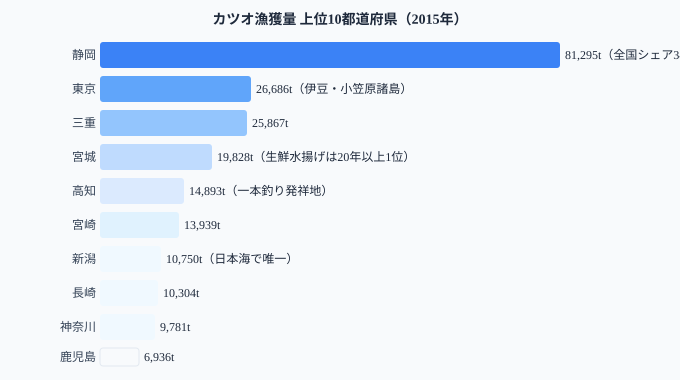
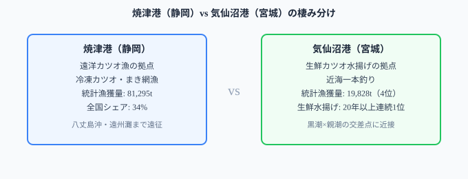

**本記事は農林水産省「海面漁業生産統計調査」2015年確報値に基づく（本統計の都道府県別最新年）。**統計で見ると[静岡県](/areas/22000)がカツオ漁獲量の全国シェア34%を独占し、宮城県は4位（8.3%）にすぎない。しかし「生鮮カツオの水揚げ量が最も多い港」を問われれば、答えは2015年時点で20年以上連続で宮城県気仙沼港だ（2015年時点での記録であり、最新の継続状況は別途確認が必要）。同じ「カツオ日本一」の話題でも、冷凍・遠洋漁業では静岡（焼津）、生鮮・近海漁業では宮城（気仙沼）という棲み分けが起きている。この二極構造を生むのは、黒潮の流れと水揚げ港の地理的条件だ。

## 都道府県別カツオ漁獲量 TOP10（2015年）

<data-source url="https://www.maff.go.jp/j/tokei/kouhyou/kaimen_gyosei/" label="農林水産省 海面漁業生産統計調査（2015年確報値）"></data-source>

1位の静岡県は81,295トンで、全国シェアの34%以上を独占しており、2位東京都の3倍以上を漁獲している。上位5県（静岡・東京・三重・宮城・高知）の合計は168,569トンで、全体の**70.8%**を占める。

> [!NOTE]
> 東京都の漁獲量が大きいのは、伊豆諸島・小笠原諸島を含む海域で操業しているためで、本州の東京湾内ではほぼ漁獲がない。「東京都の漁業」という意外感は、海域の広さによる。

<source-link href="/ranking/fishery-species-catch-bonito">カツオ漁獲量の47都道府県ランキング詳細を見る</source-link>

<ad-slot></ad-slot>

## 静岡（焼津）と宮城（気仙沼）の二極構造

カツオ漁獲量で語るときに欠かせないのが、**静岡県焼津港**と**宮城県気仙沼港**の存在だ。

**焼津港**は日本最大のカツオ水揚げ拠点で、駿河湾を経由して伊豆沖・遠州灘・八丈島沖まで遠征する遠洋カツオ一本釣り・まき網漁の母港となっている。静岡県81,295トンの大部分は焼津由来であり、これが全国シェア34%を支えている。

一方、**気仙沼港**は生鮮カツオ水揚げ量で20年以上連続日本一を記録してきた港として知られる。気仙沼港は黒潮と親潮がぶつかる三陸沖の好漁場に近く、夏から秋にかけて北上するカツオ群を効率的に水揚げできる地理的優位を持つ。本統計では宮城県は4位（19,828トン）だが、これは「水揚げ港」と「漁船登録県」の集計区分が異なるためで、実体としては気仙沼ブランドのカツオが全国に出回っている。

> [!TIP]
> 統計の「漁獲量」は漁船登録県で計上されるため、気仙沼港で水揚げされたカツオでも他県籍の漁船分はその登録県に計上される。「水揚げ港」と「統計漁獲量の県」はずれることがある。

つまり、**冷凍カツオ・遠洋漁業の本拠地が静岡（焼津）、生鮮カツオ・近海漁業の本拠地が宮城（気仙沼）**という棲み分けが、日本のカツオ流通を二極で支えている。

## 漁獲ゼロ13県──黒潮の通り道が水産業を決める

カツオ漁獲量ランキングで特徴的なのは、**漁獲量0トンの県が13も存在**することだ。

> [!WARNING]
> 「漁獲量がゼロ＝魚が獲れない地域」ではない。内陸8県（栃木・群馬・埼玉・山梨・長野・岐阜・滋賀・奈良）はそもそも海面漁業統計の集計対象外。残りの5県（岩手・秋田・山形など）は黒潮の主流から外れた日本海側や瀬戸内海沿岸で、カツオの回遊ルートが通らない地理的理由による。

上位10県のうち9県が太平洋に面しており、唯一の例外は7位の新潟県（10,750トン）のみ。新潟は日本海を北上するカツオ群を捕る海域があるが、漁獲量は太平洋岸の主要県に比べて小さい。

カツオ漁獲量と**マグロ類漁獲量との相関係数は r=0.82**と非常に強い。これはカツオとマグロが同じ黒潮系の沿岸環境・漁業基盤に依拠していることを示している。「カツオが捕れる県＝マグロも捕れる県」という構造は、黒潮ルート上の太平洋岸という立地条件が両魚種の回遊路を共有していることで生まれる。

<source-link href="/ranking/fishery-species-catch-tuna">マグロ類漁獲量ランキング（カツオと相関 r=0.82）</source-link>

<ad-slot></ad-slot>

## カツオ流通を決める3つの地理的条件

静岡・東京・三重・宮城・高知という上位5県の分布には、共通する地理的条件がある。

1. **黒潮ルート上にある**: 太平洋を北上する黒潮が運ぶカツオ群の通り道に位置すること
2. **大規模水揚げ港を持つ**: 遠洋・近海漁業船を受け入れる港湾インフラが整備されていること
3. **漁船団の登録拠点**: 地元籍の漁船が多いほど統計上の漁獲量が計上されやすい

3位の三重県（25,867トン）は熊野灘沖の遠洋カツオ漁、5位高知県（14,893トン）は土佐沖のカツオ一本釣り発祥地として知られ、いずれも黒潮の恩恵を直接受ける太平洋岸の県だ。

## データ出典

- 農林水産省「海面漁業生産統計調査」（2015年確報値）
- 海面漁業によるかつおの漁獲量を都道府県別に集計（内陸8県は集計対象外）
- e-Stat 統計表 ID: `0003238633`、分類カテゴリ「かつお（0250）」

本記事の対象データ: [関連カテゴリ](/category/agriculture)・[熊本県](/areas/43000)
