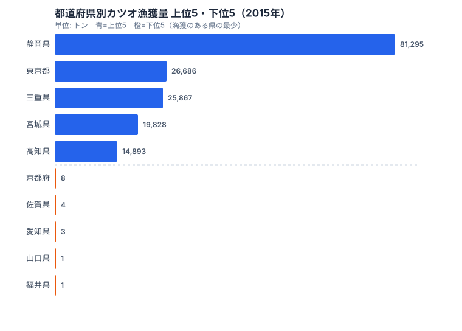
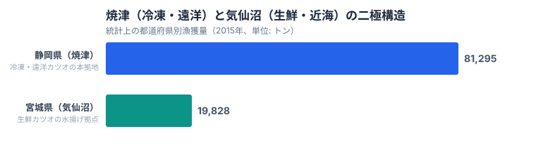

「カツオ日本一はどこか」という問いには、統計の答えと食卓の実感で食い違いが生まれます。本記事は農林水産省「海面漁業生産統計調査」2015年確報値（本統計の都道府県別最新年）に基づきます。統計で見ると[静岡県](/areas/22000)がカツオ漁獲量の全国シェア34%を独占し、宮城県はそれより下位（全国シェア8.3%）にとどまります。しかし「生鮮カツオの水揚げ量が最も多い港」を問われれば、答えは2015年時点で20年以上連続して宮城県気仙沼港でした（2015年時点での記録であり、最新の継続状況は別途確認が必要です）。同じ「カツオ日本一」でも、冷凍・遠洋漁業では静岡（焼津）、生鮮・近海漁業では宮城（気仙沼）という棲み分けが起きています。この二極構造を生むのは、黒潮の流れと水揚げ港の地理的条件です。

## 都道府県別カツオ漁獲量の全体像（2015年）

1位の静岡県は81,295トンで、全国シェアの34%以上を独占し、2位東京都（26,686トン）の3倍以上を漁獲しています。上位5県（静岡・東京・三重・宮城・高知）の合計は168,569トンで、全体の**70.8%**を占めます。漁獲が集中するこれらの県には共通点があり、いずれも黒潮が運ぶカツオ群が通る太平洋岸に位置し、遠洋・近海の大型漁船を受け入れる水揚げ港を抱えています。カツオは黒潮に乗って春から秋にかけて日本列島を北上する回遊魚なので、その通り道に大規模港を持つ県だけが大量水揚げを実現できる構造になっています。

下位を見ると様相が一変します。漁獲のある県でも京都府は8トン、愛知県は3トン、福井県・山口県はわずか1トンで、上位県とは桁が3つも4つも違います。これらの県は海に面していても、日本海側や瀬戸内海側に位置し、北上する黒潮の主流から外れているため、カツオの群れが回遊してこないのです。つまりカツオ漁獲量は「海があるかどうか」ではなく「黒潮の本流が通るかどうか」でほぼ決まります。同じ太平洋でも、回遊路の中心に当たる県とそうでない県とで、これだけの差が生まれます。

> [!NOTE]
> 東京都の漁獲量が大きいのは、伊豆諸島・小笠原諸島を含む海域で操業しているためで、本州の東京湾内ではほぼ漁獲がありません。「東京都の漁業」という意外感は、行政区域としての海域の広さによるものです。

<source-link href="/ranking/fishery-species-catch-bonito">カツオ漁獲量の47都道府県ランキング詳細を見る</source-link>

<ad-slot></ad-slot>

## 静岡（焼津）と宮城（気仙沼）の二極構造

カツオ漁獲量を語るときに欠かせないのが、**静岡県焼津港**と**宮城県気仙沼港**という二つの拠点です。同じカツオでも、冷凍と生鮮で主役の港が入れ替わります。

**焼津港**は日本最大のカツオ水揚げ拠点で、駿河湾を経由して伊豆沖・遠州灘・八丈島沖まで遠征する遠洋カツオ一本釣り・まき網漁の母港となっています。静岡県81,295トンの大部分は焼津由来であり、これが全国シェア34%を支えています。遠洋で獲ったカツオは船上で急速冷凍されて持ち帰られるため、焼津は「冷凍カツオの都」として加工・流通の集積地にもなっています。冷凍を前提にした遠洋漁業は航海日数が長く、大型船と冷凍設備を備えた焼津のような基地があってはじめて成立する漁業です。

一方、[宮城県](/areas/04000)の**気仙沼港**は生鮮カツオ水揚げ量で20年以上連続日本一を記録してきた港として知られます。気仙沼港は黒潮と親潮がぶつかる三陸沖の好漁場に近く、夏から秋にかけて北上するカツオ群を獲ってその日のうちに水揚げできる地理的優位を持っています。本統計で宮城県は19,828トンと、静岡の4分の1ほどの数字にとどまりますが、これは「水揚げ港」と「漁船登録県」の集計区分が異なるためで、実体としては気仙沼ブランドの生鮮カツオが全国の食卓に出回っています。鮮度が命の生鮮カツオは、好漁場と港の距離が近いほど有利であり、三陸沖の漁場に隣接する気仙沼の立地がそのまま強みになります。

> [!TIP]
> 統計の「漁獲量」は漁船の登録県で計上されるため、気仙沼港で水揚げされたカツオでも他県籍の漁船分はその登録県に計上されます。「水揚げ港の日本一」と「統計漁獲量の県」は必ずしも一致しません。ランキングの数字を見るときは、この集計区分のズレを念頭に置くと、産地ブランドと統計順位の食い違いが読み解けます。

つまり、**冷凍カツオ・遠洋漁業の本拠地が静岡（焼津）、生鮮カツオ・近海漁業の本拠地が宮城（気仙沼）**という棲み分けが、日本のカツオ流通を二極で支えています。統計の順位だけを見ると静岡の独走に見えますが、流通の現場では二つの港が役割を分け合っているのです。

## 漁獲ゼロ13県──黒潮の通り道が水産業を決める

カツオ漁獲量ランキングで特徴的なのは、**漁獲量0トンの県が13も存在する**ことです。海に面していてもカツオがまったく揚がらない県がこれだけあるのは、回遊魚であるカツオの性質をよく表しています。

上位10県のうち9県が太平洋に面しており、唯一の例外は新潟県（10,750トン）だけです。新潟は日本海を北上するカツオ群を獲る海域がありますが、漁獲量は太平洋岸の主要県に比べて小さくなっています。逆に、漁獲ゼロの13県はいずれも黒潮の本流から外れた立地にあり、日本海側や瀬戸内海沿岸が中心です。海があってもカツオの回遊ルートが通らなければ、漁獲はゼロになります。「海に面しているか」ではなく「黒潮の本流が通るか」が水産業の有無を分けている、という構造がここに表れています。

> [!WARNING]
> 「漁獲量がゼロ＝魚がまったく獲れない地域」ではありません。栃木・群馬・埼玉・山梨・長野・岐阜・滋賀・奈良の内陸8県は、そもそも海面漁業統計の集計対象外で、このランキングには登場しません。一方、ゼロと表示される13県（岩手・秋田・山形・茨城・石川・大阪・兵庫・鳥取・島根・岡山・広島・香川・熊本）はすべて海に面した県ですが、黒潮の主流から外れた日本海側・瀬戸内海側に位置するため、カツオの回遊ルートが通らないのです。ゼロの読み方を「対象外」と「回遊路の外」で分けて見る必要があります。

カツオ漁獲量と**マグロ類漁獲量との相関係数は r=0.82**と非常に強い数字になっています。これはカツオとマグロが同じ黒潮系の沿岸環境・漁業基盤に依拠していることを示しています。「カツオが捕れる県＝マグロも捕れる県」という関係は、黒潮ルート上の太平洋岸という立地条件が両魚種の回遊路と漁業インフラを共有していることで生まれます。ただし相関が強いからといって一方が他方の原因というわけではなく、両者の背後にある「黒潮の本流が通る太平洋岸」という共通の地理条件が真因です。見かけ上はカツオとマグロが連動して見えますが、両者をつないでいるのは魚同士の関係ではなく、同じ海流の通り道という土台なのです。

> [!NOTE]
> 相関係数 r=0.82 は二つの量が連動して動く度合いを示すもので、因果関係そのものではありません。ここでは黒潮ルートという共通要因が両魚種の漁獲を同時に押し上げていると読むのが妥当です。

<source-link href="/ranking/fishery-species-catch-tuna">マグロ類漁獲量ランキング（カツオと相関する太平洋岸の構造）を見る</source-link>

<ad-slot></ad-slot>

## カツオ流通を決める3つの地理的条件

静岡・東京・三重・宮城・高知という上位5県の分布には、共通する3つの地理的条件があります。

1. **黒潮ルート上にある**: 太平洋を北上する黒潮が運ぶカツオ群の通り道に位置していること
2. **大規模水揚げ港を持つ**: 遠洋・近海漁業船を受け入れる港湾インフラが整備されていること
3. **漁船団の登録拠点である**: 地元籍の漁船が多いほど統計上の漁獲量が計上されやすいこと

3位の三重県（25,867トン）は熊野灘沖の遠洋カツオ漁、5位高知県（14,893トン）は土佐沖のカツオ一本釣り発祥地として知られ、いずれも黒潮の恩恵を直接受ける太平洋岸の県です。こうした水産の地域差は[農林水産・水産カテゴリ](/category/agriculture)の他の指標と合わせて見ると、産地の偏りがより立体的に見えてきます。これら3条件のうち一つでも欠けると、海に面していてもカツオ漁獲量は伸びません。逆に、3条件がそろう静岡や宮城のような県だけが、冷凍・生鮮それぞれの拠点として日本のカツオ流通を支えています。統計の順位は単なる水揚げ量の大小ではなく、海流・港湾・漁船団という三つの地理的土台が重なった結果なのです。

## データ出典

- 農林水産省「海面漁業生産統計調査」（2015年確報値）
- 海面漁業によるかつおの漁獲量を都道府県別に集計（内陸8県は集計対象外）
- e-Stat 統計表 ID: `0003238633`、分類カテゴリ「かつお（0250）」
