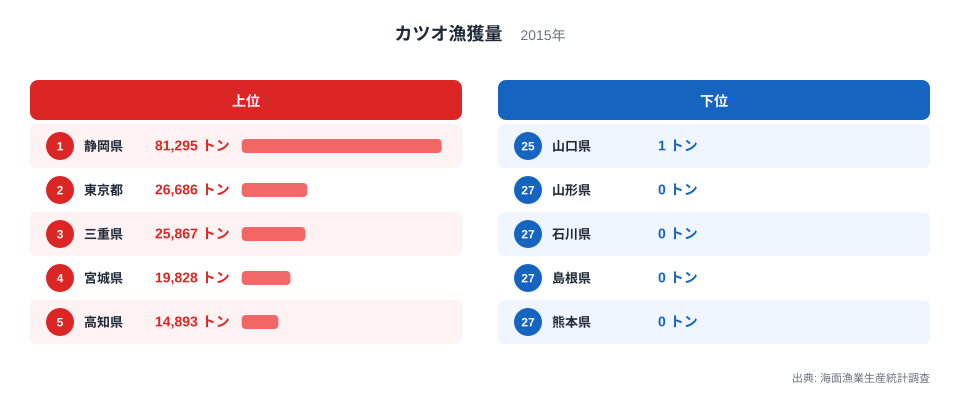

「カツオ日本一はどこか」という問いには、統計の答えと食卓の実感で食い違いが生まれます。本記事は農林水産省「海面漁業生産統計調査」2015年確報値（本統計の都道府県別最新年）に基づきます。統計で見ると[静岡県](/areas/22000)がカツオ漁獲量の全国シェア34%を独占し、宮城県はそれより下位（全国シェア8.3%）にとどまります。しかし「生鮮カツオの水揚げ量が最も多い港」を問われれば、答えは2015年時点で20年以上連続して宮城県気仙沼港でした（2015年時点での記録であり、最新の継続状況は別途確認が必要です）。同じ「カツオ日本一」でも、冷凍・遠洋漁業では静岡（焼津）、生鮮・近海漁業では宮城（気仙沼）という棲み分けが起きています。この二極構造を生むのは、黒潮の流れと水揚げ港の地理的条件です。

## 都道府県別カツオ漁獲量の全体像（2015年）

1位の静岡県は81,295トンで、全国シェアの34%以上を独占します。2位の東京都は26,686トンで、静岡県はその3倍以上を漁獲しています。上位5県（静岡・東京・三重・宮城・高知）の合計は168,569トンで、全体の**70.7%**を占めます。ここでいう「全国」や「全体」は、2015年の統計表に値がある30県の合計238,262トンのことで、後述する公表値のない県は含みません。漁獲が集中するこれらの県には共通点があり、いずれも黒潮が運ぶカツオ群が通る太平洋岸に位置し、遠洋・近海の大型漁船を受け入れる水揚げ港を抱えています。カツオは黒潮に乗って春から秋にかけて日本列島を北上する回遊魚なので、その通り道に大規模港を持つ県で大量の漁獲が集まりやすいと考えられます。

下位を見ると様相が一変します。値のある県でも京都府は8トン、愛知県は3トン、福井県・山口県はわずか1トンで、上位県とは桁が3つも4つも違います。京都・福井・山口は日本海側、愛知は太平洋側にあり、海に面した向きだけでは説明がつきません。[仮説] カツオの回遊路に加えて、遠洋・近海の大型漁船を受け入れる拠点の有無が効いている可能性があります。ただし、この記事のデータでは回遊路も船の拠点も確かめていないため、下位の理由は検証が必要です。

> [!NOTE]
> 東京都の漁獲量が大きいのは、伊豆諸島・小笠原諸島を含む海域で操業しているためで、本州の東京湾内ではほぼ漁獲がありません。「東京都の漁業」という意外感は、行政区域としての海域の広さによるものです。

<source-link href="/ranking/fishery-species-catch-bonito">カツオ漁獲量の47都道府県ランキング詳細を見る</source-link>

<ad-slot></ad-slot>

## 静岡（焼津）と宮城（気仙沼）の二極構造

カツオを語るときに欠かせない水揚げ拠点が、静岡県の**焼津港**と宮城県の**気仙沼港**です。同じカツオでも、冷凍と生鮮で主役の港が入れ替わります。ただし、この統計に冷凍と生鮮の内訳はありません。以下は港と流通についての一般的な説明であり、数値で確かめたものではありません。

**焼津港**は日本最大のカツオ水揚げ拠点で、駿河湾を経由して伊豆沖・遠州灘・八丈島沖まで遠征する遠洋カツオ一本釣り・まき網漁の母港となっています。遠洋で獲ったカツオは船上で急速冷凍されて持ち帰られるため、焼津は「冷凍カツオの都」として加工・流通の集積地にもなっています。冷凍を前提にした遠洋漁業は航海日数が長く、大型船と冷凍設備を備えた焼津のような基地があってはじめて成立する漁業です。

一方、[宮城県](/areas/04000)の**気仙沼港**は生鮮カツオ水揚げ量で20年以上連続日本一を記録してきた港として知られます。気仙沼港は黒潮と親潮がぶつかる三陸沖の好漁場に近く、夏から秋にかけて北上するカツオ群を獲ってその日のうちに水揚げできる地理的優位を持っています。鮮度が命の生鮮カツオは、好漁場と港の距離が近いほど有利であり、三陸沖の漁場に隣接する気仙沼の立地がそのまま強みになります。

ここで気をつけたいのは、ランキングの数字が港の水揚げ量ではないことです。静岡県の81,295トンも宮城県の19,828トンも、焼津港や気仙沼港だけの水揚げ量ではなく、その県に拠点を置く漁業経営体の漁獲の合計です。静岡県の値のうち焼津がどれだけを占めるか、宮城県の値のうち気仙沼がどれだけを占めるかは、この統計からは分かりません。宮城県の値が静岡県の4分の1ほどにとどまる理由も、この統計だけでは分かりません。

> [!TIP]
> 農林水産省東北農政局の資料は、この系列の統計について「漁業経営体が所在する都道府県で集計（属人統計）しており、水揚げ港で集計（属地統計）したものではない」と説明しています。同資料が扱うのは令和3年の統計で、2015年の値も同じ方式かは本記事では確認していません。気仙沼港で水揚げされたカツオでも、他県に拠点を置く漁船の分はその県に計上されることになり、「水揚げ港の日本一」と「統計上の漁獲量の県」は一致しない場合があります。

つまり、冷凍・遠洋漁業の拠点として語られるのが焼津、生鮮・近海漁業の拠点として語られるのが気仙沼です。統計の順位だけを見ると静岡の独走に見えますが、流通の現場では二つの港が役割を分け合っていると説明されます。

ここまでは獲る側の話です。食べる側を総務省「家計調査」の購入数量で見ると、並びはまったく別になります。2024年の年間かつお購入数量（県庁所在市の二人以上世帯）は、高知県が3,642グラムで全国最多で、和歌山県が1,492グラム、福島県が1,488グラム、茨城県が1,361グラムで続きます。漁獲量の順位が上から5番目の高知県は、購入数量では全国で最も多い県でもあります。一方で、漁獲量の最も多い静岡県の購入数量は972グラムで、順位は上から15番目です。漁獲量が4番目の宮城県は1,076グラムで、購入数量では9番目にとどまります。購入数量で上から4番目の茨城県と5番目の岩手県は、2015年の漁獲量の統計表に公表値がなく、6番目の山形県は0トンでした。漁獲量は2015年の漁業経営体の所在地ベース、購入数量は2024年の県庁所在市の家計という別の指標なので、水揚げの多い県がそのまま最もかつおを買う県になるわけではありません。高知県のように獲る側と食べる側がそろう県は例外で、獲る側の二極と食べる側の分布は重ならない、というのがこの節の結論です。

あわせて見る: [かつお購入数量ランキング（家計調査）](/ranking/bonito-consumption-quantity)

## 漁獲ゼロ4県と、公表値のない9県──「0」と「行がない」は別

カツオ漁獲量ランキングを読むときに最初に確認したいのは、「0トン」と「値がない」の区別です。2015年の統計表には30県の行があり、そのうち値が0トンなのは山形・石川・島根・熊本の4県だけです。栃木・群馬・埼玉・山梨・長野・岐阜・滋賀・奈良の内陸8県は海面漁業統計の対象外で、これも行がありません。さらに、岩手・秋田・茨城・大阪・兵庫・鳥取・岡山・広島・香川の9県は海に面しているのに、2015年の行そのものがなく、公表値がありません。

この9県を「漁獲ゼロ」とは書けません。たとえば茨城県には2014年に2,756トン、鳥取県には2012年に9,336トン、岩手県には2014年に96トンの値があります。2015年に突然ゼロになったとも、回遊路の外にあるとも読めません。行がない理由が、個別の経営体が特定されないようにする秘匿なのか、別の事情なのかは、本記事のデータでは分かりません。農林水産省東北農政局の資料（令和3年の統計）にも、養殖業の一部が秘匿措置で非公表になっているという注記があり、この系列の統計に秘匿があること自体は確かです。

[仮説] 公表値のない9県は、少なくとも一部は秘匿による非公表かもしれません。検証するには、海面漁業生産統計調査（0003238633）の2015年について、当該県のセルに付いた記号を e-Stat で確認する必要があります。それまでは「公表値がない」と読むのが安全です。

0トンの4県は、前年の2014年も石川県が2トン、島根県と熊本県が1トン、山形県が0トンと、ごく少量です。これらの県の漁獲は、そもそも多くありません。

上位に目を向けると、上位10県には太平洋以外に面した県も入っています。7位の新潟県は10,750トンで日本海側、8位の長崎県は10,304トンで東シナ海側に位置します。カツオの産地は太平洋岸だけではなく、「黒潮の本流が通る太平洋岸かどうか」だけでは漁獲量を説明しきれません。

> [!WARNING]
> ランキングの下位や圏外に並ぶ県が、「カツオが獲れない県」とは限りません。2015年の統計表で行のない17県（内陸8県と、公表値のない海沿いの9県）を、0トンの県と同じに扱わないでください。特に海沿いの9県は、他の年に値があるため、ゼロではなく「その年の値が公表されていない」と読むのが正確です。

カツオ漁獲量と**マグロ類漁獲量との相関係数は r=0.81**と強い数字になっています。算出には、カツオとマグロ類の両方に2015年の値がある29県を使い、ピアソンの積率相関係数で計算しました。「カツオが捕れる県はマグロも捕れる県」という関係は、遠洋・近海の漁船が出入りする太平洋岸の港という立地条件を、両魚種が共有していることから生まれると考えられます。ただし相関が強いからといって一方が他方の原因というわけではなく、両者の背後にある共通の地理条件が真因とみられます。見かけ上はカツオとマグロが連動して見えますが、両者をつないでいるのは魚同士の関係ではなく、同じ海域と漁業の拠点という土台です。

> [!NOTE]
> 相関係数 r=0.81 は二つの量が連動して動く度合いを示すもので、因果関係そのものではありません。ここでは漁船の拠点と漁場の共有という共通要因が両魚種の漁獲を同時に押し上げていると読むのが妥当ですが、本記事ではその要因を直接測っていません。

あわせて見る: [マグロ類漁獲量ランキング](/ranking/fishery-species-catch-tuna)

<ad-slot></ad-slot>

## カツオ流通を決める3つの地理的条件

静岡・東京・三重・宮城・高知という上位5県の分布には、共通する3つの地理的条件があります。

1. **黒潮ルート上にある**: 太平洋を北上する黒潮が運ぶカツオ群の通り道に位置していること
2. **大規模水揚げ港を持つ**: 遠洋・近海漁業船を受け入れる港湾インフラが整備されていること
3. **漁船団の所在地である**: 地元に拠点を置く漁業経営体が多いほど統計上の漁獲量が計上されやすいこと

3位の三重県は25,867トンで熊野灘沖の遠洋カツオ漁、5位の高知県は14,893トンで土佐沖のカツオ一本釣り発祥地として知られ、いずれも黒潮の恩恵を直接受ける太平洋岸の県です。こうした水産の地域差は[農林水産・水産カテゴリ](/category/agriculture)の他の指標と合わせて見ると、産地の偏りがより立体的に見えてきます。これら3条件のうち一つでも欠けると、漁獲量は伸びにくいと考えられます。逆に、3条件がそろう静岡や宮城のような県が、冷凍・生鮮それぞれの拠点として日本のカツオ流通を支えています。統計の順位は単なる水揚げ量の大小ではなく、海流・港湾・漁船団という三つの地理的土台が重なった結果とみられますが、本記事のデータだけで因果まで確かめたわけではありません。
