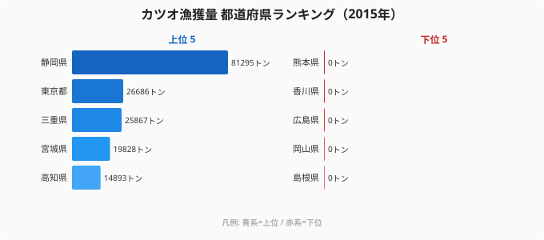

本記事は[カツオ漁獲量ランキング｜静岡・宮城の二強構造](https://stats47.jp/blog/bonito-catch-prefecture)の姉妹編です。前記事では首位の静岡（81,295トン）と宮城を軸にした二強構造と、上位5県で全国の70.8%を占める集中構造を扱いました。本記事ではその裏返しにある **「漁獲ゼロ13県」** にフォーカスし、なぜそこではカツオが獲れないのかを地理的に深掘りします。

海面漁業生産統計調査（2015年確報）によれば、海に面しているにもかかわらず、あるいは沿岸環境を持ちながらカツオ漁獲量が **0トン** と記録される県は13に上ります。内陸8県は集計対象外として除外されるため、母集団39都道府県のうち実質的に **3割超** がカツオ漁から外れていることになります。これらは偶然のばらつきではなく、**黒潮ルート・内海地形・漁港インフラ** という3つの要因で構造的に決まっているのです。

> [!NOTE]
> 本データは農林水産省「海面漁業生産統計調査」（2015年確報）に基づきます。内陸8県（栃木・群馬・埼玉・山梨・長野・岐阜・滋賀・奈良）は海面漁業統計の集計対象外のため除外し、39都道府県を母集団としています。漁獲量は漁船の登録県に計上される「漁船所属県基準」です。

## 漁獲ゼロ13県の地理分類

2015年に漁獲量0トンと記録された13県（いずれも同率27位タイ）を、面する海域で分類すると次のように整理できます。

- **日本海側（5県）**: 秋田・山形・石川・鳥取・島根
- **瀬戸内海沿岸（5県）**: 大阪・兵庫・岡山・広島・香川
- **有明海・八代海（1県）**: 熊本
- **太平洋側の例外（2県）**: 岩手・茨城

13県のうち **10県が日本海側または瀬戸内海** であり、共通項は **「黒潮の主流から外れている」** ことです。残る熊本は有明海・八代海という閉鎖性内海に面し、岩手・茨城は太平洋側にあるものの所属船団の構造で漁獲計上から外れます。下のチャートで首位の静岡（81,295トン）と漁獲ゼロ県を並べると、その落差が一目で分かります。以下、それぞれの地域がなぜカツオ漁から外れるのかを順に見ていきます。

首位の静岡が81,295トンを記録する一方で、ゼロ県は文字どおり棒が立ちません。注目すべきは、ゼロ県の顔ぶれが海域ごとにきれいに塊を作っている点です。日本海側と瀬戸内海でそれぞれ5県、有明海で1県、そして太平洋側で2県と、地理と統計の両面から説明できる「4つのゼロ」が重なっています。逆に上位5県（静岡・東京・三重・宮城・高知）はいずれも黒潮が直接当たる太平洋岸か、太平洋に大型カツオ船団の母港を持つ地域です。カツオが「いる海」と「いない海」、そして「いるのに獲る船がない海」の三つが、このゼロ13県には混在しているのです。

<source-link href="/ranking/fishery-species-catch-bonito">カツオ漁獲量ランキングをもっと見る</source-link>

## なぜ日本海側でカツオが獲れないか

日本海側でゼロを記録するのは **秋田・山形・石川・鳥取・島根** の5県です。富山もほぼゼロに近く（20位・14トン）、新潟（7位・10,750トン）を除けば日本海側はほぼ全滅に近い状況です。

理由はシンプルで、**カツオの主回遊ルートが太平洋黒潮ライン上にあるため** です。カツオは熱帯海域で生まれ、春から夏にかけて黒潮に乗って房総沖→三陸沖→北海道沖へと北上し、秋に「戻り鰹」として南下します。これが日本のカツオ漁業の基本サイクルであり、太平洋岸の静岡・宮城・高知・宮崎が上位を独占する根拠でもあります。

一方、日本海側を流れる対馬暖流はカツオ群の主回遊ルートではありません。対馬暖流に乗って入ってくるカツオ群は限定的で、漁業として成立する規模に達しないのです。新潟県が7位（10,750トン）と日本海側で唯一上位に入るのは、佐渡沖から能登半島沖にかけて夏季に小規模な来遊群があり、これを獲る船団を保有しているためですが、これは日本海側の例外であって全体を代表するものではありません。秋田・山形・石川・鳥取・島根の5県は、沿岸漁業の対象魚種が **ハタハタ・ブリ・スルメイカ** などに特化しており、カツオを獲るための一本釣り船・まき網船団がそもそも存在しないという産業構造的な要因も大きいのです。

## なぜ瀬戸内海沿岸でも獲れないか

瀬戸内海沿岸でゼロを記録するのは **大阪・兵庫・岡山・広島・香川** の5県です。愛媛は宇和海・豊後水道など外洋に面する部分でカツオを獲りますが（11位・5,235トン）、それ以外の瀬戸内5県では完全にゼロです。

理由は **瀬戸内海が閉鎖性内海であり、回遊魚カツオの回遊路ではない** ことに尽きます。瀬戸内海は本州・四国・九州に囲まれた内海で、外海との接続は紀伊水道・豊予海峡・関門海峡の3箇所に限られます。そのため大型回遊魚であるカツオが内海まで入ってくる頻度は極めて低く、入ってきても漁業対象として成立する密度にはなりません。

瀬戸内海の主要漁業対象は **イカナゴ・タイ・タコ・サワラ・カキ養殖** などで、内海の小型・定住性魚種に特化しています。[香川県](/areas/37000)のハマチ養殖、広島県のカキ養殖、岡山県のサワラ漁などはいずれも内海環境を活かした漁業であり、外洋回遊魚のカツオとは漁業構造が根本的に異なります。瀬戸内5県はカツオ漁の不在ではなく、別の漁業構造で成立しているというのが実態です。

[熊本県](/areas/43000)（有明海・八代海）も同じ論理で説明できます。有明海は閉鎖性がさらに強く、ノリ養殖・アサリ・ムツゴロウなどの干潟漁業が主体で、回遊魚カツオの漁場ではありません。

> [!WARNING]
> 「漁獲ゼロ13県」のうち日本海・瀬戸内の10県は、首位静岡や2位東京とは桁が違うのではなく、文字どおり0トンです。ランキングでは同率27位タイにまとめられますが、これは「最下位が13県横並び」という意味であり、わずかに獲れている福井（25位・1トン）や山口（25位・1トン）はゼロ県には含まれない点に注意してください。

## 太平洋側なのにゼロの岩手・茨城

地理分類で異色なのが **岩手・茨城** の2県です。両県とも太平洋に面し、本来であれば黒潮・親潮の交差点や潮目に位置するため、カツオ漁の好条件を備えているはずです。事実、岩手県の大船渡港・宮古港、茨城県の鹿島港・那珂湊港は重要な水産拠点です。

それでもゼロと記録されるのは、**漁船所属県基準** という統計上の集計区分が原因です。本データは「漁船が登録されている県」で漁獲を計上するため、大船渡港や鹿島港で水揚げされても、入港した漁船が宮城県・千葉県・神奈川県などの所属であれば、それぞれの所属県に計上されます。岩手・茨城の地元船はカツオ専門の遠洋・近海一本釣り船団を大規模には保有しておらず、サンマ・サバ・イワシなど他魚種を主漁場としているため、結果的に「県としての漁獲量」はゼロとなるのです。

つまり岩手・茨城のゼロは **「カツオが獲れない海」ではなく「カツオを獲る地元船団がない」** という産業基盤の問題です。日本海・瀬戸内のゼロが地理的構造によるのに対し、太平洋側2県のゼロは漁船保有構造に由来するという、性質の異なる2種類のゼロが混在しています。

> [!TIP]
> 「漁獲ゼロ」は「海にカツオがいない」と同義ではありません。岩手・茨城のように太平洋に面しながらゼロになるのは、地元漁船がカツオ専門の船団を持たない産業構造によるものです。地理的ゼロ（日本海・瀬戸内）と構造的ゼロ（太平洋側2県）は原因が異なる、と切り分けて読むのがコツです。

## まとめ

- 漁獲ゼロ13県は **日本海5県・瀬戸内5県・有明1県・太平洋2県** に分類されます
- 日本海側ゼロは **黒潮ルート不在 + ハタハタ・ブリへの漁業特化** が要因です
- 瀬戸内海ゼロは **閉鎖性内海でカツオ回遊路ではない + イカナゴ・タイ・カキへの特化** が要因です
- 太平洋側でも岩手・茨城がゼロなのは **漁船所属県基準の統計集計と地元船団の魚種特化** によります
- 上位独占・中位周辺関与・ゼロ地理欠落の **3層構造** が日本のカツオ漁の地理を決めています

## データ出典

- 農林水産省「海面漁業生産統計調査」（2015年確報）
- e-Stat 統計表（分類「かつお」）
- 内陸8県（栃木・群馬・埼玉・山梨・長野・岐阜・滋賀・奈良）は海面漁業統計の母集団外として除外
