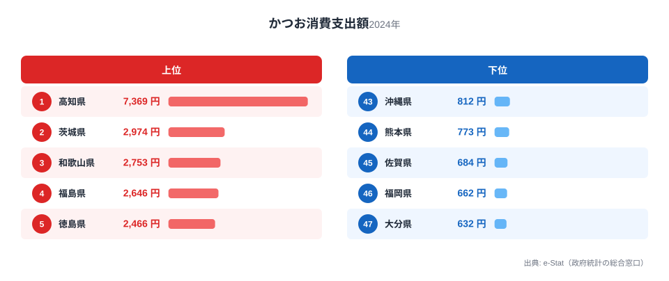
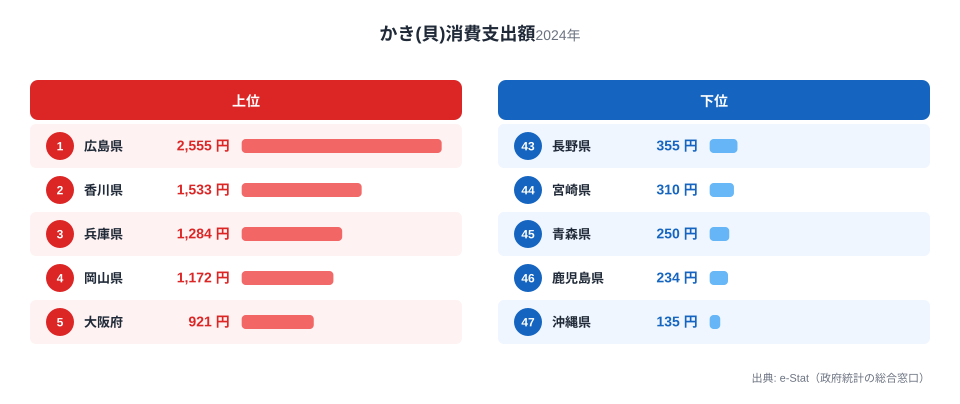

同じ「魚介」でも、どこで多く食べられているかは魚種によってまったく違います。総務省の家計調査で都道府県庁所在市の消費支出額を見ると、かつおは太平洋沿岸で強く、かきは瀬戸内海・三陸で強いという、対照的な地図が浮かび上がります。

かつお消費支出額の1位は高知県で7,369円。最下位の大分県632円と比べると11.7倍もの開きがあります。一方かき(貝)消費支出額の1位は広島県で2,555円、最下位の沖縄県135円とは18.9倍の差です。どちらも「産地=消費地」という単純な構図に見えますが、地図に並べてみると、かつおとかきの強い県が驚くほど重なりません。漁獲量や養殖規模といった「産地」の情報ではなく、家計が実際に支出した金額という「消費地」のデータから、この2つの魚介が描く「面する海で分かれる魚食の地図」を読み解きます。

> [!NOTE]
> 消費支出額は総務省「家計調査」による都道府県庁所在市（政令指定都市含む）の1世帯あたり年間支出額です。実際の漁獲量や消費量そのものではなく、あくまで「その都市の世帯が支出した金額」である点に注意してください。地元で獲れても加工・流通の都合で他地域の支出額が高くなるケースもあります。

## かつお消費支出ランキング｜太平洋沿岸が上位を独占

かつお消費支出額の上位を見ると、1位[高知県](/areas/39000)7,369円が突出しています。これは高知の郷土料理「かつおのタタキ」の存在が大きく、藁焼きで炙って食べる文化が家庭の食卓にも定着していることの表れです。2位以下は茨城県2,974円、和歌山県2,753円、福島県2,646円、徳島県2,466円と続き、上位5県すべてが太平洋岸に面しています。

<source-link href="/ranking/bonito-consumption-expenditure">かつお消費支出額ランキングをもっと見る</source-link>

さらに6位以降を見ても、宮崎県2,377円、山形県2,371円、岩手県2,334円、愛媛県2,260円、香川県2,229円、宮城県2,225円と、東北の太平洋側（宮城・岩手・福島）と四国・南九州（徳島・愛媛・宮崎）が上位に集中しています。カツオは黒潮に乗って太平洋を北上する回遊魚で、初鰹は高知や和歌山など南から水揚げされ、戻り鰹は三陸沖まで北上します。この回遊ルートに沿って水揚げ港がある県が、そのまま消費支出額の上位に並んでいる構図です。この中で目を引くのが日本海側に位置する山形県で、7位2,371円と回遊ルート上ではない県ながら上位に食い込んでいます。庄内地方をはじめ東北一円にかつお節や生かつおの流通・食文化が根付いているという見方もできます。

一方で最下位グループは、46位福岡県662円、47位大分県632円と九州北部・大分に集中しています。九州は水産県が多いにもかかわらず、かつおの消費支出は低い部類に入るのが興味深い点です。これは、九州近海がカツオの主要な回遊ルートから外れていること、そして地元で消費される主力魚種（ぶり・あじ・さばなど）が別にあるという見方もできます。実際、45位佐賀県684円、44位熊本県773円、43位沖縄県812円と、九州・沖縄勢が下位に固まっています。

> [!TIP]
> かつおの消費額を都道府県別に見ると、単純な「西高東低」でも「東高西低」でもなく、**太平洋沿岸ライン**という地理軸で説明できます。ただし同じ日本海側でも一様ではなく、北陸の新潟・富山・石川は39位・35位・42位と軒並み下位に沈む一方、東北の山形は7位、秋田は15位、青森は19位と上位〜中位に来ています。日本海側12県の順位の中央値は28.5位で、47都道府県全体の中央値である24位からは大きくは離れておらず、なぜ北陸だけが低いのかは今後の検証テーマとして残ります。

## かき(貝)消費支出ランキング｜瀬戸内が上位を独占、三陸が続く

かき(貝)消費支出額のランキングは、かつおとは対照的な地理分布を見せます。1位は[広島県](/areas/34000)2,555円で、これは広島湾が国内有数のカキ養殖の産地であることと直結しています。広島のカキ養殖は江戸時代から続く伝統産業で、地元の食文化に深く根付いています。2位は香川県1,533円、3位は兵庫県1,284円、4位は岡山県1,172円と、上位4県すべてが瀬戸内海に面した県で占められました。

<source-link href="/ranking/oyster-consumption-expenditure">かき(貝)消費支出額ランキングをもっと見る</source-link>

5位以降も大阪府921円、宮城県889円、滋賀県883円、東京都874円、山形県828円、神奈川県826円と続きますが、瀬戸内海勢に続いて存在感を示すのが宮城県です。松島湾や気仙沼はかつおと並んでカキ養殖の名産地であり、東北・三陸のカキも全国的に評価が高いことが表れています。かき消費支出は「瀬戸内海クラスター」と「三陸クラスター」という2つの産地圏が上位を形成しているのが特徴です。

最下位グループを見ると、41位福井県413円、42位山口県361円、43位長野県355円、44位宮崎県310円、45位青森県250円、46位鹿児島県234円、47位沖縄県135円と続きます。かきは水温が低い海域でよく育つ貝であるため、沖縄など温暖な地域では地元産のカキがほとんど流通せず、消費文化自体が根付きにくいという見方もできます。長野県のような内陸県が下位に来るのは自然で、宮崎・鹿児島・沖縄のような南九州・南西諸島が低いのも予想どおりですが、興味深いのは最北の県の一つである青森県が45位250円と沈んでいる点です。青森は陸奥湾のホタテなど他の貝類の産地としての存在感が強く、貝の消費が別の種類に向かっている可能性を示唆します。南北どちらの端に位置する県も下位に集中しており、単純な「南ほど低い」という傾向では説明しきれず、産地（広島湾・松島湾）からの距離という別の軸で見る必要がありそうです。

> [!TIP]
> ランキングの支出額差は、必ずしも「食べる量の違い」だけを表しているわけではありません。同じ魚介でも、鮮度や品質を求めて高値のものを買う都市ほど支出額は膨らむため、金額の開きには「量の差」と「単価の差」の両方が混ざっています。産地に近い都市ほど良いものを高く買う傾向があることも、支出額ランキングを読むときに押さえておきたいポイントです。

> [!WARNING]
> かきは冬が旬の食材で、家計調査の年間支出額には季節による偏りが反映されています。年間を通じて均等に消費される品目ではないため、月次データを見ると冬季（11月〜2月）に支出が集中する点に注意してください。

## 発見: かつおとかきは「入れ替わる」地図を描く

かつお・かきの対照は、この2品目に限れば「太平洋に面するか、それとも瀬戸内海や日本海側に面するか」という構図で説明できます。ただし1位の突出度は対称ではありません。かつおは1位高知が2位茨城の2.48倍（7,369円÷2,974円）と大きく引き離すのに対し、かきは1位広島が2位香川の1.67倍（2,555円÷1,533円）にとどまり、突出度そのものにも差があります。漁獲量や養殖規模という「産地」ではなく、家計の支出額という「消費地」に注目するこの記事の視点に立つと、「地元でよく獲れる魚」と「地元でよく食べられている魚」は必ずしも一致しないことが見えてきます。

かつお上位5県（高知・茨城・和歌山・福島・徳島）とかき上位5県（広島・香川・兵庫・岡山・大阪）を見比べると、重なる県が1つもありません。かつおが強い太平洋沿岸ラインと、かきが強い瀬戸内海・三陸沿岸ラインは、地理的にほぼ排他的な関係にあります。

香川県はかつお消費支出額でも10位2,229円と健闘していますが、これは讃岐うどんの出汁文化でいりこ・かつお節が多用されることが影響しているという見方もできます。逆に広島県はかつお消費支出額で33位1,239円と中位にとどまり、「魚介の消費量が多い県」がそのまま「あらゆる魚種で上位」になるわけではないことを示しています。

`[仮説]` かつおとかきの消費地図がここまで綺麗に分かれるのは、養殖と天然回遊という生産構造の違いが大きいと考えられます。かきは特定の湾（広島湾・松島湾など）で集中生産される養殖主体の食材であるのに対し、かつおは黒潮ルートに沿って広く分布する天然回遊魚です。検証には、他の養殖魚種（ぶり・のり等）と天然回遊魚種（さんま・さば等）の地理分布を比較する追加分析が必要です。

もう1つの発見は、九州・沖縄の中に「両方低い県」と「かつおだけ高い県」がはっきり分かれる点です。福岡はかつお46位・かき32位、熊本は44位・34位、大分は47位・35位、長崎は37位・28位、沖縄は43位・47位と、かつお・かき双方の消費額が低い一方、宮崎は6位・44位、鹿児島は14位・46位と、かつおの消費額こそ上位〜中位に入るのに、かきは大きく順位を下げます。前者は九州が「魚を食べない」わけではなく、地元で獲れる別の魚種（あじ・さば・ぶりなど）に消費が向かっていることを示唆する一方、宮崎・鹿児島の分岐は、かつおが黒潮の回遊ルートに沿った太平洋沿岸で強いという構図を裏付ける材料といえます。

## まとめ

- かつお消費支出額1位は高知県7,369円、最下位は大分県632円で11.7倍の差
- かき消費支出額1位は広島県2,555円、最下位は沖縄県135円で18.9倍の差
- かつおは太平洋沿岸ライン（高知・茨城・和歌山・福島・徳島など）が上位を独占
- かきは瀬戸内海クラスター（広島・香川・兵庫・岡山）と三陸クラスター（宮城）が上位を形成
- 両ランキングの上位県はほぼ重ならず、産地の生産構造（天然回遊 vs 養殖）の違いが背景にあると考えられる

魚介の消費支出は寿司文化とも密接に関わっています。あわせて[外食・回転寿司の消費支出ランキング記事](/blog/sushi-dining-consumption-expenditure)も参考にしてください。

## データ出典

総務省「家計調査」（都道府県庁所在市および政令指定都市、1世帯あたり年間支出額、2024年）をもとに、e-Stat（政府統計の総合窓口）経由で集計・整備しています。
